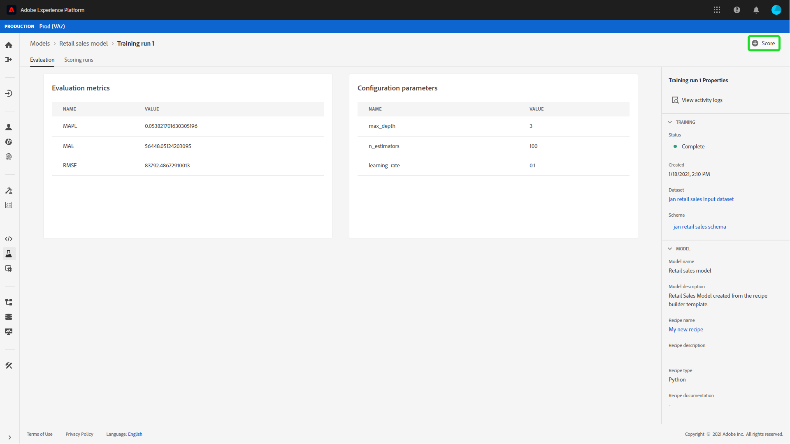

# Punteggio di un modello nell’interfaccia utente di Data Science Workspace

Punteggio in Adobe Experience Platform [!DNL Data Science Workspace] può essere ottenuto inserendo i dati di input in un modello addestrato esistente. I risultati del punteggio vengono quindi memorizzati e visualizzati in un set di dati di output specificato come nuovo batch.

Questa esercitazione illustra i passaggi necessari per valutare un modello nel [!DNL Data Science Workspace] interfaccia utente.

## Introduzione

Per completare questa esercitazione, devi disporre dell’accesso a [!DNL Experience Platform]. Se non hai accesso a un’organizzazione IMS in [!DNL Experience Platform]Prima di procedere, rivolgiti all’amministratore di sistema.

Questa esercitazione richiede un modello addestrato. Se non si dispone di un modello addestrato, seguire la [addestrare e valutare un modello nell’interfaccia utente](./train-evaluate-model-ui.md) esercitazione prima di continuare.

## Crea una nuova esecuzione del punteggio

Un’esecuzione del punteggio viene creata utilizzando configurazioni ottimizzate da un’esecuzione di formazione completata e valutata in precedenza. L&#39;insieme di configurazioni ottimali per un modello viene in genere determinato esaminando le metriche di valutazione dell&#39;esecuzione del corso di formazione.

Trova l’esecuzione di formazione più ottimale per utilizzare le sue configurazioni per il punteggio. Quindi, apri l&#39;esecuzione di formazione desiderata selezionando il collegamento ipertestuale associato al nome.

Dall’esecuzione di formazione **[!UICONTROL Valutazione]** scheda , seleziona **[!UICONTROL Punteggio]** in alto a destra sullo schermo. Inizia un nuovo flusso di lavoro di punteggio.

Seleziona il set di dati per il punteggio di input e seleziona **[!UICONTROL Successivo]**.

Seleziona il set di dati per il punteggio di output, questo è il set di dati di output dedicato in cui vengono memorizzati i risultati del punteggio. Conferma la selezione e seleziona **[!UICONTROL Successivo]**.

Il passaggio finale nel flusso di lavoro richiede di configurare l’esecuzione del punteggio. Queste configurazioni vengono utilizzate dal modello per l’esecuzione del punteggio.
Non è possibile rimuovere i parametri ereditati impostati durante la creazione dei modelli. Per modificare o ripristinare i parametri non ereditati, fai doppio clic sul valore o seleziona l’icona Ripristina mentre passi il cursore sulla voce.

Rivedi e conferma le configurazioni del punteggio e seleziona **[!UICONTROL Fine]**  per creare ed eseguire l’esecuzione del punteggio. Viene eseguito il **[!UICONTROL Esecuzione del punteggio]** e la nuova esecuzione del punteggio con **[!UICONTROL In sospeso]** viene visualizzato lo stato .

Un’esecuzione del punteggio può essere visualizzata con uno dei seguenti stati:
- In sospeso
- Completa
- Non riuscito
- In esecuzione

Gli stati vengono aggiornati automaticamente. Procedi al passaggio successivo se lo stato è **[!UICONTROL Completa]** o **[!UICONTROL Non riuscito]**.

## Visualizza risultati punteggio

Per visualizzare i risultati del punteggio, inizia selezionando un’esecuzione di formazione.

Viene eseguito il reindirizzamento alle esecuzioni di formazione **[!UICONTROL Valutazione]** pagina. Nella parte superiore della pagina di valutazione dell’esecuzione del corso, seleziona la **[!UICONTROL Esecuzione del punteggio]** per visualizzare un elenco delle esecuzioni dei punteggi esistenti.

Quindi, seleziona un’esecuzione del punteggio per visualizzare i dettagli dell’esecuzione.

Se l’esecuzione del punteggio selezionata ha lo stato &quot;Completato&quot; o &quot;Non riuscito&quot;, la **[!UICONTROL Visualizzare i registri attività]** link è reso disponibile. Se un’esecuzione del punteggio non riesce, i registri di esecuzione possono fornire informazioni utili per determinare il motivo dell’errore. Per scaricare i registri di esecuzione, seleziona **[!UICONTROL Visualizzare i registri attività]**.

La **[!UICONTROL Visualizzare i registri attività]** appare il puntatore. Seleziona un URL per scaricare automaticamente i registri associati.

Puoi anche visualizzare i risultati del punteggio selezionando  **[!UICONTROL Anteprima del set di dati dei risultati del punteggio]**.

Viene fornita un’anteprima del set di dati di output.

Per l’insieme completo dei risultati del punteggio, seleziona il **[!UICONTROL Set di dati dei risultati del punteggio]** link nella colonna a destra.

## Passaggi successivi

Questa esercitazione illustra i passaggi necessari per valutare i dati utilizzando un modello addestrato in [!DNL Data Science Workspace]. Segui l’esercitazione su [pubblicazione di un modello come servizio nell’interfaccia utente](./publish-model-service-ui.md) per consentire agli utenti all’interno della tua organizzazione di valutare i dati fornendo un facile accesso a un servizio di apprendimento automatico.
