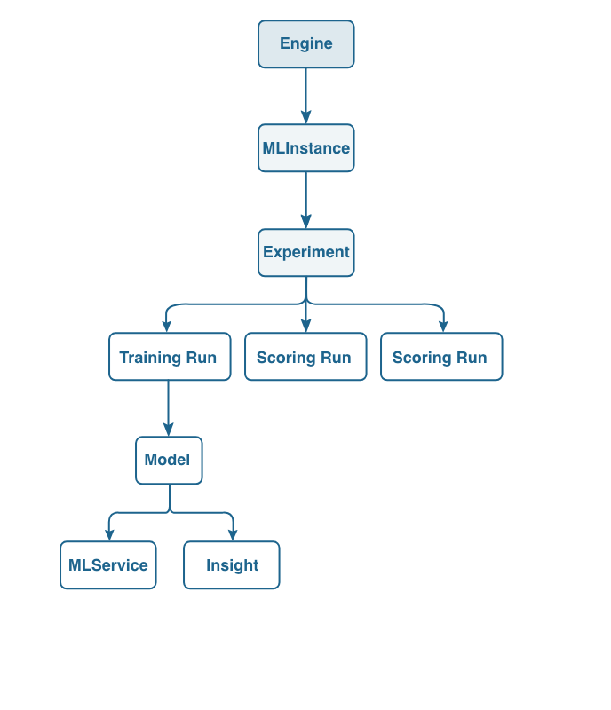

# Formazione e valutazione di un modello (API)


Questa esercitazione illustra come creare, formare e valutare un modello utilizzando le chiamate API. Fate riferimento a [questo documento](https://www.adobe.io/apis/experienceplatform/home/api-reference.html#!acpdr/swagger-specs/sensei-ml-api.yaml) per un elenco dettagliato della documentazione API.

## Prerequisiti

Seguite [Importa una ricetta inclusa nel pacchetto utilizzando l&#39;API](./import-packaged-recipe-api.md) per creare un motore, richiesto per formare e valutare un modello utilizzando l&#39;API.

Segui questa [esercitazione](../../tutorials/authentication.md) per ottenere l&#39;autorizzazione per iniziare a effettuare chiamate API.

Dall&#39;esercitazione dovrebbero ora essere disponibili i seguenti valori:

- `{ACCESS_TOKEN}`: Il valore del token del portatore specificato dopo l&#39;autenticazione.
- `{IMS_ORG}`: Credenziali organizzazione IMS trovate nella vostra integrazione  Adobe Experience Platform.
- `{API_KEY}`: Il valore della chiave API specifico trovato nell&#39;integrazione del Adobe Experience Platform  univoco.

- Collegamento a un&#39;immagine Docker di un servizio intelligente

## Flusso di lavoro API

Utilizzeremo le API per creare un Experience Run per la formazione. Per questa esercitazione, ci occuperemo degli endpoint **Motori**, **MLInants** e **Sperimenti** . Il grafico seguente delinea la relazione tra i tre e introduce anche l&#39;idea di un&#39;esecuzione e un modello.



>[!NOTE]
>
>I termini &quot;Engine&quot;, &quot;MLIn&quot;, &quot;MLService&quot;, &quot;Experiment&quot; e &quot;Model&quot; sono denominati termini diversi nell’interfaccia utente. Se si proviene dall’interfaccia utente, nella tabella seguente vengono mappate le differenze.
> 
> | Termine interfaccia utente | Termine API |
> --- | ---
> | Ricetta | Motore |
> | Modello | MLInance |
> | Corsi di formazione | Sperimentazione |
> | Servizio | MLService |


### Creare un&#39;istanza MLI

La creazione di un&#39;istanza MLI può essere effettuata utilizzando la richiesta seguente. Utilizzerete le risorse `{ENGINE_ID}` restituite durante la creazione di un motore da [Importa una ricetta inclusa nel pacchetto tramite l&#39;esercitazione API](./import-packaged-recipe-ui.md) .

**Richiesta**

```SHELL
curl -X POST \
  https://platform.adobe.io/data/sensei/mlInstances \
  -H 'Authorization: Bearer {ACCESS_TOKEN}' \
  -H 'Content-Type: application/vnd.adobe.platform.sensei+json;profile=mlInstance.v1.json' \
  -H 'x-api-key: {API_KEY}' \
  -H 'x-gw-ims-org-id: {IMS_ORG}' \
  -d `{JSON_PAYLOAD}`
```

`{ACCESS_TOKEN}`: Il valore del token del portatore specificato dopo l&#39;autenticazione.\
`{IMS_ORG}`: Credenziali organizzazione IMS trovate nella vostra integrazione  Adobe Experience Platform.\
`{API_KEY}`: Il valore della chiave API specifico trovato nell&#39;integrazione del Adobe Experience Platform  univoco.\
`{JSON_PAYLOAD}`: La configurazione del nostro MLIninstance. L’esempio che utilizziamo nell’esercitazione è riportato di seguito:

```JSON
{
    "name": "Retail - Instance",
    "description": "Instance for ML Instance",
    "engineId": "{ENGINE_ID}",
    "createdBy": {
        "displayName": "John Doe",
        "userId": "johnd"
    },
    "tags": {
        "purpose": "tutorial"
    },
    "tasks": [
        {
            "name": "train",
            "parameters": [
                {
                    "key": "numFeatures",
                    "value": "10"
                },
                {
                    "key": "maxIter",
                    "value": "2"
                },
                {
                    "key": "regParam",
                    "value": "0.15"
                },
                {
                    "key": "trainingDataLocation",
                    "value": "sample_training_data.csv"
                }
            ]
        },
        {
            "name": "score",
            "parameters": [
                {
                    "key": "scoringDataLocation",
                    "value": "sample_scoring_data.csv"
                },
                {
                    "key": "scoringResultsLocation",
                    "value": "scoring_results.net"
                }
            ]
        }
    ]
}
```

>[!NOTE]
>
>Nel `{JSON_PAYLOAD}`pannello vengono definiti i parametri utilizzati per la formazione e il punteggio nell’ `tasks` array. L’ID `{ENGINE_ID}` è il motore che si desidera utilizzare e il `tag` campo è un parametro facoltativo utilizzato per identificare l’istanza.

La risposta conterrà l’istanza `{INSTANCE_ID}` che rappresenta l’istanza MLI creata. È possibile creare più istanze MLI con diverse configurazioni.

**Risposta**

```JSON
{
    "id": "{INSTANCE_ID}",
    "name": "Retail - Instance",
    "description": "Instance for ML Instance",
    "engineId": "{ENGINE_ID}",
    "created": "2018-21-21T11:11:11.111Z",
    "createdBy": {
        "displayName": "John Doe",
        "userId": "johnd"
    },
    "updated": "2018-21-01T11:11:11.111Z",
    "deleted": false,
    "tags": {
        "purpose": "tutorial"
    },
    "tasks": [
        {
            "name": "train",
            "parameters": [...]
        },
        {
            "name": "score",
            "parameters": [...]
        }
    ]
}
```

`{ENGINE_ID}`: Questo ID rappresenta il motore in cui viene creata l’istanza MLIn.\
`{INSTANCE_ID}`: L&#39;ID che rappresenta l&#39;istanza MLI.

### Creare un esperimento

Un esperimento è utilizzato da uno scienziato informatico per arrivare a un modello ad alte prestazioni durante la formazione. Più esperimenti includono la modifica di set di dati, funzioni, parametri di apprendimento e hardware. Di seguito è riportato un esempio di creazione di un esperimento.

**Richiesta**

```SHELL
curl -X POST \
  https://platform.adobe.io/data/sensei/experiments \
  -H 'Authorization: Bearer {ACCESS_TOKEN}' \
  -H 'Content-Type: application/vnd.adobe.platform.sensei+json;profile=experiment.v1.json' \
  -H 'x-gw-ims-org-id: {IMS_ORG}' \
  -H 'x-api-key: {API_KEY' \
  -d `{JSON PAYLOAD}`
```

`{IMS_ORG}`: Credenziali organizzazione IMS trovate nella vostra integrazione  Adobe Experience Platform.\
`{ACCESS_TOKEN}`: Il valore del token del portatore specificato dopo l&#39;autenticazione.\
`{API_KEY}`: Il valore della chiave API specifico trovato nell&#39;integrazione del Adobe Experience Platform  univoco.\
`{JSON_PAYLOAD}`: Oggetto Sperimentale creato. L’esempio che utilizziamo nell’esercitazione è riportato di seguito:

```JSON
{
    "name": "Experiment for Retail ",
    "mlInstanceId": "{INSTANCE_ID}",
    "tags": {
        "test": "guide"
    }
}
```

`{INSTANCE_ID}`: L&#39;ID che rappresenta l&#39;istanza MLI.

La risposta della creazione dell&#39;esperimento si presenta così.

**Risposta**

```JSON
{
    "id": "{EXPERIMENT_ID}",
    "name": "Experiment for Retail",
    "mlInstanceId": "{INSTANCE_ID}",
    "created": "2018-01-01T11:11:11.111Z",
    "updated": "2018-01-01T11:11:11.111Z",
    "deleted": false,
    "tags": {
        "test": "guide"
    }
}
```

`{EXPERIMENT_ID}`: L’ID che rappresenta l’esperimento appena creato.
`{INSTANCE_ID}`: L&#39;ID che rappresenta l&#39;istanza MLI.

### Creazione di un esperimento pianificato per la formazione

Gli esperimenti pianificati vengono utilizzati in modo che non sia necessario creare ogni singolo esperimento eseguito tramite una chiamata API. Al contrario, durante la creazione dell&#39;esperimento forniamo tutti i parametri necessari e ogni esecuzione verrà creata periodicamente.

Per indicare la creazione di un esperimento programmato, dobbiamo aggiungere una `template` sezione nel corpo della richiesta. In `template`, tutti i parametri necessari per le esecuzioni di programmazione sono inclusi, ad esempio `tasks`, che indicano quale azione, e `schedule`, che indica i tempi delle esecuzioni programmate.

**Richiesta**

```Shell
curl -X POST \
  https://platform.adobe.io/data/sensei/experiments \
  -H 'Authorization: Bearer {ACCESS_TOKEN}' \
  -H 'Content-Type: application/vnd.adobe.platform.sensei+json;profile=experiment.v1.json' \
  -H 'x-gw-ims-org-id: {IMS_ORG}' \
  -H 'x-api-key: {API_KEY}' \
  -d '{JSON_PAYLOAD}`
```

`{IMS_ORG}`: Credenziali organizzazione IMS trovate nella vostra integrazione  Adobe Experience Platform.\
`{ACCESS_TOKEN}`: Il valore del token del portatore specificato dopo l&#39;autenticazione.\
`{API_KEY}`: Il valore della chiave API specifico trovato nell&#39;integrazione del Adobe Experience Platform  univoco.\
`{JSON_PAYLOAD}`: Set di dati da inviare. L’esempio che utilizziamo nell’esercitazione è riportato di seguito:

```JSON
{
    "name": "Experiment for Retail",
    "mlInstanceId": "{INSTANCE_ID}",
    "template": {
        "tasks": [{
            "name": "train",
            "parameters": [
                   {
                        "value": "1000",
                        "key": "numFeatures"
                    }
            ],
            "specification": {
                "type": "SparkTaskSpec",
                "executorCores": 5,
                "numExecutors": 5
            }
        }],
        "schedule": {
            "cron": "*/20 * * * *",
            "startTime": "2018-11-11",
            "endTime": "2019-11-11"
        }
    }
}
```

Quando creiamo un Esperimento, il corpo, `{JSON_PAYLOAD}`, deve contenere il `mlInstanceId` o il `mlInstanceQuery` parametro. In questo esempio, un esperimento pianificato richiamerà un&#39;esecuzione ogni 20 minuti, impostata nel `cron` parametro, a partire dal `startTime` fino al `endTime`.

**Risposta**

```JSON
{
    "id": "{EXPERIMENT_ID}",
    "name": "Experiment for Retail",
    "mlInstanceId": "{INSTANCE_ID}",
    "created": "2018-11-11T11:11:11.111Z",
    "updated": "2018-11-11T11:11:11.111Z",
    "deleted": false,
    "workflowId": "endid123_0379bc0b_8f7e_4706_bcd9_1a2s3d4f5g_abcdf",
    "template": {
        "tasks": [
            {
                "name": "train",
                "parameters": [...],
                "specification": {
                    "type": "SparkTaskSpec",
                    "executorCores": 5,
                    "numExecutors": 5
                }
            }
        ],
        "schedule": {
            "cron": "*/20 * * * *",
            "startTime": "2018-07-04",
            "endTime": "2018-07-06"
        }
    }
}
```

`{EXPERIMENT_ID}`: L’ID che rappresenta l’esperimento.\
`{INSTANCE_ID}`: L&#39;ID che rappresenta l&#39;istanza MLI.


### Creazione di un&#39;esecuzione di un esperimento per la formazione

Con la creazione di un&#39;entità Sperimento, è possibile creare un&#39;esecuzione di formazione ed eseguirla utilizzando la chiamata seguente. Sarà necessario specificare `{EXPERIMENT_ID}` e specificare cosa `mode` si desidera attivare nel corpo della richiesta.

**Richiesta**

```Shell
curl -X POST \
  https://platform.adobe.io/data/sensei/experiments/{EXPERIMENT_ID}/runs \
  -H 'Authorization: Bearer {ACCESS_TOKEN}' \
  -H 'Content-Type: application/vnd.adobe.platform.sensei+json;profile=experimentRun.v1.json' \
  -H 'x-gw-ims-org-id: {IMS_ORG}' \
  -H 'x-api-key: {API_KEY}' \
  -d '{JSON_PAYLOAD}'
```

`{EXPERIMENT_ID}`: L’ID corrispondente all’esperimento di cui eseguire il targeting. Questo si trova nella risposta quando create il vostro esperimento.\
`{IMS_ORG}`: Credenziali organizzazione IMS trovate nella vostra integrazione  Adobe Experience Platform.\
`{ACCESS_TOKEN}`: Il valore del token del portatore specificato dopo l&#39;autenticazione.\
`{API_KEY}`: Il valore della chiave API specifico trovato nell&#39;integrazione del Adobe Experience Platform  univoco.\
`{JSON_PAYLOAD}`: Per creare un&#39;esecuzione di formazione, è necessario includere nel corpo quanto segue:

```JSON
{
    "mode":"Train"
}
```

È inoltre possibile ignorare i parametri di configurazione includendo una `tasks` matrice:

```JSON
{
   "mode":"Train",
   "tasks": [
        {
           "name": "train",
           "parameters": [
                {
                   "key": "numFeatures",
                   "value": "2"
                }
            ]
        }
    ]
}
```

Riceverai la seguente risposta che ti permetterà di conoscere la configurazione `{EXPERIMENT_RUN_ID}` e la configurazione in `tasks`.

**Risposta**

```JSON
{
    "id": "{EXPERIMENT_RUN_ID}",
    "mode": "train",
    "experimentId": "{EXPERIMENT_ID}",
    "created": "2018-01-01T11:11:11.903Z",
    "updated": "2018-01-01T11:11:11.903Z",
    "deleted": false,
    "tasks": [
        {
            "name": "Train",
            "parameters": [...]
        }
    ]
}
```

`{EXPERIMENT_RUN_ID}`:  ID che rappresenta l’esecuzione dell’esperimento.\
`{EXPERIMENT_ID}`: L&#39;ID che rappresenta l&#39;Esperimento sotto il quale si trova l&#39;Esperimento.

### Ottenere lo stato di esecuzione di un esperimento

Lo stato dell&#39;esecuzione dell&#39;esperimento può essere interrogato con l&#39; `{EXPERIMENT_RUN_ID}`.

**Richiesta**

```shell
curl -X GET \
  https://platform.adobe.io/data/sensei/experiments/{EXPERIMENT_ID}/runs/{EXPERIMENT_RUN_ID}/status \
  -H 'Authorization: Bearer {ACCESS_TOKEN}' \
  -H 'x-gw-ims-org-id: {IMS_ORG}' \
  -H 'x-api-key: {API_KEY}'
```

`{EXPERIMENT_ID}`: L’ID che rappresenta l’esperimento.\
`{EXPERIMENT_RUN_ID}`: ID che rappresenta l’esecuzione dell’esperimento.\
`{ACCESS_TOKEN}`: Il valore del token del portatore specificato dopo l&#39;autenticazione.\
`{IMS_ORG}`: Credenziali organizzazione IMS trovate nella vostra integrazione  Adobe Experience Platform.\
`{API_KEY}`: Il valore della chiave API specifico trovato nell&#39;integrazione del Adobe Experience Platform  univoco.

**Risposta**

La chiamata GET fornirà lo stato nel `state` parametro come mostrato di seguito:

```JSON
{
    "id": "{EXPERIMENT_ID}",
    "name": "RunStatus for experimentRunId {EXPERIMENT_RUN_ID}",
    "experimentRunId": "{EXPERIMENT_RUN_ID}",
    "deleted": false,
    "status": {
        "tasks": [
            {
                "id": "{MODEL_ID}",
                "state": "DONE",
                "tasklogs": [
                    {
                        "name": "execution",
                        "url": "https://mlbaprod1sapwd7jzid.file.core.windows.net/..."
                    },
                    {
                        "name": "stderr",
                        "url": "https://mlbaprod1sapwd7jzid.file.core.windows.net/..."
                    },
                    {
                        "name": "stdout",
                        "url": "https://mlbaprod1sapwd7jzid.file.core.windows.net/..."
                    }
                ]
            }
        ]
    }
}
```

`{EXPERIMENT_RUN_ID}`:  ID che rappresenta l’esecuzione dell’esperimento.\
`{EXPERIMENT_ID}`: L&#39;ID che rappresenta l&#39;Esperimento sotto il quale si trova l&#39;Esperimento.

Oltre allo `DONE` stato, altri stati includono:
- `PENDING`
- `RUNNING`
- `FAILED`

Per ottenere ulteriori informazioni, i registri dettagliati si trovano sotto il `tasklogs` parametro.

### Recuperare il modello addestrato

Al fine di ottenere il modello addestrato creato sopra durante l&#39;allenamento, facciamo la seguente richiesta:

**Richiesta**

```Shell
curl -X GET \
  'https://platform.adobe.io/data/sensei/models/?property=experimentRunId=={EXPERIMENT_RUN_ID}' \
  -H 'Authorization: Bearer {ACCESS_TOKEN}' \
  -H 'x-gw-ims-org-id: {IMS_ORG}'
```

`{EXPERIMENT_RUN_ID}`: L’ID corrispondente all’esecuzione dell’esperimento di cui desiderate eseguire il targeting. Questo si trova nella risposta durante la creazione dell&#39;esecuzione dell&#39;esperimento.\
`{ACCESS_TOKEN}`: Il valore del token del portatore specificato dopo l&#39;autenticazione.\
`{IMS_ORG}`: Credenziali organizzazione IMS trovate nella vostra integrazione  Adobe Experience Platform.

La risposta rappresenta il modello addestrato creato.

**Risposta**

```JSON
{
    "children": [
        {
            "id": "{MODEL_ID}",
            "name": "Tutorial trained Model",
            "experimentId": "{EXPERIMENT_ID}",
            "experimentRunId": "{EXPERIMENT_RUN_ID}",
            "description": "trained model for ID",
            "modelArtifactUri": "wasb://test-models@mlpreprodstorage.blob.core.windows.net/{MODEL_ID}",
            "created": "2018-01-01T11:11:11.011Z",
            "updated": "2018-01-01T11:11:11.011Z",
            "deleted": false
        }
    ],
    "_page": {
        "property": "ExperimentRunId=={EXPERIMENT_RUN_ID},deleted!=true",
        "count": 1
    }
}
```

`{MODEL_ID}`: L&#39;ID corrispondente al modello.\
`{EXPERIMENT_ID}`:  L&#39;ID corrispondente all&#39;Esperimento eseguito è sotto.\
`{EXPERIMENT_RUN_ID}`: L’ID corrispondente all’esecuzione dell’esperimento.

### Arrestare ed eliminare un esperimento pianificato

Se si desidera interrompere l&#39;esecuzione di un esperimento pianificato prima del relativo `endTime`, è possibile eseguire questa operazione eseguendo una query su una richiesta DELETE al `{EXPERIMENT_ID}`

**Richiesta**

```Shell
curl -X DELETE \
  'https://platform.adobe.io/data/sensei/experiments/{EXPERIMENT_ID}' \
  -H 'Authorization: Bearer {ACCESS_TOKEN}' \
  -H 'x-gw-ims-org-id: {IMS_ORG}'
```

`{EXPERIMENT_ID}`:  L’ID corrispondente all’esperimento.\
`{ACCESS_TOKEN}`: Il valore del token del portatore specificato dopo l&#39;autenticazione.\
`{IMS_ORG}`: Credenziali organizzazione IMS trovate nella vostra integrazione  Adobe Experience Platform.

>[!NOTE]
>
>La chiamata API disattiverà la creazione di nuove esecuzioni di Esperimenti. Tuttavia, non interromperà l&#39;esecuzione di esecuzioni di esperti già in esecuzione.

Di seguito viene riportata la risposta che informa che l’eliminazione dell’esperimento è avvenuta correttamente.

**Risposta**

```JSON
{
    "title": "Success",
    "status": 200,
    "detail": "Experiment successfully deleted"
}
```

## Passaggi successivi

Questa esercitazione spiega come utilizzare le API per creare un motore, un esperimento, esecuzioni di esperti programmate e modelli formati. Nell&#39;esercizio [successivo](./score-model-api.md), effettuerai previsioni assegnando un nuovo set di dati al modello qualificato con le prestazioni migliori.