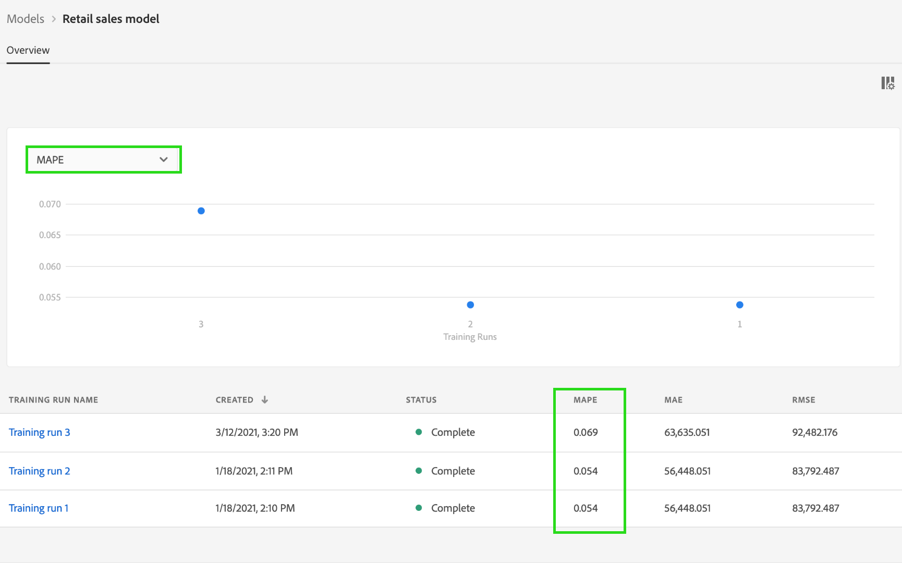

# Formazione e valutazione di un modello nell’interfaccia utente di Data Science Workspace

In Adobe Experience Platform Data Science Workspace, viene creato un modello di apprendimento automatico incorporando una ricetta esistente appropriata per l’intento del modello. Il Modello viene quindi addestrato e valutato per ottimizzarne l&#39;efficienza operativa e l&#39;efficacia attraverso l&#39;ottimizzazione dei relativi Hyperparametri associati. Le ricette sono riutilizzabili, il che significa che è possibile creare più modelli e personalizzarli per scopi specifici con una singola ricetta.

Questo tutorial illustra i passaggi necessari per creare, addestrare e valutare un modello.

## Introduzione

Per completare questa esercitazione, devi avere accesso a [!DNL Experience Platform]. Se non hai accesso a un’organizzazione in [!DNL Experience Platform], contattare l&#39;amministratore di sistema prima di procedere.

Questa esercitazione richiede una ricetta esistente. Se non hai una ricetta, segui la [Importare una composizione in pacchetti nell’interfaccia utente](./import-packaged-recipe-ui.md) prima di continuare.

## Creare un modello

Ad Experience Platform, seleziona la **[!UICONTROL Modelli]** nella barra di navigazione a sinistra, quindi seleziona la scheda Sfoglia per visualizzare i modelli esistenti. Seleziona **[!UICONTROL Crea modello]** in alto a destra nella pagina per iniziare un processo di creazione di un modello.

Sfoglia l’elenco delle ricette esistenti, individua e seleziona la ricetta da utilizzare per creare il modello e seleziona **[!UICONTROL Successivo]**.

Seleziona un set di dati di input appropriato e seleziona **[!UICONTROL Successivo]**. In questo modo verrà impostato il set di dati di addestramento di input predefinito per il modello.

Fornite un nome per il modello ed esaminate le configurazioni del modello di default. Le configurazioni di default venivano applicate durante la creazione della ricetta, esaminando e modificando i valori di configurazione facendo doppio clic sui valori.

Per fornire un nuovo set di configurazioni, seleziona **[!UICONTROL Carica nuova configurazione]** e trascina un file JSON contenente le configurazioni del modello nella finestra del browser. Seleziona **[!UICONTROL Fine]** per creare il modello.

>[!NOTE]
>
>Le configurazioni sono univoche e specifiche della ricetta prevista, il che significa che le configurazioni della ricetta di vendita al dettaglio non funzioneranno per la ricetta di Recommendations del prodotto. Consulta la [riferimento](#reference) sezione per un elenco delle configurazioni delle ricette per la vendita al dettaglio.

## Creare un’esecuzione del corso di formazione

Ad Experience Platform, seleziona la **[!UICONTROL Modelli]** nella barra di navigazione a sinistra, quindi seleziona la scheda Sfoglia per visualizzare i modelli esistenti. Individuare e selezionare il collegamento ipertestuale associato al nome del modello che si desidera addestrare.

Sono elencate tutte le esecuzioni di formazione esistenti con i relativi stati di formazione correnti. Per i modelli creati utilizzando [!DNL Data Science Workspace] interfaccia utente, un’esecuzione dell’addestramento viene generata ed eseguita automaticamente utilizzando le configurazioni predefinite e il set di dati di addestramento di input.

Creare una nuova esecuzione dell’apprendimento selezionando **[!UICONTROL Addestra]** in alto a destra nella pagina di panoramica del modello.

Seleziona il set di dati di input dell’addestramento per l’esecuzione dell’addestramento, quindi seleziona **[!UICONTROL Successivo]**.

Le configurazioni predefinite fornite durante la creazione del modello vengono visualizzate, modificate e modificate di conseguenza facendo doppio clic sui valori. Seleziona **[!UICONTROL Fine]** per creare ed eseguire l’esecuzione dell’addestramento.

>[!NOTE]
>
>Le configurazioni sono univoche e specifiche della ricetta prevista, il che significa che le configurazioni della ricetta di vendita al dettaglio non funzioneranno per la ricetta di Recommendations del prodotto. Consulta la [riferimento](#reference) sezione per un elenco delle configurazioni delle ricette per la vendita al dettaglio.

## Valutare il modello

Ad Experience Platform, seleziona la **[!UICONTROL Modelli]** nella barra di navigazione a sinistra, quindi seleziona la scheda Sfoglia per visualizzare i modelli esistenti. Individuare e selezionare il collegamento ipertestuale associato al nome del modello che si desidera valutare.

Sono elencate tutte le esecuzioni di formazione esistenti con i relativi stati di formazione correnti. Con più esecuzioni di formazione completate, le metriche di valutazione possono essere confrontate tra diverse esecuzioni di formazione nel grafico di valutazione del modello. Seleziona una metrica di valutazione utilizzando l’elenco a discesa sopra il grafico.

La metrica MAPE (Mean Absolute Percent Error) esprime l’accuratezza come percentuale dell’errore. Viene utilizzato per identificare l’esperimento con le prestazioni migliori. Più basso è il MAPE, meglio è.

La metrica &quot;Precisione&quot; descrive la percentuale di istanze rilevanti rispetto al totale *recuperato* Istanze. La precisione può essere vista come la probabilità che un risultato selezionato casualmente sia corretto.

La selezione di un’esecuzione di addestramento specifica fornisce i dettagli dell’esecuzione aprendo la pagina di valutazione. Questa operazione può essere eseguita anche prima del completamento dell’esecuzione. Nella pagina di valutazione puoi visualizzare altre metriche di valutazione, parametri di configurazione e visualizzazioni specifici per l’esecuzione dell’apprendimento.

Puoi anche scaricare i registri attività per visualizzare i dettagli dell’esecuzione. I registri sono particolarmente utili per le esecuzioni non riuscite per individuare l’errore.

Gli iperparametri non possono essere addestrati e un modello deve essere ottimizzato testando diverse combinazioni di iperparametri. Ripetere questo processo di formazione e valutazione del modello fino a ottenere un modello ottimizzato.

## Passaggi successivi

Questo tutorial illustra come creare, addestrare e valutare un modello in [!DNL Data Science Workspace]. Una volta raggiunto un modello ottimizzato, puoi utilizzare il modello addestrato per generare informazioni seguendo la [Valutazione di un modello nell’interfaccia utente](./score-model-ui.md) esercitazione.

## Riferimenti {#reference}

### Configurazioni ricetta vendita al dettaglio

Gli iperparametri determinano il comportamento di addestramento del modello, modificando gli iperparametri si avrà un impatto sulla precisione e l&#39;accuratezza del modello:

| Hyperparameter | Descrizione | Intervallo consigliato |
| --- | --- | --- |
| tasso_di_apprendimento | Il tasso di apprendimento riduce il contributo di ogni albero in base al valore learning_rate. Esiste un compromesso tra learning_rate e n_estimatori. | 0.1 |
| n_stimatori | Il numero di fasi di potenziamento da eseguire. Il potenziamento della sfumatura è abbastanza robusto da adattare in eccesso, quindi un numero elevato di solito si traduce in prestazioni migliori. | 100 |
| max_depth | Profondità massima dei singoli stimatori di regressione. La profondità massima limita il numero di nodi nella struttura. Regola questo parametro per ottenere prestazioni migliori; il valore migliore dipende dall’interazione delle variabili di input. | 3 |

Parametri aggiuntivi determinano le proprietà tecniche del modello:

| Chiave parametro | Tipo | Descrizione |
| ----- | ----- | ----- |
| `ACP_DSW_INPUT_FEATURES` | Stringa | Elenco di attributi dello schema di input separati da virgole. |
| `ACP_DSW_TARGET_FEATURES` | Stringa | Elenco di attributi dello schema di output separati da virgole. |
| `ACP_DSW_FEATURE_UPDATE_SUPPORT` | Booleano | Determina se le funzioni di input e output sono modificabili |
| `tenantId` | Stringa | Questo ID garantisce che le risorse create abbiano uno spazio dei nomi corretto e siano contenute all’interno dell’organizzazione. [Segui questi passaggi](../../xdm/api/getting-started.md#know-your-tenant_id) per trovare il tuo ID tenant. |
| `ACP_DSW_TRAINING_XDM_SCHEMA` | Stringa | Schema di input utilizzato per l’apprendimento di un modello. |
| `evaluation.labelColumn` | Stringa | Etichetta di colonna per le visualizzazioni di valutazione. |
| `evaluation.metrics` | Stringa | Elenco separato da virgole delle metriche di valutazione da utilizzare per la valutazione di un modello. |
| `ACP_DSW_SCORING_RESULTS_XDM_SCHEMA` | Stringa | Schema di output utilizzato per il punteggio di un modello. |
