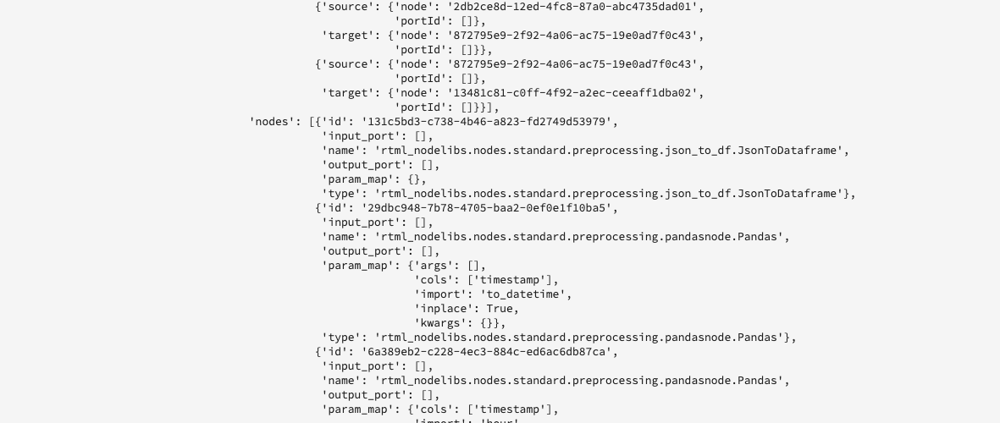
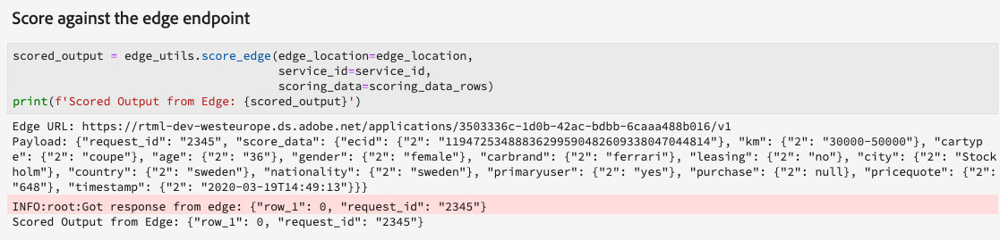

# Gestire notebook di Machine Learning in tempo reale (Alpha)

>[!NOTE]
>
>Data Science Area di lavoro non è più disponibile per l&#39;acquisto.
>
>Questa documentazione è destinata ai clienti esistenti con precedenti diritti a Data Science Area di lavoro.

>[!IMPORTANT]
>
>L&#39;apprendimento automatico in tempo reale non è ancora disponibile per tutti gli utenti. Questa funzione è in versione alpha ed è ancora in fase di test. Questo documento è soggetto a modifiche.

La guida seguente descrive i passaggi necessari per versione un applicazione di Machine Learning in tempo reale. Utilizzando il modello di notebook ML Python in tempo ]**reale fornito Adobe Systems**[!UICONTROL , questa guida illustra training modello, la creazione di un DSL, la pubblicazione di DSL su Edge e il punteggio del richiesta. Man mano che si procede nell&#39;implementazione del modello di Machine Learning in tempo reale, è necessario modificare il modello per adattarlo alle esigenze del set di dati.

## Crea un notebook di Machine Learning in tempo reale

Nella Adobe Experience Platform interfaccia selezionare **[!UICONTROL Blocchi appunti]** da Data **Science**. Successivo, seleziona **[!UICONTROL JupyterLab]** e attendi un po&#39; di tempo per il caricamento dell&#39;ambiente.


Viene visualizzato il [!DNL JupyterLab] modulo di avvio. Scorri verso il basso fino a *Real-Time Machine Learning* e seleziona il blocco appunti Real-time **[!UICONTROL ML]** . Si apre un modello contenente celle di notebook di esempio con un set di dati di esempio.


## Importa e individua nodi

Inizia importando tutti i pacchetti necessari per il tuo modello. Assicurati che qualsiasi pacchetto che intendi utilizzare per l&#39;authoring dei nodi sia importato.

>[!NOTE]
>
>L&#39;elenco delle importazioni potrebbe variare in base al modello che si desidera realizzare. Questo elenco cambierà man mano che nuovi nodi verranno aggiunti nel tempo. Fare riferimento alla [guida](./node-reference.md) di riferimento dei nodi per un elenco completo dei nodi disponibili.

```python
from pprint import pprint
import pandas as pd
import numpy as np
import json
import uuid
from shutil import copyfile
from pathlib import Path
from datetime import date, datetime, timedelta
from platform_sdk.dataset_reader import DatasetReader

from rtml_nodelibs.nodes.standard.preprocessing.json_to_df import JsonToDataframe
from rtml_sdk.edge.utils import EdgeUtils
from rtml_sdk.graph.utils import GraphBuilder
from rtml_nodelibs.nodes.standard.ml.onnx import ONNXNode
from rtml_nodelibs.core.nodefactory import NodeFactory as nf
from rtml_nodelibs.nodes.standard.preprocessing.pandasnode import Pandas
from rtml_nodelibs.nodes.standard.preprocessing.one_hot_encoder import OneHotEncoder
from rtml_nodelibs.nodes.standard.ml.artifact_utils import ModelUpload
from rtml_nodelibs.core.nodefactory import NodeFactory as nf
from rtml_nodelibs.core.datamsg import DataMsg
```

Nella cella di codice riportata di seguito viene stampato un elenco di nodi disponibili.

```python
# Discover Nodes
pprint(nf.discover_nodes())
```


## Training di un modello di Machine Learning in tempo reale

Utilizzando una delle opzioni seguenti, scriverai [!DNL Python] il codice per leggere, preelaborare e analizzare i dati. Successivo, è necessario addestrare il proprio modello ML, serializzarlo in formato ONNX e quindi caricarlo nel modello di Machine Learning in tempo reale store.

- [Eseguire il training del proprio modello nei notebook JupyterLab](#training-your-own-model)
- [Caricamento del proprio modello ONNX pre-addestrato sui notebook JupyterLab](#pre-trained-model-upload)

### Formazione del proprio modello {#training-your-own-model}

Inizia caricando i tuoi dati training.

>[!NOTE]
>
>Nel modello ML in tempo **reale, il set di dati](https://github.com/adobe/experience-platform-dsw-reference/tree/master/datasets/insurance) CSV dell&#39;assicurazione**[auto viene acquisito da [!DNL Github].


Se desideri utilizzare un set di dati all’interno di Adobe Experience Platform, rimuovi il commento dalla cella sottostante. Sostituire `DATASET_ID` con il valore appropriato.


Per accedere a un set di dati nel blocco appunti [!DNL JupyterLab], seleziona la scheda **Dati** nell&#39;area di navigazione a sinistra di [!DNL JupyterLab]. Vengono visualizzate le **[!UICONTROL directory Datasets]** e **[!UICONTROL Schemas]** . Selezionare **[!UICONTROL Set di]** dati e fare clic con il pulsante destro del mouse, quindi selezionare l&#39;opzione **[!UICONTROL Esplora dati in blocco appunti]** dal menu a discesa sul set di dati che si desidera utilizzare. Una voce di codice eseguibile viene visualizzata nella parte inferiore del blocco appunti. Questa cella ha il tuo `dataset_id`file .


Al termine, fare clic con il pulsante destro del mouse ed eliminare la cella generata nella parte inferiore del blocco appunti.

### Proprietà dell&#39;allenamento

Utilizzando il modello fornito, modificare una qualsiasi delle proprietà training all&#39;interno `config_properties`di .

```python
config_properties = {
    "train_records_limit":1000000,
    "n_estimators": "80",
    "max_depth": "5",
    "ten_id": "_experienceplatform"  
}
```

### Prepara il modello

Utilizzando il **[!UICONTROL modello ML in tempo]** reale, è necessario analizzare, preelaborare, addestrare e valutare il modello ML. Questo viene fatto applicando trasformazioni di dati e creando una pipeline training.

**Trasformazioni dei dati**

La **[!UICONTROL cella Trasformazioni dati** dei modelli **ML in tempo]** reale deve essere modificata per funzionare con il proprio set di dati. In genere ciò comporta la ridenominazione delle colonne, l&#39;rollup di dati e la preparazione dei dati/progettazione delle funzionalità.

>[!NOTE]
>
>L&#39;esempio seguente è stato condensato per motivi di leggibilità utilizzando `[ ... ]`. Visualizza ed espandi la *sezione Trasformazioni dei dati dei modelli ML in tempo* reale per la cella di codice completa.

```python
df1.rename(columns = {config_properties['ten_id']+'.identification.ecid': 'ecid',
                     [ ... ]}, inplace=True)
df1 = df1[['ecid', 'km', 'cartype', 'age', 'gender', 'carbrand', 'leasing', 'city', 
       'country', 'nationality', 'primaryuser', 'purchase', 'pricequote', 'timestamp']]
print("df1 shape 1", df1.shape)
#########################################
# Data Rollup
######################################### 
df1['timestamp'] = pd.to_datetime(df1.timestamp)
df1['hour'] = df1['timestamp'].dt.hour.astype(int)
df1['dayofweek'] = df1['timestamp'].dt.dayofweek

df1.loc[(df1['purchase'] == 'yes'), 'purchase'] = 1
df1.purchase.fillna(0, inplace=True)
df1['purchase'] = df1['purchase'].astype(int)

[ ... ]

print("df1 shape 2", df1.shape)

#########################################
# Data Preparation/Feature Engineering
#########################################      

df1['carbrand'] = df1['carbrand'].str.lower()
df1['country'] = df1['country'].str.lower()
df1.loc[(df1['carbrand'] == 'vw'), 'carbrand'] = 'volkswagen'

[ ... ]

df1['age'].fillna(df1['age'].median(), inplace=True)
df1['gender'].fillna('notgiven', inplace=True)

[ ... ]

df1['city'] = df1.groupby('country')['city'].transform(lambda x: x.fillna(x.mode()))
df1.dropna(subset = ['pricequote'], inplace=True)
print("df1 shape 3", df1.shape)
print(df1)

#grouping
grouping_cols = ['carbrand', 'cartype', 'city', 'country']

for col in grouping_cols:
    df_idx = pd.DataFrame(df1[col].value_counts().head(6))

    def grouping(x):
        if x in df_idx.index:
            return x
        else:
            return "Others"
    df1[col] = df1[col].apply(lambda x: grouping(x))

def age(x):
    if x < 20:
        return "u20"
    elif x > 19 and x < 29:
    [ ... ]
    else: 
        return "Others"

df1['age'] = df1['age'].astype(int)
df1['age_bucket'] = df1['age'].apply(lambda x: age(x))

df_final = df1[['hour', 'dayofweek','age_bucket', 'gender', 'city',  
   'country', 'carbrand', 'cartype', 'leasing', 'pricequote', 'purchase']]
print("df final", df_final.shape)

cat_cols = ['age_bucket', 'gender', 'city', 'dayofweek', 'country', 'carbrand', 'cartype', 'leasing']
df_final = pd.get_dummies(df_final, columns = cat_cols)
```

Esegui la cella specificata per vedere un risultato di esempio. La tabella di output restituita dal set di dati `carinsurancedataset.csv` restituisce le modifiche definite.


**Pipeline di formazione**

Successivamente, devi creare la pipeline di apprendimento. Sarà simile a qualsiasi altro file della pipeline di apprendimento, tranne per il fatto che è necessario convertire e generare un file ONNX.

Utilizzando le trasformazioni di dati definite nella cella precedente, modificare il modello. Il codice seguente evidenziato di seguito viene utilizzato per generare un file ONNX nella pipeline delle funzionalità. Visualizzare il *modello ML in tempo* reale per la cella di codice completa della pipeline.

```python
#for generating onnx
def generate_onnx_resources(self):        
    install_dir = os.path.expanduser('~/my-workspace')
    print("Generating Onnx")
        
    from skl2onnx import convert_sklearn
    from skl2onnx.common.data_types import FloatTensorType
        
    # ONNX-ification
    initial_type = [('float_input', FloatTensorType([None, self.feature_len]))]

    print("Converting Model to Onnx")
    onx = convert_sklearn(self.model, initial_types=initial_type)
             
    with open("model.onnx", "wb") as f:
        f.write(onx.SerializeToString())
            
    print("Model onnx created")
```

Dopo aver completato la pipeline training e modificato i dati tramite trasformazioni di dati, utilizzare la cella seguente per eseguire training.

```python
model = train(config_properties, df_final)
```

### Genera e carica un modello ONNX

Dopo aver completato correttamente l&#39;esecuzione del training, è necessario generare un modello ONNX e caricare il modello sottoposto a training nella store del modello di Machine Learning in tempo reale. Dopo aver eseguito le celle seguenti, il modello ONNX viene visualizzato nella barra sinistra accanto a tutti gli altri blocchi appunti.

```python
import os
import skl2onnx, subprocess

model.generate_onnx_resources()
```

>[!NOTE]
>
>Modificare il valore stringa `model_path` (`model.onnx`) per cambiare il nome del modello.

```python
model_path = "model.onnx"
```

>[!NOTE]
>
>La cella seguente non è modificabile o eliminabile ed è necessaria per il funzionamento del applicazione di apprendimento automatico in tempo reale.

```python
model = ModelUpload(params={'model_path': model_path})
msg_model = model.process(None, 1)
model_id = msg_model.model['model_id']
 
print("Model ID: ", model_id)
```


### Caricamento del proprio modello ONNX pre-addestrato {#pre-trained-model-upload}

Utilizzando l&#39;pulsante di caricamento disponibile nei [!DNL JupyterLab] blocchi appunti, caricare il modello ONNX pre-addestrato nell&#39;ambiente [!DNL Data Science Workspace] notebook.


Successivo, modificare il valore della `model_path` stringa nel *notebook ML in tempo* reale in modo che corrisponda al nome del modello ONNX. Una volta completato, esegui la *cella Imposta percorso* modello, quindi esegui la cella Carica il modello nell&#39;archivio ** modelli RTML. La posizione del modello e l&#39;ID del modello vengono entrambi restituiti nella risposta in caso di esito positivo.


## Creazione DSL (Domain Specific Language)

In questa sezione viene descritta la creazione di una DSL. Stai per creare i nodi che includono qualsiasi pre-elaborazione dei dati insieme al nodo ONNX. Successivo, un grafico DSL viene creato utilizzando nodi e bordi. I bordi collegano i nodi utilizzando il formato basato su tupla (node_1, node_2). Il grafico non dovrebbe avere cicli.

>[!IMPORTANT]
>
>L&#39;utilizzo del nodo ONNX è obbligatorio. Senza il nodo ONNX, il applicazione avrà esito negativo.

### Authoring dei nodi

>[!NOTE]
>
> È probabile che tu abbia più nodi in base al tipo di dati utilizzato. Nell&#39;esempio *seguente viene delineato un solo nodo nel modello ML in tempo* reale. Consultate la *sezione Real-time ML* templates *Node Authoring* per la cella di codice completa.

Il nodo Pandas riportato di seguito viene utilizzato `"import": "map"` per importare il nome del metodo come stringa nei parametri, seguito dall&#39;immissione dei parametri come funzione mappa. L&#39;esempio seguente esegue questa operazione utilizzando `{'arg': {'dataLayerNull': 'notgiven', 'no': 'no', 'yes': 'yes', 'notgiven': 'notgiven'}}`. Una volta impostata la mappa, è possibile impostarla `inplace` come `True` o `False`. Imposta `inplace` come `True` o `False` in base al fatto che desideri applicare o meno la trasformazione. Per impostazione predefinita `"inplace": False` crea una nuova colonna. Il supporto per fornire un nuovo nome di colonna è impostato per essere aggiunto in una versione successiva. L&#39;ultima riga `cols` può essere un nome di una singola colonna o un elenco di colonne. Specificare le colonne a cui applicare la trasformazione. In questo esempio `leasing` è specificato. Per ulteriori informazioni sui nodi disponibili e su come usarli, visita la guida](./node-reference.md) di riferimento ai [nodi.

```python
# Renaming leasing column using Pandas Node
leasing_mapper_node = Pandas(params={'import': 'map',
                                'kwargs': {'arg': {
                                    'dataLayerNull': 'notgiven', 
                                    'no': 'no', 
                                    'yes': 'yes', 
                                    'notgiven': 'notgiven'}},
                                'inplace': True,
                                'cols': 'leasing'})
```

### Creare il grafico DSL

Una volta creati i nodi, il passaggio successivo consiste nel concatenare i nodi per creare un grafico.

Inizia elencando tutti i nodi che fanno parte del grafico creando un array.

```python
nodes = [json_df_node, 
        to_datetime_node,
        hour_node,
        dayofweek_node,
        age_fillna_node,
        carbrand_fillna_node,
        country_fillna_node,
        cartype_primary_nationality_km_fillna_node,
        carbrand_mapper_node,
        cartype_mapper_node,
        country_mapper_node,
        gender_mapper_node,
        leasing_mapper_node,
        age_to_int_node,
        age_bins_node,
        dummies_node, 
        onnx_node]
```

Successivo, collegare i nodi con i bordi. Ogni tupla è una [!DNL Edge] connessione.

>[!TIP]
>
> Poiché i nodi sono linearmente dipendenti l&#39;uno dall&#39;altro (ogni nodo dipende dall&#39;output del nodo precedente), è possibile creare collegamenti utilizzando una semplice comprensione dell&#39;elenco Python. Aggiungi le tue connessioni se un nodo dipende da più input.

```python
edges = [(nodes[i], nodes[i+1]) for i in range(len(nodes)-1)]
```

Una volta che i nodi sono connessi, versione il grafico. La cella sottostante è obbligatoria e non può essere modificata o eliminata.

```python
dsl = GraphBuilder.generate_dsl(nodes=nodes, edges=edges)
pprint(json.loads(dsl))
```

Una volta completato, viene restituito un `edge` oggetto contenente ciascuno dei nodi e i parametri mappati ad essi.



## Publish a Edge (Hub)

>[!NOTE]
>
>Real-time Machine Learning viene temporaneamente distribuito e gestito dall’hub Adobe Experience Platform. Per ulteriori dettagli, visitare la sezione panoramica sull&#39;[architettura di apprendimento automatico in tempo reale](./home.md#architecture).

Dopo aver creato un grafico DSL, è possibile distribuirlo a [!DNL Edge].

>[!IMPORTANT]
>
>Non pubblicare su [!DNL Edge] spesso, questo può sovraccaricare i nodi [!DNL Edge]. Non è consigliabile pubblicare lo stesso modello più volte.

```python
edge_utils = EdgeUtils()
(edge_location, service_id) = edge_utils.publish_to_edge(dsl=dsl)
print(f'Edge Location: {edge_location}')
print(f'Service ID: {service_id}')
```

### Aggiornamento della DSL e ripubblicazione su Edge (facoltativo)

Se non è necessario aggiornare la DSL, è possibile passare al [punteggio](#scoring).

>[!NOTE]
>
>Le celle seguenti sono necessarie solo se desideri aggiornare un file DSL esistente che è stato pubblicato su Edge.

È probabile che i tuoi modelli continuino a svilupparsi. Invece di creare un servizio completamente nuovo, è possibile aggiornare un servizio esistente con il nuovo modello. È possibile definire un nodo che si desidera aggiornare, assegnargli un nuovo ID, quindi ricaricare il nuovo DSL in [!DNL Edge].

Nell&#39;esempio seguente, il nodo 0 viene aggiornato con un nuovo ID.

```python
# Update the id of Node 0 with a random uuid.

dsl_dict = json.loads(dsl)
print(f"ID of Node 0 in current DSL: {dsl_dict['edge']['applicationDsl']['nodes'][0]['id']}")

new_node_id = str(uuid.uuid4())
print(f'Updated Node ID: {new_node_id}')

dsl_dict['edge']['applicationDsl']['nodes'][0]['id'] = new_node_id
```


Dopo aver aggiornato l&#39;ID del nodo, puoi pubblicare nuovamente un DSL aggiornato all&#39;Edge.

```python
# Republish the updated DSL to Edge
(edge_location_ret, service_id, updated_dsl) = edge_utils.update_deployment(dsl=json.dumps(dsl_dict), service_id=service_id)
print(f'Updated dsl: {updated_dsl}')
```

Viene restituita la DSL aggiornata.


## Punteggio {#scoring}

Dopo la pubblicazione in [!DNL Edge], il punteggio viene effettuato da un richiesta POST da un client. In genere, questa operazione può essere eseguita da un applicazione client che necessita di punteggi ML. Puoi farlo anche da Postman. Il modello **[!UICONTROL Real-time ML]** utilizza EdgeUtils per dimostrare questo processo.

>[!NOTE]
>
>È necessario un piccolo tempo di elaborazione prima dell’inizio del punteggio.

```python
# Wait for the app to come up
import time
time.sleep(20)
```

Utilizzando lo stesso schema utilizzato nell’apprendimento, vengono generati dati di punteggio di esempio. Questi dati vengono utilizzati per creare un dataframe di punteggio e quindi convertiti in un dizionario di punteggio. Visualizzare il modello *Real-time ML* per la cella di codice completa.


### Punteggio rispetto all&#39;endpoint Edge

Usa la cella seguente all&#39;interno del *modello ML in tempo* reale per assegnare un punteggio rispetto al servizio [!DNL Edge] .



Una volta completato il punteggio, vengono restituiti il URL, il payload e l&#39;output [!DNL Edge] [!DNL Edge] con punteggio.

## Elencare le app distribuite dalla pagina [!DNL Edge]

Per generare un elenco delle app attualmente distribuite in [!DNL Edge], eseguire la cella di codice seguente. Impossibile modificare o eliminare questa cella.

```python
services = edge_utils.list_deployed_services()
print(services)
```

La risposta restituita è un array dei servizi distribuiti.

```json
[
    {
        "created": "2020-05-25T19:18:52.731Z",
        "deprecated": false,
        "id": "40eq76c0-1c6f-427a-8f8f-54y9cdf041b7",
        "type": "edge",
        "updated": "2020-05-25T19:18:52.731Z"
    }
]
```

## Elimina un ID app o servizio distribuito dalla [!DNL Edge] cartella (opzionale)

>[!CAUTION]
>
>Questa cella viene utilizzata per eliminare l&#39;applicazione Edge distribuito. Non utilizzare la cella seguente a meno che non sia necessario eliminare un applicazione distribuito [!DNL Edge] .

```python
if edge_utils.delete_from_edge(service_id=service_id):
    print(f"Deleted service id {service_id} successfully")
else:
    print(f"Failed to delete service id {service_id}")
```

## Passaggi successivi

Seguendo la esercitazione precedente, è stato correttamente addestrato e caricato un modello ONNX nel modello di Machine Learning in tempo reale store. Inoltre, hai assegnato un punteggio e distribuito il tuo modello di Machine Learning in tempo reale. Per ulteriori informazioni sui nodi disponibili per l&#39;authoring dei modelli, visita la guida](./node-reference.md) di riferimento ai [nodi.
