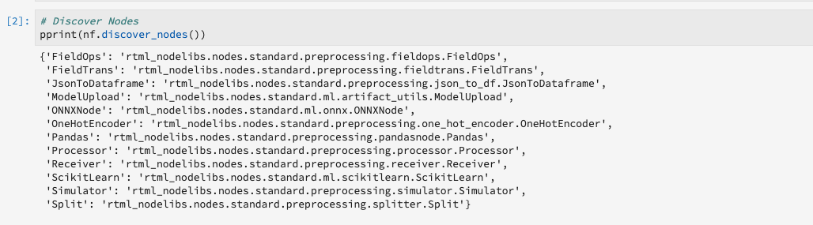
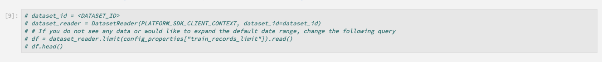

# Gestire i blocchi appunti di apprendimento automatico in tempo reale (Alpha)

>[!IMPORTANT]
>
>L&#39;apprendimento automatico in tempo reale non è ancora disponibile per tutti gli utenti. Questa funzione è in alfa e viene ancora testata. Questo documento è soggetto a modifiche.

La guida seguente illustra i passaggi necessari per creare un&#39;applicazione di apprendimento automatico in tempo reale. Utilizzo dell’Adobe fornito **[!UICONTROL ML in tempo reale]** Modello per notebook Python, questa guida tratta la formazione di un modello, la creazione di un DSL, la pubblicazione di DSL su Edge e il punteggio della richiesta. Durante l&#39;implementazione del modello di apprendimento automatico in tempo reale, è previsto che modifichi il modello per adattarlo alle esigenze del set di dati.

## Creare un blocco appunti per l&#39;apprendimento automatico in tempo reale

Nell’interfaccia utente di Adobe Experience Platform, seleziona **[!UICONTROL Notebook]** dall&#39;interno **Data Science**. Quindi, seleziona **[!UICONTROL JupyterLab]** e lascia un po&#39; di tempo per il caricamento dell&#39;ambiente.


La [!DNL JupyterLab] viene visualizzato il modulo di avvio. Scorri verso il basso fino a *Apprendimento automatico in tempo reale* e seleziona la **[!UICONTROL ML in tempo reale]** blocco appunti. Viene aperto un modello contenente celle di esempio per un blocco appunti con un set di dati di esempio.


## Importare e individuare i nodi

Iniziare importando tutti i pacchetti richiesti per il modello. Assicurati che tutti i pacchetti che intendi utilizzare per la creazione dei nodi siano importati.

>[!NOTE]
>
>L’elenco delle importazioni potrebbe essere diverso in base al modello che si desidera creare. Questo elenco verrà modificato man mano che nuovi nodi vengono aggiunti nel tempo. Fai riferimento alla [guida di riferimento dei nodi](./node-reference.md) per un elenco completo dei nodi disponibili.

```python
from pprint import pprint
import pandas as pd
import numpy as np
import json
import uuid
from shutil import copyfile
from pathlib import Path
from datetime import date, datetime, timedelta
from platform_sdk.dataset_reader import DatasetReader

from rtml_nodelibs.nodes.standard.preprocessing.json_to_df import JsonToDataframe
from rtml_sdk.edge.utils import EdgeUtils
from rtml_sdk.graph.utils import GraphBuilder
from rtml_nodelibs.nodes.standard.ml.onnx import ONNXNode
from rtml_nodelibs.core.nodefactory import NodeFactory as nf
from rtml_nodelibs.nodes.standard.preprocessing.pandasnode import Pandas
from rtml_nodelibs.nodes.standard.preprocessing.one_hot_encoder import OneHotEncoder
from rtml_nodelibs.nodes.standard.ml.artifact_utils import ModelUpload
from rtml_nodelibs.core.nodefactory import NodeFactory as nf
from rtml_nodelibs.core.datamsg import DataMsg
```

Nella cella di codice seguente viene stampato un elenco dei nodi disponibili.

```python
# Discover Nodes
pprint(nf.discover_nodes())
```



## Formazione di un modello di apprendimento automatico in tempo reale

Utilizzando una delle seguenti opzioni, scriverai [!DNL Python] codice per leggere, preelaborare e analizzare i dati. Successivamente, devi addestrare il tuo modello ML, serializzarlo in formato ONNX e caricarlo nello store del modello Real-time Machine Learning.

- [Formazione del tuo modello nei notebook JupyterLab](#training-your-own-model)
- [Caricamento del proprio modello ONNX pre-addestrato sui notebook JupyterLab](#pre-trained-model-upload)

### Formazione del proprio modello {#training-your-own-model}

Inizia caricando i dati di formazione.

>[!NOTE]
>
>In **ML in tempo reale** modello, [set di dati CSV per l&#39;assicurazione auto](https://github.com/adobe/experience-platform-dsw-reference/tree/master/datasets/insurance) è preso da [!DNL Github].


Se desideri utilizzare un set di dati da Adobe Experience Platform, decommenta la cella sottostante. Successivamente, devi sostituire `DATASET_ID` con il valore appropriato.



Per accedere a un set di dati nel [!DNL JupyterLab] blocco appunti, selezionare **Dati** nella navigazione a sinistra di [!DNL JupyterLab]. La **[!UICONTROL Set di dati]** e **[!UICONTROL Schemi]** vengono visualizzate le directory. Seleziona **[!UICONTROL Set di dati]** e fai clic con il pulsante destro del mouse, quindi seleziona il **[!UICONTROL Esplorare i dati nel notebook]** dal menu a discesa del set di dati che desideri utilizzare. Nella parte inferiore del blocco appunti viene visualizzata una voce di codice eseguibile. Questa cella ha il tuo `dataset_id`.


Una volta completata, fare clic con il pulsante destro del mouse ed eliminare la cella generata nella parte inferiore del blocco appunti.

### Proprietà di formazione

Utilizzando il modello fornito, modifica una delle proprietà di formazione in `config_properties`.

```python
config_properties = {
    "train_records_limit":1000000,
    "n_estimators": "80",
    "max_depth": "5",
    "ten_id": "_experienceplatform"  
}
```

### Preparare il modello

Utilizzo della **[!UICONTROL ML in tempo reale]** modello, è necessario analizzare, pre-elaborare, addestrare e valutare il modello ML. Questo viene fatto applicando le trasformazioni dei dati e creando una pipeline di formazione.

**Trasformazioni dei dati**

La **[!UICONTROL ML in tempo reale]** modelli **Trasformazioni dei dati** per funzionare con il proprio set di dati, è necessario modificare la cella. In genere questo comporta la ridenominazione di colonne, il rollup dei dati e la preparazione/progettazione di funzioni dei dati.

>[!NOTE]
>
>L’esempio seguente è stato condensato a fini di leggibilità utilizzando `[ ... ]`. Visualizza ed espandi la *ML in tempo reale* sezione sulle trasformazioni di dati dei modelli per la cella di codice completa.

```python
df1.rename(columns = {config_properties['ten_id']+'.identification.ecid': 'ecid',
                     [ ... ]}, inplace=True)
df1 = df1[['ecid', 'km', 'cartype', 'age', 'gender', 'carbrand', 'leasing', 'city', 
       'country', 'nationality', 'primaryuser', 'purchase', 'pricequote', 'timestamp']]
print("df1 shape 1", df1.shape)
#########################################
# Data Rollup
######################################### 
df1['timestamp'] = pd.to_datetime(df1.timestamp)
df1['hour'] = df1['timestamp'].dt.hour.astype(int)
df1['dayofweek'] = df1['timestamp'].dt.dayofweek

df1.loc[(df1['purchase'] == 'yes'), 'purchase'] = 1
df1.purchase.fillna(0, inplace=True)
df1['purchase'] = df1['purchase'].astype(int)

[ ... ]

print("df1 shape 2", df1.shape)

#########################################
# Data Preparation/Feature Engineering
#########################################      

df1['carbrand'] = df1['carbrand'].str.lower()
df1['country'] = df1['country'].str.lower()
df1.loc[(df1['carbrand'] == 'vw'), 'carbrand'] = 'volkswagen'

[ ... ]

df1['age'].fillna(df1['age'].median(), inplace=True)
df1['gender'].fillna('notgiven', inplace=True)

[ ... ]

df1['city'] = df1.groupby('country')['city'].transform(lambda x: x.fillna(x.mode()))
df1.dropna(subset = ['pricequote'], inplace=True)
print("df1 shape 3", df1.shape)
print(df1)

#grouping
grouping_cols = ['carbrand', 'cartype', 'city', 'country']

for col in grouping_cols:
    df_idx = pd.DataFrame(df1[col].value_counts().head(6))

    def grouping(x):
        if x in df_idx.index:
            return x
        else:
            return "Others"
    df1[col] = df1[col].apply(lambda x: grouping(x))

def age(x):
    if x < 20:
        return "u20"
    elif x > 19 and x < 29:
    [ ... ]
    else: 
        return "Others"

df1['age'] = df1['age'].astype(int)
df1['age_bucket'] = df1['age'].apply(lambda x: age(x))

df_final = df1[['hour', 'dayofweek','age_bucket', 'gender', 'city',  
   'country', 'carbrand', 'cartype', 'leasing', 'pricequote', 'purchase']]
print("df final", df_final.shape)

cat_cols = ['age_bucket', 'gender', 'city', 'dayofweek', 'country', 'carbrand', 'cartype', 'leasing']
df_final = pd.get_dummies(df_final, columns = cat_cols)
```

Esegui la cella fornita per visualizzare un risultato di esempio. Tabella di output restituita dal `carinsurancedataset.csv` Il set di dati restituisce le modifiche definite.


**Gasdotto di formazione**

Ora devi creare la pipeline di formazione. Questo avrà un aspetto simile a qualsiasi altro file della pipeline di formazione, tranne che per convertire e generare un file ONNX.

Utilizzando le trasformazioni di dati definite nella cella precedente, modifica il modello. Il seguente codice evidenziato viene utilizzato per generare un file ONNX nella pipeline delle funzioni. Visualizza *ML in tempo reale* modello per la cella del codice pipeline completa.

```python
#for generating onnx
def generate_onnx_resources(self):        
    install_dir = os.path.expanduser('~/my-workspace')
    print("Generating Onnx")
        
    from skl2onnx import convert_sklearn
    from skl2onnx.common.data_types import FloatTensorType
        
    # ONNX-ification
    initial_type = [('float_input', FloatTensorType([None, self.feature_len]))]

    print("Converting Model to Onnx")
    onx = convert_sklearn(self.model, initial_types=initial_type)
             
    with open("model.onnx", "wb") as f:
        f.write(onx.SerializeToString())
            
    print("Model onnx created")
```

Una volta completata la pipeline di formazione e modificato i dati tramite le trasformazioni dei dati, utilizza la cella seguente per eseguire la formazione.

```python
model = train(config_properties, df_final)
```

### Generare e caricare un modello ONNX

Una volta completata l&#39;esecuzione di un corso di formazione, è necessario generare un modello ONNX e caricare il modello addestrato nello store del modello di apprendimento automatico in tempo reale. Dopo aver eseguito le celle seguenti, il modello ONNX viene visualizzato nella barra a sinistra accanto a tutti gli altri notebook.

```python
import os
import skl2onnx, subprocess

model.generate_onnx_resources()
```

>[!NOTE]
>
>Modificare la `model_path` valore stringa (`model.onnx`) per modificare il nome del modello.

```python
model_path = "model.onnx"
```

>[!NOTE]
>
>La cella seguente non è modificabile o eliminabile ed è necessaria per il funzionamento dell&#39;applicazione di apprendimento automatico in tempo reale.

```python
model = ModelUpload(params={'model_path': model_path})
msg_model = model.process(None, 1)
model_id = msg_model.model['model_id']
 
print("Model ID: ", model_id)
```


### Caricamento del proprio modello ONNX {#pre-trained-model-upload}

Utilizzo del pulsante di caricamento situato in [!DNL JupyterLab] notebook, carica il modello ONNX pre-addestrato nel [!DNL Data Science Workspace] ambiente notebook.


Quindi, modifica il `model_path` valore stringa nel *ML in tempo reale* notebook in modo che corrisponda al nome del modello ONNX. Una volta completato, esegui la *Imposta percorso modello* quindi eseguire la *Carica il modello nell&#39;archivio modelli RTML* cella. La posizione del modello e l&#39;ID del modello vengono entrambi restituiti nella risposta in caso di esito positivo.


## Creazione di una lingua specifica del dominio (DSL)

Questa sezione illustra la creazione di un DSL. Stai per creare i nodi che includono qualsiasi preelaborazione dei dati insieme al nodo ONNX. Successivamente, viene creato un grafico DSL utilizzando nodi e bordi. Gli spigoli collegano i nodi utilizzando il formato basato su tuple (node_1, node_2). Il grafico non deve avere cicli.

>[!IMPORTANT]
>
>L&#39;utilizzo del nodo ONNX è obbligatorio. Senza il nodo ONNX, l&#39;applicazione non avrà esito positivo.

### Authoring dei nodi

>[!NOTE]
>
> È probabile che si abbiano più nodi in base al tipo di dati utilizzato. L&#39;esempio seguente delinea solo un singolo nodo nel *ML in tempo reale* modello. Visualizza *ML in tempo reale* modelli *Authoring dei nodi* sezione per la cella del codice completa.

Il nodo panda sottostante utilizza `"import": "map"` per importare il nome del metodo come stringa nei parametri, quindi inserendo i parametri come funzione mappa. L’esempio seguente lo fa utilizzando `{'arg': {'dataLayerNull': 'notgiven', 'no': 'no', 'yes': 'yes', 'notgiven': 'notgiven'}}`. Dopo aver impostato la mappa, puoi scegliere di `inplace` come `True` o `False`. Imposta `inplace` come `True` o `False` a seconda che si desideri applicare o meno la trasformazione al suo interno. Per impostazione predefinita `"inplace": False` crea una nuova colonna. Il supporto per fornire un nuovo nome di colonna deve essere impostato per essere aggiunto in una versione successiva. Ultima riga `cols` può essere un nome di colonna singolo o un elenco di colonne. Specificare le colonne alle quali si desidera applicare la trasformazione. In questo esempio `leasing` è specificato. Per ulteriori informazioni sui nodi disponibili e su come utilizzarli, visita il [guida di riferimento dei nodi](./node-reference.md).

```python
# Renaming leasing column using Pandas Node
leasing_mapper_node = Pandas(params={'import': 'map',
                                'kwargs': {'arg': {
                                    'dataLayerNull': 'notgiven', 
                                    'no': 'no', 
                                    'yes': 'yes', 
                                    'notgiven': 'notgiven'}},
                                'inplace': True,
                                'cols': 'leasing'})
```

### Creare il grafico DSL

Con i nodi creati, il passaggio successivo consiste nel catena i nodi per creare un grafico.

Inizia elencando tutti i nodi che fanno parte del grafico creando un array.

```python
nodes = [json_df_node, 
        to_datetime_node,
        hour_node,
        dayofweek_node,
        age_fillna_node,
        carbrand_fillna_node,
        country_fillna_node,
        cartype_primary_nationality_km_fillna_node,
        carbrand_mapper_node,
        cartype_mapper_node,
        country_mapper_node,
        gender_mapper_node,
        leasing_mapper_node,
        age_to_int_node,
        age_bins_node,
        dummies_node, 
        onnx_node]
```

Poi, collega i nodi con i bordi. Ogni tupla è un [!DNL Edge] connessione.

>[!TIP]
>
> Poiché i nodi sono linearmente dipendenti l’uno dall’altro (ogni nodo dipende dall’output del nodo precedente), puoi creare collegamenti utilizzando una semplice comprensione dell’elenco Python. Aggiungi le tue connessioni se un nodo dipende da più input.

```python
edges = [(nodes[i], nodes[i+1]) for i in range(len(nodes)-1)]
```

Una volta che i nodi sono connessi, crea il grafico. La cella sottostante è obbligatoria e non può essere modificata o eliminata.

```python
dsl = GraphBuilder.generate_dsl(nodes=nodes, edges=edges)
pprint(json.loads(dsl))
```

Una volta completato, un `edge` viene restituito un oggetto contenente ciascuno dei nodi e i parametri mappati.


## Pubblicare su Edge (Hub)

>[!NOTE]
>
>Il machine learning in tempo reale viene temporaneamente distribuito e gestito da Adobe Experience Platform Hub. Per ulteriori dettagli, visita la sezione panoramica su [Architettura di apprendimento automatico in tempo reale](./home.md#architecture).

Ora che hai creato un grafico DSL, puoi distribuire il grafico in [!DNL Edge].

>[!IMPORTANT]
>
>Non pubblicare su [!DNL Edge] spesso, questo può sovraccaricare il [!DNL Edge] nodi. Si sconsiglia di pubblicare lo stesso modello più volte.

```python
edge_utils = EdgeUtils()
(edge_location, service_id) = edge_utils.publish_to_edge(dsl=dsl)
print(f'Edge Location: {edge_location}')
print(f'Service ID: {service_id}')
```

### Aggiornamento del DSL e ripubblicazione su Edge (facoltativo)

Se non è necessario aggiornare il DSL, puoi passare a [punteggio](#scoring).

>[!NOTE]
>
>Le celle seguenti sono necessarie solo se si desidera aggiornare un DSL esistente pubblicato in Edge.

È probabile che i modelli continuino a svilupparsi. Invece di creare un servizio completamente nuovo, è possibile aggiornare un servizio esistente con il nuovo modello. Puoi definire un nodo da aggiornare, assegnargli un nuovo ID, quindi ricaricare il nuovo DSL nel [!DNL Edge].

Nell&#39;esempio seguente, il nodo 0 viene aggiornato con un nuovo ID.

```python
# Update the id of Node 0 with a random uuid.

dsl_dict = json.loads(dsl)
print(f"ID of Node 0 in current DSL: {dsl_dict['edge']['applicationDsl']['nodes'][0]['id']}")

new_node_id = str(uuid.uuid4())
print(f'Updated Node ID: {new_node_id}')

dsl_dict['edge']['applicationDsl']['nodes'][0]['id'] = new_node_id
```


Dopo aver aggiornato l’ID del nodo, puoi ripubblicare un DSL aggiornato sul server Edge.

```python
# Republish the updated DSL to Edge
(edge_location_ret, service_id, updated_dsl) = edge_utils.update_deployment(dsl=json.dumps(dsl_dict), service_id=service_id)
print(f'Updated dsl: {updated_dsl}')
```

Viene restituito l’DSL aggiornato.


## Punteggio {#scoring}

Dopo la pubblicazione in [!DNL Edge], il punteggio viene eseguito da una richiesta POST di un client. In genere, questo può essere fatto da un&#39;applicazione client che richiede punteggi ML. Puoi farlo anche da Postman. La **[!UICONTROL ML in tempo reale]** Il modello utilizza EdgeUtils per illustrare questo processo.

>[!NOTE]
>
>Prima dell’inizio del punteggio è necessario un tempo di elaborazione ridotto.

```python
# Wait for the app to come up
import time
time.sleep(20)
```

Utilizzando lo stesso schema utilizzato nella formazione, vengono generati dati di punteggio di esempio. Questi dati vengono utilizzati per creare un dataframe di punteggio e quindi convertiti in un dizionario di punteggio. Visualizza *ML in tempo reale* modello per la cella di codice completa.


### Punteggio rispetto all’endpoint Edge

Utilizza la cella seguente all’interno della *ML in tempo reale* modello da valutare rispetto al [!DNL Edge] servizio.


Una volta completato il punteggio, il [!DNL Edge] URL, Payload e output con punteggio dal [!DNL Edge] vengono restituiti.

## Elencare le app distribuite da [!DNL Edge]

Per generare un elenco delle app attualmente implementate in [!DNL Edge], esegui la seguente cella di codice. Impossibile modificare o eliminare la cella.

```python
services = edge_utils.list_deployed_services()
print(services)
```

La risposta restituita è un array dei servizi distribuiti.

```json
[
    {
        "created": "2020-05-25T19:18:52.731Z",
        "deprecated": false,
        "id": "40eq76c0-1c6f-427a-8f8f-54y9cdf041b7",
        "type": "edge",
        "updated": "2020-05-25T19:18:52.731Z"
    }
]
```

## Eliminare un app o un ID di servizio distribuito da [!DNL Edge] (facoltativo)

>[!CAUTION]
>
>Questa cella viene utilizzata per eliminare l&#39;applicazione Edge distribuita. Non utilizzare la cella seguente a meno che non sia necessario eliminare una distribuzione [!DNL Edge] applicazione.

```python
if edge_utils.delete_from_edge(service_id=service_id):
    print(f"Deleted service id {service_id} successfully")
else:
    print(f"Failed to delete service id {service_id}")
```

## Passaggi successivi

Seguendo l&#39;esercitazione precedente, hai addestrato e caricato con successo un modello ONNX nello store del modello Real-time Machine Learning. Inoltre, hai effettuato il punteggio e implementato il tuo modello di apprendimento automatico in tempo reale. Per ulteriori informazioni sui nodi disponibili per l’authoring dei modelli, visita [guida di riferimento dei nodi](./node-reference.md).
