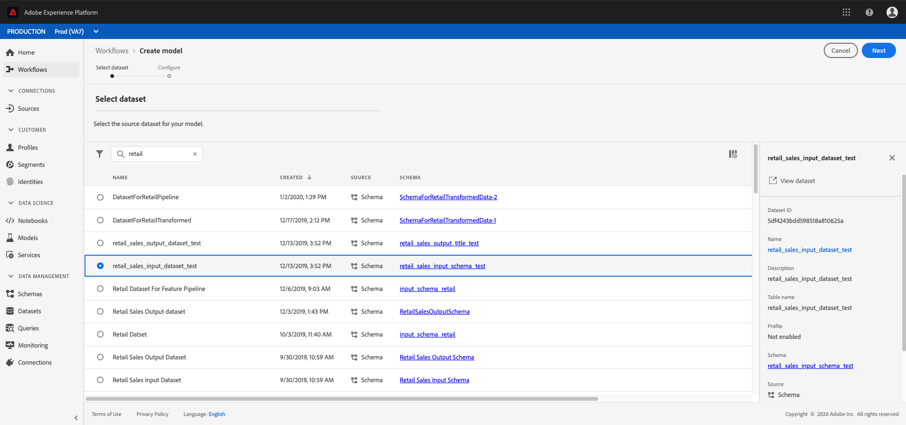
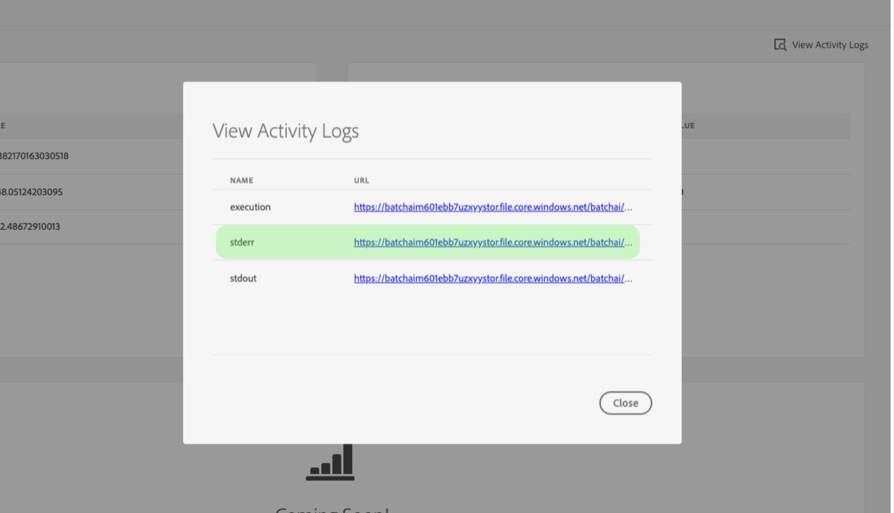

# Formazione di un modello per l&#39;apprendimento automatico in tempo reale

>[!IMPORTANT]
>L&#39;apprendimento automatico in tempo reale non è ancora disponibile per tutti gli utenti. Questa funzione è in alfa e viene ancora testata. Questo documento è soggetto a modifiche.

Questo documento fornisce un&#39;esercitazione per il caricamento di un modello ONNX nello store del modello Real-time Machine Learning.

Utilizzando una delle seguenti opzioni, si scriverà codice di python per leggere, preelaborare e analizzare i dati. Successivamente, è necessario formare il proprio modello ML, serializzarlo in formato ONNX, e infine caricarlo in Real-time Machine Learning model store. Inoltre, alla fine dell&#39;esercitazione, vi verrà fornito un ID modello che identifica il modello preparato da utilizzare nell&#39;esercitazione [di](./scoring-ml-model.md)punteggio.

* [Formazione di un modello con un notebook Python](#training-model-python-notebook)
* [Formazione di un modello con il proprio modello ONNX](#train-using-own-onnx-model)
* [Formazione di un modello con il modello di creazione delle ricette](#train-using-recipe-builder)
* [Formazione di un modello mediante il flusso di lavoro di ricetta Data Science Workplace](#recipe-workflow-train-model)


## Formazione di un modello con un notebook Python {#training-model-python-notebook}

Nell’interfaccia utente di Adobe Experience Platform, seleziona **[!UICONTROL Notebooks]** da *Data Science*. Quindi, selezionate **[!UICONTROL JupyterLab]** e lasciate che il caricamento dell&#39;ambiente abbia un po&#39; di tempo.


Per iniziare, seleziona il notebook **Python 3** vuoto dall&#39;avvio di JupyterLab.


### Dati di accesso {#access-data}

Selezionare quindi il set di dati da utilizzare. Per accedere a un set di dati nel notebook JupyterLab, seleziona la scheda **Dati** nella barra di navigazione a sinistra di JupyterLab. Vengono visualizzate le directory *Dataset* e *Schemi* . Selezionare **[!UICONTROL Datasets]** e fare clic con il pulsante destro del mouse, quindi selezionare l&#39; **[!UICONTROL Explore Data in Notebook]** opzione dal menu a discesa del set di dati che si desidera utilizzare. Nel blocco appunti viene visualizzata una voce di codice eseguibile.


### Preparare il modello

Utilizza il seguente modello per analizzare, pre-elaborare, formare e valutare il modello ML. Per un esempio completo, usate le schermate fornite di seguito al modello:

```python
from sklearn import svm, metrics
from sklearn.model_selection import train_test_split


data = df[input_columns]
target = df[target_column]
# Create a classifier: a support vector classifier
classifier = svm.SVC(gamma=0.001)

# Split data into train and test subsets
X_train, X_test, y_train, y_test = train_test_split(
    data, target, test_size=0.5, shuffle=False)

# We train the classifier
classifier.fit(X_train, y_train)

# Now do predictions
predicted = classifier.predict(X_test)


print("Classification report for classifier %s:\n%s\n"
      % (classifier, metrics.classification_report(y_test, predicted)))
disp = metrics.plot_confusion_matrix(classifier, X_test, y_test)
disp.figure_.suptitle("Confusion Matrix")
print("Confusion matrix:\n%s" % disp.confusion_matrix)
```

>[!NOTE]
>Nell&#39;esempio seguente viene utilizzata la libreria scikit-learn invece di caricare i dati da un set di dati Adobe Experience Platform acquisito.


**Uscita**


### Caricare il modello

Una volta completato il passaggio precedente, è necessario serializzare il modello in un formato ONNX e caricarlo nello store Real-time Machine Learning. Questo restituisce l&#39; `model_id` oggetto utilizzato nell&#39;esercitazione [successiva](#next-steps).

Utilizzate il seguente modello per convertire in ONNX e caricare il set di dati:

```python
from rtml_nodelibs.nodes.standard.ml.artifact_utils
import ModelUpload
from rtml_nodelibs.core.nodefactory
import NodeFactory as nf
from skl2onnx.common.data_types
import FloatTensorType
from skl2onnx
import convert_sklearn

########## Save sklearn model in ONNX format at model_path ##########
inputs = [('features', FloatTensorType([None, X_train.shape[1]]))]
model_onnx = convert_sklearn(classifier, 'ScikitLearnModel', inputs)

model_path = "model.onnx"
os.environ["ONNX_MODEL_PATH"] = model_path

with open(model_path, "wb") as f:
  f.write(model_onnx.SerializeToString())

  ########## Upload the model from model_path to RTML model store ##########
  model = ModelUpload(params = {
    'model_path': model_path
  })

msg_model = model.process(None, 1)

model_id = msg_model.model['model_id']

print("Model ID : ", model_id)
```

**Risposta**


Una volta ricevuto il tuo `model_id`account, copialo e passa ai [passaggi](#next-steps)successivi.


## Formazione di un modello con il proprio modello ONNX {#train-using-own-onnx-model}

Nell’interfaccia utente di Adobe Experience Platform, seleziona **[!UICONTROL Notebooks]** da *Data Science*. Quindi, selezionate **[!UICONTROL JupyterLab]** e lasciate che il caricamento dell&#39;ambiente abbia un po&#39; di tempo.


Utilizzando il pulsante di caricamento presente nei notebook JupyterLab, caricate il modello ONNX nell’ambiente dei notebook Data Science Workspace.


Quindi, create un nuovo notebook vuoto selezionando l&#39;icona del notebook vuoto sotto Python 3 in JupyterLab launcher.


All’interno del blocco appunti vuoto, copiare e incollare quanto segue:

>[!NOTE]
> Assicuratevi di fornire il `model_path` modello ONNX caricato.

```python
from rtml_nodelibs.nodes.standard.ml.artifact_utils import ModelUpload
from rtml_nodelibs.core.nodefactory import NodeFactory as nf
 
model_path = <path/to/onnx_model>
########## Upload the model from model_path to RTML model store ##########
model = ModelUpload(params={'model_path': model_path})
 
msg_model = model.process(None, 1)
 
model_id = msg_model.model['model_id']
 
print("Model ID : ", model_id)
```

Dopo aver eseguito la cella sopra, `model_id` viene restituito un errore. Copiate l&#39;ID modello da utilizzare nell&#39;esercitazione [successiva](#next-steps).

## Formazione di un modello con un modello di ricetta predefinito {#train-using-recipe-builder}

Nell’interfaccia utente di Adobe Experience Platform, seleziona **[!UICONTROL Notebooks]** da *Data Science*. Quindi, selezionate **[!UICONTROL JupyterLab]** e lasciate che il caricamento dell&#39;ambiente abbia un po&#39; di tempo.


Seguite l’esercitazione [Create a recipe (Crea ricetta) con i notebook](../jupyterlab/create-a-recipe.md) Jupyter. Una volta completato, è necessario modificare il file pipeline.py per consentire il funzionamento dell&#39;inferenza in tempo reale.

>[!NOTE]
>È necessario modificare il modello fornito da Data Science Workspace per adattarlo al set di dati.

Assicurarsi di salvare il modello in formato ONNX e impostare la variabile di ambiente su `ONNX_MODEL_PATH`. L&#39;esempio seguente mostra come modificare il file della pipeline utilizzando il modello di creazione ricette.

```python
def train(configProperties, data):

  print("Train Start")

########## Extract fields from configProperties ##########
learning_rate = float(configProperties['learning_rate'])
n_estimators = int(configProperties['n_estimators'])
max_depth = int(configProperties['max_depth'])

########## Fit model ##########
X_train = data.drop('weeklySalesAhead', axis = 1).values
y_train = data['weeklySalesAhead'].values

seed = 1234
model = GradientBoostingRegressor(learning_rate = learning_rate,
  n_estimators = n_estimators,
  max_depth = max_depth,
  random_state = seed)

model.fit(X_train, y_train)

########## Save sklearn model in ONNX format at model_path ##########
inputs = [('features', FloatTensorType([None, X_train.shape[1]]))]
model_onnx = convert_sklearn(model, 'ScikitLearnModel', inputs)

model_path = "retail_sales_model.onnx"
os.environ["ONNX_MODEL_PATH"] = model_path

with open(model_path, "wb") as f:
  f.write(model_onnx.SerializeToString())

print("Train Complete")

return model
```

Dopo aver modificato il file pipeline.py, esegui **[!UICONTROL Training]** e **[!UICONTROL Scoring]**. Al termine, selezionate il **[!UICONTROL Create Recipe]** pulsante.


Viene visualizzata una finestra di dialogo di denominazione. Immettete il nome della ricetta e selezionate **[!UICONTROL OK]**. Viene visualizzata una nuova finestra di dialogo che avvisa dell’inizio della creazione della ricetta. Lasciate che vi sia tempo per la creazione della ricetta.


Una volta creata, una ricetta può essere visualizzata selezionando **[!UICONTROL View Recipes]** nella finestra di dialogo fornita o **[!UICONTROL Models]** quindi selezionando **[!UICONTROL Recipes]** nella navigazione in alto a sinistra. Viene visualizzato un elenco di ricette ordinate per data di creazione. Confermate che la nuova ricetta sia in cima.


Selezionate la ricetta. Viene visualizzata la pagina di panoramica della ricetta. Nella navigazione in alto a destra selezionate **[!UICONTROL Create Model]**.


Quindi, selezionare un set di dati appropriato. Fate clic **[!UICONTROL Next]** nella barra di navigazione in alto a destra.



Viene visualizzata la pagina di configurazione. Specificare un nome per il modello e rivedere le configurazioni del modello predefinito. Le configurazioni predefinite vengono applicate durante la creazione delle ricette. Rivedete e modificate i valori di configurazione facendo doppio clic sui valori. Per fornire un nuovo set di configurazioni, fai clic **[!UICONTROL Upload New Config]** e trascina nella finestra del browser un file JSON contenente configurazioni di modelli. Selezionare **[!UICONTROL Finish]** per creare il modello.


Una volta creato il modello, è necessario attendere il completamento dell&#39;esecuzione del corso di formazione. Una volta completata l’esecuzione di una formazione, potete selezionare l’esecuzione della formazione per visualizzarne i dettagli.

Selezionate un’esecuzione di formazione. Una volta selezionata questa opzione, viene visualizzata una finestra di dialogo delle proprietà a destra. In questa finestra di dialogo selezionare **[!UICONTROL View Activity Logs]**.


Viene visualizzata la finestra di dialogo *Visualizza registri* attività. Selezionate l’URL dei registri di *store* per scaricare i registri e visualizzare i dettagli dell’esecuzione.



I registri sono particolarmente utili per le esecuzioni non riuscite per vedere cosa è andato storto. Ma, in questo caso si sta cercando il `model-id` corrispondente al modello ONNX che avete fatto. Copiate l’ID del modello.

>[!NOTE]
>Non è necessario eseguire un processo di punteggio. Il punteggio del margine di apprendimento automatico in tempo reale è incluso nel [passaggio](#next-steps)successivo.


## Formazione di un modello mediante il flusso di lavoro di ricetta Data Science Workplace {#recipe-workflow-train-model}

Questo è il metodo migliore da utilizzare se si ha familiarità con Docker, git e imballaggio codice Python. Il flusso di lavoro Data Science Workspace offre la massima flessibilità e libertà nella creazione delle ricette. È possibile ottenere un&#39;immagine docker di base e creare un proprio ambiente docker, eseguire il debug della ricetta con maggiore facilità, duplicare ricette pre-costruite per giocare con qualsiasi servizio di Data Science Workspace, pianificare le esecuzioni della ricetta e molto altro ancora.

### Creare uno schema

Il primo passaggio richiede la presenza di uno schema dati per il dataset. Uno schema può essere creato tramite l’interfaccia utente di Adobe Experience Platform o le API della piattaforma.

>[!NOTE]
>Se disponi già dei dati che desideri usare per l’assimilazione in Adobe Experience Platform, passa a [creare una ricetta](#create-a-python-recipe)Python.

* [Creazione di uno schema tramite l&#39;esercitazione dell&#39;interfaccia utente dell&#39;editor dello schema](../../xdm/tutorials/create-schema-ui.md)
* [Creazione di uno schema tramite l&#39;esercitazione API dell&#39;editor dello schema](../../xdm/tutorials/create-schema-api.md)

### Acquisire i dati

Successivamente, è necessario acquisire i dati utilizzando lo schema appena creato. Questo può essere fatto utilizzando l&#39;API o l&#39;interfaccia utente della piattaforma.

>[!NOTE]
>Se disponi già dei dati che desideri usare per l’assimilazione in Adobe Experience Platform, passa a [creare una ricetta](#create-a-python-recipe)Python.

* [Esercitazione sull&#39;acquisizione di dati nell&#39;interfaccia utente di Adobe Experience Platform](../../ingestion/tutorials/ingest-batch-data.md)
* [Inserimento di dati nell’esercitazione API di Adobe Experience Platform](../../ingestion/batch-ingestion/api-overview.md)

### Creare una ricetta Python {#create-a-python-recipe}

La creazione di ricette inizia con la creazione di pacchetti di file sorgente per creare un file di archivio. I file di origine definiscono la logica di machine learning e gli algoritmi utilizzati per risolvere un problema specifico a portata di mano. Utilizzate la seguente esercitazione per creare un&#39;immagine Python Docker.

* [Creare pacchetti di file sorgente in una ricetta](../models-recipes/package-source-files-recipe.md)

Per completare il passaggio successivo è necessario disporre di un&#39;immagine Docker in un Registro di sistema del contenitore di Azure insieme all&#39;URL immagine corrispondente. Per completare la creazione di una ricetta Python, selezionate uno dei collegamenti di esercitazione riportati di seguito:

* [Importare una ricetta in un pacchetto nell’interfaccia utente](../models-recipes/import-packaged-recipe-ui.md)
* [Importare una composizione in pacchetti utilizzando l&#39;API](../models-recipes/import-packaged-recipe-api.md)

### Creazione di un&#39;esecuzione di formazione

In Adobe Experience Platform Data Science Workspace, viene creato un modello di apprendimento automatico che incorpora una ricetta esistente adatta all&#39;intento del modello. Il modello viene quindi addestrato e valutato per ottimizzare l&#39;efficienza operativa e l&#39;efficacia, affinando i relativi Hyperparameters associati.

* [Formazione e valutazione di un modello nell’interfaccia utente](../models-recipes/train-evaluate-model-ui.md)
* [Formazione e valutazione di un modello nell&#39;API](../models-recipes/train-evaluate-model-api.md)

>[!IMPORTANT]
>Nel file pipeline.py della ricetta, salvare il modello in formato ONNX all&#39;interno `model_path` e impostare la variabile di ambiente su `ONNX_MODEL_PATH`. Il runtime cerca questa specifica variabile di ambiente.

```python
def train(configProperties, data):
 
    print("Train Start")
 
    ########## Extract fields from configProperties ##########

    learning_rate = float(configProperties['learning_rate'])
    n_estimators = int(configProperties['n_estimators'])
    max_depth = int(configProperties['max_depth'])
 
 
    
    ########## Fit model ##########
    
    X_train = data.drop('weeklySalesAhead', axis=1).values
    y_train = data['weeklySalesAhead'].values
 
    seed = 1234
    model = GradientBoostingRegressor(learning_rate=learning_rate,
                                      n_estimators=n_estimators,
                                      max_depth=max_depth,
                                      random_state=seed)
 
    model.fit(X_train, y_train)
     
    ########## Save sklearn model in ONNX format at model_path ##########
    inputs = [('features', FloatTensorType([None, X_train.shape[1]]))]
    model_onnx = convert_sklearn(model, 'ScikitLearnModel', inputs)
 
    model_path = "retail_sales_model.onnx"
    os.environ["ONNX_MODEL_PATH"] = model_path
 
    with open(model_path, "wb") as f:
        f.write(model_onnx.SerializeToString())
 
    print("Train Complete")
 
    return model
```

Una volta creato il modello, è necessario attendere il completamento dell&#39;esecuzione del corso di formazione. Una volta completata l’esecuzione di una formazione, potete selezionare l’esecuzione della formazione per visualizzarne i dettagli. Selezionate un’esecuzione di formazione. Dopo aver selezionato una finestra di dialogo delle proprietà, selezionare **[!UICONTROL View Activity Logs]**.


Viene visualizzata la finestra di dialogo *Visualizza registri* attività. Selezionate l’URL dei registri di *store* per scaricare i registri e visualizzare i dettagli dell’esecuzione.


I registri sono particolarmente utili per le esecuzioni non riuscite per vedere cosa è andato storto. Ma, in questo caso si sta cercando il `model-id` corrispondente al modello ONNX che avete fatto. Copiate l’ID del modello.


Non è necessario eseguire un processo di punteggio nella ricetta. Il punteggio del margine di apprendimento automatico in tempo reale è riportato nell&#39;esercitazione [successiva](#next-steps).

## Passaggi successivi {#next-steps}

Seguendo una delle esercitazioni di cui sopra, avete addestrato e caricato con successo un modello ONNX nel negozio di modelli Real-time Machine Learning e avete un `model_id` che identifica il modello. Seguite l&#39;esercitazione successiva per scoprire come [valutare il modello](./scoring-ml-model.md)di apprendimento automatico in tempo reale.