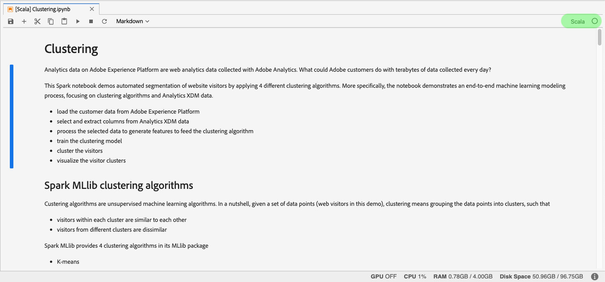

# Guide per la migrazione a componenti e notebook

>[!NOTE]
>I notebook e le ricette che utilizzano Python/R rimangono invariati. La migrazione si applica solo alle ricette e ai notebook PySpark/Spark (2.3).

Le guide seguenti descrivono i passaggi e le informazioni necessari per migrare ricette e blocchi appunti esistenti.

- [Guide alla migrazione delle ricette](#recipe-migration)
- [Guide alla migrazione dei notebook](#notebook-migration)

## Guide alla migrazione delle ricette {#recipe-migration}

Le recenti modifiche a Data Science Workspace richiedono l&#39;aggiornamento delle ricette Spark e PySpark esistenti. Utilizzate i seguenti flussi di lavoro per facilitare la transizione delle ricette.

- [Guida alla migrazione Spark](#spark-migration-guide)
   - [Modifica della modalità di lettura e scrittura dei set di dati](#read-write-recipe-spark)
   - [Scaricate la ricetta di esempio](#download-sample-spark)
   - [Aggiungere il file docker](#add-dockerfile-spark)
   - [Controllare le dipendenze](#change-dependencies-spark)
   - [Preparare gli script docker](#prepare-docker-spark)
   - [creare la ricetta con il docker](#create-recipe-spark)
- [Guida alla migrazione a PySpark](#pyspark-migration-guide)
   - [Modifica della modalità di lettura e scrittura dei set di dati](#pyspark-read-write)
   - [Scaricate la ricetta di esempio](#pyspark-download-sample)
   - [Aggiungere il file docker](#pyspark-add-dockerfile)
   - [Preparare gli script docker](#pyspark-prepare-docker)
   - [creare la ricetta con il docker](#pyspark-create-recipe)

## Guida alla migrazione Spark {#spark-migration-guide}

L&#39;artefatto della ricetta generato dai passaggi di creazione è ora un&#39;immagine Docker che contiene il file binario .jar. Inoltre, la sintassi utilizzata per leggere e scrivere i set di dati con l’SDK della piattaforma è cambiata e richiede di modificare il codice di ricetta.

Il seguente video è stato creato per agevolare la comprensione delle modifiche necessarie per le ricette Spark:

>[!VIDEO](https://video.tv.adobe.com/v/33243)

### Set di dati di lettura e scrittura (Spark) {#read-write-recipe-spark}

Prima di creare l&#39;immagine Docker, controlla gli esempi per la lettura e la scrittura di set di dati nell&#39;SDK della piattaforma, forniti nelle sezioni seguenti. Se state convertendo ricette esistenti, il codice SDK della piattaforma deve essere aggiornato.

#### Lettura di un dataset

Questa sezione illustra le modifiche necessarie per la lettura di un dataset e utilizza l’esempio [helper.scala](https://github.com/adobe/experience-platform-dsw-reference/blob/master/recipes/scala/src/main/scala/com/adobe/platform/ml/helper/Helper.scala) fornito da Adobe.

**Vecchio modo di leggere un dataset**

```scala
 var df = sparkSession.read.format("com.adobe.platform.dataset")
    .option(DataSetOptions.orgId, orgId)
    .option(DataSetOptions.serviceToken, serviceToken)
    .option(DataSetOptions.userToken, userToken)
    .option(DataSetOptions.serviceApiKey, apiKey)
    .load(dataSetId)
```

**Nuovo metodo di lettura di un dataset**

Con gli aggiornamenti alle ricette Spark, è necessario aggiungere e modificare una serie di valori. Innanzitutto, `DataSetOptions` non viene più utilizzato. Replace `DataSetOptions` with `QSOption`. Inoltre, sono necessari nuovi `option` parametri. Sia `QSOption.mode` che `QSOption.datasetId` sono necessari. Infine, `orgId` e `serviceApiKey` devono essere modificati in `imsOrg` e `apiKey`. Per un confronto tra i set di dati di lettura, consultare l&#39;esempio seguente:

```scala
import com.adobe.platform.query.QSOption
var df = sparkSession.read.format("com.adobe.platform.query")
  .option(QSOption.userToken", {userToken})
  .option(QSOption.serviceToken, {serviceToken})
  .option(QSOption.imsOrg, {orgId})
  .option(QSOption.apiKey, {apiKey})
  .option(QSOption.mode, "interactive")
  .option(QSOption.datasetId, {dataSetId})
  .load()
```

>[!TIP]
> La modalità interattiva si interrompe se le query sono in esecuzione per più di 10 minuti. Se state acquisendo più di alcuni gigabyte di dati, si consiglia di passare alla modalità &quot;batch&quot;. La modalità batch richiede più tempo per l&#39;avvio ma può gestire set di dati più grandi.

#### Scrivere in un dataset

Questa sezione illustra le modifiche necessarie per scrivere un dataset utilizzando l’esempio [ScoringDataSaver.scala](https://github.com/adobe/experience-platform-dsw-reference/blob/master/recipes/scala/src/main/scala/com/adobe/platform/ml/ScoringDataSaver.scala) fornito da Adobe.

**Vecchio modo di scrivere un dataset**

```scala
df.write.format("com.adobe.platform.dataset")
    .option(DataSetOptions.orgId, orgId)
    .option(DataSetOptions.serviceToken, serviceToken)
    .option(DataSetOptions.userToken, userToken)
    .option(DataSetOptions.serviceApiKey, apiKey)
    .save(scoringResultsDataSetId)
```

**Nuovo modo di scrivere un dataset**

Con gli aggiornamenti alle ricette Spark, è necessario aggiungere e modificare una serie di valori. Innanzitutto, `DataSetOptions` non viene più utilizzato. Replace `DataSetOptions` with `QSOption`. Inoltre, sono necessari nuovi `option` parametri. `QSOption.datasetId` è necessario e sostituisce la necessità di caricare il `{dataSetId}` contenuto `.save()`. Infine, `orgId` e `serviceApiKey` devono essere modificati in `imsOrg` e `apiKey`. Esaminare l&#39;esempio seguente per un confronto sulla scrittura di set di dati:

```scala
import com.adobe.platform.query.QSOption
df.write.format("com.adobe.platform.query")
  .option(QSOption.userToken", {userToken})
  .option(QSOption.serviceToken, {serviceToken})
  .option(QSOption.imsOrg, {orgId})
  .option(QSOption.apiKey, {apiKey})
  .option(QSOption.datasetId, {dataSetId})
  .save()
```

### Pacchetto di file sorgente basati su Docker (Spark) {#package-docker-spark}

Per iniziare, andate alla directory in cui si trova la ricetta.

Nelle sezioni seguenti viene utilizzata la nuova ricetta di vendita al dettaglio Scala disponibile nell&#39;archivio [pubblico di Github di](https://github.com/adobe/experience-platform-dsw-reference)Data Science Workspace.

### Scarica la ricetta di esempio (Spark) {#download-sample-spark}

La ricetta di esempio contiene file che devono essere copiati nella ricetta esistente. Per duplicare il Github pubblico che contiene tutte le ricette campione, immettete quanto segue in terminale:

```BASH
git clone https://github.com/adobe/experience-platform-dsw-reference.git
```

La ricetta Scala si trova nella seguente directory `experience-platform-dsw-reference/recipes/scala/retail`.

### Aggiungere il file Dockerfile (Spark) {#add-dockerfile-spark}

Per utilizzare il flusso di lavoro basato sul docker è necessario un nuovo file nella cartella di ricetta. Copiate e incollate il file Dockerfile dalla cartella delle ricette in `experience-platform-dsw-reference/recipes/scala/Dockerfile`. Facoltativamente, potete anche copiare e incollare il codice riportato di seguito in un nuovo file denominato `Dockerfile`.

>[!IMPORTANT]
> Il file JAR di esempio riportato di seguito `ml-retail-sample-spark-*-jar-with-dependencies.jar` deve essere sostituito con il nome del file JAR della ricetta.

```scala
FROM adobe/acp-dsw-ml-runtime-spark:0.0.1

COPY target/ml-retail-sample-spark-*-jar-with-dependencies.jar /application.jar
```

### Modificare le dipendenze (Spark) {#change-dependencies-spark}

Se utilizzate una ricetta esistente, per le dipendenze sono necessarie modifiche nel file pom.xml. Cambia in 2.0.0 la versione della dipendenza model-authoring-sdk. Quindi, aggiornate la versione Spark nel file pom a 2.4.3 e la versione Scala a a 2.11.12.

```json
<groupId>com.adobe.platform.ml</groupId>
<artifactId>authoring-sdk_2.11</artifactId>
<version>2.0.0</version>
<classifier>jar-with-dependencies</classifier>
```

### Preparare gli script Docker (Spark) {#prepare-docker-spark}

Le ricette Spark non utilizzano più gli artefatti binari e richiedono invece la creazione di un&#39;immagine Docker. Se non lo avete fatto, [scaricate e installate Docker](https://www.docker.com/products/docker-desktop).

Nella ricetta di esempio Scala fornita, è possibile trovare gli script `login.sh` e `build.sh` individuare in `experience-platform-dsw-reference/recipes/scala/` . Copiate e incollate questi file nella ricetta esistente.

La struttura delle cartelle deve ora essere simile al seguente esempio (i file aggiunti di recente sono evidenziati):


Il passaggio successivo consiste nel seguire i file sorgente del [pacchetto in un&#39;esercitazione sulle ricette](./models-recipes/package-source-files-recipe.md) . Questa esercitazione include una sezione che descrive come creare un&#39;immagine docker per una ricetta Scala (Spark). Al termine, viene fornita l&#39;immagine Docker in un Registro di sistema del contenitore di Azure con l&#39;URL immagine corrispondente.

### Creare una ricetta (Spark) {#create-recipe-spark}

Per creare una ricetta, dovete prima completare l&#39;esercitazione sui file [sorgente del](./models-recipes/package-source-files-recipe.md) pacchetto e avere l&#39;URL dell&#39;immagine docker pronto. Potete creare una ricetta con l&#39;interfaccia utente o l&#39;API.

Per creare la ricetta utilizzando l&#39;interfaccia utente, seguite l&#39;esercitazione [Importa una ricetta (interfaccia)](./models-recipes/import-packaged-recipe-ui.md) in pacchetti per Scala.

Per creare la ricetta utilizzando l&#39;API, seguite l&#39;esercitazione API ( [Import a packages recipe) (API)](./models-recipes/import-packaged-recipe-api.md) per Scala.

## Guida alla migrazione a PySpark {#pyspark-migration-guide}

L&#39;artefatto della ricetta generato dai passaggi di creazione è ora un&#39;immagine Docker che contiene il file binario .egg. Inoltre, la sintassi utilizzata per leggere e scrivere i set di dati con l’SDK della piattaforma è cambiata e richiede di modificare il codice di ricetta.

Il seguente video è stato creato per agevolare la comprensione delle modifiche necessarie per le ricette PySpark:

>[!VIDEO](https://video.tv.adobe.com/v/33048?learn=on&quality=12)

### Set di dati di lettura e scrittura (PySpark) {#pyspark-read-write}

Prima di creare l&#39;immagine Docker, controlla gli esempi per la lettura e la scrittura di set di dati nell&#39;SDK della piattaforma, forniti nelle sezioni seguenti. Se state convertendo ricette esistenti, il codice SDK della piattaforma deve essere aggiornato.

#### Lettura di un dataset

Questa sezione illustra le modifiche necessarie per leggere un dataset utilizzando l&#39;esempio [helper.py](https://github.com/adobe/experience-platform-dsw-reference/blob/master/recipes/pyspark/pysparkretailapp/helper.py) fornito da Adobe.

**Vecchio modo di leggere un dataset**

```python
dataset_options = get_dataset_options(spark.sparkContext)
pd = spark.read.format("com.adobe.platform.dataset") 
  .option(dataset_options.serviceToken(), service_token) 
  .option(dataset_options.userToken(), user_token) 
  .option(dataset_options.orgId(), org_id) 
  .option(dataset_options.serviceApiKey(), api_key)
  .load(dataset_id)
```

**Nuovo metodo di lettura di un dataset**

Con gli aggiornamenti alle ricette Spark, è necessario aggiungere e modificare una serie di valori. Innanzitutto, `DataSetOptions` non viene più utilizzato. Replace `DataSetOptions` with `qs_option`. Inoltre, sono necessari nuovi `option` parametri. Sia `qs_option.mode` che `qs_option.datasetId` sono necessari. Infine, `orgId` e `serviceApiKey` devono essere modificati in `imsOrg` e `apiKey`. Per un confronto tra i set di dati di lettura, consultare l&#39;esempio seguente:

```python
qs_option = spark_context._jvm.com.adobe.platform.query.QSOption
pd = sparkSession.read.format("com.adobe.platform.query") 
  .option(qs_option.userToken, {userToken}) 
  .option(qs_option.serviceToken, {serviceToken}) 
  .option(qs_option.imsOrg, {orgId}) 
  .option(qs_option.apiKey, {apiKey}) 
  .option(qs_option.mode, "interactive") 
  .option(qs_option.datasetId, {dataSetId}) 
  .load()
```

>[!TIP]
> La modalità interattiva si interrompe se le query sono in esecuzione per più di 10 minuti. Se state acquisendo più di alcuni gigabyte di dati, si consiglia di passare alla modalità &quot;batch&quot;. La modalità batch richiede più tempo per l&#39;avvio ma può gestire set di dati più grandi.

#### Scrivere in un dataset

In questa sezione sono illustrate le modifiche necessarie per scrivere un dataset utilizzando l&#39;esempio [data_saver.py](https://github.com/adobe/experience-platform-dsw-reference/blob/master/recipes/pyspark/pysparkretailapp/data_saver.py) fornito da Adobe.

**Vecchio modo di scrivere un dataset**

```python
df.write.format("com.adobe.platform.dataset")
  .option(DataSetOptions.orgId, orgId)
  .option(DataSetOptions.serviceToken, serviceToken)
  .option(DataSetOptions.userToken, userToken)
  .option(DataSetOptions.serviceApiKey, apiKey)
  .save(scoringResultsDataSetId)
```

**Nuovo modo di scrivere un dataset**

Con gli aggiornamenti alle ricette PySpark, è necessario aggiungere e modificare una serie di valori. Innanzitutto, `DataSetOptions` non viene più utilizzato. Replace `DataSetOptions` with `qs_option`. Inoltre, sono necessari nuovi `option` parametri.  `qs_option.datasetId` è necessario e sostituisce la necessità di caricare il `{dataSetId}` in `.save()` . Infine, `orgId` e `serviceApiKey` devono essere modificati in `imsOrg` e `apiKey`. Per un confronto tra i set di dati di lettura, consultare l&#39;esempio seguente:

```python
qs_option = spark_context._jvm.com.adobe.platform.query.QSOption
scored_df.write.format("com.adobe.platform.query") 
  .option(qs_option.userToken, {userToken}) 
  .option(qs_option.serviceToken, {serviceToken}) 
  .option(qs_option.imsOrg, {orgId}) 
  .option(qs_option.apiKey, {apiKey}) 
  .option(qs_option.datasetId, {dataSetId}) 
  .save()
```

### Pacchetto di file sorgente basati su Docker (PySpark) {#pyspark-package-docker}

Per iniziare, andate alla directory in cui si trova la ricetta.

Per questo esempio, la nuova ricetta di vendita al dettaglio PySpark viene utilizzata e si trova nell&#39;archivio [pubblico di Github di](https://github.com/adobe/experience-platform-dsw-reference)Data Science Workspace.

### Scarica la ricetta di esempio (PySpark) {#pyspark-download-sample}

La ricetta di esempio contiene file che devono essere copiati nella ricetta esistente. Per duplicare il Github pubblico che contiene tutte le ricette campione, immettete quanto segue in terminale.

```BASH
git clone https://github.com/adobe/experience-platform-dsw-reference.git
```

La ricetta PySpark si trova nella seguente directory `experience-platform-dsw-reference/recipes/pyspark`.

### Aggiungere il file Dockerfile (PySpark) {#pyspark-add-dockerfile}

Per utilizzare il flusso di lavoro basato sul docker è necessario un nuovo file nella cartella di ricetta. Copiate e incollate il file Dockerfile dalla cartella delle ricette in `experience-platform-dsw-reference/recipes/pyspark/Dockerfile`. Facoltativamente, potete anche copiare e incollare il codice riportato di seguito e creare un nuovo file denominato `Dockerfile`.

>[!IMPORTANT]
> Il file di uova di esempio riportato di seguito `pysparkretailapp-*.egg` deve essere sostituito con il nome del file di uova della ricetta.

```scala
FROM adobe/acp-dsw-ml-runtime-pyspark:0.0.1
RUN mkdir /recipe

COPY . /recipe

RUN cd /recipe && \
    ${PYTHON} setup.py clean install && \
    rm -rf /recipe

RUN cp /databricks/conda/envs/${DEFAULT_DATABRICKS_ROOT_CONDA_ENV}/lib/python3.6/site-packages/pysparkretailapp-*.egg /application.egg
```

### Preparare gli script Docker (PySpark) {#pyspark-prepare-docker}

Le ricette PySpark non utilizzano più gli artefatti binari e richiedono invece la creazione di un&#39;immagine Docker. Se non lo avete fatto, scaricate e installate [Docker](https://www.docker.com/products/docker-desktop).

Nella ricetta di esempio PySpark fornita, potete trovare gli script `login.sh` e `build.sh` trovarli in `experience-platform-dsw-reference/recipes/pyspark` . Copiate e incollate questi file nella ricetta esistente.

La struttura delle cartelle deve ora essere simile al seguente esempio (i file aggiunti di recente sono evidenziati):


La ricetta è ora pronta per essere creata utilizzando un&#39;immagine Docker. Il passaggio successivo consiste nel seguire i file sorgente del [pacchetto in un&#39;esercitazione sulle ricette](./models-recipes/package-source-files-recipe.md) . Questa esercitazione ha una sezione che descrive come creare un&#39;immagine docker per una ricetta PySpark (Spark 2.4). Al termine, viene fornita l&#39;immagine Docker in un Registro di sistema del contenitore di Azure con l&#39;URL immagine corrispondente.

### Creare una ricetta (PySpark) {#pyspark-create-recipe}

Per creare una ricetta, dovete prima completare l&#39;esercitazione sui file [sorgente del](./models-recipes/package-source-files-recipe.md) pacchetto e avere l&#39;URL dell&#39;immagine docker pronto. Potete creare una ricetta con l&#39;interfaccia utente o l&#39;API.

Per creare la ricetta utilizzando l&#39;interfaccia utente, seguite l&#39;esercitazione [Importa una ricetta (interfaccia)](./models-recipes/import-packaged-recipe-ui.md) in pacchetti per PySpark.

Per creare la ricetta utilizzando l&#39;API, seguite l&#39;esercitazione API ( [import a packages recipe) (API)](./models-recipes/import-packaged-recipe-api.md) per PySpark.

## Guide alla migrazione dei notebook {#notebook-migration}

Le recenti modifiche apportate ai notebook JupyterLab richiedono l’aggiornamento dei notebook PySpark e Spark 2.3 a 2.4. Con questa modifica, JupyterLab Launcher è stato aggiornato con nuovi notebook. Per una guida dettagliata su come convertire i notebook, selezionare una delle seguenti guide:

- [Guida alla migrazione a PySpark 2.3-2.4](#pyspark-notebook-migration)
- [Guida alla migrazione da Spark 2.3 a Spark 2.4 (Scala)](#spark-notebook-migration)

Il seguente video è stato creato per agevolare la comprensione delle modifiche necessarie per i notebook JupyterLab:

>[!VIDEO](https://video.tv.adobe.com/v/33444?quality=12&learn=on)

## Guida alla migrazione dei notebook PySpark 2.3-2.4 {#pyspark-notebook-migration}

Con l&#39;introduzione di PySpark 2.4 ai notebook JupyterLab, i nuovi notebook Python con PySpark 2.4 utilizzano ora il kernel Python 3 invece del kernel PySpark 3. Ciò significa che il codice esistente in esecuzione su PySpark 2.3 non è supportato in PySpark 2.4.

>[!IMPORTANT] PySpark 2.3 è obsoleto e deve essere rimosso in una versione successiva. Tutti gli esempi esistenti sono impostati in modo da essere sostituiti con gli esempi PySpark 2.4.

Per convertire i notebook PySpark 3 (Spark 2.3) esistenti in Spark 2.4, seguire gli esempi riportati di seguito:

### Kernel

I notebook PySpark 3 (Spark 2.4) utilizzano il kernel Python 3 invece del kernel PySpark obsoleto utilizzato nei notebook PySpark 3 (Spark 2.3 - obsoleto).

Per confermare o modificare il kernel nell’interfaccia utente di JupyterLab, selezionate il pulsante del kernel nella barra di navigazione in alto a destra del notebook. Se si utilizza uno dei blocchi appunti di avvio predefiniti, il kernel è già selezionato. Nell&#39;esempio riportato di seguito viene utilizzato l&#39;avvio del blocco appunti *Aggregazione* PySpark 3 (Spark 2.4).


Selezionando il menu a discesa si apre un elenco dei kernel disponibili.


Per i notebook PySpark 3 (Spark 2.4), selezionate il kernel Python 3 e confermate facendo clic sul pulsante **Seleziona** .


## Inizializzazione di sparkSession

Tutti i notebook Spark 2.4 richiedono l’inizializzazione della sessione con il nuovo codice standard.

<table>
  <th>Notebook</th>
  <th>PySpark 3 (Spark 2.3 - obsoleto)</th>
  <th>PySpark 3 (Spark 2.4)</th>
  <tr>
  <th>Kernel</th>
  <td align="center">PySpark 3</td>
  <td align="center">Python 3</td>
  </tr>
  <tr>
  <th>Codice</th>
  <td>
  <pre class="JSON language-JSON hljs">
  scintilla
</pre>
  </td>
  <td>
  <pre class="JSON language-JSON hljs">
da pyspark.sql importare SparkSessionspark = SparkSession.builder.getOrCreate()
</pre>
  </td>
  </tr>
</table>

Le immagini seguenti evidenziano le differenze di configurazione per PySpark 2.3 e PySpark 2.4. In questo esempio vengono utilizzati i notebook *Aggregation* Starter forniti in JupyterLab Launcher.

**Esempio di configurazione per 2.3 (obsoleto)**


**Esempio di configurazione per 2.4**


## Utilizzo di %dataset {#magic}

Con l&#39;introduzione di Spark 2.4, `%dataset` la magia personalizzata viene fornita per l&#39;uso nei nuovi notebook PySpark 3 (Spark 2.4) (kernel Python 3).

**Utilizzo**

`%dataset {action} --datasetId {id} --dataFrame {df}`

**Descrizione**

Un comando magico personalizzato di Data Science Workspace per la lettura o la scrittura di un set di dati da un notebook Python (kernel Python 3).

- **{action}**: Tipo di azione da eseguire sul set di dati. Sono disponibili due azioni: &quot;read&quot; o &quot;write&quot;.
- **—datasetId {id}**: Utilizzato per fornire l&#39;ID del set di dati da leggere o scrivere. Questo è un argomento obbligatorio.
- **—dataFrame {df}**: Il dataframe panda. Questo è un argomento obbligatorio.
   - Quando l&#39;azione è &quot;read&quot;, {df} è la variabile in cui sono disponibili i risultati dell&#39;operazione di lettura del dataset.
   - Quando l&#39;azione è &quot;scrivi&quot;, il dataframe {df} viene scritto nel dataset.
- **—mode (facoltativo)**: I parametri consentiti sono &quot;batch&quot; e &quot;interattivo&quot;. Per impostazione predefinita, la modalità è impostata su &quot;interattivo&quot;. Si consiglia di utilizzare la modalità &quot;batch&quot; durante la lettura di grandi quantità di dati.

**Esempi**

- **Leggi l&#39;esempio**: `%dataset read --datasetId 5e68141134492718af974841 --dataFrame pd0`
- **Esempio** di scrittura: `%dataset write --datasetId 5e68141134492718af974842 --dataFrame pd0`

## Carica in un dataframe in LocalContext

Con l&#39;introduzione di Spark 2.4, [`%dataset`](#magic) la magia personalizzata è in dotazione. L&#39;esempio seguente evidenzia le differenze chiave per il caricamento del dataframe nei notebook PySpark (Spark 2.3) e PySpark (Spark 2.4):

**Utilizzo di PySpark 3 (Spark 2.3 - obsoleto) - Kernel PySpark 3**

```python
dataset_options = sc._jvm.com.adobe.platform.dataset.DataSetOptions
pd0 = spark.read.format("com.adobe.platform.dataset")
  .option(dataset_options.orgId(), "310C6D375BA5248F0A494212@AdobeOrg")
  .load("5e68141134492718af974844")
```

**Utilizzo di PySpark 3 (Spark 2.4) - Kernel Python 3**

```python
%dataset read --datasetId 5e68141134492718af974844 --dataFrame pd0
```

| Elemento | Descrizione |
| ------- | ----------- |
| pd0 | Nome dell&#39;oggetto dataframe panas da utilizzare o creare. |
| [%dataset](#magic) | Magia personalizzata per l&#39;accesso ai dati nel kernel Python3. |

Le immagini seguenti evidenziano le differenze chiave nel caricamento dei dati per PySpark 2.3 e PySpark 2.4. In questo esempio vengono utilizzati i notebook *Aggregation* Starter forniti in JupyterLab Launcher.

**Caricamento di dati in PySpark 2.3 (dataset Luma) - obsoleto**


**Caricamento dei dati in PySpark 2.4 (dataset Luma)**

Con PySpark 3 (Spark 2.4) `sc = spark.sparkContext` è definito nel caricamento.


**Caricamento dei dati della piattaforma Experience Cloud in PySpark 2.3 - obsoleto**


**Caricamento dei dati della piattaforma Experience Cloud in PySpark 2.4**

Con PySpark 3 (Spark 2.4) non è più necessario definire `org_id` e `dataset_id` non è più necessario definirlo. Inoltre, `df = spark.read.format` è stato sostituito con una magia personalizzata [`%dataset`](#magic) per semplificare la lettura e la scrittura dei dataset.


| Elemento | description |
| ------- | ----------- |
| [%dataset](#magic) | Magia personalizzata per l&#39;accesso ai dati nel kernel Python3. |

>[!TIP] —mode può essere impostato su `interactive` o `batch`. Il valore predefinito per —mode è `interactive`. Si consiglia di utilizzare la `batch` modalità quando si leggono grandi quantità di dati.

## Creazione di un fotogramma dati locale

Con PySpark 3 (Spark 2.4) `%%` sparkmagic non è più supportato. Non è più possibile utilizzare le operazioni seguenti:

- `%%help`
- `%%info`
- `%%cleanup`
- `%%delete`
- `%%configure`
- `%%local`

Nella tabella seguente sono illustrate le modifiche necessarie per convertire le query `%%sql` sparkmagic:

<table>
  <th>Notebook</th>
  <th>PySpark 3 (Spark 2.3 - obsoleto)</th>
  <th>PySpark 3 (Spark 2.4)</th>
  <tr>
  <th>Kernel</th>
  <td align="center">PySpark 3</td>
  <td align="center">Python 3</td>
  </tr>
  <tr>
  <th>Codice</th>
      <td>
         <pre class="JSON language-JSON hljs">%%sql -o dfselect * da sparkdf
</pre>
         <pre class="JSON language-JSON hljs"> %%sql -o df -n limitselect * da sparkdf
</pre>
         <pre class="JSON language-JSON hljs">%%sql -o df -qselect * da sparkdf
</pre>
         <pre class="JSON language-JSON hljs"> %%sql -o df -r frazionselect * da sparkdf
</pre>
      </td>
      <td>
         <pre class="JSON language-JSON hljs">
df = spark.sql(''' SELECT * FROM sparkdf'''')
</pre>
         <pre class="JSON language-JSON hljs">
df = spark.sql(''' SELECT * FROM sparkdf LIMIT limit''')
</pre>
         <pre class="JSON language-JSON hljs">
df = spark.sql(''' SELECT * FROM sparkdf LIMIT limit''')
</pre>
         <pre class="JSON language-JSON hljs">
sample_df = df.sample(fraction)
</pre>
      </td>
   </tr>
</table>

>[!TIP] È inoltre possibile specificare un campione di sementi facoltativo, ad esempio un valore booleano conSostituzione, una doppia frazione o un valore seed lungo.

Le immagini seguenti evidenziano le differenze chiave per la creazione di un fotogramma dati locale in PySpark 2.3 e PySpark 2.4. In questo esempio vengono utilizzati i notebook *Aggregation* Starter forniti in JupyterLab Launcher.

**Crea dataframe locale PySpark 2.3 - obsoleto**


**Crea dataframe locale PySpark 2.4**

Con PySpark 3 (Spark 2.4) `%%sql` Sparkmagic non è più supportato ed è stato sostituito con il seguente:


## Scrivere in un dataset

Con l&#39;introduzione di Spark 2.4, [`%dataset`](#magic) è disponibile una magia personalizzata che rende la scrittura di dataset più pulita. Per scrivere in un dataset, usate il seguente esempio di Spark 2.4:

**Utilizzo di PySpark 3 (Spark 2.3 - obsoleto) - Kernel PySpark 3**

```python
userToken = spark.sparkContext.getConf().get("spark.yarn.appMasterEnv.USER_TOKEN")
serviceToken = spark.sparkContext.getConf().get("spark.yarn.appMasterEnv.SERVICE_TOKEN")
serviceApiKey = spark.sparkContext.getConf().get("spark.yarn.appMasterEnv.SERVICE_API_KEY")

dataset_options = sc._jvm.com.adobe.platform.dataset.DataSetOptions

pd0.write.format("com.adobe.platform.dataset")
  .option(dataset_options.orgId(), "310C6D375BA5248F0A494212@AdobeOrg")
  .option(dataset_options.userToken(), userToken)
  .option(dataset_options.serviceToken(), serviceToken)
  .option(dataset_options.serviceApiKey(), serviceApiKey)
  .save("5e68141134492718af974844")
```

**Utilizzo di PySpark 3 (Spark 2.4) - Kernel Python 3**

```python
%dataset write --datasetId 5e68141134492718af974844 --dataFrame pd0
pd0.describe()
pd0.show(10, False)
```

| Elemento | description |
| ------- | ----------- |
| pd0 | Nome dell&#39;oggetto dataframe panas da utilizzare o creare. |
| [%dataset](#magic) | Magia personalizzata per l&#39;accesso ai dati nel kernel Python3. |

>[!TIP] —mode può essere impostato su `interactive` o `batch`. Il valore predefinito per —mode è `interactive`. Si consiglia di utilizzare la `batch` modalità quando si leggono grandi quantità di dati.

Le immagini seguenti evidenziano le differenze chiave per la riscrittura dei dati sulla piattaforma in PySpark 2.3 e PySpark 2.4. In questo esempio vengono utilizzati i notebook *Aggregation* Starter forniti in JupyterLab Launcher.

**Scrittura dei dati in Platform PySpark 2.3 - obsoleto**


**Scrittura dei dati su Platform PySpark 2.4**

Con PySpark 3 (Spark 2.4) la magia `%dataset` personalizzata elimina la necessità di definire valori quali `userToken`, `serviceToken`, `serviceApiKey`e `.option`. Inoltre, `orgId` non è più necessario definirla.


## Spark 2.3 - Spark 2.4 (Scala) - guida alla migrazione dei notebook {#spark-notebook-migration}

Con l&#39;introduzione di Spark 2.4 a JupyterLab Notebooks, i notebook Spark (Spark 2.3) esistenti ora utilizzano il kernel Scala invece del kernel Spark. Ciò significa che il codice esistente in esecuzione su Spark (Spark 2.3) non è supportato in Scala (Spark 2.4). Inoltre, tutti i nuovi notebook Spark dovrebbero utilizzare Scala (Spark 2.4) nel lancio di JupyterLab.

>[!IMPORTANT] Spark (Spark 2.3) è obsoleto e viene impostato per essere rimosso in una versione successiva. Tutti gli esempi esistenti sono impostati in modo da essere sostituiti con gli esempi Scala (Spark 2.4).

Per convertire i notebook Spark (Spark 2.3) esistenti in Scala (Spark 2.4), attenetevi agli esempi riportati di seguito:

## Kernel

I notebook Scala (Spark 2.4) utilizzano il kernel Scala invece del kernel Spark obsoleto utilizzato nei notebook Spark (Spark 2.3 - obsoleto).

Per confermare o modificare il kernel nell’interfaccia utente di JupyterLab, selezionate il pulsante del kernel nella barra di navigazione in alto a destra del notebook. Viene visualizzato il *pulsante Seleziona kernel* . Se si utilizza uno dei blocchi appunti di avvio predefiniti, il kernel è già selezionato. Nell&#39;esempio seguente viene utilizzato il notebook Scala *Clustering* in JupyterLab Launcher.



Selezionando il menu a discesa si apre un elenco dei kernel disponibili.


Per i notebook Scala (Spark 2.4), selezionate il kernel Scala e confermate facendo clic sul pulsante **Seleziona** .


## Inizializzazione di SparkSession {#initialize-sparksession-scala}

Tutti i notebook Scala (Spark 2.4) richiedono l’inizializzazione della sessione con il seguente codice standard:

<table>
  <th>Notebook</th>
  <th>Spark (Spark 2.3 - obsoleto)</th>
  <th>Scala (Spark 2.4)</th>
  <tr>
  <th>Kernel</th>
  <td align="center">Spark</td>
  <td align="center">Scala</td>
  </tr>
  <tr>
  <th>code</th>
  <td align="center">
  nessun codice richiesto
  </td>
  <td>
  <pre class="JSON language-JSON hljs">
import org.apache.spark.sql.{ SparkSession } val spark = SparkSession .builder() .master("local") .getOrCreate()
</pre>
  </td>
  </tr>
</table>

L&#39;immagine Scala (Spark 2.4) riportata di seguito evidenzia la differenza fondamentale nell&#39;inizializzazione di sparkSession con il kernel Spark 2.3 e il kernel Spark 2.4 Scala. In questo esempio vengono utilizzati i notebook *Clustering* iniziali forniti in JupyterLab Launcher.

**Spark (Spark 2.3 - obsoleto)**

Spark (Spark 2.3 - obsoleto) utilizza il kernel Spark, pertanto non era necessario definire Spark.

**Scala (Spark 2.4)**

L&#39;utilizzo di Spark 2.4 con il kernel Scala richiede che vengano definiti `val spark` e importati `SparkSesson` per poter leggere o scrivere:


## Dati query

Con Scala (Spark 2.4) `%%` sparkmagic non è più supportato. Non è più possibile utilizzare le operazioni seguenti:

- `%%help`
- `%%info`
- `%%cleanup`
- `%%delete`
- `%%configure`
- `%%local`

Nella tabella seguente sono illustrate le modifiche necessarie per convertire le query `%%sql` sparkmagic:

<table>
  <th>Notebook</th>
  <th>Spark (Spark 2.3 - obsoleto)</th>
  <th>Scala (Spark 2.4)</th>
  <tr>
  <th>Kernel</th>
  <td align="center">Spark</td>
  <td align="center">Scala</td>
  </tr>
  <tr>
  <th>code</th>
    <td>
       <pre class="JSON language-JSON hljs">
%%sql -o dfselect * da sparkdf
</pre>
         <pre class="JSON language-JSON hljs">
%%sql -o df -n limitselect * da sparkdf
</pre>
         <pre class="JSON language-JSON hljs">
%%sql -o df -qselect * da sparkdf
</pre>
         <pre class="JSON language-JSON hljs">
%%sql -o df -r frazionselect * da sparkdf
</pre>
      </td>
      <td>
         <pre class="JSON language-JSON hljs">
val df = spark.sql(''' SELECT * FROM sparkdf''')
</pre>
         <pre class="JSON language-JSON hljs">
val df = spark.sql(''' SELECT * FROM sparkdf LIMIT limit'''')
</pre>
         <pre class="JSON language-JSON hljs">
val df = spark.sql(''' SELECT * FROM sparkdf LIMIT limit'''')
</pre>
         <pre class="JSON language-JSON hljs">
val_sample_df = df.sample(fraction) </pre>
      </td>
   </tr>
</table>

L&#39;immagine Scala (Spark 2.4) riportata di seguito evidenzia le differenze chiave nell&#39;eseguire query con il kernel Spark 2.3 e Spark 2.4 Scala. In questo esempio vengono utilizzati i notebook *Clustering* iniziali forniti in JupyterLab Launcher.

**Spark (Spark 2.3 - obsoleto)**

Il notebook Spark (Spark 2.3 - obsoleto) utilizza il kernel Spark. Il kernel Spark supporta e utilizza `%%sql` scintillio.


**Scala (Spark 2.4)**

Il kernel Scala non supporta più `%%sql` sparkmagic. Il codice sparkmagic esistente deve essere convertito.


## Lettura di un dataset {#notebook-read-dataset-spark}

In Spark 2.3 era necessario definire le variabili per `option` i valori utilizzati per leggere i dati o utilizzare i valori non elaborati nella cella del codice. In Scala è possibile utilizzare `sys.env("PYDASDK_IMS_USER_TOKEN")` per dichiarare e restituire un valore, eliminando la necessità di definire variabili come `var userToken`. Nell&#39;esempio di Scala (Spark 2.4) riportato di seguito, `sys.env` viene utilizzato per definire e restituire tutti i valori richiesti per la lettura di un dataset.

**Utilizzo di Spark (Spark 2.3 - obsoleto) - Kernel Spark**

```scala
import com.adobe.platform.dataset.DataSetOptions
var df1 = spark.read.format("com.adobe.platform.dataset")
  .option(DataSetOptions.orgId, "310C6D375BA5248F0A494212@AdobeOrg")
  .option(DataSetOptions.batchId, "dbe154d3-197a-4e6c-80f8-9b7025eea2b9")
  .load("5e68141134492718af974844")
```

**Utilizzo di Scala (Spark 2.4) - Kernel Scala**

```scala
import org.apache.spark.sql.{Dataset, SparkSession}
val spark = SparkSession.builder().master("local").getOrCreate()
val df1 = spark.read.format("com.adobe.platform.query")
  .option("user-token", sys.env("PYDASDK_IMS_USER_TOKEN"))
  .option("ims-org", sys.env("IMS_ORG_ID"))
  .option("api-key", sys.env("PYDASDK_IMS_CLIENT_ID"))
  .option("service-token", sys.env("PYDASDK_IMS_SERVICE_TOKEN"))
  .option("mode", "interactive")
  .option("dataset-id", "5e68141134492718af974844")
  .load()
```

| elemento | description |
| ------- | ----------- |
| df1 | Variabile che rappresenta il fotogramma dati Pandas utilizzato per leggere e scrivere i dati. |
| token utente | Token utente recuperato automaticamente tramite `sys.env("PYDASDK_IMS_USER_TOKEN")`. |
| service-token | Token di servizio recuperato automaticamente tramite `sys.env("PYDASDK_IMS_SERVICE_TOKEN")`. |
| ims-org | Il vostro ID ims-org che viene recuperato automaticamente utilizzando `sys.env("IMS_ORG_ID")`. |
| api-key | Il tasto API che viene recuperato automaticamente utilizzando `sys.env("PYDASDK_IMS_CLIENT_ID")`. |

Le immagini riportate di seguito evidenziano le differenze chiave nel caricamento dei dati con Spark 2.3 e Spark 2.4. In questo esempio vengono utilizzati i notebook *Clustering* iniziali forniti in JupyterLab Launcher.

**Spark (Spark 2.3 - obsoleto)**

Il notebook Spark (Spark 2.3 - obsoleto) utilizza il kernel Spark. Le due celle seguenti mostrano un esempio di caricamento del set di dati con un ID set di dati specificato nell&#39;intervallo di date di (2019-3-21, 2019-3-29).


**Scala (Spark 2.4)**

Il notebook Scala (Spark 2.4) utilizza il kernel Scala, che richiede più valori al momento della configurazione, come evidenziato nella prima cella di codice. Inoltre, `var mdata` richiede la compilazione di più `option` valori. In questo blocco appunti, il codice precedentemente menzionato per [l&#39;inizializzazione di SparkSession](#initialize-sparksession-scala) è incluso nella cella di `var mdata` codice.


>[!TIP] In Scala è possibile utilizzare `sys.env()` per dichiarare e restituire un valore dall&#39;interno `option`. Questo elimina la necessità di definire le variabili se sai che verranno utilizzate solo una volta. L&#39;esempio seguente prende `val userToken` in considerazione l&#39;esempio precedente e lo dichiara in linea all&#39;interno `option`:
> 
```scala
> .option("user-token", sys.env("PYDASDK_IMS_USER_TOKEN"))
> ```

## Scrivere in un dataset

Come per la [lettura di un set di dati](#notebook-read-dataset-spark), la scrittura in un set di dati richiede `option` valori aggiuntivi descritti nell&#39;esempio seguente. In Scala è possibile utilizzare `sys.env("PYDASDK_IMS_USER_TOKEN")` per dichiarare e restituire un valore, eliminando la necessità di definire variabili come `var userToken`. Nell&#39;esempio di Scala riportato di seguito, `sys.env` è utilizzato per definire e restituire tutti i valori richiesti necessari per la scrittura in un dataset.

**Utilizzo di Spark (Spark 2.3 - obsoleto) - Kernel Spark**

```scala
import com.adobe.platform.dataset.DataSetOptions

var userToken = spark.sparkContext.getConf.getOption("spark.yarn.appMasterEnv.USER_TOKEN").get
var serviceToken = spark.sparkContext.getConf.getOption("spark.yarn.appMasterEnv.SERVICE_TOKEN").get
var serviceApiKey = spark.sparkContext.getConf.getOption("spark.yarn.appMasterEnv.SERVICE_API_KEY").get

df1.write.format("com.adobe.platform.dataset")
  .option(DataSetOptions.orgId, "310C6D375BA5248F0A494212@AdobeOrg")
  .option(DataSetOptions.userToken, userToken)
  .option(DataSetOptions.serviceToken, serviceToken)
  .option(DataSetOptions.serviceApiKey, serviceApiKey)
  .save("5e68141134492718af974844")
```

**Utilizzo di Scala (Spark 2.4) - Kernel Scala**

```scala
import org.apache.spark.sql.{Dataset, SparkSession}

val spark = SparkSession.builder().master("local").getOrCreate()

df1.write.format("com.adobe.platform.query")
  .option("user-token", sys.env("PYDASDK_IMS_USER_TOKEN"))
  .option("service-token", sys.env("PYDASDK_IMS_SERVICE_TOKEN"))
  .option("ims-org", sys.env("IMS_ORG_ID"))
  .option("api-key", sys.env("PYDASDK_IMS_CLIENT_ID"))
  .option("mode", "interactive")
  .option("dataset-id", "5e68141134492718af974844")
  .save()
```

| elemento | description |
| ------- | ----------- |
| df1 | Variabile che rappresenta il fotogramma dati Pandas utilizzato per leggere e scrivere i dati. |
| token utente | Token utente recuperato automaticamente tramite `sys.env("PYDASDK_IMS_USER_TOKEN")`. |
| service-token | Token di servizio recuperato automaticamente tramite `sys.env("PYDASDK_IMS_SERVICE_TOKEN")`. |
| ims-org | Il vostro ID ims-org che viene recuperato automaticamente utilizzando `sys.env("IMS_ORG_ID")`. |
| api-key | Il tasto API che viene recuperato automaticamente utilizzando `sys.env("PYDASDK_IMS_CLIENT_ID")`. |