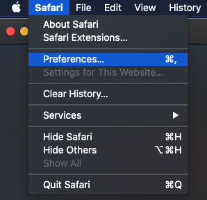

# [!DNL Data Science Workspace] guida alla risoluzione dei problemi

Questo documento contiene le risposte alle domande più frequenti su Adobe Experience Platform [!DNL Data Science Workspace]. Per domande e risoluzione dei problemi relativi [!DNL Platform] API in generale, consulta la sezione [Guida alla risoluzione dei problemi dell’API Adobe Experience Platform](../landing/troubleshooting.md).

## Stato della query del blocco appunti JupyterLab bloccato nello stato di esecuzione

Un blocco appunti JupyterLab può indicare che una cella è in stato di esecuzione, a tempo indeterminato, in alcune condizioni di memoria esaurita. Ad esempio, quando si esegue una query su un set di dati di grandi dimensioni o si eseguono più query successive, il blocco appunti JupyterLab può esaurire la memoria disponibile per memorizzare l&#39;oggetto dataframe risultante. Ci sono alcuni indicatori che si possono vedere in questa situazione. In primo luogo, il kernel entra nello stato di inattività anche se la cella mostra come in esecuzione indicato dal [`*`] accanto alla cella. Inoltre, la barra inferiore indica la quantità di RAM utilizzata/disponibile.


Durante la lettura dei dati, la memoria può crescere fino a raggiungere la quantità massima di memoria allocata. La memoria viene liberata non appena viene raggiunta la memoria massima e il kernel si riavvia. Ciò significa che la memoria utilizzata in questo scenario può mostrare come molto bassa a causa del riavvio del kernel, mentre poco prima del riavvio, la memoria sarebbe stata molto vicina al massimo RAM allocata.

Per risolvere il problema, seleziona l’icona a forma di ingranaggio in alto a destra di JupyterLab e fai scorrere il cursore a destra, quindi seleziona **[!UICONTROL Aggiorna configurazioni]** per allocare più RAM. Inoltre, se si eseguono più query e il valore della RAM si avvicina alla quantità massima allocata, a meno che non siano necessari i risultati delle query precedenti, riavviare il kernel per reimpostare la quantità disponibile di RAM. In questo modo si garantisce di disporre della quantità massima di RAM disponibile per la query corrente.


Nel caso in cui si alloci la quantità massima di memoria (RAM) e si verifichi ancora questo problema, è possibile modificare la query per operare su una dimensione di set di dati più piccola riducendo le colonne o l&#39;intervallo di dati. Per utilizzare la quantità completa di dati, si consiglia di utilizzare un blocco appunti Spark.

## [!DNL JupyterLab] ambiente non caricato in [!DNL Google Chrome]

>[!IMPORTANT]
>
>Questo problema è stato risolto ma potrebbe essere ancora presente nel browser Google Chrome 80.x. Assicurati che il tuo browser Chrome sia aggiornato.

Con la [!DNL Google Chrome] nella versione 80.x del browser, tutti i cookie di terze parti sono bloccati per impostazione predefinita. Questa politica può impedire [!DNL JupyterLab] dal caricamento in Adobe Experience Platform.

Per risolvere questo problema, procedi come segue:

Nel tuo [!DNL Chrome] browser, naviga in alto a destra e seleziona **Impostazioni** (in alternativa puoi copiare e incollare &quot;chrome://settings/&quot; nella barra degli indirizzi). Quindi, scorri fino alla parte inferiore della pagina e fai clic sul pulsante **Avanzate** a discesa.


La **Privacy e sicurezza** viene visualizzata la sezione . Fai clic su **Impostazioni del sito** seguito da **Cookie e dati del sito**.


Infine, seleziona &quot;Blocca cookie di terze parti&quot; su &quot;OFF&quot;.


>[!NOTE]
>
>In alternativa, puoi disabilitare i cookie di terze parti e aggiungere [*]ds.adobe.net all’elenco consentiti.

Passa a &quot;chrome://flags/&quot; nella barra degli indirizzi. Cerca e disabilita il flag con titolo *&quot;SameSite by default cookies&quot;* utilizzando il menu a discesa a destra.


Dopo il passaggio 2, viene richiesto di riavviare il browser. Dopo il riavvio, [!DNL Jupyterlab] devono essere accessibili.

## Perché non sono in grado di accedere [!DNL JupyterLab] in Safari?

Safari disabilita i cookie di terze parti per impostazione predefinita in Safari &lt; 12. Perché il tuo [!DNL Jupyter] l&#39;istanza della macchina virtuale risiede in un dominio diverso rispetto al frame principale, Adobe Experience Platform attualmente richiede l&#39;abilitazione dei cookie di terze parti. Abilitare i cookie di terze parti o passare a un altro browser come [!DNL Google Chrome].

Per Safari 12, è necessario passare l&#39;agente utente a &#39;[!DNL Chrome]&#39; o &#39;[!DNL Firefox]&quot;. Per cambiare l&#39;agente utente, inizia aprendo la *Safari* menu e seleziona **Preferenze**. Viene visualizzata la finestra delle preferenze.



Nella finestra delle preferenze di Safari, seleziona **Avanzate**. Quindi controlla il *Mostra menu di sviluppo nella barra dei menu* scatola. Al termine di questo passaggio, è possibile chiudere la finestra delle preferenze.


Quindi, dalla barra di navigazione superiore seleziona la **Sviluppa** menu. Da all’interno di **Sviluppa** menu a discesa, passaggio del mouse **Agente utente**. È possibile selezionare la **[!DNL Chrome]** o **[!DNL Firefox]** Stringa Agente utente da utilizzare.


## Perché viene visualizzato un messaggio &quot;403 Forbidden&quot; quando si tenta di caricare o eliminare un file in [!DNL JupyterLab]?

Se il browser è abilitato con un software di blocco dell&#39;annuncio, come [!DNL Ghostery] o [!DNL AdBlock] Inoltre, il dominio &quot;\*.adobe.net&quot; deve essere consentito in ogni software di blocco dell&#39;annuncio per [!DNL JupyterLab] per funzionare normalmente. Questo perché [!DNL JupyterLab] le macchine virtuali vengono eseguite su un dominio diverso da [!DNL Experience Platform] dominio.

## Perché alcune parti del mio [!DNL Jupyter Notebook] sembri scorrevole o non esegui il rendering come codice?

Questo può accadere se la cella in questione viene accidentalmente cambiata da &quot;Codice&quot; a &quot;Markdown&quot;. Mentre una cella di codice è messa a fuoco, premendo la combinazione di tasti **ESC+M** cambia il tipo di cella in Markdown. Il tipo di cella può essere modificato dall&#39;indicatore a discesa nella parte superiore del blocco appunti per le celle selezionate. Per modificare un tipo di cella in codice, inizia selezionando la cella specificata da modificare. Quindi, fai clic sul menu a discesa che indica il tipo corrente della cella, quindi seleziona &quot;Codice&quot;.


## Come si installa un file personalizzato [!DNL Python] biblioteche?

La [!DNL Python] il kernel è preinstallato con molte librerie di apprendimento automatico popolari. Tuttavia, puoi installare librerie personalizzate aggiuntive eseguendo il seguente comando all’interno di una cella di codice:

```shell
!pip install {LIBRARY_NAME}
```

Per un elenco completo delle preinstallate [!DNL Python] librerie, vedi [sezione appendice della guida utente di JupyterLab](./jupyterlab/overview.md#supported-libraries).

## Posso installare librerie PySpark personalizzate?

Purtroppo non è possibile installare librerie aggiuntive per il kernel PySpark. Tuttavia, è possibile contattare il proprio rappresentante del servizio clienti Adobe per avere le librerie PySpark personalizzate installate per voi.

Per un elenco delle librerie PySpark preinstallate, consulta la sezione [sezione appendice della guida utente di JupyterLab](./jupyterlab/overview.md#supported-libraries).

## È possibile configurare [!DNL Spark] risorse cluster per [!DNL JupyterLab] [!DNL Spark] o kernel PySpark?

È possibile configurare le risorse aggiungendo il seguente blocco alla prima cella del blocco appunti:

```python
%%configure -f 
{
    "numExecutors": 10,
    "executorMemory": "8G",
    "executorCores":4,
    "driverMemory":"2G",
    "driverCores":2,
    "conf": {
        "spark.cores.max": "40"
    }
}
```

Per ulteriori informazioni su [!DNL Spark] configurazione delle risorse del cluster, incluso l&#39;elenco completo delle proprietà configurabili, consulta la sezione [Guida utente di JupyterLab](./jupyterlab/overview.md#kernels).

## Perché ricevo un errore quando si tentano di eseguire determinate attività per set di dati più grandi?

Se ricevi un errore con un motivo come `Reason: Remote RPC client disassociated. Likely due to containers exceeding thresholds, or network issues.` In genere significa che la memoria del driver o dell&#39;esecutore è esaurita. Vedi i notebook JupyterLab [accesso ai dati](./jupyterlab/access-notebook-data.md) documentazione per ulteriori informazioni sui limiti dei dati e su come eseguire attività su set di dati di grandi dimensioni. In genere questo errore può essere risolto modificando il `mode` da `interactive` a `batch`.

Inoltre, mentre scrivi set di dati Spark/PySpark di grandi dimensioni, memorizza in cache i tuoi dati (`df.cache()`) prima di eseguire il codice di scrittura può migliorare notevolmente le prestazioni.

<!-- remove this paragraph at a later date once the sdk is updated -->

Se si verificano problemi durante la lettura dei dati e si applicano trasformazioni ai dati, provare a memorizzare in cache i dati prima delle trasformazioni. La memorizzazione in cache dei dati impedisce l&#39;esecuzione di più letture in rete. Inizia leggendo i dati. Successivamente, la cache (`df.cache()`) i dati. Infine, esegui le tue trasformazioni.

## Perché i miei notebook Spark/PySpark richiedono così tanto tempo per leggere e scrivere i dati?

Se esegui trasformazioni sui dati, ad esempio utilizzando `fit()`, le trasformazioni possono essere eseguite più volte. Per migliorare le prestazioni, memorizza in cache i dati utilizzando `df.cache()` prima di eseguire `fit()`. In questo modo le trasformazioni vengono eseguite solo una volta e si evitano più letture in rete.

**Ordine consigliato:** Inizia leggendo i dati. Esegui quindi le trasformazioni seguite dalla memorizzazione in cache (`df.cache()`) i dati. Infine, eseguire un `fit()`.

## Perché i miei notebook Spark/PySpark non vengono eseguiti?

Se ricevi uno dei seguenti errori:

- Processo interrotto a causa di un errore dell&#39;area di visualizzazione... È possibile comprimere solo gli RDD con lo stesso numero di elementi in ogni partizione.
- Client RPC remoto non associato e altri errori di memoria.
- Scarse prestazioni durante la lettura e la scrittura di set di dati.

Verifica di memorizzare i dati nella cache (`df.cache()`) prima di scrivere i dati. Durante l&#39;esecuzione del codice nei blocchi appunti, utilizzando `df.cache()` prima di un&#39;azione come `fit()` può migliorare notevolmente le prestazioni del notebook. Utilizzo `df.cache()` prima di scrivere un set di dati assicura che le trasformazioni vengano eseguite solo una volta invece che più volte.

## [!DNL Docker Hub] limitazioni in Data Science Workspace

A partire dal 20 novembre 2020 sono entrati in vigore i limiti di tariffa per l’utilizzo anonimo e gratuito autenticato di Docker Hub. Anonimo e gratuito [!DNL Docker Hub] gli utenti possono effettuare fino a 100 richieste di pull di immagini contenitore ogni sei ore. Se sei interessato da queste modifiche riceverai questo messaggio di errore: `ERROR: toomanyrequests: Too Many Requests.` o `You have reached your pull rate limit. You may increase the limit by authenticating and upgrading: https://www.docker.com/increase-rate-limits.`.

Al momento, questo limite influisce solo sulla tua organizzazione se stai tentando di costruire 100 notebook in Recipes entro un arco di tempo di sei ore o se utilizzi i notebook basati su Spark all’interno di Data Science Workspace che vengono spesso ridimensionati. Tuttavia, questo è improbabile, dal momento che il cluster su cui vengono eseguiti rimane attivo per due ore prima di essere disattivato. Questo riduce il numero di pull necessari quando il cluster è attivo. Se ricevi uno qualsiasi degli errori di cui sopra, dovrai aspettare fino al tuo [!DNL Docker] limite reimpostato.

Per ulteriori informazioni [!DNL Docker Hub] limiti di tasso, visita [Documentazione DockerHub](https://www.docker.com/increase-rate-limits). Una soluzione a questo problema è in fase di elaborazione e prevista in una versione successiva.
