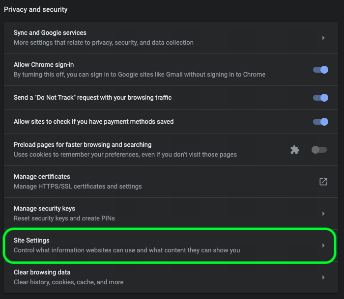

# [!DNL Data Science Workspace] guida alla risoluzione dei problemi

Questo documento contiene le risposte alle domande più frequenti su Adobe Experience Platform [!DNL Data Science Workspace]. Per domande e risoluzione dei problemi relativi a [!DNL Platform] API in generale, consulta [Guida alla risoluzione dei problemi API di Adobe Experience Platform](../landing/troubleshooting.md).

## Stato query JupyterLab Notebook bloccato in esecuzione

Un notebook JupyterLab può indicare che una cella è in esecuzione, indefinitamente, in alcune condizioni di memoria esaurita. Ad esempio, quando si esegue una query su un set di dati di grandi dimensioni o si eseguono più query successive, JupyterLab Notebook può esaurire la memoria disponibile per memorizzare l’oggetto dataframe risultante. Vi sono alcuni indicatori che possono essere osservati in questa situazione. In primo luogo, il kernel entra nello stato inattivo anche se la cella viene visualizzata come in esecuzione indicata dal [`*`] accanto alla cella. Inoltre, la barra inferiore indica la quantità di RAM utilizzata/disponibile.


Durante la lettura dei dati, la memoria può aumentare fino a raggiungere la quantità massima di memoria allocata. La memoria viene liberata non appena viene raggiunta la memoria massima e il kernel si riavvia. Ciò significa che la memoria utilizzata in questo scenario potrebbe essere molto bassa a causa del riavvio del kernel, mentre poco prima del riavvio, la memoria sarebbe stata molto vicina alla RAM massima allocata.

Per risolvere questo problema, seleziona l’icona a forma di ingranaggio in alto a destra di JupyterLab e fai scorrere il cursore verso destra, quindi seleziona **[!UICONTROL Aggiorna configurazioni]** per allocare più RAM. Inoltre, se si eseguono più query e il valore RAM si avvicina alla quantità massima allocata, a meno che non siano necessari i risultati delle query precedenti, riavviare il kernel per reimpostare la quantità di RAM disponibile. In questo modo è possibile disporre della quantità massima di RAM disponibile per la query corrente.


Nel caso in cui si stia allocando la quantità massima di memoria (RAM) e si verifichi ancora questo problema, è possibile modificare la query per operare su un set di dati di dimensioni inferiori riducendo le colonne o l’intervallo di dati. Per utilizzare l&#39;intera quantità di dati, si consiglia di utilizzare un notebook Spark.

## [!DNL JupyterLab] l’ambiente non viene caricato in [!DNL Google Chrome]

>[!IMPORTANT]
>
>Questo problema è stato risolto ma potrebbe essere ancora presente nel browser Google Chrome 80.x. Verifica che il browser Chrome sia aggiornato.

Con il [!DNL Google Chrome] browser 80.x, tutti i cookie di terze parti sono bloccati per impostazione predefinita. Questo criterio può impedire [!DNL JupyterLab] dal caricamento in Adobe Experience Platform.

Per risolvere il problema, attenersi alla procedura descritta di seguito.

Nel tuo [!DNL Chrome] , passa in alto a destra e seleziona **Impostazioni** in alternativa, è possibile copiare e incollare &quot;chrome://settings/&quot; nella barra degli indirizzi. Quindi, scorri fino alla parte inferiore della pagina e fai clic sul pulsante **Avanzate** a discesa.


Il **Privacy e sicurezza** viene visualizzata la sezione. Quindi, fai clic su **Impostazioni del sito** seguito da **Cookie e dati del sito**.




Infine, imposta &quot;Blocca cookie di terze parti&quot; su &quot;OFF&quot;.


>[!NOTE]
>
>In alternativa, puoi disabilitare i cookie di terze parti e aggiungere [*.]ds.adobe.net all’elenco consentiti.

Passa a chrome://flags/ nella barra degli indirizzi. Cerca e disattiva il flag con titolo *&quot;SameSite by default cookies&quot; (Cookie SameSite per impostazione predefinita)* utilizzando il menu a discesa a destra.


Dopo il passaggio 2, viene richiesto di riavviare il browser. Dopo il rilancio, [!DNL Jupyterlab] deve essere accessibile.

## Perché non è possibile accedere a [!DNL JupyterLab] in Safari?

Per impostazione predefinita, Safari disabilita i cookie di terze parti in Safari &lt; 12. Perché il tuo [!DNL Jupyter] l&#39;istanza della macchina virtuale risiede in un dominio diverso rispetto al frame padre. Adobe Experience Platform attualmente richiede l&#39;abilitazione dei cookie di terze parti. Abilita i cookie di terze parti o passa a un altro browser, ad esempio [!DNL Google Chrome].

Per Safari 12, devi cambiare l’agente utente in &quot;[!DNL Chrome]&#39; o &#39;[!DNL Firefox]&quot;. Per cambiare l’agente utente, inizia aprendo *Safari* menu e seleziona **Preferenze**. Viene visualizzata la finestra delle preferenze.


Nella finestra delle preferenze di Safari, seleziona **Avanzate**. Quindi seleziona la *Mostra menu Sviluppo nella barra dei menu* casella. Al termine di questo passaggio è possibile chiudere la finestra delle preferenze.


Quindi, dalla barra di navigazione superiore, seleziona la **Sviluppa** menu. Dall&#39;interno del **Sviluppa** menu a discesa, passaggio del mouse **Agente utente**. È possibile selezionare **[!DNL Chrome]** o **[!DNL Firefox]** Stringa dell’agente utente che desideri utilizzare.


## Perché viene visualizzato il messaggio &quot;403 Forbidden&quot; quando si tenta di caricare o eliminare un file in [!DNL JupyterLab]?

Se il browser è abilitato con un software di blocco degli annunci, ad esempio [!DNL Ghostery] o [!DNL AdBlock] Inoltre, il dominio &quot;\*.adobe.net&quot; deve essere consentito in ogni software di blocco degli annunci per [!DNL JupyterLab] per funzionare normalmente. Questo perché [!DNL JupyterLab] macchine virtuali eseguite in un dominio diverso da [!DNL Experience Platform] dominio.

## Perché fare alcune parti del mio [!DNL Jupyter Notebook] sembri codificato o non esegui il rendering come codice?

Ciò può verificarsi se la cella in questione viene accidentalmente modificata da &quot;Code&quot; a &quot;Markdown&quot;. Mentre una cella di codice è attiva, premere la combinazione di tasti **ESC+M** modifica il tipo di cella in Markdown. Il tipo di cella può essere modificato dall&#39;indicatore a discesa nella parte superiore del blocco appunti per le celle selezionate. Per cambiare un tipo di cella in codice, inizia selezionando la cella che desideri modificare. Quindi, fai clic sul menu a discesa che indica il tipo corrente della cella, quindi seleziona &quot;Codice&quot;.


## Come si installano i [!DNL Python] librerie?

Il [!DNL Python] kernel è preinstallato con molte librerie machine learning. Tuttavia, puoi installare librerie personalizzate aggiuntive eseguendo il seguente comando all’interno di una cella di codice:

```shell
!pip install {LIBRARY_NAME}
```

Per un elenco completo dei [!DNL Python] librerie, vedi [sezione dell’appendice della Guida utente di JupyterLab](./jupyterlab/overview.md#supported-libraries).

## Posso installare librerie PySpark personalizzate?

Sfortunatamente, non è possibile installare librerie aggiuntive per il kernel PySpark. Tuttavia, puoi contattare il rappresentante del servizio clienti Adobe per richiedere l’installazione di librerie PySpark personalizzate.

Per un elenco delle librerie PySpark preinstallate, vedi [sezione dell’appendice della Guida utente di JupyterLab](./jupyterlab/overview.md#supported-libraries).

## È possibile configurare [!DNL Spark] risorse cluster per [!DNL JupyterLab] [!DNL Spark] o il kernel PySpark?

È possibile configurare le risorse aggiungendo il seguente blocco alla prima cella del blocco appunti:

```python
%%configure -f 
{
    "numExecutors": 10,
    "executorMemory": "8G",
    "executorCores":4,
    "driverMemory":"2G",
    "driverCores":2,
    "conf": {
        "spark.cores.max": "40"
    }
}
```

Per ulteriori informazioni su [!DNL Spark] configurazione delle risorse del cluster, incluso l&#39;elenco completo delle proprietà configurabili, vedere [Guida utente di JupyterLab](./jupyterlab/overview.md#kernels).

## Perché ricevo un errore quando tento di eseguire determinate attività per set di dati più grandi?

Se ricevi un errore con un motivo come `Reason: Remote RPC client disassociated. Likely due to containers exceeding thresholds, or network issues.` In genere, ciò significa che la memoria del driver o di un esecutore è quasi esaurita. Consulta i notebook JupyterLab [accesso ai dati](./jupyterlab/access-notebook-data.md) per ulteriori informazioni sui limiti dei dati e su come eseguire attività su set di dati di grandi dimensioni. In genere, questo errore può essere risolto modificando il `mode` da `interactive` a `batch`.

Inoltre, durante la scrittura di set di dati Spark/PySpark di grandi dimensioni, i dati vengono memorizzati nella cache (`df.cache()`) prima di eseguire il codice di scrittura può migliorare notevolmente le prestazioni.

<!-- remove this paragraph at a later date once the sdk is updated -->

Se riscontri problemi durante la lettura dei dati e applichi trasformazioni ai dati, prova a memorizzare i dati nella cache prima delle trasformazioni. La memorizzazione nella cache dei dati impedisce la lettura multipla in rete. Inizia leggendo i dati. Quindi, cache (`df.cache()`) i dati. Infine, esegui le tue trasformazioni.

## Perché i miei notebook Spark/PySpark impiegano così tanto tempo per leggere e scrivere dati?

Se esegui trasformazioni sui dati, ad esempio utilizzando `fit()`, le trasformazioni possono essere eseguite più volte. Per migliorare le prestazioni, memorizza i dati nella cache utilizzando `df.cache()` prima di eseguire `fit()`. In questo modo le trasformazioni vengono eseguite una sola volta e si evitano più letture in rete.

**Ordine consigliato:** Inizia leggendo i dati. Quindi, eseguire le trasformazioni seguite dal caching (`df.cache()`) i dati. Infine, esegui una `fit()`.

## Perché i notebook Spark/PySpark non vengono eseguiti?

Se ricevi uno dei seguenti errori:

- Processo interrotto a causa di un errore della fase... È possibile comprimere solo gli RDD con lo stesso numero di elementi in ogni partizione.
- Client RPC remoto disassociato e altri errori di memoria.
- Scarse prestazioni durante la lettura e la scrittura di set di dati.

Verifica di memorizzare i dati nella cache (`df.cache()`) prima di scrivere i dati. Quando si esegue il codice nei blocchi appunti, utilizzando `df.cache()` prima di un’azione come `fit()` può migliorare notevolmente le prestazioni del notebook. Utilizzo di `df.cache()` prima di scrivere un set di dati, le trasformazioni vengono eseguite solo una volta invece di più volte.

## [!DNL Docker Hub] limitare le restrizioni in Data Science Workspace

A partire dal 20 novembre 2020, sono entrati in vigore i limiti di tariffa per l’uso anonimo e gratuito autenticato di Docker Hub. Anonimo e gratuito [!DNL Docker Hub] Gli utenti possono effettuare fino a 100 richieste di pull di immagini contenitore ogni sei ore. Se subisci gli effetti di queste modifiche, riceverai questo messaggio di errore: `ERROR: toomanyrequests: Too Many Requests.` o `You have reached your pull rate limit. You may increase the limit by authenticating and upgrading: https://www.docker.com/increase-rate-limits.`.

Attualmente, questo limite influisce sull’organizzazione solo se si tenta di creare 100 notebook su ricette entro il periodo di sei ore o se si utilizzano notebook basati su Spark in Data Science Workspace che vengono spesso ridimensionati. Tuttavia, questo è improbabile, poiché il cluster su cui vengono eseguiti rimane attivo per due ore prima di essere disattivato. Questo riduce il numero di pull necessari quando il cluster è attivo. Se ricevi uno degli errori di cui sopra, dovrai attendere fino al [!DNL Docker] il limite è reimpostato.

Per ulteriori informazioni su [!DNL Docker Hub] limiti di tariffa, visita il [Documentazione di DockerHub](https://www.docker.com/increase-rate-limits). Una soluzione a questo problema è attualmente in fase di elaborazione ed è prevista in una versione successiva.
