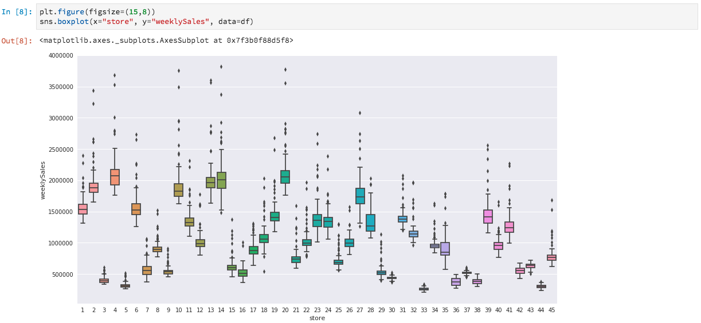

# [!DNL Data Science Workspace] guida

Questo documento fornisce una procedura dettagliata per  Adobe Experience Platform [!DNL Data Science Workspace]. Nello specifico, analizzeremo il flusso di lavoro generale che un esperto di dati dovrebbe seguire per risolvere un problema utilizzando l&#39;apprendimento automatico.

## Prerequisiti

- Un account  Adobe ID registrato
   - L&#39;account del Adobe ID  deve essere stato aggiunto a un&#39;organizzazione con accesso al Adobe Experience Platform  e [!DNL Data Science Workspace]

## Motivazione dello scienziato informatico

Un rivenditore deve affrontare molte sfide per rimanere competitivo nel mercato attuale. Una delle principali preoccupazioni del rivenditore è quella di decidere il prezzo ottimale dei propri prodotti e di prevedere le tendenze di vendita. Grazie a un modello di previsione accurato, il rivenditore sarà in grado di individuare la relazione tra le politiche di domanda e di prezzo e di prendere decisioni di prezzo ottimizzate per massimizzare le vendite e i ricavi.

## La soluzione del Data Scienziato

La soluzione di uno scienziato informatico è quella di sfruttare la ricchezza di dati storici a cui un rivenditore ha accesso, di prevedere le tendenze future e di ottimizzare le decisioni di determinazione dei prezzi. Useremo i dati di vendita passati per formare il nostro modello di apprendimento automatico e utilizzeremo il modello per prevedere le tendenze di vendita future. In questo modo, il rivenditore potrà avere informazioni utili per apportare modifiche ai prezzi.

In questa panoramica, seguiremo i passi che uno scienziato di dati dovrebbe compiere per prendere un set di dati e creare un modello per prevedere le vendite settimanali. Verranno analizzate le seguenti sezioni nel Sample Retail Sales Notebook  Adobe Experience Platform [!DNL Data Science Workspace]:

- [Configurazione](#setup)
- [Esplorazione dei dati](#exploring-data)
- [Progettazione delle funzioni](#feature-engineering)
- [Formazione e verifica](#training-and-verification)

### Blocco note in [!DNL Data Science Workspace]

In primo luogo, vogliamo creare un [!DNL JupyterLab] blocco appunti per aprire il blocco appunti di esempio &quot;Vendite al dettaglio&quot;. Seguendo i passi fatti dallo scienziato informatico nel notebook, potremo comprendere meglio il flusso di lavoro tipico.

Nell&#39;interfaccia utente del Adobe Experience Platform , fai clic sulla scheda Scienze dati nel menu principale per passare all&#39; [!DNL Data Science Workspace]. Da questa pagina, fare clic sulla [!DNL JupyterLab] scheda che aprirà il [!DNL JupyterLab] modulo di avvio. Dovrebbe essere visualizzata una pagina simile a questa.


Nella nostra esercitazione, useremo [!DNL Python] 3 in [!DNL Jupyter Notebook] per mostrare come accedere ed esplorare i dati. Nella pagina Launcher sono disponibili alcuni blocchi appunti di esempio. Utilizzeremo il campione &quot;Vendite al dettaglio&quot; per [!DNL Python] 3.


### Configurazione {#setup}

Con il notebook Retail Sales aperto, la prima cosa da fare è caricare le librerie necessarie per il nostro flusso di lavoro. Nell&#39;elenco seguente viene fornita una breve descrizione di ciascuno degli elementi utilizzati:
- **numpy** - libreria scientifica di calcolo che aggiunge il supporto per array e matrici multidimensionali di grandi dimensioni
- **panda** - libreria che offre strutture e operazioni di dati utilizzate per la manipolazione e l&#39;analisi dei dati
- **matplotlib.pyplot** : libreria di plotting che fornisce un&#39;esperienza simile a MATLAB durante la stampa
- **sea** - libreria di visualizzazione dei dati dell&#39;interfaccia di alto livello basata su matplotlib
- **sklearn** - libreria di machine learning con classificazione, regressione, supporto di algoritmi vettoriali e cluster
- **avvisi** : libreria che controlla i messaggi di avviso

### Esplorare i dati {#exploring-data}

#### Carica dati

Una volta caricate le librerie, è possibile iniziare a osservare i dati. Il [!DNL Python] codice seguente utilizza la struttura di dati dei panda `DataFrame` e la funzione [read_csv()](https://pandas.pydata.org/pandas-docs/stable/generated/pandas.read_csv.html#pandas.read_csv) per leggere il CSV ospitato [!DNL Github] nel DataFrame panda:


La struttura dati DataFrame dei panda è una struttura dati con etichetta bidimensionale. Per vedere rapidamente le dimensioni dei nostri dati, possiamo usare `df.shape`. Questo restituisce un tupla che rappresenta la dimensione del DataFrame:


Infine, possiamo dare un&#39;occhiata a come sono fatti i nostri dati. È possibile utilizzare `df.head(n)` per visualizzare le prime `n` righe del DataFrame:


#### Riepilogo statistico

Possiamo sfruttare la libreria [!DNL Python's] panda per ottenere il tipo di dati di ciascun attributo. L&#39;output della seguente chiamata fornisce informazioni sul numero di voci e sul tipo di dati per ciascuna colonna:

```PYTHON
df.info()
```


Questa informazione è utile perché conoscere il tipo di dati per ogni colonna ci permetterà di sapere come trattare i dati.

Guardiamo ora il riepilogo statistico. Vengono visualizzati solo i tipi di dati numerici, `date`così `storeType`, e non `isHoliday` vengono generati:

```PYTHON
df.describe()
```


Con questo, possiamo vedere che ci sono 6435 istanze per ogni caratteristica. Inoltre, vengono fornite informazioni statistiche come la media, la deviazione standard (std), il min, il max e gli interquartili. Questo ci dà informazioni sulla deviazione per i dati. Nella sezione successiva, passeremo alla visualizzazione che funziona insieme a queste informazioni per darci una comprensione completa dei nostri dati.

Osservando i valori minimo e massimo per `store`, possiamo vedere che ci sono 45 archivi univoci che i dati rappresentano. Ci sono anche `storeTypes` che differenziano quello che è un negozio. Possiamo vedere la distribuzione di `storeTypes` facendo quanto segue:


Ciò significa che 22 negozi sono di `storeType A` , 17 sono `storeType B`, e 6 sono `storeType C`.

#### Visualizzare i dati

Ora che conosciamo i nostri valori di frame dei dati, vogliamo completarli con visualizzazioni per rendere le cose più chiare e più facili da identificare. Questi grafici sono utili anche per trasmettere i risultati a un pubblico.

#### Grafici univoci

I grafici univoci sono grafici di una singola variabile. Un grafico universale comune usato per visualizzare i dati sono i grafici a scatola e a sussurro.

Utilizzando il nostro set di dati per la vendita al dettaglio da prima, possiamo generare il grafico box e whisker per ciascuno dei 45 negozi e le loro vendite settimanali. Il grafico viene generato utilizzando la `seaborn.boxplot` funzione.



Una trama scatola e sussurro è usato per mostrare la distribuzione dei dati. Le linee esterne della trama mostrano i quarti superiori e inferiori mentre la scatola si estende per l&#39;intervallo interquartile. La linea nella casella indica la mediana. I punti di dati più di 1,5 volte il quartile superiore o inferiore sono contrassegnati come un cerchio. Questi punti sono considerati fuorvianti.

In seguito, possiamo tracciare le vendite settimanali con il tempo. Mostreremo solo l&#39;output del primo negozio. Il codice nel notebook genera 6 punti corrispondenti a 6 dei 45 punti vendita del nostro set di dati.


Con questo diagramma, possiamo confrontare le vendite settimanali su un periodo di 2 anni. È facile vedere picchi di vendita e attraverso schemi nel tempo.

#### Grafici multivariati

I grafici multivariati sono utilizzati per visualizzare l&#39;interazione tra le variabili. Con la visualizzazione, gli esperti di dati possono verificare se esistono correlazioni o pattern tra le variabili. Un grafico multivariato comune usato è una matrice di correlazione. Con una matrice di correlazione, le dipendenze tra più variabili vengono quantificate con il coefficiente di correlazione.

Utilizzando lo stesso dataset per la vendita al dettaglio, possiamo generare la matrice di correlazione.


Osservate la diagonale di quelle che si trovano al centro. Questo indica che quando confronta una variabile con se stessa, ha una correlazione positiva completa. Una forte correlazione positiva avrà una grandezza più vicina a 1, mentre le correlazioni deboli saranno più vicine a 0. La correlazione negativa è mostrata con un coefficiente negativo che mostra una tendenza inversa.

### Progettazione di funzioni {#feature-engineering}

In questa sezione verranno apportate modifiche al set di dati per la vendita al dettaglio. Verranno eseguite le seguenti operazioni:

- aggiunta di colonne settimana e anno
- converti storeType in una variabile indicatore
- converti isHoliday in una variabile numerica
- previsioni settimanaliVendite della settimana successiva

#### Aggiungi colonne settimana e anno

Il formato corrente per la data (`2010-02-05`) è difficile da distinguere che i dati sono per ogni settimana. Per questo motivo, convertiamo la data in settimana e anno.


Ora la settimana e la data sono le seguenti:


#### Converti storeType in variabile indicatore

Quindi, si desidera convertire la colonna storeType in colonne che rappresentano ciascuna `storeType`. Ci sono 3 tipi di store, (`A`, `B`, `C`), da cui stiamo creando 3 nuove colonne. Il valore impostato in ciascuna di esse sarà un valore booleano in cui verrà impostato un valore &#39;1&#39; a seconda di quale `storeType` era e `0` per le altre 2 colonne.


La `storeType` colonna corrente verrà eliminata.

#### Converti isHoliday in tipo numerico

La modifica successiva consiste nel modificare il `isHoliday` valore booleano in una rappresentazione numerica.


#### Predicazione settimanaleVendite della settimana prossima

Ora vogliamo aggiungere le vendite settimanali precedenti e future a ciascuno dei nostri set di dati. Lo stiamo facendo compensando la nostra `weeklySales`. Inoltre, stiamo calcolando la `weeklySales` differenza. Questo avviene sottraendo `weeklySales` con quello della settimana precedente `weeklySales`.


Poiché i `weeklySales` dati vengono impostati in avanti su 45 set di dati e all&#39;indietro su 45 per creare nuove colonne, la prima e l&#39;ultima 45 coordinate avranno valori NaN. Possiamo rimuovere questi punti dal nostro dataset utilizzando la `df.dropna()` funzione che rimuove tutte le righe che hanno valori NaN.


Di seguito è riportato un riepilogo del set di dati dopo le modifiche apportate:


### Formazione e verifica {#training-and-verification}

Ora, è il momento di creare alcuni modelli di dati e selezionare quale modello è il migliore per prevedere le vendite future. Verranno valutati i 5 algoritmi seguenti:

- Regressione lineare
- Albero decisionale
- Foresta casuale
- Incremento sfumatura
- K Vicini

#### Dividi set di dati a sottoinsiemi di formazione e test

Abbiamo bisogno di un modo per sapere quanto accurato sarà il nostro modello in grado di prevedere i valori. Questa valutazione può essere effettuata assegnando una parte del dataset da utilizzare come convalida e il resto come dati di formazione. Poiché `weeklySalesAhead` sono i valori futuri effettivi di `weeklySales`, possiamo utilizzarli per valutare la precisione con cui il modello è in grado di prevedere il valore. La divisione è effettuata di seguito:


Ora abbiamo `X_train` e `y_train` per preparare i modelli e `X_test` e `y_test` per la valutazione in seguito.

#### Algoritmi di controllo spot

In questa sezione, dichiareremo tutti gli algoritmi in un array denominato `model`. Quindi, ripetiamo questo array e per ogni algoritmo, immettiamo i dati di formazione con `model.fit()` cui crea un modello `mdl`. Utilizzando questo modello, prevediamo `weeklySalesAhead` con i nostri `X_test` dati.


Per il punteggio, stiamo prendendo la differenza percentuale media tra il previsto `weeklySalesAhead` con i valori effettivi nei `y_test` dati. Dal momento che vogliamo ridurre al minimo la differenza tra la nostra previsione e l&#39;effettivo, Regressore Incremento sfumatura è il modello più performante.

#### Visualizzare le previsioni

Infine, visualizzeremo il nostro modello di previsione con i valori di vendita settimanali effettivi. La linea blu rappresenta i numeri effettivi, mentre quella verde rappresenta la nostra previsione utilizzando Incremento sfumatura. Il codice seguente genera 6 appezzamenti che rappresentano 6 dei 45 punti vendita nel nostro dataset. Solo `Store 1` qui:


<!--TODO UI Flow> -->

## Conclusione

Con questa panoramica, abbiamo analizzato il flusso di lavoro che un esperto di dati avrebbe condotto per risolvere un problema di vendita al dettaglio. In particolare, abbiamo fatto i seguenti passi per raggiungere una soluzione che predica le vendite settimanali future.

- [Configurazione](#setup)
- [Esplorazione dei dati](#exploring-data)
- [Progettazione delle funzioni](#feature-engineering)
- [Formazione e verifica](#training-and-verification)