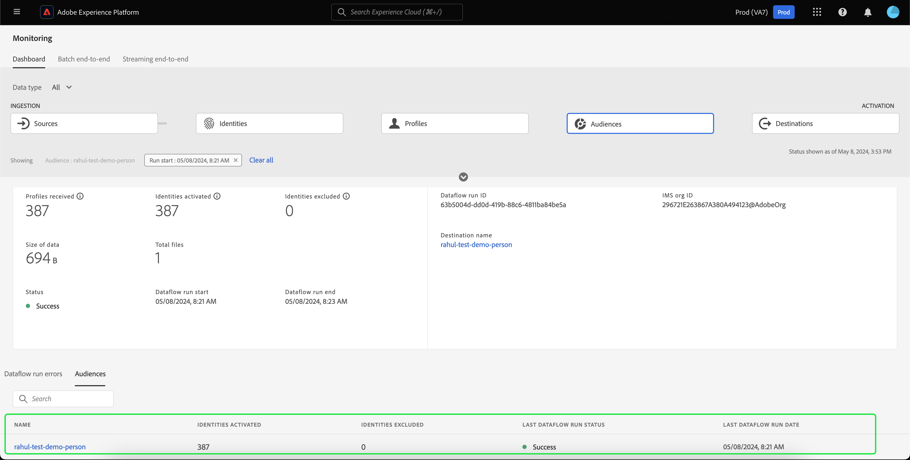

# Monitorare i flussi di dati per il pubblico nell’interfaccia utente

Il servizio di segmentazione consente di creare tipi di pubblico tramite definizioni di segmenti o altre origini dal [!DNL Real-Time Customer Profile] dati. Platform fornisce flussi di dati per monitorare in modo trasparente questo flusso di dati dalle origini alle destinazioni.

Utilizza il dashboard di monitoraggio per visualizzare una rappresentazione visiva dell’attività dei dati all’interno di un pubblico, incluso lo stato della segmentazione dei dati. Leggi il tutorial per istruzioni su come utilizzare il dashboard di monitoraggio per monitorare la segmentazione dei dati utilizzando l’interfaccia utente di Experienci Platform, che consente di monitorare lo stato dei processi di attivazione, valutazione ed esportazione del pubblico.

## Introduzione {#getting-started}

Questa guida richiede una buona conoscenza dei seguenti componenti di Adobe Experience Platform:

- [Flussi dati](../home.md): i flussi di dati sono una rappresentazione dei processi di dati che spostano i dati in Platform. I flussi di dati sono configurati tra servizi diversi, consentendo di spostare i dati dai connettori di origine ai set di dati di destinazione, a [!DNL Identity] e [!DNL Profile], e a [!DNL Destinations].
   - [Il flusso di dati viene eseguito](../../sources/notifications.md): le esecuzioni dei flussi di dati sono i processi pianificati ricorrenti in base alla configurazione della frequenza dei flussi di dati selezionati.
- [Segmentazione](../../segmentation/home.md): la segmentazione ti consente di creare tipi di pubblico dai dati Profilo cliente in tempo reale.
   - [Processi di attivazione](../../destinations/ui/activation-overview.md): un processo di attivazione viene utilizzato per attivare il pubblico in una destinazione specificata.
   - [Processi di valutazione](../../segmentation/tutorials/evaluate-a-segment.md#evaluate-a-segment): un processo di valutazione è un processo asincrono che valuta il pubblico.
   - [Processi di esportazione](../../segmentation/api/export-jobs.md): un processo di esportazione è un processo asincrono utilizzato per mantenere i membri del pubblico nei set di dati.
- [Sandbox](../../sandboxes/home.md): [!DNL Experience Platform] fornisce sandbox virtuali che permettono di suddividere un singolo [!DNL Platform] in ambienti virtuali separati, per facilitare lo sviluppo e l’evoluzione delle applicazioni di esperienza digitale.

## Monitoraggio del dashboard dei tipi di pubblico {#monitoring-audiences-dashboard}

>[!CONTEXTUALHELP]
>id="platform_monitoring_segments"
>title="Tipi di pubblico"
>abstract="La visualizzazione Tipi di pubblico contiene informazioni su tutti i tipi di pubblico dell’organizzazione, con ulteriori informazioni sui relativi processi di attivazione e valutazione."

Per accedere al **[!UICONTROL Tipi di pubblico]** dashboard, seleziona **[!UICONTROL Monitorare]** nel menu di navigazione a sinistra. Una volta al **[!UICONTROL Monitorare]** , seleziona la **[!UICONTROL Tipi di pubblico]** Card.

Principale **[!UICONTROL Tipi di pubblico]** dashboard, il **[!UICONTROL Tipi di pubblico]** mostra lo stato e la data dell’ultimo processo di valutazione e dell’ultimo processo di esportazione.

La dashboard stessa contiene metriche sia per i tipi di pubblico che per i processi di segmentazione. Per impostazione predefinita, la dashboard mostra le metriche relative al pubblico delle ultime 24 ore. Per ulteriori informazioni sulla visualizzazione dei processi di segmentazione, consulta [monitoraggio dei processi di segmentazione](#monitoring-segmentation-jobs-dashboard) sezione.

>[!IMPORTANT]
>
>Attualmente, solo i tipi di pubblico attivati per [destinazioni batch (basate su file)](../../destinations/destination-types.md#file-based) sono supportati per il dashboard monitoraggio dei tipi di pubblico.

Per questa visualizzazione dashboard sono disponibili le metriche seguenti:

| Metrica | Descrizione |
| ------ | ----------- |
| **[!UICONTROL Nome del pubblico]** | Il nome del pubblico. |
| **[!UICONTROL Tipo di dati]** | Il tipo di dati del pubblico. I valori possibili includono **[!UICONTROL Cliente]**, **[!UICONTROL Account]**, e **[!UICONTROL Potenziale cliente]**. È possibile visualizzare per i tipi di pubblico di un tipo di dati specificato utilizzando [!UICONTROL Tipo di dati] filtro sopra la barra multifunzione delle schede. |
| **[!UICONTROL Timestamp dell’ultima valutazione]** | La data e l’ora di esecuzione dell’ultimo processo di valutazione del pubblico. |
| **[!UICONTROL Stato ultima valutazione]** | Lo stato dell’ultimo processo di valutazione del pubblico. I valori possibili includono **[!UICONTROL Completato]**, **[!UICONTROL Nessuna esecuzione]**, e **[!UICONTROL Non riuscito]**. |
| **[!UICONTROL Ultimo metodo di valutazione]** | Il metodo di valutazione del pubblico. Poiché è supportata solo la segmentazione batch, l’unico valore possibile è **[!UICONTROL Batch]**. |
| **[!UICONTROL Ultimi profili di valutazione]** | Il numero di profili valutati nell’ultimo processo di valutazione del pubblico. |
| **[!UICONTROL Timestamp ultima attivazione]** | La data e l’ora di esecuzione dell’ultimo processo di attivazione del pubblico. |
| **[!UICONTROL Stato ultima attivazione]** | Lo stato dell’ultimo processo di attivazione del pubblico. I valori possibili includono **[!UICONTROL Completato]**, **[!UICONTROL Nessuna esecuzione]**, e **[!UICONTROL Non riuscito]**. |
| **[!UICONTROL Identità ultima attivazione]** | Il numero di identità attivate nell’ultimo processo di attivazione del pubblico. |
| **[!UICONTROL Destinazione ultima attivazione]** | Il nome della destinazione a cui è stato attivato l’ultimo processo di attivazione del pubblico. |

Puoi filtrare i risultati per un pubblico specifico e visualizzarne i processi di segmentazione selezionando l’icona del filtro (). I processi di segmentazione sono ordinati in ordine cronologico, con i processi di segmentazione più recenti che appaiono per primi.

Viene visualizzato il dashboard del pubblico filtrato. Il **[!UICONTROL Tipi di pubblico]** mostra lo stato e la data dell’ultimo processo di valutazione e dell’ultimo processo di attivazione.

Il dashboard stesso visualizza l’ora e lo stato degli ultimi processi di valutazione e attivazione, un grafico che mostra il conteggio dei profili della valutazione del pubblico e le metriche per i processi di segmentazione eseguiti. Per impostazione predefinita, il dashboard mostra le metriche del processo di segmentazione per le ultime 24 ore.

Per questa visualizzazione dashboard sono disponibili le metriche seguenti:

| Metrica | Descrizione |
| ------ | ----------- |
| **[!UICONTROL Inizio processo]** | La data e l’ora di inizio del processo di segmentazione. |
| **[!UICONTROL Tipo]** | Indica il tipo di processo di segmentazione. I due tipi di processo supportati sono **attivazione** e **valutazione** processi. |
| **[!UICONTROL Processo completato]** | La data e l’ora in cui il processo di segmentazione è stato completato. |
| **[!UICONTROL Tempo di elaborazione]** | Il tempo necessario per il completamento del processo di segmentazione. |
| **[!UICONTROL Stato del processo]** | Stato del processo di segmentazione. I valori supportati includono **[!UICONTROL Completato]**, **[!UICONTROL In corso]**, e **[!UICONTROL Non riuscito]**. |
| **[!UICONTROL Conteggio dei profili]** | Il numero di profili che il processo di segmentazione sta valutando. Ogni utente deve avere un profilo univoco. |
| **[!UICONTROL Identità attivata]** | Il numero di identità attivate dal processo di segmentazione. Ogni profilo può avere più identità. Ad esempio, un profilo potrebbe avere come identità un’e-mail, un numero di telefono e un numero fedeltà. |
| **[!UICONTROL Nome destinazione]** | Il nome della destinazione in cui viene attivato il processo di segmentazione. |

Puoi filtrare ulteriormente per uno specifico processo di segmentazione e visualizzarne i dettagli selezionando l’icona del filtro (). Esistono due diversi tipi di processi di segmentazione che possono essere filtrati: processi di attivazione e processi di valutazione.

### Dettagli processo di attivazione {#activation-job-details}

La pagina dei dettagli di esecuzione del flusso di dati del processo di attivazione mostra informazioni sulle metriche dell’esecuzione, sugli errori di esecuzione del flusso di dati e sui tipi di pubblico correlati al processo di segmentazione. Un processo di attivazione viene utilizzato per attivare il pubblico per una destinazione specificata.

Per questa visualizzazione dashboard sono disponibili le metriche seguenti:

| Metrica | Descrizione |
| ------ | ----------- |
| **[!UICONTROL Profili ricevuti]** | Numero totale di profili ricevuti nel flusso di attivazione. |
| **[!UICONTROL Identità attivate]** | Numero totale di identità attivate correttamente nella destinazione, in base ai profili ricevuti. |
| **[!UICONTROL Identità escluse]** | Il numero totale di identità escluse dall’attivazione nella destinazione, in base ai profili ricevuti. Queste identità potrebbero essere escluse a causa di attributi mancanti o violazioni del consenso. |
| **[!UICONTROL Dimensione dei dati]** | Dimensione del flusso di dati da attivare. |
| **[!UICONTROL File totali]** | Numero totale di file attivati nel flusso di dati. |
| **[!UICONTROL Stato]** | Stato corrente del processo di attivazione. |
| **[!UICONTROL Avvio esecuzione flusso di dati]** | Data e ora di inizio del processo di attivazione. |
| **[!UICONTROL Fine esecuzione flusso di dati]** | La data e l’ora in cui è terminato il processo di attivazione. |
| **[!UICONTROL ID esecuzione flusso di dati]** | ID del processo di attivazione corrente. |
| **[!UICONTROL ID organizzazione IMS]** | ID dell&#39;organizzazione a cui appartiene il processo di attivazione. |
| **[!UICONTROL Nome destinazione]** | Nome della destinazione a cui vengono attivati i dati. |

Nella sezione tipi di pubblico puoi visualizzare un elenco dei tipi di pubblico attivati come parte del processo di attivazione.

Per la sezione dei tipi di pubblico sono disponibili le metriche seguenti:

| Metrica | Descrizione |
| ------ | ----------- |
| **[!UICONTROL Nome]** | Il nome del pubblico che è stato attivato. |
| **[!UICONTROL Identità attivate]** | Numero totale di identità attivate correttamente nella destinazione, in base ai profili ricevuti. |
| **[!UICONTROL Identità escluse]** | Il numero totale di identità escluse dall’attivazione nella destinazione, in base ai profili ricevuti. Queste identità potrebbero essere escluse a causa di attributi mancanti o di una violazione del consenso. |
| **[!UICONTROL Stato ultima esecuzione del flusso di dati]** | Lo stato dell’ultimo processo di attivazione eseguito per quel pubblico. |
| **[!UICONTROL Data ultima esecuzione del flusso di dati]** | La data e l’ora dell’ultimo processo di attivazione eseguito per quel pubblico. |

Inoltre, puoi visualizzare i dettagli sugli errori di esecuzione del flusso di dati. Nella sezione errori di esecuzione del flusso di dati, puoi visualizzare sia le identità con errori che quelle escluse. La sezione errori include dettagli sul codice di errore e sul numero di identità non riuscite o escluse.

### Dettagli processo di valutazione {#evaluation-job-details}

La pagina dei dettagli dell’esecuzione del flusso di dati del processo di valutazione mostra le informazioni sulle metriche dell’esecuzione e sui tipi di pubblico correlati al processo di segmentazione.

Per questa visualizzazione dashboard sono disponibili le metriche seguenti:

| Metrica | Descrizione |
| ------ | ----------- |
| **[!UICONTROL Profili totali]** | Numero totale di profili da valutare. |
| **[!UICONTROL Stato]** | Stato del processo di valutazione. Gli stati possibili per il processo di valutazione includono **[!UICONTROL Completato]** e **[!UICONTROL Non riuscito]**. |
| **[!UICONTROL Inizio processo]** | Data e ora di inizio del processo di valutazione. |
| **[!UICONTROL Fine processo]** | Data e ora di fine del processo di valutazione. |
| **[!UICONTROL Tipo di processo]** | Il tipo di processo di segmentazione. In questo caso, sarà sempre **[!UICONTROL Valutazione del segmento]** lavoro. |
| **[!UICONTROL Tipo di valutazione]** | Tipo di valutazione in corso. Può essere **[!UICONTROL Batch]** o **[!UICONTROL Streaming]**. |
| **[!UICONTROL ID processo]** | ID del processo di valutazione. |
| **[!UICONTROL ID organizzazione IMS]** | ID dell&#39;organizzazione a cui appartiene il processo di valutazione. |
| **[!UICONTROL Nome del pubblico]** | Il nome del pubblico che viene valutato. |
| **[!UICONTROL ID pubblico]** | ID del pubblico che viene valutato. |

Sotto [!UICONTROL Tipi di pubblico] sezione, puoi visualizzare un elenco dei tipi di pubblico che vengono valutati come parte del processo di valutazione. Puoi filtrare l’elenco dei tipi di pubblico per nome utilizzando la barra di ricerca.

>[!IMPORTANT]
>
>Questa visualizzazione dashboard supporta attualmente fino a 800 metriche per il pubblico.

Per [!UICONTROL Tipi di pubblico] , sono disponibili le seguenti metriche:

| Metrica | Descrizione |
| ------ | ----------- |
| **[!UICONTROL Nome]** | Il nome del pubblico che viene valutato. |
| **[!UICONTROL Conteggio dei profili]** | Il numero di profili che vengono valutati. |

## Monitoraggio del dashboard dei processi di segmentazione {#monitoring-segmentation-jobs-dashboard}

>[!CONTEXTUALHELP]
>id="platform_monitoring_segment_jobs"
>title="Segmentazione dei processi"
>abstract="La vista Processi di segmentazione contiene informazioni sui processi di valutazione ed esportazione per tutti i tipi di pubblico."

Per accedere al **[!UICONTROL Segmentazione dei processi]** dashboard, seleziona **[!UICONTROL Segmentazione dei processi]** nel [!UICONTROL Tipi di pubblico] dashboard. Il [!UICONTROL Monitorare] il dashboard contiene metriche e informazioni sui processi di valutazione ed esportazione.

>[!NOTE]
>
>Solo **processi di valutazione della segmentazione** sono supportate per il monitoraggio per pubblico. I processi di esportazione della segmentazione supportano solo il monitoraggio a livello di organizzazione.

Utilizza il [!UICONTROL Segmentazione dei processi] dashboard per capire se la valutazione e l’esportazione del profilo si verificano in tempo e senza eccezioni, in modo che i servizi a valle per l’attivazione della destinazione possano disporre dei dati di profilo valutati più recenti.

Per i processi di segmentazione sono disponibili le metriche seguenti:

| Metrica | Descrizione |
| ------ | ----------- |
| **[!UICONTROL Processo di segmentazione]** | Indica il nome del processo di segmentazione. |
| **[!UICONTROL Tipo]** | Indica il tipo di processo di segmentazione, esportazione o valutazione. In entrambi i casi, il processo di segmentazione valuta o esporta **tutto** tipi di pubblico appartenenti a un’organizzazione. Per ulteriori informazioni sui processi di esportazione, consulta la guida [endpoint processi di esportazione](../../segmentation/api/export-jobs.md). Per ulteriori informazioni sui processi di valutazione, consulta l’esercitazione su [valutazione di una definizione di segmento](../../segmentation/tutorials/evaluate-a-segment.md#evaluate-a-segment). |
| **[!UICONTROL Inizio processo]** | La data e l’ora di inizio del processo di segmentazione. |
| **[!UICONTROL Fine processo]** | La data e l’ora in cui il processo di segmentazione è stato completato. |
| **[!UICONTROL Stato]** | Stato del processo completato. Gli stati possibili per il processo di segmentazione includono Completato o Non riuscito. |
