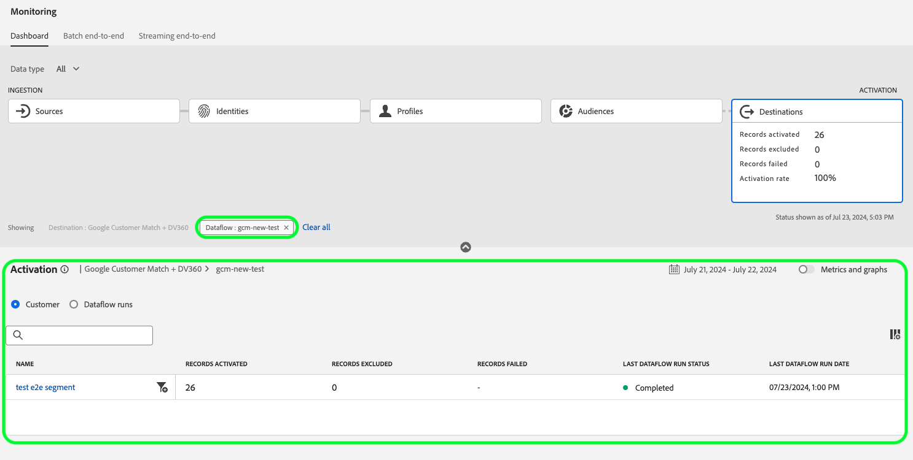

# Monitorare i flussi di dati per le destinazioni nell’interfaccia utente

Utilizza le varie destinazioni nel catalogo di Experienci Platform per attivare i tuoi dati da Platform a innumerevoli partner esterni. Platform semplifica il processo di tracciamento del flusso di dati nelle destinazioni fornendo trasparenza con i flussi di dati.

La dashboard di monitoraggio offre una rappresentazione visiva del percorso di un flusso di dati, inclusa la destinazione in cui vengono attivati i dati, il tipo di dati che stai visualizzando, i dati esportati per ogni esecuzione del flusso di dati e molto altro.

Questa esercitazione fornisce istruzioni su come monitorare i flussi di dati direttamente nell’area di lavoro delle destinazioni o utilizzare il dashboard di monitoraggio per monitorare i flussi di dati per le destinazioni utilizzando l’interfaccia utente di Experienci Platform.

## Introduzione {#getting-started}

Questa guida richiede una buona conoscenza dei seguenti componenti di Adobe Experience Platform:

- [Flussi dati](../home.md): i flussi di dati sono una rappresentazione dei processi di dati che spostano i dati in Platform. I flussi di dati sono configurati tra servizi diversi, consentendo di spostare i dati dai connettori di origine ai set di dati di destinazione, a [!DNL Identity] e [!DNL Profile], e a [!DNL Destinations].
   - [Il flusso di dati viene eseguito](../../sources/notifications.md): le esecuzioni dei flussi di dati sono i processi pianificati ricorrenti in base alla configurazione della frequenza dei flussi di dati selezionati.
- [Destinazioni](../../destinations/home.md): le destinazioni sono integrazioni predefinite con applicazioni di uso comune che consentono l’attivazione diretta dei dati da Platform per campagne di marketing cross-channel, campagne e-mail, pubblicità mirata e molti altri casi d’uso.
- [Sandbox](../../sandboxes/home.md): [!DNL Experience Platform] fornisce sandbox virtuali che permettono di suddividere un singolo [!DNL Platform] in ambienti virtuali separati, per facilitare lo sviluppo e l’evoluzione delle applicazioni di esperienza digitale.

## Monitorare i flussi di dati nell’area di lavoro Destinazioni {#monitor-dataflows-in-the-destinations-workspace}

In **[!UICONTROL Destinazioni]** nell’interfaccia utente di Platform, passa alla sezione **[!UICONTROL Sfoglia]** e selezionare il nome di una destinazione che si desidera visualizzare.

Viene visualizzato un elenco dei flussi di dati esistenti. In questa pagina è riportato un elenco di flussi di dati visualizzabili, con informazioni sulla destinazione, il nome utente, il numero di flussi di dati e lo stato.

Per ulteriori informazioni sugli stati, consulta la tabella seguente:

| Stato | Descrizione |
| ------ | ----------- |
| Abilitata | Il `Enabled` Lo stato indica che un flusso di dati è attivo ed esporta i dati in base alla pianificazione fornita. |
| Disabilitata | Il `Disabled` Lo stato indica che un flusso di dati è inattivo e non esporta alcun dato. |
| Elaborazione | Il `Processing` Lo stato indica che un flusso di dati non è ancora attivo. Questo stato si verifica spesso subito dopo la creazione di un nuovo flusso di dati. |
| Errore | Il `Error` lo stato indica che il processo di attivazione di un flusso di dati è stato interrotto. |

### Esecuzioni del flusso di dati per le destinazioni di streaming {#dataflow-runs-for-streaming-destinations}

>[!CONTEXTUALHELP]
>id="platform_monitoring_dataflow_run_details_activation_streaming"
>title="Dettagli dell’esecuzione del flusso di dati"
>abstract="I dettagli di esecuzione del flusso di dati di destinazione contengono informazioni sullo stato di attivazione di un pubblico e metriche estratte dal Profilo cliente in tempo reale per generare identità univoche. Per ulteriori informazioni, rivedi la guida alle definizioni delle metriche."

>[!CONTEXTUALHELP]
>id="platform_monitoring_profiles_received_streaming"
>title="Profili ricevuti"
>abstract="Numero totale di profili ricevuti nel flusso di dati. Questo valore viene aggiornato ogni 60 minuti."

>[!CONTEXTUALHELP]
>id="platform_destinations_dataflow_identitiesactivated_streaming"
>title="Identità attivate"
>abstract="Conteggio delle singole identità di profilo attivate correttamente nella destinazione selezionata. Questa metrica include le identità create, aggiornate e rimosse dai tipi di pubblico esportati."

>[!CONTEXTUALHELP]
>id="platform_destinations_dataflow_identitiesexcluded_streaming"
>title="Identità escluse"
>abstract="Conteggio dei singoli record di profilo esclusi dall’attivazione per la destinazione selezionata in base agli attributi mancanti e alla violazione del consenso."

>[!CONTEXTUALHELP]
>id="platform_destinations_dataflow_identitiesfailed_streaming"
>title="Identità non riuscite"
>abstract="Conteggio delle singole identità di profilo non riuscite per la destinazione selezionata. Per informazioni, controlla la diagnostica degli errori."

Per le destinazioni di streaming, [!UICONTROL Il flusso di dati viene eseguito] fornisce un aggiornamento orario per i dati delle metriche sulle esecuzioni del flusso di dati. Le statistiche più importanti etichettate sono per le identità.

Le identità rappresentano i diversi facet di un profilo. Ad esempio, se un profilo contiene sia un numero di telefono che un indirizzo e-mail, tale profilo ha due identità.

Viene visualizzato un elenco di singole esecuzioni e delle relative metriche specifiche, insieme ai seguenti totali per le identità:

- **[!UICONTROL Identità attivate]**: numero totale di identità di profilo attivate correttamente nella destinazione selezionata. Questa metrica include le identità create, aggiornate e rimosse dai tipi di pubblico esportati.
- **[!UICONTROL Identità escluse]**: numero totale di identità di profilo ignorate per l’attivazione in base ad attributi mancanti e violazioni del consenso.
- **[!UICONTROL Identità non riuscite]**: numero totale di identità di profilo non attivate nella destinazione a causa di errori.

Ogni singola esecuzione del flusso di dati mostra i seguenti dettagli:

- **[!UICONTROL Avvio esecuzione flusso di dati]**: ora di inizio dell’esecuzione del flusso di dati. Per le esecuzioni di flussi di dati in streaming, Experienci Platform acquisisce metriche basate sull’inizio dell’esecuzione del flusso di dati, sotto forma di metriche orarie. Per le esecuzioni dei flussi di dati in streaming, se un flusso di dati viene avviato, ad esempio, alle 22:30, la metrica mostra l’ora di inizio come 22:00 nell’interfaccia utente.
- **[!UICONTROL Tempo di elaborazione]**: tempo necessario all’elaborazione del flusso di dati.
   - Per **[!UICONTROL completato]** , la metrica del tempo di elaborazione mostra sempre un’ora.
   - Per le esecuzioni del flusso di dati che si trovano ancora in una **[!UICONTROL elaborazione]** state, la finestra per acquisire tutte le metriche rimane aperta per più di un’ora, per elaborare tutte le metriche che corrispondono all’esecuzione del flusso di dati. Ad esempio, un’esecuzione di un flusso di dati avviata alle 09:30 potrebbe rimanere in uno stato di elaborazione per un’ora e trenta minuti per acquisire ed elaborare tutte le metriche. Quindi, una volta chiusa la finestra di elaborazione e aggiornato lo stato dell’esecuzione del flusso di dati a **completato**, il tempo di elaborazione visualizzato viene modificato in un’ora.
- **[!UICONTROL Profili ricevuti]**: numero totale di profili ricevuti nel flusso di dati.
- **[!UICONTROL Identità attivate]**: numero totale di identità di profilo attivate correttamente nella destinazione selezionata nell’ambito dell’esecuzione del flusso di dati. Questa metrica include le identità create, aggiornate e rimosse dai tipi di pubblico esportati.
- **[!UICONTROL Identità escluse]**: numero totale di identità di profilo escluse dall’attivazione in base ad attributi mancanti e a violazioni del consenso.
- **[!UICONTROL Identità non riuscite]** Numero totale di identità di profilo non attivate nella destinazione a causa di errori.
- **[!UICONTROL Tasso di attivazione]**: percentuale di identità ricevute che sono state attivate correttamente o saltate. La formula seguente illustra come viene calcolato questo valore:
  
- **[!UICONTROL Stato]**: rappresenta lo stato del flusso di dati: [!UICONTROL Completato] o [!UICONTROL Elaborazione]. [!UICONTROL Completato] significa che tutte le identità per l’esecuzione del flusso di dati corrispondente sono state esportate entro il periodo di un’ora. [!UICONTROL Elaborazione] significa che l’esecuzione del flusso di dati non è ancora terminata.

Per visualizzare i dettagli di una particolare esecuzione del flusso di dati, seleziona l’ora di inizio dell’esecuzione dall’elenco.

La pagina dei dettagli per un’esecuzione del flusso di dati contiene informazioni aggiuntive, ad esempio il numero di profili ricevuti, il numero di identità attivate, il numero di identità non riuscite e il numero di identità escluse.

Nella pagina dei dettagli viene inoltre visualizzato un elenco di identità con errori e di identità escluse. Vengono visualizzate informazioni sia per le identità non riuscite che per quelle escluse, inclusi il codice di errore, il conteggio delle identità e la descrizione. Per impostazione predefinita, nell’elenco vengono visualizzate le identità con errori. Per visualizzare le identità ignorate, seleziona la **[!UICONTROL Identità escluse]** attivare/disattivare.

### Il flusso di dati viene eseguito per le destinazioni di batch {#dataflow-runs-for-batch-destinations}

>[!CONTEXTUALHELP]
>id="platform_monitoring_dataflow_run_details_activation"
>title="Dettagli dell’esecuzione del flusso di dati"
>abstract="I dettagli di esecuzione del flusso di dati di destinazione contengono informazioni sullo stato di attivazione di un pubblico e metriche estratte dal Profilo cliente in tempo reale per generare identità univoche. Per ulteriori informazioni, rivedi la guida alle definizioni delle metriche."
>additional-url="https://experienceleague.adobe.com/docs/experience-platform/dataflows/ui/monitor-destinations.html?lang=it#dataflow-runs-for-streaming-destinations" text="Esecuzioni del flusso di dati per le destinazioni di streaming"

>[!CONTEXTUALHELP]
>id="platform_monitoring_profiles_received_batch"
>title="Profili ricevuti"
>abstract="Numero totale di profili ricevuti nel flusso di dati. Questo valore viene aggiornato ogni 60 minuti."

>[!CONTEXTUALHELP]
>id="platform_destinations_dataflow_identitiesactivated_batch"
>title="Identità attivate"
>abstract="Conteggio delle singole identità di profilo attivate correttamente nella destinazione selezionata. Questa metrica include le identità create, aggiornate e rimosse dai tipi di pubblico esportati."

>[!CONTEXTUALHELP]
>id="platform_destinations_dataflow_identitiesexcluded_batch"
>title="Identità escluse"
>abstract="Conteggio dei singoli record di profilo esclusi dall’attivazione per la destinazione selezionata in base agli attributi mancanti e alla violazione del consenso."

Per le destinazioni batch, il [!UICONTROL Il flusso di dati viene eseguito] fornisce dati sulle metriche durante l’esecuzione del flusso di dati. Viene visualizzato un elenco di singole esecuzioni e delle relative metriche specifiche, insieme ai seguenti totali per le identità:

- **[!UICONTROL Identità attivate]**: numero totale di identità di profilo attivate correttamente nella destinazione selezionata. Questa metrica include le identità create, aggiornate e rimosse dai tipi di pubblico esportati.
- **[!UICONTROL Identità escluse]**: conteggio delle singole identità di profilo escluse dall’attivazione per la destinazione selezionata, in base agli attributi mancanti e alla violazione del consenso.

Ogni singola esecuzione del flusso di dati mostra i seguenti dettagli:

- **[!UICONTROL Avvio esecuzione flusso di dati]**: ora di inizio dell’esecuzione del flusso di dati.
- **[!UICONTROL Pubblico]**: nome del pubblico associato a ogni esecuzione del flusso di dati.
- **[!UICONTROL Tempo di elaborazione]**: tempo necessario per l’elaborazione dell’esecuzione del flusso di dati.
- **[!UICONTROL Profili ricevuti]**: numero totale di profili ricevuti nel flusso di dati. Questo valore viene aggiornato ogni 60 minuti.
- **[!UICONTROL Identità attivate]**: numero totale di identità di profilo attivate correttamente nella destinazione selezionata nell’ambito dell’esecuzione del flusso di dati. Questa metrica include le identità create, aggiornate e rimosse dai tipi di pubblico esportati.
- **[!UICONTROL Identità escluse]**: numero totale di identità di profilo escluse dall’attivazione in base ad attributi mancanti e a violazioni del consenso.
- **[!UICONTROL Stato]**: rappresenta lo stato in cui si trova il flusso di dati. Può essere uno dei tre stati seguenti: [!UICONTROL Completato], [!UICONTROL Non riuscito], e [!UICONTROL Elaborazione]. [!UICONTROL Completato] significa che il flusso di dati è attivo ed esporta i dati in base alla pianificazione fornita. [!UICONTROL Non riuscito] significa che l’attivazione dei dati è stata sospesa a causa di errori. [!UICONTROL Elaborazione] significa che il flusso di dati non è ancora attivo e si verifica generalmente quando viene creato un nuovo flusso di dati.

Per visualizzare i dettagli di un’esecuzione specifica del flusso di dati, seleziona l’ora di inizio dell’esecuzione dall’elenco.

>[!NOTE]
>
>Le esecuzioni del flusso di dati vengono generate in base alla frequenza di pianificazione del flusso di dati di destinazione. Viene eseguita un’esecuzione separata del flusso di dati per ogni [criterio di unione](../../profile/merge-policies/overview.md) applicati a un pubblico.

La pagina dei dettagli di un flusso di dati, oltre ai dettagli riportati nell’elenco dei flussi di dati, visualizza informazioni più specifiche su di esso:

- **[!UICONTROL Dimensione dei dati]**: dimensione del flusso di dati in fase di esportazione.
- **[!UICONTROL File totali]**: numero totale di file esportati nel flusso di dati.
- **[!UICONTROL Ultimo aggiornamento]**: ora dell’ultimo aggiornamento del flusso di dati.

Nella pagina dei dettagli viene inoltre visualizzato un elenco di identità con errori e di identità escluse. Vengono visualizzate le informazioni sia per le identità non riuscite che per quelle escluse, inclusi il codice di errore e la descrizione. Per impostazione predefinita, nell’elenco vengono visualizzate le identità con errori. Per mostrare le identità escluse, seleziona la **[!UICONTROL Identità escluse]** attivare/disattivare.

## Dashboard di monitoraggio delle destinazioni {#monitoring-destinations-dashboard}

>[!NOTE]
>
>- La funzionalità di monitoraggio delle destinazioni è attualmente supportata per tutte le destinazioni in Experienci Platform *eccetto* il [Adobe Target](/help/destinations/catalog/personalization/adobe-target-connection.md) e [Personalizzazione personalizzata](/help/destinations/catalog/personalization/custom-personalization.md) destinazioni.
>- Per [Amazon Kinesis](/help/destinations/catalog/cloud-storage/amazon-kinesis.md), [Hub eventi di Azure](/help/destinations/catalog/cloud-storage/azure-event-hubs.md), e [API HTTP](/help/destinations/catalog/streaming/http-destination.md) destinazioni, vengono stimate le metriche relative alle identità escluse, non riuscite e attivate. Volumi più elevati di dati di attivazione consentono una maggiore precisione delle metriche.

>[!CONTEXTUALHELP]
>id="platform_monitoring_activation"
>title="Activation"
>abstract="La vista Attivazione della destinazione contiene informazioni sullo stato di attivazione di un pubblico e metriche prelevate dal profilo cliente in tempo reale per generare identità univoche."

Per accedere al [!UICONTROL Monitorare] dashboard, seleziona **[!UICONTROL Monitorare]** () nel menu di navigazione a sinistra. Una volta al [!UICONTROL Monitorare] pagina, seleziona [!UICONTROL Destinazioni]. Il [!UICONTROL Monitorare] il dashboard contiene metriche e informazioni sui processi eseguiti di destinazione.

Utilizza il [!UICONTROL Destinazioni] per avere un’idea generale dello stato dei flussi di attivazione. Inizia ottenendo informazioni su un livello aggregato per tutte le destinazioni di batch e streaming, quindi approfondisci le viste dettagliate per i flussi di dati, le esecuzioni dei flussi di dati e i tipi di pubblico attivati, per una panoramica approfondita dei dati di attivazione. Schermi in [!UICONTROL Monitorare] le dashboard forniscono informazioni fruibili tramite metriche e descrizioni degli errori per aiutarti a risolvere eventuali problemi che potrebbero verificarsi negli scenari di attivazione.

Puoi filtrare le informazioni visualizzate per tipo di dati: clienti, account (solo per l’edizione B2B di Adobe Real-Time CDP), potenziali clienti e arricchimento dell’account. Per ulteriori informazioni su queste opzioni, consulta [guida al dashboard di monitoraggio](/help/dataflows/ui/monitor.md#monitoring-dashboard-overview).

Al centro del dashboard è presente [!UICONTROL Attivazione] Questo pannello contiene metriche e grafici che visualizzano i dati sulla velocità di attivazione dei dati esportati nelle destinazioni di streaming, nonché sul flusso di dati batch non riuscito eseguito nelle destinazioni batch.

Per impostazione predefinita, i dati visualizzati contengono le informazioni di attivazione delle ultime 24 ore. Seleziona **[!UICONTROL Ultime 24 ore]** per regolare l&#39;intervallo di tempo dei record visualizzati. Le opzioni disponibili includono **[!UICONTROL Ultime 24 ore]**, **[!UICONTROL Ultimi 7 giorni]**, e **[!UICONTROL Ultimi 30 giorni]**. In alternativa, è possibile selezionare le date nella finestra a comparsa del calendario visualizzata. Dopo aver selezionato le date, seleziona **[!UICONTROL Applica]** per regolare l&#39;intervallo di tempo delle informazioni visualizzate.

>[!NOTE]
>
>La schermata seguente mostra il tasso di attivazione e il flusso di dati batch eseguiti per gli ultimi 30 giorni invece delle ultime 24 ore. È possibile regolare l’intervallo di tempo selezionando **[!UICONTROL Ultimi 30 giorni]**.

Utilizza l’icona freccia () per espandere o chiudere le schede nella parte superiore dello schermo, che mostrano immediatamente informazioni sui dettagli di attivazione, in base al tipo di destinazione - streaming o batch:

- **[!UICONTROL Tasso di attivazione in streaming]**: rappresenta la percentuale di identità ricevute che sono state attivate correttamente o saltate. La formula utilizzata per calcolare questa percentuale è descritta più avanti in questa pagina, nel [Il flusso di dati viene eseguito per le destinazioni di streaming](#dataflow-runs-for-streaming-destinations) sezione.
- **[!UICONTROL Flusso di dati batch non riuscito]**: rappresenta il numero di esecuzioni del flusso di dati non riuscite nell’intervallo di tempo selezionato.

Il **[!UICONTROL Attivazione]** il grafico viene visualizzato per impostazione predefinita e puoi disattivarlo per espandere l’elenco delle destinazioni di seguito. Seleziona la **[!UICONTROL Metriche e grafici]** per disattivare i grafici.

Il **[!UICONTROL Attivazione]** Nel pannello viene visualizzato un elenco di destinazioni che contengono almeno un account esistente. Questo elenco include anche informazioni sui profili ricevuti, identità attivate, identità non riuscite, identità escluse, tasso di attivazione, flussi di dati totali non riusciti e la data dell’ultimo aggiornamento per queste destinazioni. Non tutte le metriche sono disponibili per tutti i tipi di destinazione. La tabella seguente illustra le metriche e le informazioni disponibili per tipo di destinazione, streaming o batch.

| Metrica | Tipo di destinazione |
---------|----------|
| **[!UICONTROL Profili ricevuti]** | Streaming e batch |
| **[!UICONTROL Identità attivate]** | Streaming e batch |
| **[!UICONTROL Identità non riuscite]** | Streaming |
| **[!UICONTROL Identità escluse]** | Streaming e batch |
| **[!UICONTROL Tasso di attivazione]** | Streaming |
| **[!UICONTROL Totale flussi di dati non riusciti]** | Batch |
| **[!UICONTROL Ultimo aggiornamento]** | Streaming e batch |

Puoi anche filtrare l’elenco delle destinazioni per visualizzare solo la categoria di destinazioni selezionata. Seleziona la **[!UICONTROL Le mie destinazioni]** e seleziona la [categoria di destinazione](/help/destinations/destination-types.md#categories) che desideri filtrare.

Inoltre, puoi immettere una destinazione nella barra di ricerca per isolarla in una singola destinazione. Per visualizzare i flussi di dati della destinazione, seleziona il filtro  accanto per visualizzare un elenco dei relativi flussi di dati attivi.

Per visualizzare tutti i flussi di dati esistenti su tutte le destinazioni, seleziona **[!UICONTROL Flussi dati]**.

Viene visualizzato un elenco di flussi di dati, ordinati in base all’ultima esecuzione del flusso di dati. Per visualizzare ulteriori dettagli su un flusso di dati specifico, individua la destinazione da monitorare e seleziona il filtro  e quindi selezionare il filtro  accanto al flusso di dati di cui desideri ulteriori informazioni.

Dopo aver selezionato un flusso di dati per un’ulteriore ispezione, la pagina dei dettagli del flusso di dati contiene un interruttore che consente di visualizzare i dati attivati nel flusso di dati, suddivisi per esecuzioni di flussi di dati o tipi di pubblico.

### Visualizzazione esecuzioni flusso di dati {#dataflow-runs-view}

Quando **[!UICONTROL Il flusso di dati viene eseguito]** è selezionato, puoi visualizzare un elenco di esecuzioni del flusso di dati per il flusso di dati selezionato e ulteriori informazioni su ciascuna esecuzione.

>[!INFO]
>
>Per i flussi di dati verso le destinazioni di streaming, un’esecuzione dei flussi di dati viene suddivisa in finestre orarie. Ogni finestra oraria genera un ID esecuzione flusso di dati corrispondente.
>
>Per i flussi di dati verso destinazioni batch, ogni pubblico ha una corrispondente esecuzione di flusso di dati generata, in base alla frequenza pianificata di attivazione del pubblico. Ad esempio, se imposti un’attivazione pianificata giornaliera per cinque tipi di pubblico nello stesso flusso di dati di destinazione, ogni giorno verranno generati cinque flussi di dati separati.

Utilizza il **[!UICONTROL Mostra solo errori]** attiva per visualizzare solo le esecuzioni non riuscite per un flusso di dati.

### Visualizzazione a livello di pubblico {#segment-level-view}

Quando **[!UICONTROL Tipi di pubblico]** è selezionato, viene visualizzato un elenco dei tipi di pubblico attivati nel flusso di dati selezionato, all’interno dell’intervallo di tempo selezionato. Questa schermata include informazioni a livello di pubblico sulle identità attivate, sulle identità escluse, nonché sullo stato e sull’ora dell’ultima esecuzione del flusso di dati. Esaminando le metriche per le identità escluse e attivate, puoi verificare se un pubblico è stato attivato correttamente o meno.

Ad esempio, stai attivando un pubblico denominato &quot;Membri fedeltà in California&quot; in una destinazione Amazon S3 &quot;Membri fedeltà California December&quot;. Supponiamo che nel pubblico selezionato siano presenti 100 profili, ma solo 80 profili su 100 contengono gli attributi ID fedeltà e che le regole di mappatura dell’esportazione siano state definite come `loyalty.id` è obbligatorio. In questo caso, a livello di pubblico, vedrai 80 identità attivate e 20 identità escluse.

>[!IMPORTANT]
>
>Tieni presente le limitazioni correnti relative alle metriche a livello di pubblico:
>- La visualizzazione a livello di pubblico è attualmente disponibile solo per le destinazioni batch.
>- Le metriche a livello di pubblico sono attualmente registrate solo per l’esecuzione corretta del flusso di dati. Non vengono registrati per le esecuzioni dei flussi di dati non riuscite e i record esclusi.

Nella vista a livello di pubblico, le metriche sono aggregate tra più flussi di dati eseguiti all’interno dell’intervallo di tempo selezionato. In presenza di più esecuzioni del flusso di dati, puoi approfondire la ricerca dal livello di pubblico per visualizzare il raggruppamento di ogni esecuzione del flusso di dati, filtrato in base al pubblico selezionato.
Utilizza il pulsante Filtro  per approfondire il flusso di dati, viene eseguita una visualizzazione per ogni pubblico nel flusso di dati.

### Pagina di esecuzione del flusso di dati {#dataflow-runs-page}

La pagina Esecuzioni flusso di dati visualizza informazioni sulle esecuzioni del flusso di dati, tra cui l’ora di inizio dell’esecuzione del flusso di dati, il tempo di elaborazione, i profili ricevuti, le identità attivate, le identità escluse, le identità non riuscite, il tasso di attivazione e lo stato.

Quando esegui il drill-down nella pagina del flusso di dati, da [vista a livello di pubblico](#segment-level-view), puoi filtrare il flusso di dati eseguito in base alle seguenti opzioni:

- **[!UICONTROL Il flusso di dati viene eseguito con identità non riuscite]**: per il pubblico selezionato, questa opzione elenca tutte le esecuzioni del flusso di dati che non sono riuscite per l’attivazione. Per verificare il motivo per cui l’esecuzione di un determinato flusso di dati non è riuscita, consulta [pagina dettagli esecuzione flusso di dati](#dataflow-run-details-page) per l’esecuzione del flusso di dati.
- **[!UICONTROL Il flusso di dati viene eseguito con le identità saltate]**: per il pubblico selezionato, questa opzione elenca tutti i flussi di dati in cui alcune identità non sono state completamente attivate e alcuni profili sono stati saltati. Per verificare perché le identità in una determinata esecuzione del flusso di dati sono state ignorate, vedi [pagina dettagli esecuzione flusso di dati](#dataflow-run-details-page) per l’esecuzione del flusso di dati.
- **[!UICONTROL Il flusso di dati viene eseguito con le identità attivate]**: per il pubblico selezionato, questa opzione elenca tutte le esecuzioni del flusso di dati con identità attivate correttamente.

Per visualizzare ulteriori dettagli su un flusso di dati specifico, seleziona il filtro  accanto all’ora di inizio dell’esecuzione del flusso di dati per visualizzare la pagina dettagli esecuzione flusso di dati.

### Pagina dei dettagli dell’esecuzione del flusso di dati {#dataflow-run-details-page}

La pagina dei dettagli di esecuzione del flusso di dati, oltre ai dettagli riportati nell’elenco dei flussi di dati eseguiti, visualizza informazioni più specifiche sul flusso di dati:

- **[!UICONTROL ID esecuzione flusso di dati]**: ID del flusso di dati.
- **[!UICONTROL ID organizzazione IMS]**: l’organizzazione a cui appartiene il flusso di dati.
- **[!UICONTROL Ultimo aggiornamento]**: ora dell’ultimo aggiornamento del flusso di dati.

La pagina dei dettagli dispone anche di un interruttore per passare dagli errori di esecuzione del flusso di dati ai tipi di pubblico e viceversa. Questa opzione è disponibile solo per i flussi di dati eseguiti in destinazioni batch.

La visualizzazione degli errori di esecuzione del flusso di dati mostra un elenco di identità non riuscite e di identità escluse. Vengono visualizzate informazioni sia per le identità non riuscite che per quelle escluse, inclusi il codice di errore, il conteggio delle identità e la descrizione. Per impostazione predefinita, nell’elenco vengono visualizzate le identità con errori. Per visualizzare le identità ignorate, seleziona la **[!UICONTROL Identità escluse]** attivare/disattivare.

Quando **[!UICONTROL Tipi di pubblico]** è selezionato, viene visualizzato un elenco dei tipi di pubblico attivati nell’esecuzione del flusso di dati selezionato. Questa schermata include informazioni a livello di pubblico sulle identità attivate, sulle identità escluse, nonché sullo stato e sull’ora dell’ultima esecuzione del flusso di dati.

## Passaggi successivi {#next-steps}

Seguendo questa guida, ora sai come monitorare i flussi di dati sia per le destinazioni batch che per quelle in streaming, incluse tutte le informazioni rilevanti come il tempo di elaborazione, il tasso di attivazione e lo stato. Per ulteriori informazioni sui flussi di dati in Platform, leggi la sezione [panoramica dei flussi di dati](../home.md). Per ulteriori informazioni sulle destinazioni, consulta [panoramica sulle destinazioni](../../destinations/home.md).