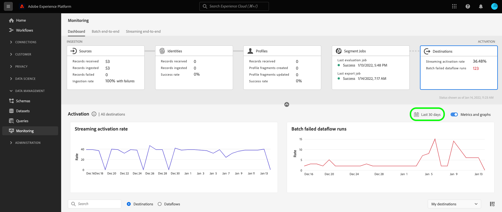

# Monitorare i flussi di dati per le destinazioni nell’interfaccia utente

Le destinazioni ti consentono di attivare i tuoi dati da Adobe Experience Platform a innumerevoli partner esterni. Platform semplifica il processo di tracciamento del flusso di dati verso le destinazioni fornendo trasparenza con i flussi di dati.

Il dashboard di monitoraggio fornisce una rappresentazione visiva del percorso di un flusso di dati, inclusa la destinazione a cui vengono attivati i dati. Questa esercitazione fornisce istruzioni su come monitorare i flussi di dati direttamente nell’area di lavoro delle destinazioni o utilizza il dashboard di monitoraggio per monitorare i flussi di dati per le destinazioni tramite l’interfaccia utente di Experience Platform.

## Introduzione {#getting-started}

Questa guida richiede una buona comprensione dei seguenti componenti di Adobe Experience Platform:

- [Flussi di dati](../home.md): I flussi di dati sono una rappresentazione dei processi di trasferimento dei dati in Platform. I flussi di dati sono configurati su diversi servizi e consentono di spostare i dati dai connettori di origine ai set di dati di destinazione, fino a [!DNL Identity] e [!DNL Profile]e a [!DNL Destinations].
   - [Corse del flusso di dati](../../sources/notifications.md): Le esecuzioni dei flussi di dati sono i processi pianificati ricorrenti in base alla configurazione della frequenza dei flussi di dati selezionati.
- [Destinazioni](../../destinations/home.md): Le destinazioni sono integrazioni predefinite con applicazioni comunemente utilizzate che consentono l’attivazione senza soluzione di continuità dei dati da Platform per campagne di marketing cross-channel, campagne e-mail, pubblicità mirata e molti altri casi d’uso.
- [Sandbox](../../sandboxes/home.md): [!DNL Experience Platform] fornisce sandbox virtuali che suddividono un singolo [!DNL Platform] in ambienti virtuali separati per sviluppare e sviluppare applicazioni di esperienza digitale.

## Monitorare i flussi di dati nell’area di lavoro Destinazioni {#monitor-dataflows-in-the-destinations-workspace}

In **[!UICONTROL Destinazioni]** nell’interfaccia utente di Platform, passa alla **[!UICONTROL Sfoglia]** e selezionare il nome di una destinazione che si desidera visualizzare.

Viene visualizzato un elenco dei flussi di dati esistenti. In questa pagina è riportato un elenco di flussi di dati visualizzabili, con informazioni sulla loro destinazione, nome utente, numero di flussi di dati e stato.

Per ulteriori informazioni sugli stati, consulta la tabella seguente:

| Stato | Descrizione |
| ------ | ----------- |
| Abilitata | La `Enabled` lo stato indica che un flusso di dati è attivo ed esporta i dati in base alla pianificazione fornita. |
| Disabilitata | La `Disabled` lo stato indica che un flusso di dati è inattivo e non esporta alcun dato. |
| Elaborazione | La `Processing` lo stato indica che un flusso di dati non è ancora attivo. Questo stato viene spesso rilevato immediatamente dopo la creazione di un nuovo flusso di dati. |
| Errore | La `Error` lo stato indica che il processo di attivazione di un flusso di dati è stato interrotto. |

### Il flusso di dati viene eseguito per le destinazioni di streaming {#dataflow-runs-for-streaming-destinations}

>[!CONTEXTUALHELP]
>id="platform_monitoring_dataflow_run_details_activation_streaming"
>title="Dettagli dell&#39;esecuzione del dataflow"
>abstract="I dettagli dell’esecuzione del flusso di dati di destinazione contengono informazioni sullo stato di attivazione del segmento e sulle metriche prelevate da Profilo cliente in tempo reale per generare identità univoche. Per ulteriori informazioni, consulta la guida alle definizioni delle metriche ."

>[!CONTEXTUALHELP]
>id="platform_monitoring_profiles_received_streaming"
>title="Profili ricevuti"
>abstract="Numero totale di profili ricevuti nel flusso di dati. Questo valore viene aggiornato ogni 60 minuti."

>[!CONTEXTUALHELP]
>id="platform_destinations_dataflow_identitiesactivated_streaming"
>title="Identità attivate"
>abstract="Numero di singole identità di profilo attivate correttamente nella destinazione selezionata. Questa metrica include identità create, aggiornate e rimosse dai segmenti esportati."

>[!CONTEXTUALHELP]
>id="platform_destinations_dataflow_identitiesexcluded_streaming"
>title="Identità escluse"
>abstract="Il conteggio dei singoli record di profilo esclusi dall’attivazione per la destinazione selezionata in base agli attributi mancanti e alla violazione del consenso."

>[!CONTEXTUALHELP]
>id="platform_destinations_dataflow_identitiesfailed_streaming"
>title="Identità non riuscite"
>abstract="Numero di singole identità di profilo che non sono riuscite per la destinazione selezionata. Per ulteriori informazioni, controlla la diagnostica degli errori."

Per le destinazioni di streaming, l’ [!UICONTROL Corse del flusso di dati] La scheda fornisce un aggiornamento orario per i dati delle metriche in esecuzione nel flusso di dati. Le statistiche più importanti etichettate sono quelle sulle identità.

Le identità rappresentano i diversi facet di un profilo. Ad esempio, se un profilo contiene sia un numero di telefono che un indirizzo e-mail, questo avrà due identità.

Viene visualizzato un elenco di singole esecuzioni e le relative metriche specifiche, insieme ai seguenti totali per le identità:

- **[!UICONTROL Identità attivate]**: Numero totale di identità di profilo attivate correttamente nella destinazione selezionata. Questa metrica include identità create, aggiornate e rimosse dai segmenti esportati.
- **[!UICONTROL Identità escluse]**: Numero totale di identità di profilo saltate per l’attivazione in base agli attributi mancanti e alla violazione del consenso.
- **[!UICONTROL Identità non riuscite]**: Numero totale di identità di profilo non attivate nella destinazione a causa di errori.

Ogni singola esecuzione di un flusso di dati mostra i seguenti dettagli:

- **[!UICONTROL Avvio esecuzione flusso di dati]**: Data di inizio dell&#39;esecuzione del flusso di dati. Per le esecuzioni di flussi di dati, Experience Platform acquisisce le metriche in base all’inizio dell’esecuzione del flusso di dati, sotto forma di metriche orarie. Per l’esecuzione del flusso di dati in streaming, se un’esecuzione di un flusso di dati inizia, ad esempio alle 10:30 di sera, la metrica mostra l’ora di inizio alle 10:00 di sera nell’interfaccia utente.
- **[!UICONTROL Tempo di elaborazione]**: Il tempo necessario all&#39;esecuzione del flusso di dati per l&#39;elaborazione.
   - Per **[!UICONTROL completato]** in esecuzione, la metrica del tempo di elaborazione mostra sempre un’ora.
   - Per le esecuzioni di flussi di dati che si trovano ancora in una **[!UICONTROL elaborazione]** la finestra per acquisire tutte le metriche rimane aperta per più di un&#39;ora, per elaborare tutte le metriche corrispondenti all&#39;esecuzione del flusso di dati. Ad esempio, un’esecuzione di un flusso di dati avviato alle 09:30 potrebbe rimanere in uno stato di elaborazione per un’ora e trenta minuti per acquisire ed elaborare tutte le metriche. Quindi, una volta chiusa la finestra di elaborazione e lo stato dell&#39;esecuzione del flusso di dati si aggiorna a **completato**, il tempo di elaborazione visualizzato viene modificato in un’ora.
- **[!UICONTROL Profili ricevuti]**: Numero totale di profili ricevuti nel flusso di dati.
- **[!UICONTROL Identità attivate]**: Numero totale di identità di profilo attivate correttamente nella destinazione selezionata come parte dell&#39;esecuzione del flusso di dati. Questa metrica include identità create, aggiornate e rimosse dai segmenti esportati.
- **[!UICONTROL Identità escluse]**: Il numero totale di identità di profilo escluse dall’attivazione in base agli attributi mancanti e alla violazione del consenso.
- **[!UICONTROL Identità non riuscite]** Numero totale di identità di profilo non attivate nella destinazione a causa di errori.
- **[!UICONTROL Tasso di attivazione]**: Percentuale di identità ricevute che sono state attivate o saltate correttamente. La formula seguente illustra come viene calcolato questo valore:
   
- **[!UICONTROL Stato]**: Rappresenta lo stato in cui si trova il flusso di dati: o [!UICONTROL Completato] o [!UICONTROL Elaborazione]. [!UICONTROL Completato] significa che tutte le identità per l’esecuzione del flusso di dati corrispondente sono state esportate entro un periodo di un’ora. [!UICONTROL Elaborazione] significa che l’esecuzione del flusso di dati non è ancora stata completata.

Per visualizzare i dettagli di una particolare esecuzione di un flusso di dati, selezionare l’ora di inizio dell’esecuzione dall’elenco.

La pagina dei dettagli di un’esecuzione del flusso di dati contiene informazioni aggiuntive, come il numero di profili ricevuti, il numero di identità attivate, il numero di identità non riuscite e il numero di identità escluse.

Nella pagina dei dettagli viene inoltre visualizzato un elenco di identità con errore e identità escluse. Vengono visualizzate informazioni sia per le identità non riuscite che per quelle escluse, incluso il codice di errore, il conteggio delle identità e la descrizione. Per impostazione predefinita, nell’elenco sono visualizzate le identità non riuscite. Per mostrare le identità saltate, seleziona la **[!UICONTROL Identità escluse]** alternare.

### Esecuzione del flusso di dati per le destinazioni batch {#dataflow-runs-for-batch-destinations}

>[!CONTEXTUALHELP]
>id="platform_monitoring_dataflow_run_details_activation"
>title="Dettagli dell&#39;esecuzione del dataflow"
>abstract="I dettagli dell’esecuzione del flusso di dati di destinazione contengono informazioni sullo stato di attivazione del segmento e sulle metriche prelevate da Profilo cliente in tempo reale per generare identità univoche. Per ulteriori informazioni, consulta la guida alle definizioni delle metriche ."
>additional-url="https://experienceleague.adobe.com/docs/experience-platform/dataflows/ui/monitor-destinations.html#dataflow-runs-for-streaming-destinations" text="Il flusso di dati viene eseguito per le destinazioni di streaming"

>[!CONTEXTUALHELP]
>id="platform_monitoring_profiles_received_batch"
>title="Profili ricevuti"
>abstract="Numero totale di profili ricevuti nel flusso di dati. Questo valore viene aggiornato ogni 60 minuti."

>[!CONTEXTUALHELP]
>id="platform_destinations_dataflow_identitiesactivated_batch"
>title="Identità attivate"
>abstract="Numero di singole identità di profilo attivate correttamente nella destinazione selezionata. Questa metrica include identità create, aggiornate e rimosse dai segmenti esportati."

>[!CONTEXTUALHELP]
>id="platform_destinations_dataflow_identitiesexcluded_batch"
>title="Identità escluse"
>abstract="Il conteggio dei singoli record di profilo esclusi dall’attivazione per la destinazione selezionata in base agli attributi mancanti e alla violazione del consenso."

Per le destinazioni batch, [!UICONTROL Corse del flusso di dati] fornisce i dati delle metriche sulle esecuzioni del flusso di dati. Viene visualizzato un elenco di singole esecuzioni e le relative metriche specifiche, insieme ai seguenti totali per le identità:

- **[!UICONTROL Identità attivate]**: Numero totale di identità di profilo attivate correttamente nella destinazione selezionata. Questa metrica include identità create, aggiornate e rimosse dai segmenti esportati.
- **[!UICONTROL Identità escluse]**: Il conteggio delle singole identità di profilo escluse dall’attivazione per la destinazione selezionata, in base agli attributi mancanti e alla violazione del consenso.

Ogni singola esecuzione di un flusso di dati mostra i seguenti dettagli:

- **[!UICONTROL Avvio esecuzione flusso di dati]**: Data di inizio dell&#39;esecuzione del flusso di dati.
- **[!UICONTROL Segmento]**: Nome del segmento associato a ogni esecuzione del flusso di dati.
- **[!UICONTROL Tempo di elaborazione]**: Il tempo necessario all’elaborazione dell’esecuzione del flusso di dati.
- **[!UICONTROL Profili ricevuti]**: Numero totale di profili ricevuti nel flusso di dati. Questo valore viene aggiornato ogni 60 minuti.
- **[!UICONTROL Identità attivate]**: Numero totale di identità di profilo attivate correttamente nella destinazione selezionata come parte dell&#39;esecuzione del flusso di dati. Questa metrica include identità create, aggiornate e rimosse dai segmenti esportati.
- **[!UICONTROL Identità escluse]**: Il numero totale di identità di profilo escluse dall’attivazione in base agli attributi mancanti e alla violazione del consenso.
- **[!UICONTROL Stato]**: Rappresenta lo stato in cui si trova il flusso di dati. Può essere uno dei tre stati seguenti: [!UICONTROL Completato], [!UICONTROL Non riuscito]e [!UICONTROL Elaborazione]. [!UICONTROL Completato] significa che il flusso di dati è attivo ed esporta i dati in base alla pianificazione fornita. [!UICONTROL Non riuscito] significa che l’attivazione dei dati è stata sospesa a causa di errori. [!UICONTROL Elaborazione] significa che il flusso di dati non è ancora attivo e viene generalmente rilevato quando viene creato un nuovo flusso di dati.

Per visualizzare i dettagli di un’esecuzione di un flusso di dati specifico, selezionare l’ora di inizio dell’esecuzione dall’elenco.

>[!NOTE]
>
>Le esecuzioni dei flussi di dati vengono generate in base alla frequenza di pianificazione del flusso di dati di destinazione. Viene eseguita un&#39;esecuzione separata del flusso di dati per ogni [criterio di unione](../../profile/merge-policies/overview.md) applicato a un segmento.

La pagina dei dettagli di un flusso di dati, oltre ai dettagli mostrati nell’elenco dei flussi di dati, visualizza informazioni più specifiche sul flusso di dati:

- **[!UICONTROL Dimensione dei dati]**: Dimensione del flusso di dati da esportare.
- **[!UICONTROL File totali]**: Numero totale di file esportati nel flusso di dati.
- **[!UICONTROL Ultimo aggiornamento]**: L’ora dell’ultimo aggiornamento del flusso di dati.

Nella pagina dei dettagli viene inoltre visualizzato un elenco di identità con errore e identità escluse. Vengono visualizzate le informazioni sia per le identità non riuscite che per quelle escluse, compreso il codice di errore e la descrizione. Per impostazione predefinita, nell’elenco sono visualizzate le identità non riuscite. Per mostrare le identità escluse, seleziona la **[!UICONTROL Identità escluse]** alternare.

## Dashboard del monitoraggio delle destinazioni {#monitoring-destinations-dashboard}

>[!NOTE]
>
>- La funzionalità di monitoraggio delle destinazioni è attualmente supportata per tutte le destinazioni in Experience Platform *eccetto* la [Adobe Target](/help/destinations/catalog/personalization/adobe-target-connection.md) e [Personalizzazione personalizzata](/help/destinations/catalog/personalization/custom-personalization.md) destinazioni.
>- Per [Amazon Kinesis](/help/destinations/catalog/cloud-storage/amazon-kinesis.md), [Hub eventi di Azure](/help/destinations/catalog/cloud-storage/azure-event-hubs.md)e [API HTTP](/help/destinations/catalog/streaming/http-destination.md) Le destinazioni, le identità escluse, non riuscite e attivate al momento non vengono visualizzate.

>[!CONTEXTUALHELP]
>id="platform_monitoring_activation"
>title="Activation"
>abstract="La vista di attivazione della destinazione contiene informazioni sullo stato di attivazione del segmento e sulle metriche prelevate da Profilo cliente in tempo reale per generare identità univoche."

Per accedere al [!UICONTROL Monitoraggio] dashboard, seleziona **[!UICONTROL Monitoraggio]** () nella navigazione a sinistra. Una volta sul [!UICONTROL Monitoraggio] pagina, seleziona [!UICONTROL Destinazioni]. La [!UICONTROL Monitoraggio] il dashboard contiene metriche e informazioni sui processi di esecuzione di destinazione.

Utilizza la [!UICONTROL Destinazioni] dashboard per ottenere un’idea generale dello stato dei flussi di attivazione. Inizia ottenendo informazioni a livello aggregato per tutte le destinazioni batch e in streaming, quindi approfondisci le visualizzazioni dettagliate per i flussi di dati, le esecuzioni dei flussi di dati e i segmenti attivati per un&#39;analisi approfondita dei dati di attivazione. Le schermate nel [!UICONTROL Monitoraggio] dashboard fornisce informazioni fruibili attraverso metriche e descrizioni degli errori per aiutarti a risolvere eventuali problemi che potrebbero insorgere negli scenari di attivazione.

Al centro del dashboard è [!UICONTROL Attivazione] , che contiene metriche e grafici che visualizzano dati sulla frequenza di attivazione dei dati esportati nelle destinazioni di streaming, nonché sul flusso di dati batch non riuscito viene eseguito sulle destinazioni batch.

Per impostazione predefinita, i dati visualizzati contengono le informazioni di attivazione delle ultime 24 ore. Seleziona **[!UICONTROL Ultime 24 ore]** per regolare l&#39;intervallo di tempo dei record visualizzati. Le opzioni disponibili includono **[!UICONTROL Ultime 24 ore]**, **[!UICONTROL Ultimi 7 giorni]** e **[!UICONTROL Ultimi 30 giorni]**. In alternativa, è possibile selezionare le date nella finestra a comparsa del calendario visualizzata. Dopo aver selezionato le date, seleziona **[!UICONTROL Applica]** per regolare l&#39;intervallo di tempo delle informazioni visualizzate.

>[!NOTE]
>
>La schermata seguente mostra il tasso di attivazione e il flusso di dati batch eseguiti per gli ultimi 30 giorni invece delle ultime 24 ore. È possibile regolare l&#39;intervallo di tempo selezionando **[!UICONTROL Ultimi 30 giorni]**.

Usa l’icona a forma di freccia () per espandere o ignorare le schede nella parte superiore dello schermo, che mostrano immediatamente informazioni sui dettagli di attivazione, in base al tipo di destinazione: streaming o batch:

- **[!UICONTROL Velocità di attivazione in streaming]**: Rappresenta la percentuale di identità ricevute che sono state attivate o saltate correttamente. La formula utilizzata per calcolare questa percentuale è descritta più avanti in questa pagina, nel [Il flusso di dati viene eseguito per le destinazioni di streaming](#dataflow-runs-for-streaming-destinations) sezione .
- **[!UICONTROL Esecuzione di un flusso di dati non riuscito batch]**: Rappresenta il numero di esecuzioni non riuscite del flusso di dati nell&#39;intervallo di tempo selezionato.

La **[!UICONTROL Attivazione]** Il grafico viene visualizzato per impostazione predefinita ed è possibile disattivarlo per espandere l’elenco di destinazioni riportato di seguito. Seleziona la **[!UICONTROL Metriche e grafici]** per disattivare i grafici.

La **[!UICONTROL Attivazione]** visualizza un elenco di destinazioni contenenti almeno un account esistente. Questo elenco include anche informazioni sui profili ricevuti, le identità attivate, le identità non riuscite, le identità escluse, il tasso di attivazione, i flussi di dati totali non riusciti e la data dell’ultimo aggiornamento per queste destinazioni. Non tutte le metriche sono disponibili per tutti i tipi di destinazione. La tabella seguente delinea quali metriche sono disponibili per tipo di destinazione, streaming o batch.

| Metrica | Tipo di destinazione |
---------|----------|
| **[!UICONTROL Profili ricevuti]** | Streaming e batch |
| **[!UICONTROL Identità attivate]** | Streaming e batch |
| **[!UICONTROL Identità non riuscite]** | Streaming |
| **[!UICONTROL Identità escluse]** | Streaming e batch |
| **[!UICONTROL Tasso di attivazione]** | Streaming |
| **[!UICONTROL Totale flussi di dati non riusciti]** | Batch |
| **[!UICONTROL Ultimo aggiornamento]** | Streaming e batch |

Puoi anche filtrare l’elenco di destinazioni per visualizzare solo la categoria di destinazioni selezionata. Seleziona la **[!UICONTROL Destinazioni personali]** e seleziona il menu a discesa [categoria di destinazione](/help/destinations/destination-types.md#categories) su cui si desidera filtrare.

Inoltre, puoi inserire una destinazione nella barra di ricerca per isolarla in una singola destinazione. Per visualizzare i flussi di dati della destinazione, seleziona il filtro  accanto a per visualizzare un elenco dei relativi flussi di dati attivi.

Se desideri visualizzare tutti i flussi di dati esistenti tra tutte le destinazioni, seleziona **[!UICONTROL Flussi di dati]**.

Viene visualizzato un elenco di flussi di dati, ordinati in base all’ultima esecuzione del flusso di dati. Puoi visualizzare ulteriori dettagli per un flusso di dati specifico individuando la destinazione da monitorare, selezionando il filtro  accanto a esso, quindi selezionando il filtro  accanto al flusso di dati desideri ulteriori informazioni.

Dopo aver selezionato un flusso di dati per un’ulteriore ispezione, la pagina dei dettagli del flusso di dati contiene un interruttore che consente di visualizzare i dati attivati nel flusso di dati, suddivisi per esecuzioni o segmenti del flusso di dati.

### Vista delle esecuzioni del flusso di dati {#dataflow-runs-view}

Quando **[!UICONTROL Corse del flusso di dati]** è selezionato, puoi visualizzare un elenco delle esecuzioni del flusso di dati selezionato per il flusso di dati selezionato e ulteriori informazioni su ogni esecuzione.

>[!INFO]
>
>Per i flussi di dati verso destinazioni di streaming, un’esecuzione di un flusso di dati viene suddivisa in finestre orarie. Ogni finestra ogni ora genera un ID di esecuzione del flusso di dati corrispondente.
>
>Per i flussi di dati verso destinazioni batch, ogni segmento ha una corrispondente esecuzione del flusso di dati generato, in base alla frequenza pianificata di attivazione del segmento. Ad esempio, se imposti un’attivazione pianificata giornaliera per cinque segmenti nello stesso flusso di dati di destinazione, verranno generate cinque esecuzioni separate del flusso di dati ogni giorno.

Utilizza la **[!UICONTROL Mostra solo errori]** per visualizzare solo le esecuzioni non riuscite per un flusso di dati.

### Vista a livello di segmento {#segment-level-view}

Quando **[!UICONTROL Segmenti]** se è selezionato, viene visualizzato un elenco dei segmenti attivati nel flusso di dati selezionato, all’interno dell’intervallo di tempo selezionato. Questa schermata include informazioni a livello di segmento sulle identità attivate, le identità escluse, nonché lo stato e l’ora dell’ultima esecuzione del flusso di dati. Esaminando le metriche relative alle identità escluse e attivate, puoi verificare se un segmento è stato attivato o meno correttamente.

Ad esempio, stai attivando un segmento denominato &quot;Membri fedeltà in California&quot; in una destinazione Amazon S3 &quot;Membri fedeltà in California Dicembre&quot;. Supponiamo che nel segmento selezionato siano presenti 100 profili, ma solo 80 profili su 100 contengono attributi ID fedeltà e che tu abbia definito le regole di mappatura dell’esportazione come `loyalty.id` è obbligatorio. In questo caso, a livello di segmento, vedrai 80 identità attivate ed escluse 20 identità.

>[!IMPORTANT]
>
>Tieni presente le limitazioni correnti relative alle metriche a livello di segmento:
>- La visualizzazione a livello di segmento è attualmente disponibile solo per le destinazioni batch.
>- Le metriche a livello di segmento sono attualmente registrate solo per l’esecuzione corretta del flusso di dati. Non vengono registrati per le esecuzioni non riuscite del flusso di dati e per i record esclusi.

Nella visualizzazione a livello di segmento, le metriche sono aggregate in più esecuzioni del flusso di dati all’interno dell’intervallo di tempo selezionato. Se sono presenti più esecuzioni di flusso di dati, puoi eseguire un drill-down a livello di segmento per visualizzare la suddivisione per ogni esecuzione di flusso di dati, filtrata dal segmento selezionato.
Usare il pulsante del filtro  per approfondire la visualizzazione delle esecuzioni del flusso di dati per ogni segmento nel flusso di dati.

### Pagina di esecuzione del flusso di dati {#dataflow-runs-page}

La pagina delle esecuzioni del flusso di dati visualizza informazioni sulle esecuzioni del flusso di dati, tra cui l’ora di inizio del flusso di dati, il tempo di elaborazione, i profili ricevuti, le identità attivate, le identità escluse, le identità non riuscite, il tasso di attivazione e lo stato.

Quando si esegue il drill-down al flusso di dati, la pagina viene eseguita dal [visualizzazione a livello di segmento](#segment-level-view), puoi filtrare le esecuzioni del flusso di dati in base alle seguenti opzioni:

- **[!UICONTROL Il flusso di dati viene eseguito con identità non riuscite]**: Per il segmento selezionato, questa opzione elenca tutte le esecuzioni del flusso di dati che non sono riuscite per l’attivazione. Per verificare il motivo per cui le identità in un determinato flusso di dati non sono riuscite, vedi [pagina dei dettagli di esecuzione del dataflow](#dataflow-run-details-page) per l&#39;esecuzione del flusso di dati.
- **[!UICONTROL Il flusso di dati viene eseguito con identità saltate]**: Per il segmento selezionato, questa opzione elenca tutte le esecuzioni del flusso di dati in cui alcune delle identità non sono state attivate completamente e alcuni profili sono stati saltati. Per verificare il motivo per cui le identità in una determinata esecuzione di un flusso di dati sono state saltate, vedi [pagina dei dettagli di esecuzione del dataflow](#dataflow-run-details-page) per l&#39;esecuzione del flusso di dati.
- **[!UICONTROL Il flusso di dati viene eseguito con identità attivate]**: Per il segmento selezionato, questa opzione elenca tutte le esecuzioni del flusso di dati con identità attivate correttamente.

Per visualizzare ulteriori dettagli sull’esecuzione di un flusso di dati specifico, seleziona il filtro  accanto all’ora di inizio del flusso di dati per visualizzare la pagina dei dettagli dell’esecuzione del flusso di dati.

### Pagina dei dettagli dell&#39;esecuzione del flusso di dati {#dataflow-run-details-page}

La pagina dei dettagli dell’esecuzione del flusso di dati, oltre ai dettagli mostrati nell’elenco delle esecuzioni del flusso di dati, visualizza informazioni più specifiche sul flusso di dati:

- **[!UICONTROL ID esecuzione flusso di dati]**: ID del flusso di dati.
- **[!UICONTROL ID organizzazione IMS]**: Organizzazione IMS a cui appartiene il flusso di dati.
- **[!UICONTROL Ultimo aggiornamento]**: L’ora dell’ultimo aggiornamento del flusso di dati.

La pagina dei dettagli dispone inoltre di un pulsante di attivazione per passare da errori di esecuzione del flusso di dati a segmenti. Questa opzione è disponibile solo per le esecuzioni del flusso di dati nelle destinazioni batch.

Nella visualizzazione degli errori di esecuzione del flusso di dati viene visualizzato un elenco di identità con errore e identità escluse. Vengono visualizzate informazioni sia per le identità non riuscite che per quelle escluse, incluso il codice di errore, il conteggio delle identità e la descrizione. Per impostazione predefinita, nell’elenco sono visualizzate le identità non riuscite. Per mostrare le identità saltate, seleziona la **[!UICONTROL Identità escluse]** alternare.

Quando **[!UICONTROL Segmenti]** se è selezionato, viene visualizzato un elenco dei segmenti attivati nell’esecuzione del flusso di dati selezionato. Questa schermata include informazioni a livello di segmento sulle identità attivate, le identità escluse, nonché lo stato e l’ora dell’ultima esecuzione del flusso di dati.

## Passaggi successivi {#next-steps}

Seguendo questa guida, ora sai come monitorare i flussi di dati sia per le destinazioni batch che per quelle in streaming, comprese tutte le informazioni rilevanti quali il tempo di elaborazione, il tasso di attivazione e lo stato. Per ulteriori informazioni sui flussi di dati in Platform, consulta la sezione [panoramica dei dataflows](../home.md). Per ulteriori informazioni sulle destinazioni, consulta il [panoramica sulle destinazioni](../../destinations/home.md).