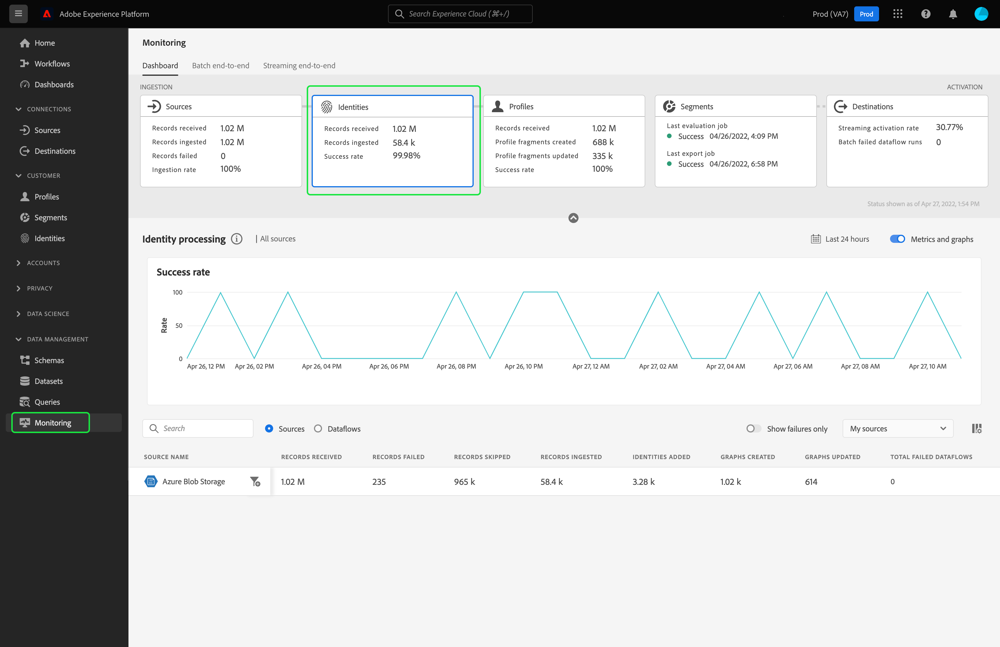

# Monitorare i flussi di dati per le identità nell’interfaccia utente

Il servizio Adobe Experience Platform Identity offre una panoramica completa dei clienti e del loro comportamento attraverso la creazione di identità tra dispositivi e sistemi, consentendo di fornire in tempo reale esperienze digitali personali di forte impatto.

Il dashboard di monitoraggio fornisce una rappresentazione visiva dell’attività dei dati all’interno delle identità, incluso lo stato delle identità dei dati. Questa esercitazione fornisce istruzioni su come utilizzare il dashboard di monitoraggio per monitorare le identità dei dati utilizzando l’interfaccia utente di Experience Platform, consentendo di tenere traccia dello stato dell’elaborazione delle identità.

## Introduzione {#getting-started}

- [Flussi di dati](../home.md): I flussi di dati sono una rappresentazione dei processi di trasferimento dei dati in Platform. I flussi di dati sono configurati su diversi servizi e consentono di spostare i dati dai connettori di origine ai set di dati di destinazione, fino a [!DNL Identity] e [!DNL Profile]e a [!DNL Destinations].
   - [Corse del flusso di dati](../../sources/notifications.md): Le esecuzioni dei flussi di dati sono i processi pianificati ricorrenti in base alla configurazione della frequenza dei flussi di dati selezionati.
- [Servizio identità](../../identity-service/home.md): Ottieni una visione migliore dei singoli clienti e del loro comportamento attraverso il collegamento delle identità tra dispositivi e sistemi.
- [Sandbox](../../sandboxes/home.md): [!DNL Experience Platform] fornisce sandbox virtuali che suddividono un singolo [!DNL Platform] in ambienti virtuali separati per sviluppare e sviluppare applicazioni di esperienza digitale.

## Dashboard delle identità di monitoraggio {#identity-metrics}

>[!CONTEXTUALHELP]
>id="platform_monitoring_identity_processing"
>title="Elaborazione delle identità"
>abstract="La vista Elaborazione delle identità contiene informazioni sui record acquisiti in Identity Service, tra cui il numero di identità aggiunte, i grafi creati e i grafi aggiornati. Consulta la guida alla definizione delle metriche per ulteriori informazioni su metriche e grafi."
>text="Learn more in documentation"

>[!CONTEXTUALHELP]
>id="platform_monitoring_dataflow_run_details_identity"
>title="Dettagli dell’esecuzione del flusso di dati"
>abstract="Nella pagina Dettagli dell’esecuzione del flusso di dati sono visualizzate ulteriori informazioni sull’esecuzione del flusso di dati di Identità, inclusi l’ID organizzazione e l’ID di esecuzione del flusso di dati."

Per accedere al **[!UICONTROL Identità]** dashboard, seleziona **[!UICONTROL Monitoraggio]** nella navigazione a sinistra. Una volta sul **[!UICONTROL Monitoraggio]** , seleziona la **[!UICONTROL Identità]** il Card.

Sul principale **[!UICONTROL Identità]** dashboard **[!UICONTROL Identità]** la scheda mostra informazioni sul numero totale di record ricevuti, sul numero di record acquisiti e sul tasso di successo dell’acquisizione dei record.

Il dashboard stesso contiene metriche sull’elaborazione dell’identità. Per impostazione predefinita, il dashboard mostra i dettagli di elaborazione dell’identità per le origini dell’organizzazione nelle ultime 24 ore.

La [!UICONTROL Elaborazione identità] contiene informazioni sui record acquisiti in [!DNL Identity Service], compreso il numero di identità aggiunte, i grafici creati e i grafici aggiornati.

Per questa vista dashboard sono disponibili le metriche seguenti:

| Metriche di identità | Descrizione |
| ---------------- | ----------- |
| **[!UICONTROL Record ricevuti]** | Numero di record ricevuti da data lake. |
| **[!UICONTROL Record con errori]** | Il numero di record che non sono stati acquisiti in Platform a causa di errori nei dati. |
| **[!UICONTROL Record saltati]** | Il numero di record acquisiti, ma non in [!DNL Identity Service] perché nella riga record era presente un solo identificatore. |
| **[!UICONTROL Record acquisiti]** | Il numero di record acquisiti in [!DNL Identity Service]. |
| **[!UICONTROL Identità aggiunte]** | Numero di nuovi identificatori netti aggiunti a [!DNL Identity Service]. |
| **[!UICONTROL Grafici creati]** | Numero di nuovi grafici di identità netti creati in [!DNL Identity Service]. |
| **[!UICONTROL Grafici aggiornati]** | Numero di grafici di identità esistenti aggiornati con nuovi bordi. |
| **[!UICONTROL Totale flussi di dati non riusciti]** | Numero di esecuzioni del flusso di dati che non sono riuscite. |

Puoi selezionare l’icona del filtro  accanto al nome dell’origine per visualizzare le informazioni di elaborazione dell’identità per i flussi di dati dell’origine selezionata.

In alternativa, è possibile selezionare **[!UICONTROL Flussi di dati]** per visualizzare i dettagli dell’elaborazione dell’identità per i flussi di dati della tua organizzazione nelle ultime 24 ore.

Per questa vista dashboard sono disponibili le metriche seguenti:

| Metrica | Descrizione |
| -------| ----------- |
| **[!UICONTROL Flusso di dati]** | Nome del flusso di dati. |
| **[!UICONTROL Set di dati]** | Nome del set di dati a cui il flusso di dati sta inserendo. |
| **[!UICONTROL Nome origine]** | Nome dell&#39;origine a cui appartiene il flusso di dati. |
| **[!UICONTROL Record ricevuti]** | Numero di record ricevuti da data lake. |
| **[!UICONTROL Record con errori]** | Il numero di record che non sono stati acquisiti in Platform a causa di errori nei dati. |
| **[!UICONTROL Record saltati]** | Il numero di record acquisiti, ma non in [!DNL Identity Service] perché nella riga record era presente un solo identificatore. |
| **[!UICONTROL Record acquisiti]** | Il numero di record acquisiti in [!DNL Identity Service]. |
| **[!UICONTROL Record totali]** | Il conteggio totale di tutti i record, inclusi quelli non riusciti, i record saltati, le identità aggiunte e i record duplicati. |
| **[!UICONTROL Identità aggiunte]** | Numero di nuovi identificatori netti aggiunti a [!DNL Identity Service]. |
| **[!UICONTROL Grafici creati]** | Numero di nuovi grafici di identità netti creati in [!DNL Identity Service]. |
| **[!UICONTROL Grafici aggiornati]** | Numero di grafici di identità esistenti aggiornati con nuovi bordi. |
| **[!UICONTROL Totale flussi di dati non riusciti]** | Numero di esecuzioni del flusso di dati che non sono riuscite. |

Seleziona l’icona del filtro  accanto all&#39;ora di avvio del flusso di dati per visualizzare ulteriori informazioni sul [!DNL Identity] esecuzione del flusso di dati.

La [!UICONTROL Dettagli dell&#39;esecuzione del dataflow] visualizza ulteriori informazioni sul [!DNL Identity] esecuzione del flusso di dati, inclusi l’ID organizzazione e l’ID di esecuzione del flusso di dati. In questa pagina vengono visualizzati anche il codice di errore e il messaggio di errore corrispondenti forniti da [!DNL Identity Service], in caso di errori nel processo di acquisizione.

Per questa vista dashboard sono disponibili le metriche seguenti:

| Metrica | Descrizione |
| -------| ----------- |
| **[!UICONTROL Record ricevuti]** | Numero di record ricevuti da data lake. |
| **[!UICONTROL Record con errori]** | Il numero di record che non sono stati acquisiti in Platform a causa di errori nei dati. |
| **[!UICONTROL Record saltati]** | Il numero di record acquisiti, ma non in [!DNL Identity Service] perché nella riga record era presente un solo identificatore. |
| **[!UICONTROL Record acquisiti]** | Il numero di record acquisiti in [!DNL Identity Service]. |
| **[!UICONTROL Identità aggiunte]** | Numero di nuovi identificatori netti aggiunti a [!DNL Identity Service]. |
| **[!UICONTROL Grafici creati]** | Numero di nuovi grafici di identità netti creati in [!DNL Identity Service]. |
| **[!UICONTROL Grafici aggiornati]** | Numero di grafici di identità esistenti aggiornati con nuovi bordi. |
| **[!UICONTROL Stato]** | Definisce lo stato generale di un flusso di dati. I possibili valori di stato sono: <ul><li>`Success`: Indica che un flusso di dati è attivo e sta acquisendo i dati in base alla pianificazione fornita.</li><li>`Failed`: Indica che il processo di attivazione di un flusso di dati è stato interrotto a causa di errori. </li><li>`Processing`: Indica che il flusso di dati non è ancora attivo. Questo stato viene spesso rilevato immediatamente dopo la creazione di un nuovo flusso di dati.</li></ul> |
| **[!UICONTROL Avvio esecuzione flusso di dati]** | Data e ora di inizio dell’esecuzione del flusso di dati. |
| **[!UICONTROL Ultimo aggiornamento]** | Data e ora dell’ultimo aggiornamento del flusso di dati. |
| **[!UICONTROL Riepilogo degli errori]** | Se l’esecuzione del flusso di dati non è riuscita, viene visualizzato un codice di errore e un riepilogo del motivo per cui l’esecuzione del flusso di dati non è riuscita. |
| **[!UICONTROL ID esecuzione flusso di dati]** | ID dell&#39;esecuzione del flusso di dati. |
| **[!UICONTROL ID organizzazione IMS]** | L&#39;ID organizzazione a cui appartiene l&#39;esecuzione del flusso di dati. |

Inoltre, puoi selezionare l&#39;interruttore per visualizzare i record non riusciti o i record saltati. La sezione Errori include dettagli sul codice di errore e sul numero di record non riusciti o esclusi.
