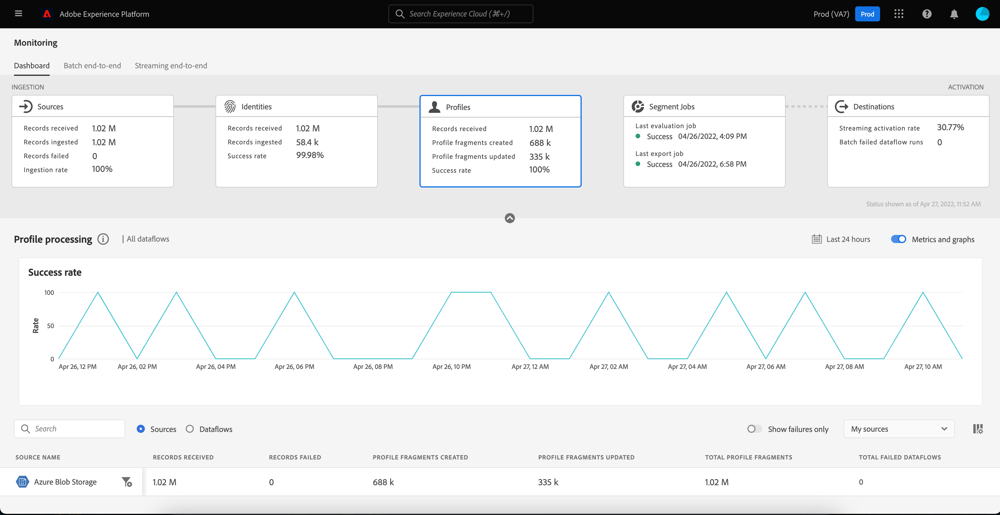

# Monitorare i flussi di dati per i profili nell’interfaccia utente

Il profilo cliente in tempo reale ti consente di visualizzare una visualizzazione olistica di ogni singolo cliente combinando dati provenienti da più canali, inclusi online, offline, CRM e di terze parti. Il profilo ti consente di consolidare i dati dei clienti in una visualizzazione unificata che offre un account utilizzabile e con marca temporale per ogni interazione con il cliente.

Il dashboard di monitoraggio fornisce una rappresentazione visiva dell’attività dei dati all’interno di Profilo, incluso lo stato dei profili dei dati. Questa esercitazione fornisce istruzioni su come utilizzare il dashboard di monitoraggio per monitorare i profili dei dati tramite l’interfaccia utente di Experience Platform, consentendo di tenere traccia dello stato dell’elaborazione del profilo.

## Introduzione {#getting-started}

Questa guida richiede una buona comprensione dei seguenti componenti di Adobe Experience Platform:

- [Flussi di dati](../home.md): I flussi di dati sono una rappresentazione dei processi di trasferimento dei dati in Platform. I flussi di dati sono configurati su diversi servizi e consentono di spostare i dati dai connettori di origine ai set di dati di destinazione, fino a [!DNL Identity] e [!DNL Profile]e a [!DNL Destinations].
   - [Corse del flusso di dati](../../sources/notifications.md): Le esecuzioni dei flussi di dati sono i processi pianificati ricorrenti in base alla configurazione della frequenza dei flussi di dati selezionati.
- [Profilo cliente in tempo reale](../../profile/home.md): Fornisce un profilo di consumatore unificato e in tempo reale basato su dati aggregati provenienti da più origini.
- [Sandbox](../../sandboxes/home.md): [!DNL Experience Platform] fornisce sandbox virtuali che suddividono un singolo [!DNL Platform] in ambienti virtuali separati per sviluppare e sviluppare applicazioni di esperienza digitale.

## Dashboard dei profili di monitoraggio {#profile-metrics}

>[!CONTEXTUALHELP]
>id="platform_monitoring_profile_processing"
>title="Elaborazione del profilo"
>abstract="La visualizzazione Elaborazione profilo contiene informazioni sui record acquisiti nel servizio Profilo, tra cui il numero di frammenti di profilo creati, i frammenti di profilo aggiornati e il numero totale di frammenti di profilo."
>text="Learn more in documentation"

>[!CONTEXTUALHELP]
>id="platform_monitoring_dataflow_run_details_profile"
>title="Dettagli dell’esecuzione del flusso di dati"
>abstract="Nella pagina dei dettagli dell’esecuzione del flusso di dati di un flusso di dati di profilo sono visualizzate ulteriori informazioni sull’esecuzione del flusso di dati, inclusi l’ID organizzazione e l’ID di esecuzione del flusso di dati."

Per accedere al **[!UICONTROL Profili]** dashboard, seleziona **[!UICONTROL Monitoraggio]** nella navigazione a sinistra. Una volta sul **[!UICONTROL Monitoraggio]** , seleziona la **[!UICONTROL Profili]** il Card.

Sul principale **[!UICONTROL Profili]** dashboard **[!UICONTROL Profili]** la scheda mostra informazioni sul numero totale di record ricevuti, sul numero di frammenti di profilo creati e aggiornati e sul tasso di successo dei frammenti di profilo creati e aggiornati.

Il dashboard stesso contiene metriche sull’elaborazione del profilo. Per impostazione predefinita, il dashboard mostra i dettagli di elaborazione del profilo per le origini dell’organizzazione nelle ultime 24 ore.

La [!UICONTROL Elaborazione del profilo] contiene informazioni sui record acquisiti in [!DNL Profile], compreso il numero di frammenti di profilo creati, i frammenti di profilo aggiornati e il numero totale di frammenti di profilo.

Per questa vista dashboard sono disponibili le metriche seguenti:

| Metrica | Descrizione |
| -------| ----------- |
| **[!UICONTROL Nome origine]** | Nome dell&#39;origine. |
| **[!UICONTROL Record ricevuti]** | Numero di record ricevuti da data lake. |
| **[!UICONTROL Record non elaborati]** | Il numero di record acquisiti, ma non in [!DNL Profile] a causa di errori. |
| **[!UICONTROL Frammenti di profilo creati]** | Numero di nuove reti [!DNL Profile] frammenti aggiunti. |
| **[!UICONTROL Frammenti di profilo aggiornati]** | Numero di [!DNL Profile] frammenti aggiornati. |
| **[!UICONTROL Frammenti di profilo totali]** | Numero totale di record scritti in [!DNL Profile], compresi tutti gli [!DNL Profile] frammenti aggiornati e nuovi [!DNL Profile] frammenti creati. |
| **[!UICONTROL Totale flussi di dati non riusciti]** | Numero di esecuzioni del flusso di dati che non sono riuscite. |

Puoi selezionare l’icona del filtro  accanto al nome dell&#39;origine per visualizzare le informazioni di elaborazione del profilo per i flussi di dati dell&#39;origine selezionata.

In alternativa, è possibile selezionare **[!UICONTROL Flussi di dati]** per visualizzare i dettagli dell’elaborazione del profilo per i flussi di dati della tua organizzazione per le ultime 24 ore.

Per questa vista dashboard sono disponibili le metriche seguenti:

| Metrica | Descrizione |
| -------| ----------- |
| **[!UICONTROL Flusso di dati]** | Nome del flusso di dati. |
| **[!UICONTROL Set di dati]** | Nome del set di dati a cui il flusso di dati sta inserendo. |
| **[!UICONTROL Nome origine]** | Nome dell&#39;origine a cui appartiene il flusso di dati. |
| **[!UICONTROL Record ricevuti**] | Numero di record ricevuti da data lake. |
| **[!UICONTROL Record non elaborati]** | Il numero di record acquisiti, ma non in [!DNL Profile] a causa di errori. |
| **[!UICONTROL Frammenti di profilo creati]** | Numero di nuove reti [!DNL Profile] frammenti aggiunti. |
| **[!UICONTROL Frammenti di profilo aggiornati]** | Numero di [!DNL Profile] frammenti aggiornati |
| **[!UICONTROL Frammenti di profilo totali]** | Numero totale di record scritti in [!DNL Profile], compresi tutti gli [!DNL Profile] frammenti aggiornati e nuovi [!DNL Profile] frammenti creati. |
| **[!UICONTROL Flussi totali non riusciti]** | Numero di esecuzioni del flusso di dati che non sono riuscite. |
| **[!UICONTROL Ultima attività]** | La marca temporale che il flusso di dati è stato eseguito l’ultima volta. |

Seleziona l’icona del filtro  accanto all&#39;ora di avvio del flusso di dati per visualizzare ulteriori informazioni sul [!DNL Profile] esecuzione del flusso di dati.

La [!UICONTROL Dettagli dell&#39;esecuzione del dataflow] visualizza ulteriori informazioni sul [!DNL Profile] esecuzione del flusso di dati, inclusi l’ID organizzazione e l’ID di esecuzione del flusso di dati. In questa pagina vengono visualizzati anche il codice di errore e il messaggio di errore corrispondenti forniti da [!DNL Profile], in caso di errori nel processo di acquisizione.

Per questa vista dashboard sono disponibili le metriche seguenti:

| Metrica | Descrizione |
| -------| ----------- |
| **[!UICONTROL Record ricevuti]** | Numero di record ricevuti da data lake. |
| **[!UICONTROL Record non elaborati]** | Il numero di record acquisiti, ma non in [!DNL Profile] a causa di errori. |
| **[!UICONTROL Frammenti di profilo creati]** | Numero di nuove reti [!DNL Profile] frammenti aggiunti. |
| **[!UICONTROL Frammenti di profilo aggiornati]** | Numero di [!DNL Profile] frammenti aggiornati. |
| **[!UICONTROL Stato]** | Definisce lo stato generale di un flusso di dati. I possibili valori di stato sono: <ul><li>`Success`: Indica che un flusso di dati è attivo e sta acquisendo i dati in base alla pianificazione fornita.</li><li>`Failed`: Indica che il processo di attivazione di un flusso di dati è stato interrotto a causa di errori. </li><li>`Processing`: Indica che il flusso di dati non è ancora attivo. Questo stato viene spesso rilevato immediatamente dopo la creazione di un nuovo flusso di dati.</li></ul> |
| **[!UICONTROL Avvio esecuzione flusso di dati]** | Data e ora di inizio dell’esecuzione del flusso di dati. |
| **[!UICONTROL Ultimo aggiornamento]** | Data e ora dell’ultimo aggiornamento del flusso di dati. |
| **[!UICONTROL Riepilogo degli errori]** | Se l’esecuzione del flusso di dati non è riuscita, viene visualizzato un codice di errore e un riepilogo del motivo per cui l’esecuzione del flusso di dati non è riuscita. |
| **[!UICONTROL ID esecuzione flusso di dati]** | ID dell&#39;esecuzione del flusso di dati. |
| **[!UICONTROL ID organizzazione IMS]** | L&#39;ID organizzazione a cui appartiene l&#39;esecuzione del flusso di dati. |

Inoltre, puoi selezionare l&#39;interruttore per visualizzare i record non riusciti o i record saltati. La sezione Errori include dettagli sul codice di errore e sul numero di record non riusciti o esclusi.
