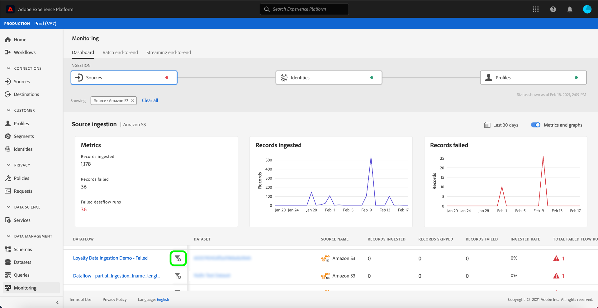

# Monitorare i flussi di dati per le sorgenti nell’interfaccia utente

>[!IMPORTANT]
>
>Sorgenti in streaming, ad esempio [Origine API HTTP](../../sources/connectors/streaming/http.md) al momento non sono supportati dal dashboard di monitoraggio. Al momento, è possibile utilizzare il dashboard solo per monitorare le origini batch.

In Adobe Experience Platform, i dati vengono acquisiti da un’ampia varietà di sorgenti, analizzati all’interno di Experience Platform, e attivati in un’ampia varietà di destinazioni. Platform facilita il processo di tracciamento di questo flusso di dati potenzialmente non lineare grazie alla trasparenza dei flussi di dati.

Il dashboard di monitoraggio fornisce una rappresentazione visiva del percorso di un flusso di dati. Puoi utilizzare una visualizzazione di monitoraggio aggregato e navigare verticalmente dal livello di origine, a un flusso di dati e a un’esecuzione di un flusso di dati, per visualizzare le metriche corrispondenti che contribuiscono al successo o al fallimento di un flusso di dati. È inoltre possibile utilizzare la capacità di monitoraggio cross-service del dashboard di monitoraggio per monitorare il percorso di un flusso di dati da un&#39;origine a [!DNL Identity Service]e a [!DNL Profile].

Questa esercitazione fornisce passaggi per monitorare il flusso di dati, utilizzando sia la visualizzazione di monitoraggio aggregato che il monitoraggio tra più servizi.

## Introduzione {#getting-started}

Questa esercitazione richiede una buona comprensione dei seguenti componenti di Adobe Experience Platform:

* [Flussi di dati](../home.md): I flussi di dati sono una rappresentazione dei processi di trasferimento dei dati in Platform. I flussi di dati sono configurati su diversi servizi e consentono di spostare i dati dai connettori di origine ai set di dati di destinazione, fino a [!DNL Identity] e [!DNL Profile]e a [!DNL Destinations].
   * [Corse del flusso di dati](../../sources/notifications.md): Le esecuzioni dei flussi di dati sono i processi pianificati ricorrenti in base alla configurazione della frequenza dei flussi di dati selezionati.
* [Origini](../../sources/home.md): L’Experience Platform consente di acquisire dati da varie sorgenti e allo stesso tempo di strutturare, etichettare e migliorare i dati in arrivo tramite i servizi Platform.
* [Servizio identità](../../identity-service/home.md): Ottieni una visione migliore dei singoli clienti e del loro comportamento attraverso il collegamento delle identità tra dispositivi e sistemi.
* [Profilo cliente in tempo reale](../../profile/home.md): Fornisce un profilo di consumatore unificato e in tempo reale basato su dati aggregati provenienti da più origini.
* [Sandbox](../../sandboxes/home.md): Experience Platform fornisce sandbox virtuali che suddividono una singola istanza di Platform in ambienti virtuali separati per sviluppare e sviluppare applicazioni di esperienza digitale.

## Vista di monitoraggio aggregato {#aggregated-monitoring-view}

>[!CONTEXTUALHELP]
>id="platform_monitoring_source_ingestion"
>title="Acquisizione sorgente"
>abstract="La visualizzazione Acquisizione origine contiene informazioni sullo stato e le metriche dell’attività dati nel servizio Data Lake, compresi i record acquisiti e i record non riusciti. Consulta la guida alla definizione delle metriche per ulteriori informazioni su metriche e grafici."
>text="Learn more in documentation"

>[!CONTEXTUALHELP]
>id="platform_monitoring_dataflow_run_details_ingestion"
>title="Dettagli dell&#39;esecuzione del dataflow"
>abstract="L&#39;elaborazione delle origini contiene informazioni sullo stato e le metriche dell&#39;attività dati nel servizio data lake, compresi i record acquisiti e i record non riusciti. Consulta la guida alla definizione delle metriche per ulteriori informazioni su metriche e grafici."
>text="Learn more in documentation"

In [Interfaccia utente della piattaforma](https://platform.adobe.com), seleziona **[!UICONTROL Monitoraggio]** dalla navigazione a sinistra per accedere al [!UICONTROL Monitoraggio] dashboard. La [!UICONTROL Monitoraggio] dashboard contiene metriche e informazioni su tutti i flussi di dati di origine, comprese informazioni sullo stato del traffico dei dati da un’origine a [!DNL Identity Service]e a [!DNL Profile].

Al centro del dashboard è [!UICONTROL Acquisizione sorgente] , che contiene metriche e grafici che visualizzano dati sui record acquisiti e record non riusciti.

Per impostazione predefinita, i dati visualizzati contengono i tassi di acquisizione delle ultime 24 ore. Seleziona **[!UICONTROL Ultime 24 ore]** per regolare l&#39;intervallo di tempo dei record visualizzati.

Viene visualizzata una finestra a comparsa del calendario che fornisce le opzioni per l’inserimento di intervalli di tempo alternativi. Seleziona **[!UICONTROL Ultimi 30 giorni]** quindi seleziona **[!UICONTROL Applica]**

I grafici sono attivati per impostazione predefinita ed è possibile disattivarli per espandere l&#39;elenco delle origini riportate di seguito. Seleziona la **[!UICONTROL Metriche e grafici]** per disattivare i grafici.

| Acquisizione sorgente | Descrizione |
| ---------------- | ----------- |
| [!UICONTROL Record acquisiti ] | Numero totale di record acquisiti. |
| [!UICONTROL Record non elaborati] | Numero totale di record che non sono stati acquisiti a causa di errori nei dati. |
| [!UICONTROL Totale flussi di dati non riusciti] | Il numero totale di flussi di dati con un `failed` stato. |

Nell’elenco di acquisizione di origine sono visualizzate tutte le origini che contengono almeno un account esistente. L’elenco include inoltre informazioni sul tasso di acquisizione di ogni origine, sul numero di record con errore e sul numero totale di flussi di dati con errore in base all’intervallo di tempo applicato.

Per ordinare l&#39;elenco delle origini, selezionare **[!UICONTROL Le mie fonti]** quindi seleziona la categoria scelta dal menu a discesa. Ad esempio, per concentrarti sugli archivi cloud, seleziona  **[!UICONTROL archiviazione cloud]**

Per visualizzare tutti i flussi di dati esistenti in tutte le origini, seleziona **[!UICONTROL Flussi di dati]**.

In alternativa, è possibile inserire una sorgente nella barra di ricerca per isolare una singola sorgente. Una volta identificata la sorgente, seleziona l’icona del filtro  accanto a per visualizzare un elenco dei relativi flussi di dati attivi.

Viene visualizzato un elenco di flussi di dati. Per restringere l’elenco e concentrarsi sui flussi di dati con errori, seleziona **[!UICONTROL Mostra solo errori]**.

Individua il flusso di dati da monitorare, quindi seleziona l’icona del filtro  accanto a esso, per visualizzare ulteriori informazioni sullo stato di esecuzione.

La pagina di esecuzione del flusso di dati visualizza informazioni sulla data di inizio dell’esecuzione del flusso di dati, sulle dimensioni dei dati, sullo stato e sulla relativa durata del tempo di elaborazione. Seleziona l’icona del filtro  accanto all’ora di avvio del flusso di dati per visualizzare i dettagli dell’esecuzione del flusso di dati.

La [!UICONTROL Dettagli dell&#39;esecuzione del dataflow] In questa pagina sono visualizzate informazioni sui metadati del flusso di dati, sullo stato di acquisizione parziale e sul riepilogo degli errori. Il riepilogo degli errori contiene lo specifico errore di livello principale che mostra in quale fase il processo di acquisizione ha rilevato un errore.

Scorri verso il basso per visualizzare informazioni più specifiche sull’errore che si è verificato.

La [!UICONTROL Errori di esecuzione del flusso di dati] Il pannello visualizza l’errore e il codice di errore specifici che hanno causato un errore di inserimento del flusso di dati. In questo scenario, si è verificato un errore di trasformazione di mappatura, con conseguente errore di 24 record.

Seleziona **[!UICONTROL File]** per ulteriori informazioni.

La [!UICONTROL File] contiene informazioni sul nome e il percorso del file.

Per una rappresentazione più granulare dell’errore, seleziona **[!UICONTROL Anteprima della diagnostica degli errori]**.

La [!UICONTROL Anteprima diagnostica errori] viene visualizzata una finestra in cui è visualizzata un&#39;anteprima di un massimo di 100 errori nel flusso di dati. È possibile selezionare **[!UICONTROL Scarica]** per recuperare un comando curl, che consente di scaricare la diagnostica dell&#39;errore.

Al termine, seleziona **[!UICONTROL Chiudi]**

Puoi usare il sistema di breadcrumb nell’intestazione superiore per tornare alla [!UICONTROL Monitoraggio] dashboard. Seleziona **[!UICONTROL Inizio esecuzione: 14/02/2021, 19:47]** per tornare alla pagina precedente, quindi seleziona **[!UICONTROL Flusso di dati: Demo di acquisizione dati fedeltà - Non riuscito]** per tornare alla pagina dei flussi di dati.

## Passaggi successivi {#next-steps}

Seguendo questa esercitazione, hai monitorato correttamente il flusso di dati di acquisizione dal livello di origine utilizzando il **[!UICONTROL Monitoraggio]** dashboard. Hai inoltre identificato con successo gli errori che hanno contribuito al fallimento dei flussi di dati durante il processo di acquisizione. Per ulteriori informazioni, consulta i seguenti documenti:

* [Monitoraggio delle identità nei flussi di dati](./monitor-identities.md)
* [Monitoraggio dei profili nei flussi di dati](./monitor-profiles.md)
