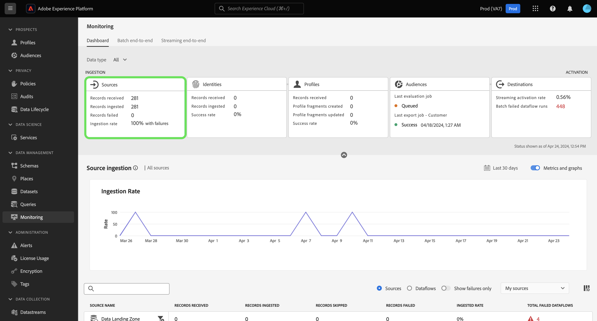

# Panoramica del dashboard di monitoraggio

Utilizza il dashboard di monitoraggio nell’interfaccia utente di Adobe Experience Platform per visualizzare il percorso dei dati dall’acquisizione all’attivazione. Con il dashboard di monitoraggio, puoi:

* Monitora il percorso dei dati da Sources (Origini), Identity Service (Servizio identità), Real-Time Customer Profile (Profilo cliente in tempo reale), Audiences (Pubblico) e infine in Destinations (Destinazioni).
* Visualizzare metriche e stati diversi a seconda della fase in cui si trovano i dati.
* Filtra la visualizzazione di monitoraggio dei dati per tipo di dati.

Il dashboard di monitoraggio supporta la visualizzazione di diversi tipi di dati:

* **Cliente e account**: i dati dei clienti si riferiscono ai dati utilizzati in [Real-time Customer Data Platform](../../rtcdp/home.md), mentre i dati dell’account si riferiscono a [dati profili account](../../rtcdp/accounts/account-profile-overview.md) accessibile quando sei abbonato a [Edizione B2B di Real-Time CDP](../../rtcdp/b2b-overview.md). Se la licenza di Real-Time CDP non include Real-Time CDP, B2B Edition, è possibile utilizzare solo il dashboard di monitoraggio per monitorare i dati dei clienti.
* **Potenziale cliente**: [Profili potenziali](../../profile/ui/prospect-profile.md) sono utilizzati per rappresentare persone che non hanno ancora contattato l’azienda ma a cui desideri rivolgerti. Con i profili di potenziali clienti, puoi integrare i profili dei clienti con attributi di partner di terze parti affidabili. Devi ottenere la licenza con Real-Time CDP (App Service), Adobe Experience Platform Activation, Real-Time CDP, Real-Time CDP Prime, Real-Time CDP Ultimate per visualizzare il tipo di dati del potenziale cliente.
* **Arricchimento del profilo account**: i profili account ti consentono di unificare le informazioni sull’account da più origini. Devi ottenere la licenza per Real-Time CDP, edizione B2B per monitorare i dati di arricchimento del profilo dell’account.

Leggi questo documento per scoprire come utilizzare il dashboard di monitoraggio per monitorare il percorso dei tuoi dati tra i diversi servizi Experienci Platform.

## Introduzione

Questo documento richiede una buona conoscenza dei seguenti elementi di Experience Platform:

* [Flussi dati](../home.md): i flussi di dati sono rappresentazioni dei processi di dati che spostano i dati in Experienci Platform. Puoi utilizzare l’area di lavoro origini per creare flussi di dati che acquisiscono dati da una determinata origine a Experienci Platform.
* [Sorgenti](../../sources/home.md): utilizza le origini in Experienci Platform per acquisire i dati da un’applicazione Adobe o da un’origine dati di terze parti.
* [Servizio identità](../../identity-service/home.md): ottieni una visione migliore dei singoli clienti e del loro comportamento collegando le identità tra dispositivi e sistemi.
* [Profilo cliente in tempo reale](../../profile/home.md): fornisce un profilo consumer unificato e in tempo reale basato su dati aggregati provenienti da più origini.
* [Segmentazione](../../segmentation/home.md): utilizza il servizio di segmentazione per creare segmenti e tipi di pubblico dai dati dei profili cliente in tempo reale.
* [Destinazioni](../../destinations/home.md): le destinazioni sono integrazioni predefinite con applicazioni di uso comune che consentono l’attivazione diretta dei dati da Platform per campagne di marketing cross-channel, campagne e-mail, pubblicità mirata e molti altri casi d’uso.

## Guida al dashboard di monitoraggio

Nell’interfaccia utente di Experienci Platform, seleziona **[!UICONTROL Monitorare]** in [!UICONTROL Gestione dati] nel menu di navigazione a sinistra.

Seleziona **[!UICONTROL Tipo di dati]** quindi utilizza il menu a discesa per selezionare il tipo di dati che desideri visualizzare. I tipi di dati sono definiti dalle classi dello schema Experience Data Model (XDM) per garantire che i loro dati seguano un formato standard quando vengono acquisiti in Experienci Platform. Per ulteriori informazioni, consulta la seguente documentazione:

* [Tipo di dati dell’account B2B](../../rtcdp/b2b-tutorial.md)
* [Tipo di dati del potenziale cliente](../../rtcdp/partner-data/prospecting.md)

Puoi filtrare la vista in base ai seguenti tipi di dati:

>[!BEGINTABS]

>[!TAB Tutti]

Seleziona **[!UICONTROL Tutti]** per aggiornare la dashboard e visualizzare le metriche su tutti i dati acquisiti per l’Experience Platform nel corso di un determinato periodo.

>[!TAB Cliente e account]

Seleziona **[!UICONTROL Cliente e account]** per aggiornare la dashboard e visualizzare le metriche sui dati del cliente e dell’account acquisiti per l’Experience Platform nel corso di un dato periodo.

>[!TAB Potenziale cliente]

Seleziona **[!UICONTROL Potenziale cliente]** per aggiornare la dashboard e visualizzare le metriche sui dati di ricerca di potenziali clienti acquisiti in Experienci Platform nel corso di un dato periodo. **Nota**: puoi visualizzare le attività relative ai tipi di dati prospect solo se sei [autorizzati a ricevere dati prospect](../../rtcdp/partner-data/prospecting.md).

>[!TAB Arricchimento del profilo account]

Seleziona **[!UICONTROL Arricchimento del profilo account]** per aggiornare la dashboard e visualizzare le metriche sui dati di arricchimento del profilo. **Nota**: puoi visualizzare le metriche di arricchimento del profilo dell’account solo se disponi dei diritti necessari [Dati B2B](../../rtcdp/b2b-tutorial.md).

>[!ENDTABS]

Utilizza l’intestazione superiore della dashboard per un’esperienza di monitoraggio cross-service. Puoi filtrare le metriche e i grafici selezionando la scheda delle funzioni desiderata dall’intestazione della categoria di dati.

>[!BEGINTABS]

>[!TAB Origini]

Seleziona **[!UICONTROL Sorgenti]** per visualizzare le metriche sul tasso di acquisizione delle origini. Leggi la guida su [monitoraggio dei dati delle origini](monitor-sources.md) per ulteriori informazioni.

>[!TAB Identità]

Seleziona **[!UICONTROL Identità]** per visualizzare la percentuale di elaborazione riuscita dei dati di identità. Leggi la guida su [monitoraggio dei dati di identità](monitor-identities.md) per ulteriori informazioni.

>[!TAB Profili]

Seleziona **[!UICONTROL Profili]** per visualizzare il tasso di successo dell’elaborazione dei dati del profilo. Leggi la guida su [monitoraggio dei dati del profilo](monitor-profiles.md) per ulteriori informazioni.

>[!TAB Tipi di pubblico]

Seleziona **[!UICONTROL Tipi di pubblico]** per visualizzare le metriche sui tipi di pubblico e i processi di segmentazione. Leggi la guida su [monitoraggio dei dati sul pubblico](monitor-segments.md) per ulteriori informazioni.

>[!TAB Destinazioni]

Seleziona **[!UICONTROL Destinazioni]** per visualizzare le metriche sul [!UICONTROL Velocità di attivazione in streaming] e [!UICONTROL Flusso di dati batch non riuscito]. Leggi la guida su [monitoraggio dei dati delle destinazioni](monitor-destinations.md) per ulteriori informazioni.

>[!ENDTABS]

### Configurare l’intervallo di tempo del monitoraggio {#configure-monitoring-time-frame}

Per impostazione predefinita, il dashboard di monitoraggio visualizza le metriche sui dati acquisiti nelle ultime 24 ore. Per aggiornare l’intervallo di tempo, seleziona **[!UICONTROL Ultime 24 ore]**.

Puoi configurare un nuovo intervallo di tempo per la visualizzazione di monitoraggio dei dati nella finestra di dialogo visualizzata. Puoi creare un intervallo di tempo personalizzato o selezionare dall’elenco di opzioni preconfigurate:

* [!UICONTROL Ultime 24 ore]
* [!UICONTROL Ultimi 7 giorni]
* [!UICONTROL Ultimi 30 giorni]

Al termine, seleziona **[!UICONTROL Applica]**.

## Passaggi successivi

Una volta letto questo documento, potrai spostarti all’interno del dashboard di monitoraggio nell’interfaccia utente. Per informazioni su come monitorare i dati per un servizio di Experience Platform specifico, consulta la documentazione seguente:

* [Monitorare i dati delle origini](monitor-sources.md).
* [Monitorare i dati di identità](monitor-identities.md).
* [Monitorare i dati del profilo](monitor-profiles.md).
* [Monitorare i dati sul pubblico](monitor-segments.md).
* [Monitorare i dati delle destinazioni](monitor-destinations.md).