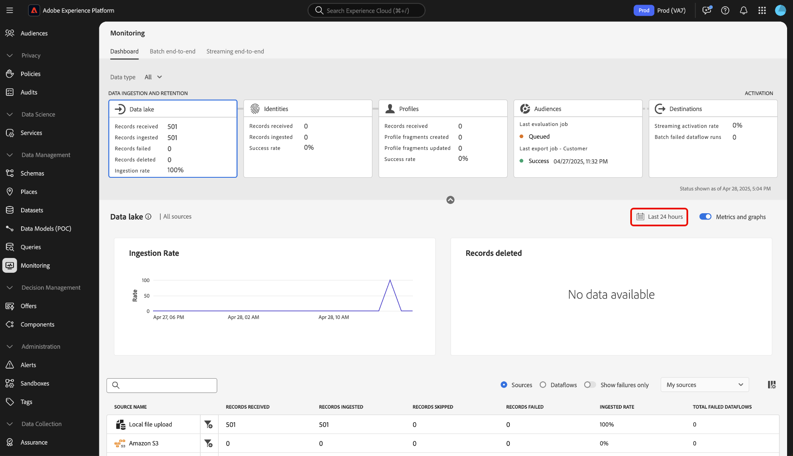

# Panoramica del dashboard di monitoraggio

Utilizza il dashboard di monitoraggio nell’interfaccia utente di Adobe Experience Platform per visualizzare il percorso dei dati dall’acquisizione all’attivazione. Con il dashboard di monitoraggio, puoi:

* Monitora il percorso dei dati da Sources (Origini), Identity Service (Servizio identità), Real-Time Customer Profile (Profilo cliente in tempo reale), Audiences (Pubblico) e infine in Destinations (Destinazioni).
* Visualizzare metriche e stati diversi a seconda della fase in cui si trovano i dati.
* Filtra la visualizzazione di monitoraggio dei dati per tipo di dati.

Il dashboard di monitoraggio supporta la visualizzazione di diversi tipi di dati:

* **Cliente e account**: i dati del cliente si riferiscono ai dati utilizzati in [Real-time Customer Data Platform](../../rtcdp/home.md), mentre i dati dell&#39;account si riferiscono ai [dati dei profili dell&#39;account](../../rtcdp/accounts/account-profile-overview.md) che sono accessibili quando si è abbonati a [Real-Time CDP, B2B Edition](../../rtcdp/b2b-overview.md). Se la licenza di Real-Time CDP non include Real-Time CDP, B2B Edition, è possibile utilizzare solo il dashboard di monitoraggio per monitorare i dati dei clienti.
* **Prospect**: [I profili prospect](../../profile/ui/prospect-profile.md) sono utilizzati per rappresentare persone che non hanno ancora contattato la società ma a cui si desidera rivolgersi. Con i profili di potenziali clienti, puoi integrare i profili dei clienti con attributi di partner di terze parti affidabili. Devi ottenere la licenza con Real-Time CDP (App Service), Adobe Experience Platform Activation, Real-Time CDP, Real-Time CDP Prime, Real-Time CDP Ultimate per visualizzare il tipo di dati del potenziale cliente.
* **Arricchimento del profilo dell&#39;account**: i profili dell&#39;account consentono di unificare le informazioni dell&#39;account da più origini. Devi ottenere la licenza per Real-Time CDP, edizione B2B per monitorare i dati di arricchimento del profilo dell’account.

Leggi questo documento per scoprire come utilizzare il dashboard di monitoraggio per monitorare il percorso dei tuoi dati tra i diversi servizi Experience Platform.

## Introduzione

Questo documento richiede una buona conoscenza dei seguenti elementi di Experience Platform:

* [Flussi dati](../home.md): i flussi dati sono rappresentazioni di processi di dati che spostano i dati in Experience Platform. Puoi utilizzare l’area di lavoro origini per creare flussi di dati che acquisiscono dati da una determinata origine a Experience Platform.
* [Origini](../../sources/home.md): utilizza le origini in Experience Platform per acquisire dati da un&#39;applicazione Adobe o da un&#39;origine dati di terze parti.
* [Identity Service](../../identity-service/home.md): ottieni una migliore visione dei singoli clienti e del loro comportamento collegando le identità tra dispositivi e sistemi.
* [Profilo cliente in tempo reale](../../profile/home.md): fornisce un profilo consumatore unificato in tempo reale basato su dati aggregati provenienti da più origini.
* [Segmentazione](../../segmentation/home.md): utilizza il servizio di segmentazione per creare segmenti e tipi di pubblico dai dati del profilo cliente in tempo reale.
* [Destinazioni](../../destinations/home.md): le destinazioni sono integrazioni predefinite con applicazioni di uso comune che consentono l&#39;attivazione diretta dei dati da Platform per campagne di marketing cross-channel, campagne e-mail, pubblicità mirata e molti altri casi d&#39;uso.

## Guida al dashboard di monitoraggio

Nell&#39;interfaccia utente di Experience Platform, seleziona **[!UICONTROL Monitoraggio]** in [!UICONTROL Gestione dati] nel menu di navigazione a sinistra.

Selezionare **[!UICONTROL Tipo di dati]**, quindi utilizzare il menu a discesa per selezionare il tipo di dati che si desidera visualizzare. I tipi di dati sono definiti dalle classi dello schema Experience Data Model (XDM) per garantire che i loro dati seguano un formato standard quando vengono acquisiti in Experience Platform. Per ulteriori informazioni, consulta la seguente documentazione:

* [Tipo di dati dell’account B2B](../../rtcdp/b2b-tutorial.md)
* [Tipo di dati del potenziale cliente](../../rtcdp/partner-data/prospecting.md)

Puoi filtrare la vista in base ai seguenti tipi di dati:

>[!BEGINTABS]

>[!TAB Tutti]

Seleziona **[!UICONTROL Tutti]** per aggiornare il dashboard e visualizzare le metriche su tutti i dati acquisiti per l&#39;Experience Platform nel corso di un determinato periodo.

>[!TAB Cliente e account]

Seleziona **[!UICONTROL Cliente e account]** per aggiornare la dashboard e visualizzare le metriche sui dati del cliente e dell&#39;account acquisiti per l&#39;Experience Platform nel corso di un determinato periodo.

>[!TAB Potenziale]

Seleziona **[!UICONTROL Prospect]** per aggiornare la dashboard e visualizzare le metriche sui dati di ricerca di potenziali clienti acquisiti per l&#39;Experience Platform nel corso di un determinato periodo. **Nota**: è possibile visualizzare le attività dei tipi di dati prospect solo se si dispone di [diritti per i dati prospect](../../rtcdp/partner-data/prospecting.md).

>[!TAB Arricchimento del profilo account]

Seleziona **[!UICONTROL Arricchimento profilo account]** per aggiornare il dashboard e visualizzare le metriche nei dati di arricchimento profilo. **Nota**: è possibile visualizzare le metriche di arricchimento del profilo account solo se si dispone dei diritti per [dati B2B](../../rtcdp/b2b-tutorial.md).

>[!ENDTABS]

Utilizza l’intestazione superiore della dashboard per un’esperienza di monitoraggio cross-service. Puoi filtrare le metriche e i grafici selezionando la scheda delle funzioni desiderata dall’intestazione della categoria di dati.

>[!BEGINTABS]

>[!TAB Origini]

Seleziona **[!UICONTROL Origini]** per visualizzare le metriche sul tasso di acquisizione delle origini. Per ulteriori informazioni, consulta la guida su [monitoraggio dei dati delle origini](monitor-sources.md).

>[!TAB Identità]

Seleziona **[!UICONTROL Identità]** per visualizzare il tasso di successo dell&#39;elaborazione dei dati di identità. Per ulteriori informazioni, consulta la guida su [dati identità di monitoraggio](monitor-identities.md).

>[!TAB Profili]

Seleziona **[!UICONTROL Profili]** per visualizzare il tasso di successo dell&#39;elaborazione dei dati del profilo. Per ulteriori informazioni, consulta la guida su [dati del profilo di monitoraggio](monitor-profiles.md).

>[!TAB Tipi di pubblico]

Seleziona **[!UICONTROL Tipi di pubblico]** per visualizzare le metriche sui tipi di pubblico e sui processi di segmentazione. Per ulteriori informazioni, consulta la guida su [monitoraggio dei dati sul pubblico](monitor-audiences.md).

>[!TAB Destinazioni]

Seleziona **[!UICONTROL Destinazioni]** per visualizzare le metriche sulla [!UICONTROL frequenza di attivazione streaming] e sulle [!UICONTROL esecuzioni del flusso di dati per batch non riuscito]. Per ulteriori informazioni, consulta la guida sui [dati sulle destinazioni di monitoraggio](monitor-destinations.md).

>[!ENDTABS]

### Configurare l’intervallo di tempo del monitoraggio {#configure-monitoring-time-frame}

Per impostazione predefinita, il dashboard di monitoraggio visualizza le metriche sui dati acquisiti nelle ultime 24 ore. Per aggiornare l&#39;intervallo di tempo, selezionare **[!UICONTROL Ultime 24 ore]**.

Puoi configurare un nuovo intervallo di tempo per la visualizzazione di monitoraggio dei dati nella finestra di dialogo visualizzata. Puoi creare un intervallo di tempo personalizzato o selezionare dall’elenco di opzioni preconfigurate:

* [!UICONTROL Ultime 24 ore]
* [!UICONTROL Ultimi 7 giorni]
* [!UICONTROL Ultimi 30 giorni]

Al termine, selezionare **[!UICONTROL Applica]**.

## Passaggi successivi

Una volta letto questo documento, potrai spostarti all’interno del dashboard di monitoraggio nell’interfaccia utente. Per informazioni su come monitorare i dati per un servizio di Experience Platform specifico, consulta la documentazione seguente:

* [Monitorare i dati di origine](monitor-sources.md).
* [Monitora dati identità](monitor-identities.md).
* [Monitorare i dati del profilo](monitor-profiles.md).
* [Monitorare i dati del pubblico](monitor-audiences.md).
* [Monitorare i dati delle destinazioni](monitor-destinations.md).
