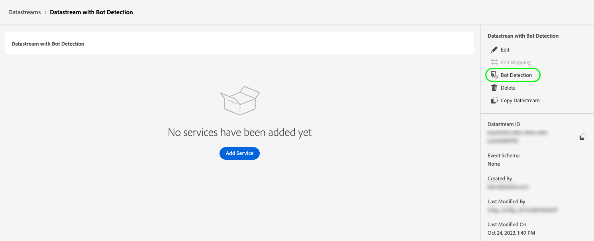

# Configurare il rilevamento di bot per gli stream di dati

Il traffico proveniente da entità non umane, come programmi automatizzati, web scraper, ragni, scanner scriptati, può rendere più difficile identificare gli eventi che si verificano dai visitatori umani. Questo tipo di traffico può influenzare negativamente importanti metriche aziendali, portando a rapporti di traffico errati.

Il rilevamento dei bot consente di identificare gli eventi generati da [Web SDK](../web-sdk/home.md), [Mobile SDK](https://developer.adobe.com/client-sdks/home/) e [[!DNL Server API]](../server-api/overview.md) come generati da spider e bot noti.

Configurando il rilevamento di bot per gli stream di dati, puoi identificare indirizzi IP, intervalli IP e intestazioni di richiesta specifici che desideri classificare come eventi bot.

L’identificazione del traffico da bot può fornire una misurazione più accurata dell’attività degli utenti sul sito o sull’app mobile.

Quando una richiesta all’Edge Network corrisponde a una qualsiasi delle regole di rilevamento di bot, lo schema XDM viene aggiornato con un punteggio bot (sempre impostato su 1), come mostrato di seguito.

```json
{
  "botDetection": {
    "score": 1
  }
}
```

Questo punteggio bot consente alle soluzioni che ricevono la richiesta di identificare correttamente il traffico da bot.

>[!IMPORTANT]
>
>Il rilevamento dei bot non elimina alcuna richiesta di bot. Aggiorna lo schema XDM solo con il punteggio bot e inoltra l&#39;evento al servizio [datastream](configure.md) configurato.
>
>Le soluzioni di Adobe possono gestire il punteggio bot in diversi modi. Adobe Analytics, ad esempio, utilizza il proprio [servizio di filtro bot](https://experienceleague.adobe.com/docs/analytics/admin/admin-tools/manage-report-suites/edit-report-suite/report-suite-general/bot-removal/bot-rules.html) e non utilizza il punteggio impostato dall&#39;Edge Network. I due servizi utilizzano lo stesso [elenco di bot IAB](https://www.iab.com/guidelines/iab-abc-international-spiders-bots-list/), pertanto il punteggio bot è identico.

Dopo la creazione, le regole di rilevamento dei bot possono richiedere fino a 15 minuti per propagarsi nell’Edge Network.

## Prerequisiti {#prerequisites}

Affinché il rilevamento bot funzioni sullo stream di dati, devi aggiungere il gruppo di campi **[!UICONTROL Informazioni sul rilevamento bot]** allo schema. Per informazioni su come aggiungere gruppi di campi a uno schema, consulta la documentazione dello schema [XDM](../xdm/ui/resources/schemas.md#add-field-groups).

## Configurare il rilevamento di bot per gli stream di dati {#configure}

Puoi configurare il rilevamento di bot dopo aver creato una configurazione dello stream di dati. Consulta la documentazione su come [creare e configurare uno stream di dati](configure.md), quindi segui le istruzioni riportate di seguito per aggiungere funzionalità di rilevamento bot allo stream di dati.

Vai all’elenco dei flussi di dati e seleziona il flusso di dati a cui desideri aggiungere il rilevamento di bot.


Nella pagina dei dettagli dello stream di dati, seleziona l&#39;opzione **[!UICONTROL Rilevamento bot]** nella barra a destra.



Viene visualizzata la pagina **[!UICONTROL Regole di rilevamento bot]**.


Dalla pagina Regole di rilevamento bot, puoi configurare il rilevamento bot utilizzando le seguenti funzionalità:

* Utilizzo di [!DNL [IAB/ABC International Spiders and Bots List]](https://www.iab.com/guidelines/iab-abc-international-spiders-bots-list/).
* Creazione di regole di rilevamento bot personalizzate.

### Utilizzare l&#39;elenco internazionale Spiders e bot IAB/ABC {#iab-list}

L&#39;[elenco internazionale Spider e bot IAB/ABC](https://www.iab.com/guidelines/iab-abc-international-spiders-bots-list/) è un elenco di terze parti standard di settore di spider e bot Internet che consente di identificare il traffico automatizzato, ad esempio i crawler dei motori di ricerca, gli strumenti di monitoraggio e altro traffico non umano che non si desidera visualizzare nei conteggi di analisi.

Per configurare lo stream di dati per l&#39;utilizzo di [!DNL IAB/ABC International Spiders and Bots List], attiva l&#39;opzione **[!UICONTROL Usa elenco Spider e bot internazionali IAB/ABC per il rilevamento di bot in questo stream di dati]**, quindi seleziona Salva per applicare le impostazioni di rilevamento di bot allo stream di dati.


### Creare regole di rilevamento bot {#rules}

Oltre a utilizzare l&#39;[elenco internazionale Spider e bot IAB/ABC](https://www.iab.com/guidelines/iab-abc-international-spiders-bots-list/), puoi definire le tue regole di rilevamento bot per ogni flusso di dati.

Puoi creare regole di rilevamento bot in base a **indirizzi IP** e **intervalli di indirizzi IP**.

Se hai bisogno di regole di rilevamento bot più granulari, puoi combinare le condizioni IP con le condizioni dell’intestazione della richiesta. Le regole di rilevamento dei bot possono utilizzare le intestazioni seguenti:

| Intestazione HTTP | Descrizione |
| --- | --- |
| `user-agent` | Intestazione che consente ai server e ai peer di rete di identificare l&#39;applicazione, il sistema operativo, il fornitore e/o la versione dell&#39;agente utente richiedente. |
| `content-type` | Indica il tipo di file multimediale originale della risorsa (prima di qualsiasi codifica di contenuto applicata per l’invio). |
| `referer` | Identifica l’indirizzo della pagina web da cui è stata richiesta la risorsa. |
| `sec-ch-ua` | Fornisce il brand e la versione significativa per ogni brand associato al browser in un elenco separato da virgole. |
| `sec-ch-ua-mobile` | Indica se il browser si trova su un dispositivo mobile. Può essere utilizzato anche da un browser desktop per indicare una preferenza per un’esperienza di utilizzo mobile. |
| `sec-ch-ua-platform` | Fornisce la piattaforma o il sistema operativo su cui è in esecuzione l&#39;agente utente. Ad esempio: &quot;Windows&quot; o &quot;Android&quot;. |
| `sec-ch-ua-platform-version` | Fornisce la versione del sistema operativo in cui è in esecuzione l&#39;agente utente. |
| `sec-ch-ua-arch` | Fornisce l&#39;architettura CPU sottostante dell&#39;agente utente, ad esempio ARM o x86. |
| `sec-ch-ua-model` | Indica il modello di dispositivo su cui è in esecuzione il browser. |
| `sec-ch-ua-bitness` | Fornisce il &quot;bit&quot; dell’architettura CPU sottostante dell’agente utente. Dimensione in bit di un numero intero o di un indirizzo di memoria, in genere 64 o 32 bit. |
| `sec-ch-ua-wow64` | Indica se un file binario dell&#39;agente utente è in esecuzione in modalità a 32 bit in Windows a 64 bit. |

Per creare una regola di rilevamento bot, effettua le seguenti operazioni:

1. Seleziona **[!UICONTROL Aggiungi nuova regola]**.

   

2. Digitare un nome per la regola nel campo **[!UICONTROL Nome regola]**.

   

3. Selezionare **[!UICONTROL Aggiungi nuova condizione IP]** per aggiungere una nuova regola basata su IP. È possibile definire la regola in base all’indirizzo IP o all’intervallo di indirizzi IP.

   

   

   >[!TIP]
   >
   >Le condizioni IP si basano su un&#39;operazione logica `OR`. Una richiesta è contrassegnata come proveniente da un bot se corrisponde a una qualsiasi delle condizioni IP definite.

4. Se si desidera aggiungere condizioni di intestazione alla regola, selezionare **[!UICONTROL Aggiungi gruppo di condizioni di intestazione]**, quindi selezionare le intestazioni da utilizzare per la regola.

   

   Quindi, aggiungi le condizioni da utilizzare per l’intestazione selezionata.

   

5. Dopo aver configurato le regole di rilevamento bot desiderate, seleziona **[!UICONTROL Salva]** per applicare le regole allo stream di dati.

   


## Esempi di regole di rilevamento bot {#examples}

Per aiutarti a iniziare a rilevare i bot, puoi utilizzare gli esempi dettagliati di seguito per creare le regole di rilevamento dei bot.

### Rilevamento bot basato su un indirizzo IP {#one-ip}

Per contrassegnare tutte le richieste provenienti da un indirizzo IP specifico come traffico da bot, crea una nuova regola di rilevamento bot che valuti un singolo indirizzo IP, come illustrato nell’immagine seguente.


### Rilevamento dei bot basato su due indirizzi IP {#two-ip}

Per contrassegnare tutte le richieste provenienti da uno di due indirizzi IP specifici come traffico da bot, crea una nuova regola di rilevamento bot che valuta due indirizzi IP, come illustrato nell’immagine seguente.


### Rilevamento di bot basato su un intervallo di indirizzi IP {#range}

Per contrassegnare tutte le richieste provenienti da qualsiasi indirizzo IP in un intervallo specifico come traffico da bot, crea una nuova regola di rilevamento bot che valuti un intero intervallo di indirizzi IP, come illustrato nell’immagine seguente.


### Rilevamento di bot basato su un indirizzo IP e un’intestazione di richiesta {#ip-header}

Per contrassegnare come traffico bot tutte le richieste provenienti da un indirizzo IP specifico e contenenti un’intestazione di richiesta specifica, crea una nuova regola di rilevamento bot, come illustrato nell’immagine seguente.

Questa regola controlla se la richiesta proviene da un indirizzo IP specifico e se l&#39;intestazione della richiesta `referer` inizia con `www.adobe.com`.


### Rilevamento dei bot in base a più condizioni {#multiple-conditions}

Puoi creare regole di rilevamento bot in base a:

* **Condizioni diverse multiple**: condizioni diverse vengono valutate come un&#39;operazione logica `AND`, il che significa che le condizioni devono essere soddisfatte simultaneamente affinché la richiesta possa essere identificata come proveniente da un bot.
* **Condizioni multiple dello stesso tipo**: le condizioni dello stesso tipo vengono valutate come un&#39;operazione `OR` logica, il che significa che se una qualsiasi delle condizioni viene soddisfatta, la richiesta viene identificata come proveniente da un bot.

La regola mostrata nell’immagine seguente identifica una richiesta di origine da bot se sono soddisfatte le seguenti condizioni:

La richiesta proviene da uno dei due indirizzi IP, l&#39;intestazione `referer` inizia con `www.adobe.com` e l&#39;intestazione `sec-ch-ua-mobile` identifica la richiesta come proveniente da un browser desktop.


