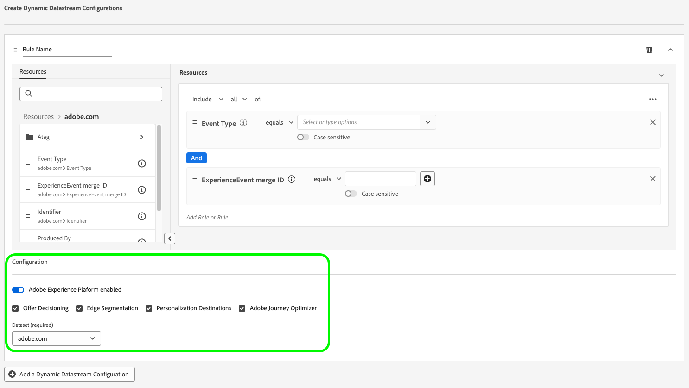

# Creare configurazioni di flussi di dati dinamici

>[!AVAILABILITY]
>
>* L’opzione per definire configurazioni di stream di dati dinamici è attualmente in Beta e disponibile per un numero limitato di clienti. Per ricevere l’accesso a questa funzionalità, contatta il rappresentante Adobe. La documentazione e le funzionalità sono soggette a modifiche.

Per impostazione predefinita, l&#39;Edge Network di Experience Platform invia tutti gli eventi che raggiungono uno stream di dati a tutti i [servizi](configure.md#add-services) di Experience Cloud che hai abilitato per gli stream di dati. Questo potrebbe non essere sempre il flusso di lavoro ideale per te, a seconda dei casi d’uso.

Le configurazioni dello stream di dati dinamici risolvono questo problema attraverso set di regole configurabili dall’utente che puoi definire per ogni servizio abilitato per lo stream di dati e che determinano quale soluzione Experience Cloud deve ricevere ogni tipo di dati.

## Prerequisiti {#prerequisites}

Per creare una configurazione dinamica per lo stream di dati, è necessario soddisfare due condizioni:

* Devi avere creato *almeno* uno stream di dati con cui lavorare. Per informazioni dettagliate, consulta la documentazione su come [creare uno stream di dati](configure.md).
* È necessario avere *almeno* un servizio Experience Cloud aggiunto allo stream di dati. Per informazioni dettagliate, consulta la documentazione su come [aggiungere un servizio](configure.md#add-services) a uno stream di dati.

Dopo aver creato uno stream di dati e aggiunto un servizio Experience Cloud, puoi [creare una configurazione dinamica](#create-dynamic-configuration).

## Guardrail {#guardrails}

Le configurazioni dello stream di dati dinamici hanno limiti e vincoli di prestazioni specifici per garantire prestazioni di sistema ed efficienza di elaborazione dei dati ottimali. Durante la configurazione delle regole dello stream di dati dinamici si applicano i seguenti guardrail:

| Guardrail | Limite | Tipo di limite |
|---------|------------|------|
| Numero massimo di configurazioni dello stream di dati dinamici per stream di dati per i servizi Experience Platform | 5 | Guardrail delle prestazioni |
| Numero massimo di configurazioni dello stream di dati dinamici per stream di dati per l’inoltro di eventi | 5 | Guardrail delle prestazioni |
| Numero massimo di configurazioni dello stream di dati dinamici per stream di dati per Adobe Analytics | 5 | Guardrail delle prestazioni |
| Numero massimo di configurazioni dello stream di dati dinamici per stream di dati per Adobe Target | 5 | Guardrail delle prestazioni |
| Numero massimo di configurazioni dello stream di dati dinamici per stream di dati per Adobe Audience Manager | 5 | Guardrail delle prestazioni |
| Numero massimo di condizioni (predicati) che è possibile combinare all’interno di una singola regola | 100 | Guardrail delle prestazioni |
| Tempo massimo consentito per valutare tutte le configurazioni dello stream di dati dinamici per stream di dati prima del timeout | 25 ms | Guarddrail imposto dal sistema |

## Configurazioni dello stream di dati dinamici e sostituzioni della configurazione dello stream di dati {#dynamic-versus-overrides}

Le configurazioni dello stream di dati dinamici e le [sostituzioni della configurazione dello stream di dati](overrides.md) si escludono a vicenda.

Ciò significa che non è possibile utilizzare configurazioni dello stream di dati dinamiche insieme alle sostituzioni della configurazione dello stream di dati. Devi scegliere l&#39;uno o l&#39;altro.

Se abiliti sia le configurazioni dello stream di dati dinamici che le sostituzioni della configurazione dello stream di dati, le sostituzioni della configurazione avranno la precedenza e le regole di configurazione dello stream di dati dinamici verranno ignorate.

## Creare una configurazione dello stream di dati dinamico {#create-dynamic-configuration}

Dopo che hai [creato uno stream di dati](configure.md) e [aggiunto un servizio](configure.md#add-services), segui i passaggi seguenti per aggiungere una configurazione dinamica al servizio.

1. Vai alla pagina **[!UICONTROL Raccolta dati]** > **[!UICONTROL Flussi di dati]** e seleziona lo stream di dati creato.

   

1. Selezionare l&#39;opzione **[!UICONTROL Modifica]** nel servizio per il quale si desidera definire una configurazione dinamica.

   

1. Nella pagina **[!UICONTROL Configura]**, selezionare **[!UICONTROL Salva e modifica configurazione dinamica]**.

   

1. Selezionare **[!UICONTROL Aggiungi configurazione dinamica]**.

   

1. Dal pannello **[!UICONTROL Risorse]**, trascina e rilascia gli elementi con cui desideri creare la regola sul lato destro della finestra. Puoi combinare più risorse per creare regole complesse.

   Utilizza le opzioni di ogni risorsa, ad esempio **[!UICONTROL è uguale a]**, **[!UICONTROL è diverso da]**, **[!UICONTROL esiste]** e altro per ottimizzare le regole.

   

1. Nella sezione **[!UICONTROL Configurazione]**, attiva/disattiva i servizi che desideri abilitare o disabilitare per ogni regola, a seconda che si desideri che i dati vengano inviati a ogni servizio. Se si disattiva l&#39;interruttore, il routing del servizio è disabilitato e *nessun dato* verrà inviato al servizio upstream.

   

1. Al termine della configurazione delle regole, seleziona **[!UICONTROL Salva]**.

## Considerazioni sulla priorità delle regole {#considerations}

Puoi definire più regole per ogni configurazione dello stream di dati dinamico. Tuttavia, se i dati corrispondono alle condizioni di più regole, viene presa in considerazione solo la prima regola corrispondente nell’elenco e tutte le altre regole corrispondenti vengono ignorate.

Per ottenere il comportamento di indirizzamento dei dati desiderato, presta attenzione all’ordine in cui disponi le regole.

Per configurare l&#39;ordine delle regole, è possibile trascinare e rilasciare le finestre delle regole nell&#39;ordine desiderato.

## Criteri di idoneità delle regole {#eligibility-criteria}

Le configurazioni dello stream di dati dinamici devono soddisfare criteri di idoneità specifici per garantire prestazioni, manutenibilità e chiarezza elevate. Di seguito sono riportati i requisiti principali e le best practice per la definizione delle regole.

### Tipi di dati supportati {#supported-data-types}

Le regole di configurazione dello stream di dati dinamici funzionano con tipi di dati specifici per garantire prestazioni ottimali e un routing dei dati affidabile. Sapere quali tipi di dati sono supportati consente di creare regole efficaci per elaborare i dati in modo efficiente.

| Tipo di dati | Stato | Note |
|-----------|--------|-------|
| Stringa | Consentito | - |
| Numero (intero, lungo, breve, byte) | Consentito | - |
| Enumerazione | Consentito | - |
| Booleano | Consentito | - |
| Data | Consentito | - |
| Array | Non consentito | Le regole basate su array non sono supportate, in quanto possono compromettere le prestazioni. |
| Mappa | Non consentito | Le regole basate sulle mappe non sono supportate, in quanto possono compromettere le prestazioni. |

### Operatori supportati {#supported-operators}

Le regole possono utilizzare i seguenti operatori, a seconda del tipo di dati:

| Tipo di dati | Operatori supportati |
|-----------|-------------------|
| **Stringa** | `equals`, `starts with`, `ends with`, `contains`, `exists`, `does not equal`, `does not start with`, `does not end with`, `does not contain`, `does not exist` |
| **Numero (Lungo, Intero, Breve, Byte)** | `equals`, `does not equal`, `greater than`, `less than`, `greater than or equal to`, `less than or equal to`, `exists`, `does not exist` |
| **Booleano** | `equals true/false`, `does not equal true/false` |
| **Enum** | `equals`, `does not equal`, `exists`, `does not exist` |
| **Data** | `today`, `yesterday`, `this month`, `this year`, `custom date`, `in last`, `from`, `during`, `within`, `before`, `after`, `rolling range`, `in next`, `exists`, `does not exist` |
| **Logico** | `INCLUDE`, `ANY/ALL` (equivalente a AND/OR) |

>[!NOTE]
>
>L&#39;operatore **[!UICONTROL EXCLUDE]** non è supportato direttamente, ma è possibile ottenere una logica equivalente utilizzando **[!UICONTROL INCLUDE]** con operatori di confronto negati (ad esempio, &quot;non è uguale a&quot;).

### Struttura delle regole {#rule-structure}

Durante la creazione di regole per le configurazioni di flussi di dati dinamici, è importante comprendere i requisiti strutturali che garantiscono prestazioni e compatibilità del sistema ottimali. La struttura delle regole influisce direttamente sull’efficienza con cui i dati vengono elaborati e instradati attraverso il sistema.

**Utilizza solo espressioni flat**. È necessario definire le regole come espressioni logiche semplici. Le espressioni logiche nidificate (che utilizzano contenitori o più livelli di AND/OR) non sono supportate. Se hai bisogno di una logica complessa, suddividila in più regole semplici.

Ad esempio, considera la regola complessa mostrata nell’immagine seguente.

Puoi suddividere questa regola nelle seguenti regole più semplici:

**Evita regole complesse**. Regole più semplici garantiscono una valutazione più rapida e una migliore manutenzione.

### Best practice {#best-practices}

Le best practice per la creazione di regole di configurazione dello stream di dati dinamici garantiscono prestazioni ottimali, affidabilità del sistema e configurazioni gestibili. Queste linee guida aiutano a evitare insidie comuni e a creare regole efficienti che funzionano perfettamente con l’architettura della piattaforma.

* **Regole semplici e piatte.** Se devi esprimere una logica complessa, usa più regole invece di nidificare.
* **Utilizzare solo [tipi di dati supportati](#supported-data-types) e [operatori](#supported-operators).**
* **Verifica le prestazioni delle regole.** Regole eccessivamente complesse o non supportate possono causare il rifiuto da parte del sistema o influire sulle prestazioni del sistema.

