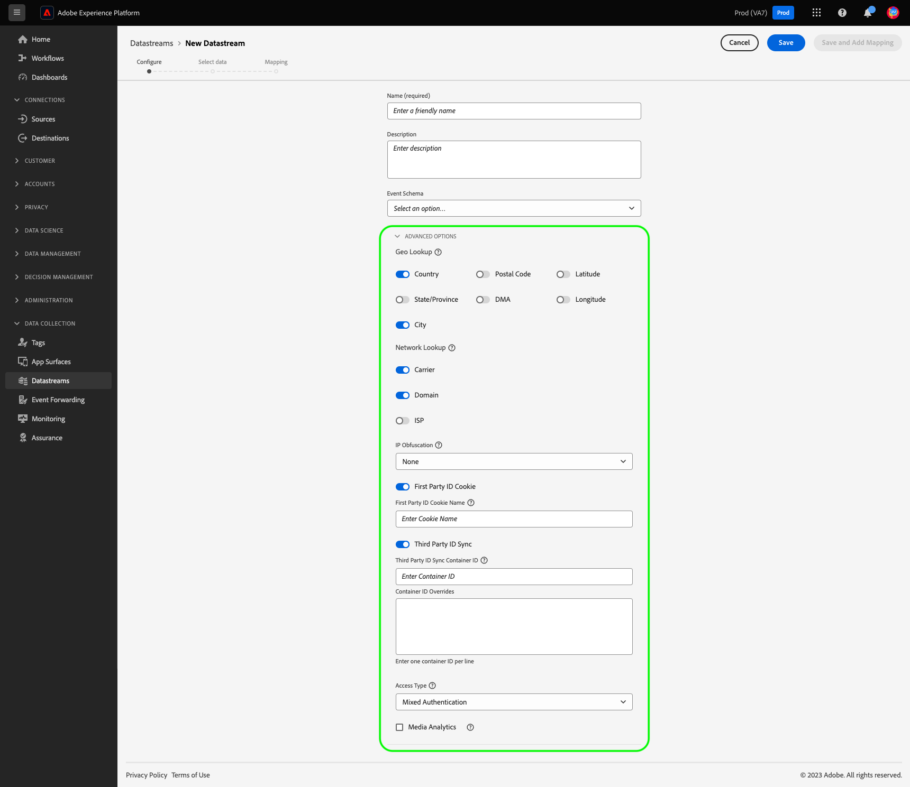
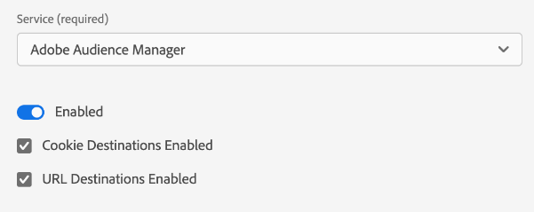

# Configurare uno stream di dati

Questo documento descrive i passaggi per la configurazione di una [flusso di dati](./overview.md) nell’interfaccia utente.

## Accedere a [!UICONTROL Flussi di dati] workspace

Puoi creare e gestire gli stream di dati nell’interfaccia utente di Data Collection o in quella di Experienci Platform selezionando **[!UICONTROL Flussi di dati]** nel menu di navigazione a sinistra.

Il **[!UICONTROL Flussi di dati]** Nella scheda viene visualizzato un elenco degli stream di dati esistenti, con il nome descrittivo, l’ID e la data dell’ultima modifica. Seleziona il nome di uno stream di dati da [visualizzarne i dettagli e configurare i servizi](#view-details).

Seleziona l’icona &quot;altro&quot; (**...**) per un particolare flusso di dati per visualizzare più opzioni. Seleziona **[!UICONTROL Modifica]** per aggiornare [configurazione di base](#configure) per lo stream di dati, oppure seleziona **[!UICONTROL Elimina]** per rimuovere lo stream di dati.

## Creare un nuovo flusso di dati {#create}

Per creare un flusso di dati, inizia selezionando **[!UICONTROL Nuovo flusso di dati]**.

Viene visualizzato il flusso di lavoro per la creazione dello stream di dati, a partire dal passaggio di configurazione. Da qui, devi fornire un nome e una descrizione facoltativa per lo stream di dati.

Se configuri questo flusso di dati per l’utilizzo in Experienci Platform e utilizzi Platform Web SDK, devi anche selezionare un’ [Schema Experience Data Model (XDM) basato su eventi](../xdm/classes/experienceevent.md) per rappresentare i dati che intendi acquisire.

Seleziona **[!UICONTROL Opzioni avanzate]** per visualizzare ulteriori controlli per configurare lo stream di dati.

 {#advanced-options}

>[!IMPORTANT]
>
> L’utente è responsabile di aver ottenuto tutte le autorizzazioni, i consensi, le autorizzazioni e le autorizzazioni necessari in base alle leggi e alle normative applicabili per raccogliere, elaborare e trasmettere dati personali, incluse informazioni precise sulla geolocalizzazione.
> 
> La selezione dell’offuscamento dell’indirizzo IP non influisce sul livello di informazioni di geolocalizzazione che verranno derivate dall’indirizzo IP e inviate alle soluzioni Adobe configurate. Le ricerche di geolocalizzazione devono essere limitate o disabilitate separatamente.

| Impostazione | Descrizione |
| --- | --- |
| [!UICONTROL Ricerca geografica] | Abilita le ricerche di geolocalizzazione per le opzioni selezionate, in base all’indirizzo IP del visitatore. La ricerca della geolocalizzazione richiede di includere [`placeContext`](../edge/data-collection/automatic-information.md#place-context) gruppo di campi nella configurazione dell’SDK web.   Opzioni disponibili: <ul><li>Paese</li><li>Codice postale</li><li>Stato/Provincia</li><li>DMA</li><li>Città</li><li>Latitudine </li><li>Longitudine</li></ul>Selezione **[!UICONTROL Città]**, **[!UICONTROL Latitudine]**, o **[!UICONTROL Longitudine]** fornisce coordinate fino a due punti decimali, indipendentemente dalle altre opzioni selezionate. Questa è considerata granularità a livello di città.    Se non si seleziona alcuna opzione, vengono disattivate le ricerche di geolocalizzazione. La geolocalizzazione si verifica prima [!UICONTROL Offuscamento IP] e non è interessato dal  [!UICONTROL Offuscamento IP] impostazione. |
| [!UICONTROL Ricerca di rete] | Abilita le ricerche di rete per le opzioni selezionate, in base all&#39;indirizzo IP del visitatore. La ricerca di rete richiede di includere [`Environment`](../edge/data-collection/automatic-information.md#environment) gruppo di campi nella configurazione dell’SDK web.   Opzioni disponibili: <ul><li>Gestore</li><li>Domain</li><li>ISP</li></ul>Utilizza queste opzioni per fornire maggiori informazioni ad altri servizi sulla rete specifica da cui hanno avuto origine le richieste. |
| [!UICONTROL Offuscamento IP] | Indica il tipo di offuscamento dell’IP da applicare allo stream di dati. Qualsiasi elaborazione basata sull’IP del cliente sarà influenzata dall’impostazione di offuscamento dell’IP. Ciò include tutti i servizi Experience Cloud che ricevono dati dallo stream di dati. 
Opzioni disponibili:
 <ul><li>**[!UICONTROL Nessuno]**: disabilita l’offuscamento dell’IP. L’indirizzo IP completo dell’utente viene inviato tramite lo stream di dati.</li><li>**[!UICONTROL Parziale]**: per gli indirizzi IPv4, offusca l’ultimo ottetto dell’indirizzo IP dell’utente. Per gli indirizzi IPv6, offusca gli ultimi 80 bit dell’indirizzo. 
Esempi:
 <ul><li>IPv4: `1.2.3.4` -> `1.2.3.0`</li><li>IPv6: `2001:0db8:1345:fd27:0000:ff00:0042:8329` -> `2001:0db8:1345:0000:0000:0000:0000:0000`</li></ul></li><li>**[!UICONTROL Completo]**: offusca l’intero indirizzo IP. 
Esempi:
 <ul><li>IPv4: `1.2.3.4` -> `0.0.0.0`</li><li>IPv6: `2001:0db8:1345:fd27:0000:ff00:0042:8329` -> `0:0:0:0:0:0:0:0`</li></ul></li></ul> Impatto dell’offuscamento dell’IP su altri prodotti Adobi: <ul><li>**Adobe Target**: il livello dello stream di dati [!UICONTROL Offuscamento IP] L’impostazione di ha la precedenza su qualsiasi opzione di oscuramento IP impostata in Adobe Target. Ad esempio, se il livello dello stream di dati [!UICONTROL Offuscamento IP] è impostata su **[!UICONTROL Completo]** e l’opzione di oscuramento dell’IP di Adobe Target è impostata su **[!UICONTROL Offuscamento dell’ultimo ottetto]**, Adobe Target riceverà un IP completamente offuscato. Consulta la documentazione di Adobe Target su [Offuscamento IP](https://developer.adobe.com/target/before-implement/privacy/privacy/) e [geolocalizzazione](https://experienceleague.adobe.com/docs/target/using/audiences/create-audiences/categories-audiences/geo.html?lang=en) per ulteriori dettagli.</li><li>**Audience Manager**: l’impostazione di offuscamento dell’IP a livello di flusso di dati ha la precedenza su qualsiasi opzione di offuscamento dell’IP impostata in Audienci Manager e viene applicata a tutti gli indirizzi IP. Qualsiasi ricerca di geolocalizzazione eseguita da Audienci Manager è influenzata dal livello di flusso di dati [!UICONTROL Offuscamento IP] opzione. Una ricerca di geolocalizzazione in Audienci Manager, basata su un IP completamente offuscato, darà luogo a un’area sconosciuta e tutti i segmenti basati sui dati di geolocalizzazione risultanti non saranno realizzati. Consulta la documentazione di Audience Manager su [Offuscamento IP](https://experienceleague.adobe.com/docs/audience-manager/user-guide/features/administration/ip-obfuscation.html?lang=en) per ulteriori dettagli.</li><li>**Adobe Analytics**: Adobe Analytics attualmente riceve gli indirizzi IP parzialmente offuscati se è selezionata un’opzione di offuscamento dell’IP diversa da NESSUNO. Affinché Analytics possa ricevere indirizzi IP completamente offuscati, devi configurare l’offuscamento dell’IP separatamente in Adobe Analytics. Questo comportamento verrà aggiornato nelle versioni future. Consulta Adobe Analytics [documentazione](https://experienceleague.adobe.com/docs/analytics/admin/admin-tools/manage-report-suites/edit-report-suite/report-suite-general/general-acct-settings-admin.html) per informazioni dettagliate su come abilitare l’offuscamento dell’IP in Analytics.</li></ul> |
| [!UICONTROL Cookie ID di prima parte] | Quando è abilitata, questa impostazione comunica a Edge Network di fare riferimento a un cookie specificato durante la ricerca di un [ID dispositivo di prime parti](../edge/identity/first-party-device-ids.md), anziché cercare questo valore in Identity Map.  Quando abiliti questa impostazione, devi fornire il nome del cookie in cui si prevede che l’ID venga memorizzato. |
| [!UICONTROL Sincronizzazione ID di terze parti] | Le sincronizzazioni ID possono essere raggruppate in contenitori per consentire di eseguire diverse sincronizzazioni ID in momenti diversi. Quando è abilitata, questa impostazione consente di specificare quale contenitore di sincronizzazioni ID viene eseguito per questo flusso di dati. |
| [!UICONTROL ID contenitore sincronizzazione ID di terze parti] | ID numerico del contenitore da utilizzare per la sincronizzazione ID di terze parti. |
| [!UICONTROL Override ID contenitore] | In questa sezione puoi definire altri ID contenitore di sincronizzazione ID di terze parti da utilizzare per sostituire quello predefinito. |
| [!UICONTROL Tipo di accesso] | Definisce il tipo di autenticazione accettato dalla rete Edge per lo stream di dati. <ul><li>**[!UICONTROL Autenticazione mista]**: quando questa opzione è selezionata, la rete Edge accetta sia richieste autenticate che non autenticate. Seleziona questa opzione quando intendi utilizzare l’SDK per web o [SDK per dispositivi mobili](https://aep-sdks.gitbook.io/docs/), insieme al [API server](../server-api/overview.md). </li><li>**[!UICONTROL Solo autenticato]**: quando questa opzione è selezionata, la rete Edge accetta solo richieste autenticate. Selezionare questa opzione quando si intende utilizzare solo l&#39;API server e si desidera impedire l&#39;elaborazione di richieste non autenticate da parte della rete Edge.</li></ul> |

Da qui, se ad Experience Platform stai configurando lo stream di dati, segui l’esercitazione su [Preparazione per la raccolta dati](./data-prep.md) per mappare i dati su uno schema di eventi di Platform, prima di tornare a questa guida. In caso contrario, seleziona **[!UICONTROL Salva]** e passare alla sezione successiva.

## Visualizzare i dettagli dello stream di dati {#view-details}

Dopo aver configurato un nuovo stream di dati o selezionato uno esistente da visualizzare, viene visualizzata la pagina dei dettagli dello stream di dati. Qui puoi trovare ulteriori informazioni sullo stream di dati, incluso il relativo ID.

Dalla schermata dei dettagli dello stream di dati, puoi [aggiungi servizi](#add-services) per abilitare le funzionalità dei prodotti Adobe Experience Cloud a cui hai accesso. Puoi anche modificare i [configurazione di base](#create), aggiorna i [regole di mappatura](./data-prep.md), [copiare lo stream di dati](#copy)o eliminarlo completamente.

## Aggiungere servizi a un flusso di dati {#add-services}

Nella pagina dei dettagli di un flusso di dati, seleziona **[!UICONTROL Aggiungi servizio]** per iniziare ad aggiungere i servizi disponibili per lo stream di dati.

Nella schermata successiva, utilizza il menu a discesa per selezionare un servizio da configurare per questo flusso di dati. In questo elenco verranno visualizzati solo i servizi a cui si ha accesso.

Seleziona il servizio desiderato, compila le opzioni di configurazione visualizzate e quindi seleziona **[!UICONTROL Salva]** per aggiungere il servizio allo stream di dati. Tutti i servizi aggiunti vengono visualizzati nella vista dei dettagli dello stream di dati.

Le sottosezioni seguenti descrivono le opzioni di configurazione per ciascun servizio.

>[!NOTE]
>
>Ogni configurazione del servizio contiene un **[!UICONTROL Abilitato]** che viene attivata automaticamente quando il servizio viene selezionato. Per disabilitare il servizio selezionato per questo flusso di dati, seleziona il **[!UICONTROL Abilitato]** attiva di nuovo.

### Impostazioni di Adobe Analytics {#analytics}

Questo servizio controlla se e come i dati vengono inviati ad Adobe Analytics. Ulteriori dettagli sono disponibili nella guida su [invio di dati ad Analytics](../edge/data-collection/adobe-analytics/analytics-overview.md).

| Impostazione | Descrizione |
| --- | --- |
| [!UICONTROL ID suite di rapporti] | **(Obbligatorio)** ID della suite di rapporti di Analytics a cui desideri inviare i dati. Questo ID si trova nell’interfaccia utente di Adobe Analytics in [!UICONTROL Amministratore] > [!UICONTROL ReportSuites]. Se sono specificate più suite di rapporti, i dati vengono copiati in ogni suite di rapporti. |
| [!UICONTROL Sostituzioni suite di rapporti] | In questa sezione puoi aggiungere altri ID suite di rapporti da utilizzare per sostituire quello predefinito. |

### Impostazioni Adobe Audience Manager {#audience-manager}

Questo servizio controlla se e come i dati vengono inviati a Adobe Audience Manager. Per inviare dati ad Audienci Manager, è sufficiente abilitare questa sezione. Le altre impostazioni sono facoltative ma consigliate.

| Impostazione | Descrizione |
| --- | --- |
| [!UICONTROL Destinazioni cookie abilitate] | Consente all&#39;SDK di condividere le informazioni sui segmenti tramite [destinazioni dei cookie](https://experienceleague.adobe.com/docs/audience-manager/user-guide/features/destinations/custom-destinations/create-cookie-destination.html) da [!DNL Audience Manager]. |
| [!UICONTROL Destinazioni URL abilitate] | Consente all&#39;SDK di condividere le informazioni sui segmenti tramite [Destinazioni URL](https://experienceleague.adobe.com/docs/audience-manager/user-guide/features/destinations/custom-destinations/create-url-destination.html) da [!DNL Audience Manager]. |

### Impostazioni Adobe Experience Platform {#aep}

>[!IMPORTANT]
>
>Quando abiliti un flusso di dati per Platform, prendi nota della sandbox Platform attualmente in uso, come mostrato nella barra multifunzione superiore dell’interfaccia utente.
>
>
>
>Le sandbox sono partizioni virtuali in Adobe Experience Platform che consentono di isolare i dati e le implementazioni da altri nell’organizzazione. Una volta creato uno stream di dati, la relativa sandbox non può essere modificata. Per ulteriori dettagli sul ruolo delle sandbox in Experienci Platform, vedi [documentazione sulle sandbox](../sandboxes/home.md).

Questo servizio controlla se e come i dati vengono inviati a Adobe Experience Platform.

| Impostazione | Descrizione |
|---| --- |
| [!UICONTROL Set di dati evento] | **(Obbligatorio)** Seleziona il set di dati di Platform a cui verranno inviati in streaming i dati dell’evento cliente. Questo schema deve utilizzare [Classe XDM ExperienceEvent](../xdm/classes/experienceevent.md). Per aggiungere altri set di dati, seleziona **[!UICONTROL Aggiungi set di dati evento]**. |
| [!UICONTROL Set di dati profilo] | Seleziona il set di dati di Platform a cui verranno inviati i dati degli attributi del cliente. Questo schema deve utilizzare [Classe profilo individuale XDM](../xdm/classes/individual-profile.md). |
| [!UICONTROL Offer Decisioning] | Seleziona questa casella di controllo per abilitare l’Offer decisioning per un’implementazione Platform Web SDK. Consulta la guida su [offer decisioning di utilizzo con Platform Web SDK](../edge/personalization/offer-decisioning/offer-decisioning-overview.md) per ulteriori dettagli sull’implementazione.  Per ulteriori informazioni sulle funzionalità di Offer Decisioning, consulta [Documentazione di Adobe Journey Optimizer](https://experienceleague.adobe.com/docs/journey-optimizer/using/offer-decisioniong/get-started/starting-offer-decisioning.html?lang=it). |
| [!UICONTROL Segmentazione Edge] | Seleziona questa casella di controllo per abilitare [segmentazione Edge](../segmentation/ui/edge-segmentation.md) per questo flusso di dati. Quando l’SDK invia i dati tramite uno stream di dati abilitato per la segmentazione edge, tutte le appartenenze al segmento aggiornate per il profilo in questione vengono rimandate nella risposta.  Questa opzione può essere utilizzata in combinazione con [!UICONTROL Destinazioni di personalizzazione] per [casi di utilizzo della personalizzazione della pagina successiva](../destinations/ui/activate-edge-personalization-destinations.md). |
| [!UICONTROL Destinazioni di personalizzazione] | Quando si attiva questa opzione dopo aver attivato [!UICONTROL Segmentazione Edge] , questa opzione consente allo stream di dati di connettersi alle destinazioni di personalizzazione, ad esempio [Personalizzazione personalizzata](../destinations/catalog/personalization/custom-personalization.md).  Consulta la documentazione sulle destinazioni per i passaggi specifici su [configurazione delle destinazioni di personalizzazione](../destinations/ui/activate-edge-personalization-destinations.md). |
| [!UICONTROL Adobe Journey Optimizer] | Seleziona questa casella di controllo per abilitare [Adobe Journey Optimizer](https://experienceleague.adobe.com/docs/journey-optimizer/using/ajo-home.html?lang=it) per questo flusso di dati.    L’abilitazione di questa opzione consente allo stream di dati di restituire contenuto personalizzato da campagne in entrata basate sul web e sull’app in [!DNL Adobe Journey Optimizer]. Questa opzione richiede [!UICONTROL Segmentazione Edge] per essere attivi. Se [!UICONTROL Segmentazione Edge] è deselezionata, questa opzione è disattivata. |

### Impostazioni di Adobe Target {#target}

Questo servizio controlla se e come i dati vengono inviati ad Adobe Target.

| Impostazione | Descrizione |
| --- | --- |
| [!UICONTROL Token proprietà] | [!DNL Target] consente ai clienti di controllare le autorizzazioni tramite l’utilizzo di proprietà. Per ulteriori informazioni sulle proprietà, consulta la guida su [configurazione delle autorizzazioni enterprise](https://experienceleague.adobe.com/docs/target/using/administer/manage-users/enterprise/properties-overview.html) nel [!DNL Target] documentazione.  Il token di proprietà si trova nell’interfaccia utente di Adobe Target in [!UICONTROL Configurazione] > [!UICONTROL Proprietà]. |
| [!UICONTROL ID ambiente di destinazione] | [Ambienti in Adobe Target](https://experienceleague.adobe.com/docs/target/using/administer/hosts.html) aiuta a gestire la tua implementazione attraverso tutte le fasi di sviluppo. Questa impostazione specifica l’ambiente da utilizzare con questo flusso di dati.  Si consiglia di impostare questo parametro in modo diverso per ogni `dev`, `stage`, e `prod` ambienti di stream di dati per semplificare le operazioni. Tuttavia, se hai già definito ambienti Adobe Target, puoi utilizzarli. |
| [!UICONTROL Spazio dei nomi ID di terze parti di Target] | Lo spazio dei nomi dell’identità per `mbox3rdPartyId` desideri utilizzare per questo flusso di dati. Consulta la guida su [implementazione `mbox3rdPartyId` con Web SDK](../edge/personalization/adobe-target/using-mbox-3rdpartyid.md) per ulteriori informazioni. |
| [!UICONTROL Override del token di proprietà] | In questa sezione puoi definire token di proprietà aggiuntivi che puoi utilizzare per sostituire quello predefinito. |

### [!UICONTROL Inoltro eventi] impostazioni

Questo servizio controlla se e come i dati vengono inviati a [inoltro eventi](../tags/ui/event-forwarding/overview.md).

| Impostazione | Descrizione |
| --- | --- |
| [!UICONTROL Launch, proprietà] | **(Obbligatorio)** La proprietà di inoltro degli eventi a cui desideri inviare i dati. |
| [!UICONTROL Ambiente Launch] | **(Obbligatorio)** L’ambiente all’interno della proprietà selezionata a cui desideri inviare i dati. |

>[!NOTE]
>
>Puoi selezionare **[!UICONTROL Immetti manualmente gli ID]** per digitare i nomi delle proprietà e degli ambienti invece di utilizzare i menu a discesa.

## Copiare un flusso di dati {#copy}

Puoi creare una copia di un flusso di dati esistente e modificarne i dettagli, se necessario.

>[!NOTE]
>
>Gli stream di dati possono essere copiati solo all’interno dello stesso [sandbox](../sandboxes/home.md). In altre parole, non è possibile copiare un flusso di dati da una sandbox all’altra.

Dalla pagina principale in [!UICONTROL Flussi di dati] , seleziona i puntini di sospensione (**....**) per lo stream di dati in questione, quindi seleziona **[!UICONTROL Copia]**.

![Immagine che mostra [!UICONTROL Copia] opzione selezionata dalla vista elenco dello stream di dati](assets/configure/copy-datastream-list.png)

In alternativa, è possibile selezionare **[!UICONTROL Copia flusso di dati]** dalla visualizzazione dei dettagli di un dato stream di dati.

![Immagine che mostra [!UICONTROL Copia] opzione selezionata dalla vista dettagli dello stream di dati](assets/configure/copy-datastream-details.png)

Viene visualizzata una finestra di dialogo di conferma in cui viene richiesto di fornire un nome univoco per il nuovo flusso di dati da creare, insieme ai dettagli sulle opzioni di configurazione che verranno copiate. Quando è pronto, seleziona **[!UICONTROL Copia]**.

La pagina principale della sezione [!UICONTROL Flussi di dati] workspace viene nuovamente visualizzato con il nuovo stream di dati elencato.

## Passaggi successivi

Questa guida illustra come gestire gli stream di dati nell’interfaccia utente di Data Collection. Per ulteriori informazioni su come installare e configurare Web SDK dopo la configurazione di un flusso di dati, consulta [Guida all’E2E di Data Collection](../collection/e2e.md#install).
