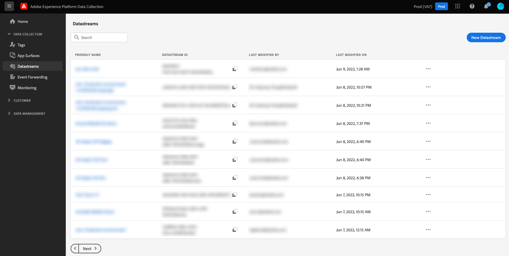

# Creare e configurare gli stream di dati

Questo documento descrive i passaggi per la configurazione di uno [stream di dati](./overview.md) nell’interfaccia utente.

## Accedere all’area di lavoro dello [!UICONTROL stream di dati]

Puoi creare e gestire stream di dati nell’interfaccia utente Raccolta dati o in quella di Experience Platform selezionando **[!UICONTROL Stream di dati]** nel menu di navigazione a sinistra.

La scheda **[!UICONTROL Stream di dati]** riporta un elenco di stream di dati esistenti, incluso il nome intuitivo, l’ID e la data dell’ultima modifica. Seleziona il nome di uno stream di dati per [visualizzare i dettagli e configurare i servizi](#view-details).

Seleziona l’icona “altro” (**...**) di un particolare stream di dati per visualizzare più opzioni. Seleziona **[!UICONTROL Modifica]** per aggiornare la [configurazione di base](#configure) per lo stream di dati, oppure seleziona **[!UICONTROL Elimina]** per rimuoverlo.

## Creare un nuovo stream di dati {#create}

Per creare uno stream di dati, inizia selezionando **[!UICONTROL Nuovo stream di dati]**.

Viene visualizzata l’area di lavoro relativa alla creazione dello stream di dati, partendo dal passaggio di configurazione. Da qui, è necessario fornire un nome e una descrizione facoltativa per lo stream di dati.

Se stai configurando questo stream di dati per utilizzarlo in Experience Platform e stai utilizzando Platform Web SDK, seleziona anche uno [schema Experience Data Model (XDM) basato su eventi](../xdm/classes/experienceevent.md), per rappresentare i dati che intendi acquisire.

### Configurare la geolocalizzazione e la ricerca di rete {#geolocation-network-lookup}

Le impostazioni di geolocalizzazione e ricerca di rete consentono di definire il livello di granularità dei dati a livello di rete e geografico che si desidera raccogliere.

Espandi **[!UICONTROL Geolocalizzazione e ricerca di rete]** per configurare le impostazioni descritte di seguito.

| Impostazione | Descrizione |
| --- | --- |
| [!UICONTROL Ricerca geolocalizzazione] | Abilita le ricerche di geolocalizzazione per le opzioni selezionate in base all’indirizzo IP del visitatore. Le opzioni disponibili includono: <ul><li>**Paese**: Popolazioni `xdm.placeContext.geo.countryCode`</li><li>**Codice postale**: Popolazioni `xdm.placeContext.geo.postalCode`</li><li>**Stato/Provincia**: Popolazioni `xdm.placeContext.geo.stateProvince`</li><li>**DMA**: Popolazioni `xdm.placeContext.geo.dmaID`</li><li>**Città**: Popolazioni `xdm.placeContext.geo.city`</li><li>**Latitudine**: Popolazioni `xdm.placeContext.geo._schema.latitude`</li><li>**Longitudine**: Popolazioni `xdm.placeContext.geo._schema.longitude`</li></ul>La selezione di **[!UICONTROL Città]**, **[!UICONTROL Latitudine]** o **[!UICONTROL Longitudine]** fornisce coordinate fino a due punti decimali, indipendentemente dalle altre opzioni selezionate. Questo viene considerato come granularità a livello di città.   Se non si seleziona alcuna opzione, vengono disattivate le ricerche di geolocalizzazione. La geolocalizzazione avviene prima [!UICONTROL Offuscamento IP], il che significa che non è interessato dal [!UICONTROL Offuscamento IP] impostazione. |
| [!UICONTROL Ricerca in rete] | Abilita le ricerche di rete per le opzioni selezionate in base all&#39;indirizzo IP del visitatore. Le opzioni disponibili includono: <ul><li>**Gestore**: Popolazioni `xdm.environment.carrier`</li><li>**Dominio**: Popolazioni `xdm.environment.domain`</li><li>**ISP**: Popolazioni `xdm.environment.ISP`</li></ul> |

Se abiliti uno dei campi di cui sopra per la raccolta dati, assicurati di impostare correttamente [`context`](../edge/data-collection/automatic-information.md) proprietà array quando [configurazione di Web SDK](../edge/fundamentals/configuring-the-sdk.md).

I campi di ricerca di geolocalizzazione utilizzano `context` stringa di matrice `"placeContext"`, mentre i campi di ricerca di rete utilizzano `context` stringa di matrice `"environment"`.

Inoltre, accertati che nello schema esista ogni campo XDM desiderato. In caso contrario, puoi aggiungere l’Adobe fornito `Environment Details` gruppo di campi allo schema.

### Configurare la ricerca del dispositivo {#geolocation-device-lookup}

Il **[!UICONTROL Ricerca dispositivo]** Le impostazioni consentono di selezionare le informazioni specifiche del dispositivo da raccogliere.

Espandi **[!UICONTROL Ricerca dispositivo]** per configurare le impostazioni descritte di seguito.

>[!IMPORTANT]
>
>Le impostazioni descritte nella tabella seguente si escludono a vicenda. Non è possibile selezionare contemporaneamente sia le informazioni dell’agente utente che i dati di ricerca del dispositivo.

| Impostazione | Descrizione |
| --- | --- |
| **[!UICONTROL Mantieni intestazioni agente utente e suggerimenti client]** | Seleziona questa opzione per raccogliere solo le informazioni memorizzate nella stringa dell’agente utente. Questa impostazione è selezionata per impostazione predefinita. Popola `xdm.environment.browserDetails.userAgent` |
| **[!UICONTROL Utilizza la ricerca del dispositivo per raccogliere le seguenti informazioni]** | Seleziona questa opzione se desideri raccogliere una o più delle seguenti informazioni specifiche per il dispositivo: <ul><li>**[!UICONTROL Dispositivo]** informazioni:<ul><li>**Produttore dispositivo**: Popolazioni `xdm.device.manufacturer`</li><li>**Modello dispositivo**: Popolazioni `xdm.device.modelNumber`</li><li>**Nome marketing**: Popolazioni `xdm.device.model`</li></ul></li><li>**[!UICONTROL Hardware]** informazioni: <ul><li>**Tipo di hardware**: Popolazioni `xdm.device.type`</li><li>**Altezza visualizzazione**: Popolazioni `xdm.device.screenHeight`</li><li>**Larghezza visualizzazione**: Popolazioni `xdm.device.screenWidth`</li><li>**Profondità colore visualizzazione**: Popolazioni `xdm.device.colorDepth`</li></ul></li><li>**[!UICONTROL Browser]** informazioni: <ul><li>**Fornitore browser**: Popolazioni `xdm.environment.browserDetails.vendor`</li><li>**Nome browser**: Popolazioni `xdm.environment.browserDetails.name`</li><li>**Versione browser**: Popolazioni `xdm.environment.browserDetails.version`</li></ul></li><li>**[!UICONTROL Sistema operativo]** informazioni: <ul><li>**Fornitore del sistema operativo**: Popolazioni `xdm.environment.operatingSystemVendor`</li><li>**Nome sistema operativo**: Popolazioni `xdm.environment.operatingSystem`</li><li>**Versione sistema operativo**: Popolazioni `xdm.environment.operatingSystemVersion`</li></ul></li></ul>Non è possibile raccogliere le informazioni di ricerca del dispositivo insieme all’agente utente e agli hint client. La scelta di raccogliere le informazioni sul dispositivo disattiva la raccolta degli hint dell’agente utente e del client e viceversa. |
| **[!UICONTROL Non raccogliere informazioni sul dispositivo]** | Selezionare questa opzione se non si desidera raccogliere informazioni sulla ricerca del dispositivo. Non vengono raccolti dati relativi a dispositivi, hardware, browser, sistema operativo, agenti utente o suggerimenti client. |

Se abiliti uno dei campi di cui sopra per la raccolta dati, assicurati di impostare correttamente [`context`](../edge/data-collection/automatic-information.md) proprietà array quando [configurazione di Web SDK](../edge/fundamentals/configuring-the-sdk.md).

Le informazioni sul dispositivo e sull&#39;hardware utilizzano `context` stringa di matrice `"device"`, mentre le informazioni del browser e del sistema operativo utilizzano `context` stringa di matrice `"environment"`.

Inoltre, accertati che nello schema esista ogni campo XDM desiderato. In caso contrario, puoi aggiungere l’Adobe fornito `Environment Details` gruppo di campi allo schema.

### Configurare le opzioni avanzate {#@advanced-options}

Seleziona **[!UICONTROL Opzioni avanzate]** per visualizzare ulteriori controlli per configurare lo stream di dati, ad esempio offuscamento dell’IP, cookie dell’ID di prima parte e altro ancora.

>[!IMPORTANT]
>
> L’utente è responsabile di aver ottenuto tutte le autorizzazioni, i consensi, gli accordi e i permessi necessari ai sensi delle leggi e delle normative applicabili per raccogliere, elaborare e trasmettere dati personali, incluse informazioni precise sulla geolocalizzazione.
> 
> La selezione dell’offuscamento dell’indirizzo IP non influisce sul livello di informazioni di geolocalizzazione, che verranno derivate dall’indirizzo IP e inviate alle soluzioni Adobe configurate. Le ricerche per geolocalizzazione devono essere limitate o disabilitate separatamente.

| Impostazione | Descrizione |
| --- | --- |
| [!UICONTROL Offuscamento IP] | Indica il tipo di offuscamento dell’indirizzo IP da applicare allo stream di dati. Qualsiasi elaborazione basata sull’indirizzo IP del cliente sarà influenzata dall’impostazione di offuscamento dell’IP. Ciò include tutti i servizi di Experience Cloud che ricevono dati dallo stream di dati. 
Opzioni disponibili:
 <ul><li>**[!UICONTROL Nessuno]**: disabilita l’offuscamento dell’indirizzo IP. L’indirizzo IP completo dell’utente viene inviato tramite lo stream di dati.</li><li>**[!UICONTROL Parziale]**: per gli indirizzi IPv4, offusca l’ultimo ottetto dell’indirizzo IP dell’utente. Per gli indirizzi IPv6, offusca gli ultimi 80 bit dell’indirizzo. 
Esempi:
 <ul><li>IPv4: `1.2.3.4` -> `1.2.3.0`</li><li>IPv6: `2001:0db8:1345:fd27:0000:ff00:0042:8329` -> `2001:0db8:1345:0000:0000:0000:0000:0000`</li></ul></li><li>**[!UICONTROL Completo]**: offusca l’intero indirizzo IP. 
Esempi:
 <ul><li>IPv4: `1.2.3.4` -> `0.0.0.0`</li><li>IPv6: `2001:0db8:1345:fd27:0000:ff00:0042:8329` -> `0:0:0:0:0:0:0:0`</li></ul></li></ul> Impatto dell’offuscamento dell’IP su altri prodotti Adobe: <ul><li>**Adobe Target**: il livello dello stream di dati [!UICONTROL Offuscamento IP] viene applicato prima del [!UICONTROL Offuscamento IP] in Adobe Target, a tutti gli indirizzi IP presenti nella richiesta. Ad esempio, se il livello dello stream di dati [!UICONTROL Offuscamento IP] è impostata su **[!UICONTROL Completo]** e l’opzione di oscuramento dell’IP di Adobe Target è impostata su **[!UICONTROL Offuscamento dell’ultimo ottetto]**, Adobe Target riceve un IP completamente offuscato. Se il livello dello stream di dati [!UICONTROL Offuscamento IP] è impostata su **[!UICONTROL Parziale]** e l’opzione di oscuramento dell’IP di Adobe Target è impostata su **[!UICONTROL Completo]**, Adobe Target riceve un IP parzialmente offuscato e quindi applica su di esso l’offuscamento completo. L’offuscamento dell’IP di Adobe Target viene gestito indipendentemente dallo stream di dati. Per ulteriori dettagli, consulta la documentazione di Adobe Target sull’[offuscamento dell’indirizzo IP](https://developer.adobe.com/target/before-implement/privacy/privacy/) e la [geolocalizzazione](https://experienceleague.adobe.com/docs/target/using/audiences/create-audiences/categories-audiences/geo.html?lang=it).</li><li>**Audience Manager**: il livello dello stream di dati [!UICONTROL Offuscamento IP] viene applicata prima dell&#39;impostazione [!UICONTROL Offuscamento IP] eseguita in Audienci Manager, a tutti gli indirizzi IP presenti nella richiesta. Qualsiasi ricerca di geolocalizzazione eseguita da Audience Manager è influenzata dall’opzione di [!UICONTROL offuscamento dell’indirizzo IP] a livello di stream di dati. Una ricerca di geolocalizzazione in Audience Manager basata su un indirizzo IP completamente offuscato darà luogo a un’area geografica sconosciuta e tutti i segmenti basati sui dati di geolocalizzazione risultanti non saranno realizzati. Per ulteriori informazioni, consulta la documentazione di Audience Manager sull’[offuscamento dell’indirizzo IP](https://experienceleague.adobe.com/docs/audience-manager/user-guide/features/administration/ip-obfuscation.html?lang=it).</li><li>**Adobe Analytics**: Adobe Analytics attualmente riceve gli indirizzi IP parzialmente offuscati se è selezionata un’opzione di offuscamento dell’IP diversa da NESSUNO. Affinché Analytics possa ricevere indirizzi IP offuscati, l’offuscamento dell’IP deve essere configurato separatamente in Adobe Analytics. Questo comportamento verrà aggiornato nelle versioni future. Consulta la [documentazione](https://experienceleague.adobe.com/docs/analytics/admin/admin-tools/manage-report-suites/edit-report-suite/report-suite-general/general-acct-settings-admin.html?lang=it) di Adobe Analytics per informazioni dettagliate su come abilitare l’offuscamento dell’indirizzo IP in Analytics.</li></ul> |
| [!UICONTROL ID cookie di prime parti] | Quando è abilitata, questa impostazione comunica alla rete Edge di fare riferimento a un cookie specificato durante la ricerca di un [ID dispositivo di prime parti](../edge/identity/first-party-device-ids.md), anziché cercare questo valore nella mappa di identità.  Quando abiliti questa impostazione, devi fornire il nome del cookie in cui si prevede di memorizzare l’ID. |
| [!UICONTROL Sincronizzazione ID di terze parti] | Le sincronizzazioni ID possono essere raggruppate in contenitori per consentire di eseguire diverse sincronizzazioni ID in momenti diversi. Quando è abilitata, questa impostazione consente di specificare quale contenitore di sincronizzazioni ID viene eseguito per tale stream di dati. |
| [!UICONTROL ID contenitore sincronizzazione ID di terze parti] | ID numerico del contenitore da utilizzare per la sincronizzazione dell’ID di terze parti. |
| [!UICONTROL Override ID contenitore] | In questa sezione puoi definire altri ID contenitore di sincronizzazione ID di terze parti da utilizzare in sostituzione di quello predefinito. |
| [!UICONTROL Tipo di accesso] | Definisce il tipo di autenticazione accettato dalla rete Edge per lo stream di dati. <ul><li>**[!UICONTROL Autenticazione mista]**: quando è selezionata questa opzione, la rete Edge accetta sia richieste autenticate che non autenticate. Seleziona questa opzione quando intendi utilizzare Web SDK o l’[SDK Mobile](https://developer.adobe.com/client-sdks/documentation/), insieme all’[API del server](../server-api/overview.md). </li><li>**[!UICONTROL Solo autenticate]**: quando è selezionata questa opzione, la rete Edge accetta solo richieste autenticate. Seleziona questa opzione quando intendi utilizzare solo l’API del server e desideri impedire l’elaborazione di richieste non autenticate da parte della rete Edge.</li></ul> |
| [!UICONTROL Media Analytics] | Seleziona questa opzione per abilitare l’elaborazione dei dati di tracciamento dello streaming per l’integrazione con Edge Network tramite SDK di Experience Platform o API Media Edge. Scopri Media Analytics da [documentazione](https://experienceleague.adobe.com/docs/media-analytics/using/media-overview.html?lang=it). |

Da qui, se stai configurando uno stream di dati per Experience Platform, segui il tutorial sulla [Preparazione dei dati per la raccolta dati](./data-prep.md) per mappare i dati su uno schema di eventi di Platform prima di tornare a questa guida. Diversamente, seleziona **[!UICONTROL Salva]** e passa alla sezione successiva.

## Visualizzare i dettagli dello stream di dati {#view-details}

Dopo aver configurato un nuovo stream di dati o averne selezionato uno esistente da visualizzare, viene visualizzata la pagina Dettagli dello stream di dati. Qui puoi trovare ulteriori informazioni sullo stream di dati, incluso il relativo ID.

Dalla schermata Dettagli dello stream di dati, puoi [aggiungere servizi](#add-services) per attivare le funzionalità dei prodotti Adobe Experience Cloud a cui hai accesso. Puoi modificare anche la [configurazione di base](#create) dello stream di dati, aggiornare le relative [regole di mappatura](./data-prep.md), [copiare lo stream di dati](#copy) oppure eliminarlo completamente.

## Aggiungere servizi a uno stream di dati {#add-services}

Nella pagina dei dettagli di uno stream di dati, seleziona **[!UICONTROL Aggiungi servizio]** per iniziare ad aggiungere i servizi disponibili per lo stream di dati.

Nella schermata successiva, utilizza il menu a discesa per selezionare un servizio da configurare per tale stream di dati. Nell’elenco verranno visualizzati solo i servizi a cui hai accesso.

Seleziona il servizio desiderato, compila le opzioni di configurazione visualizzate e quindi seleziona **[!UICONTROL Salva]** per aggiungere il servizio allo stream di dati. Tutti i servizi aggiunti vengono visualizzati nella vista Dettagli dello stream di dati.

Le sottosezioni seguenti descrivono le opzioni di configurazione per ciascun servizio.

>[!NOTE]
>
>Ogni configurazione del servizio contiene un’opzione **[!UICONTROL abilitata]** che si attiva automaticamente quando il servizio viene selezionato. Per disabilitare il servizio selezionato per lo stream di dati, seleziona di nuovo l’opzione **[!UICONTROL abilitata]**.

### Impostazioni di Adobe Analytics {#analytics}

Questo servizio controlla se e il modo in cui i dati vengono inviati ad Adobe Analytics. Ulteriori dettagli sono disponibili nella guida all’[invio di dati ad Analytics](../edge/data-collection/adobe-analytics/analytics-overview.md).

| Impostazione | Descrizione |
| --- | --- |
| [!UICONTROL ID suite di rapporti] | **(Obbligatorio)** L’ID della suite di rapporti di Analytics a cui desideri inviare i dati. Questo ID si trova nell’interfaccia utente di Adobe Analytics in [!UICONTROL Amministrazione] > [!UICONTROL Suite di rapporti]. Se sono specificate più suite di rapporti, i dati vengono copiati in ogni suite. |
| [!UICONTROL Override della suite di rapporti] | In questa sezione puoi aggiungere altri ID della suite di rapporti da utilizzare in sostituzione di quello predefinito. |

### Impostazioni di Adobe Audience Manager {#audience-manager}

Questo servizio controlla se e il modo in cui i dati vengono inviati ad Adobe Audience Manager. Per inviare dati ad Audience Manager, è sufficiente abilitare questa sezione. Le altre impostazioni sono facoltative, ma consigliate.

| Impostazione | Descrizione |
| --- | --- |
| [!UICONTROL Destinazioni cookie abilitate] | Consente all’SDK di condividere informazioni sui segmenti tramite le [destinazioni dei cookie](https://experienceleague.adobe.com/docs/audience-manager/user-guide/features/destinations/custom-destinations/create-cookie-destination.html?lang=it) da [!DNL Audience Manager]. |
| [!UICONTROL Destinazioni URL abilitate] | Consente all’SDK di condividere informazioni sui segmenti tramite le [destinazioni URL](https://experienceleague.adobe.com/docs/audience-manager/user-guide/features/destinations/custom-destinations/create-url-destination.html?lang=it) da [!DNL Audience Manager]. |

### Impostazioni di Adobe Experience Platform {#aep}

>[!IMPORTANT]
>
>Quando abiliti uno stream di dati per Platform, prendi nota della sandbox Platform attualmente in uso, come mostrato nella barra multifunzione superiore dell’interfaccia utente.
>
>
>
>In Adobe Experience Platform le sandbox sono partizioni virtuali che consentono di isolare i dati e le implementazioni da parte di altri all’interno dell’organizzazione. Una volta creato uno stream di dati, la relativa sandbox non può essere modificata. Per ulteriori dettagli sul ruolo delle sandbox in Experience Platform, consulta la [documentazione sulle sandbox](../sandboxes/home.md).

Il servizio controlla se e in che modo i dati vengono inviati ad Adobe Experience Platform.

| Impostazione | Descrizione |
|---| --- |
| [!UICONTROL Set di dati di evento] | **(Obbligatorio)** Seleziona il set di dati di Platform a cui verranno trasmessi in streaming i dati dell’evento cliente. Lo schema deve utilizzare la [classe XDM ExperienceEvent](../xdm/classes/experienceevent.md). Per aggiungere altri set di dati, seleziona **[!UICONTROL Aggiungi set di dati di evento]**. |
| [!UICONTROL Set di dati di profilo] | Seleziona il set di dati di Platform a cui verranno inviati i dati attributo del cliente. Lo schema deve utilizzare la [classe Profilo XDM individuale](../xdm/classes/individual-profile.md). |
| [!UICONTROL Offer Decisioning] | Seleziona questa casella di controllo per abilitare l’Offer Decisioning e implementare così Platform Web SDK. Per ulteriori dettagli relativi all’implementazione, consulta la guida sull’[utilizzo di Offer Decisioning con Platform Web SDK](../edge/personalization/offer-decisioning/offer-decisioning-overview.md).  Per ulteriori informazioni sulle funzionalità di Offer Decisioning, consulta la [documentazione di Adobe Journey Optimizer](https://experienceleague.adobe.com/docs/journey-optimizer/using/offer-decisioniong/get-started/starting-offer-decisioning.html?lang=it). |
| [!UICONTROL Segmentazione Edge] | Seleziona questa casella di controllo per abilitare la [segmentazione Edge](../segmentation/ui/edge-segmentation.md) per lo stream di dati. Quando l’SDK invia i dati tramite uno stream di dati abilitato per la segmentazione Edge, tutte le appartenenze al segmento aggiornate per il profilo in questione vengono inviate nuovamente nella risposta.  Questa opzione può essere utilizzata in combinazione con le [!UICONTROL destinazioni di personalizzazione], per [i casi d’uso di personalizzazione della pagina successiva](../destinations/ui/activate-edge-personalization-destinations.md). |
| [!UICONTROL Destinazioni di personalizzazione] | Quando viene abilitata dopo aver attivato la casella di controllo della [!UICONTROL segmentazione Edge], questa opzione consente allo stream di dati di connettersi alle destinazioni di personalizzazione, ad esempio la [Personalizzazione personalizzata](../destinations/catalog/personalization/custom-personalization.md).  Per i passaggi specifici sulla [configurazione delle destinazioni di personalizzazione](../destinations/ui/activate-edge-personalization-destinations.md), consulta la documentazione delle destinazioni. |
| [!UICONTROL Adobe Journey Optimizer] | Seleziona questa casella di controllo per abilitare [Adobe Journey Optimizer](https://experienceleague.adobe.com/docs/journey-optimizer/using/ajo-home.html?lang=it) per lo stream di dati.    L’abilitazione di questa opzione consente allo stream di dati di restituire il contenuto personalizzato da campagne in entrata basate su web e su app in [!DNL Adobe Journey Optimizer]. Questa opzione richiede l’attivazione della [!UICONTROL segmentazione Edge]. Se la [!UICONTROL segmentazione Edge] non è selezionata, l’opzione è disattivata. |

### Impostazioni di Adobe Target {#target}

Questo servizio controlla se e in che modo i dati vengono inviati ad Adobe Target.

| Impostazione | Descrizione |
| --- | --- |
| [!UICONTROL Token di proprietà] | [!DNL Target] consente ai clienti di controllare le autorizzazioni tramite l’utilizzo di proprietà. Per ulteriori informazioni sulle proprietà, consulta la guida sulla [configurazione delle autorizzazioni Enterprise](https://experienceleague.adobe.com/docs/target/using/administer/manage-users/enterprise/properties-overview.html?lang=it) riportata nella documentazione di [!DNL Target].  Il token di proprietà si trova nell’interfaccia utente di Adobe Target in [!UICONTROL Configurazione] >[!UICONTROL Proprietà]. |
| [!UICONTROL ID ambiente di destinazione] | Gli [ambienti in Adobe Target](https://experienceleague.adobe.com/docs/target/using/administer/hosts.html?lang=it) consentono di gestire l’implementazione in tutte le fasi di sviluppo. Questa impostazione specifica l’ambiente da utilizzare con questo stream di dati.  Si consiglia di impostare questo parametro in modo diverso per ogni ambiente di destinazione `dev`, `stage` e `prod`, per semplificare le operazioni. Tuttavia, nel caso in cui gli ambienti di Adobe Target fossero già stati definiti, è possibile utilizzarli. |
| [!UICONTROL ID spazio dei nomi destinazione di terze parti] | Lo spazio dei nomi dell’identità `mbox3rdPartyId` che desideri utilizzare per questo stream di dati. Per ulteriori informazioni, consulta la guida sull’[implementazione `mbox3rdPartyId`con Web SDK](../edge/personalization/adobe-target/using-mbox-3rdpartyid.md). |
| [!UICONTROL Override del token di proprietà] | In questa sezione puoi definire token di proprietà aggiuntivi da utilizzare in sostituzione di quello predefinito. |

### Impostazioni dell’[!UICONTROL Inoltro eventi]

Questo servizio controlla se e in che modo i dati vengono inviati all’[inoltro eventi](../tags/ui/event-forwarding/overview.md).

| Impostazione | Descrizione |
| --- | --- |
| [!UICONTROL Proprietà Launch] | **(Obbligatorio)** La proprietà di inoltro degli eventi a cui desideri inviare i dati. |
| [!UICONTROL Ambiente Launch] | **(Obbligatorio)** L’ambiente all’interno della proprietà selezionata a cui desideri inviare i dati. |

>[!NOTE]
>
>Puoi selezionare **[!UICONTROL Immetti manualmente gli ID]** per digitare i nomi delle proprietà e degli ambienti anziché utilizzare i menu a discesa.

## Copiare uno stream di dati {#copy}

Puoi creare una copia di uno stream di dati esistente e modificarne i dettagli in base alle esigenze.

>[!NOTE]
>
>Gli stream di dati possono essere copiati solo all’interno della stessa [sandbox](../sandboxes/home.md). In altre parole, non è possibile copiare uno stream di dati da una sandbox all’altra.

Nella pagina principale nell’area di lavoro [!UICONTROL Stream di dati], seleziona i puntini di sospensione (**...**) per lo stream di dati in questione, quindi seleziona **[!UICONTROL Copia]**.

![Immagine che mostra l’opzione [!UICONTROL Copia] selezionata dalla vista a elenco dello stream di dati](assets/configure/copy-datastream-list.png)

In alternativa, è possibile selezionare **[!UICONTROL Copia stream di dati]** dalla vista dei dettagli di un determinato stream di dati.

![Immagine che mostra l’opzione [!UICONTROL Copia] selezionata dalla vista dettagli dello stream di dati](assets/configure/copy-datastream-details.png)

Viene visualizzata una finestra di dialogo di conferma in cui viene richiesto di fornire un nome univoco per il nuovo stream di dati da creare, insieme ai dettagli sulle opzioni di configurazione che verranno copiate. Quando è tutto pronto, seleziona **[!UICONTROL Copia]**.

La pagina principale dell’area di lavoro [!UICONTROL Stream di dati] viene nuovamente visualizzata con il nuovo stream di dati elencato.

## Passaggi successivi

Questa guida illustra come gestire gli stream di dati nell’interfaccia utente Raccolta dati. Per ulteriori informazioni su come installare e configurare Web SDK dopo la configurazione di uno stream di dati, consulta la [guida end-to-end sulla raccolta dati](../collection/e2e.md#install).
