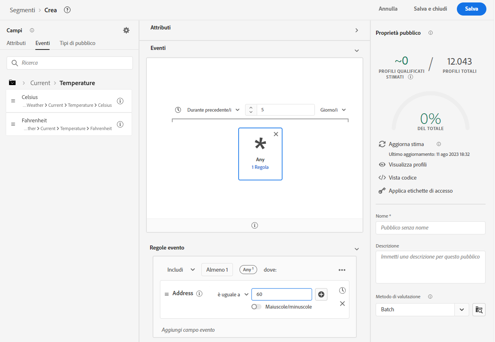

# Utilizza i dati meteo da [!DNL The Weather Channel]

Adobe ha collaborato con [!DNL [The Weather Company]](https://www.ibm.com/weather) per portare il contesto aggiuntivo del meteo degli Stati Uniti ai dati raccolti tramite stream di dati. Puoi utilizzare questi dati per l’analisi, il targeting e la creazione di segmenti in Experience Platform.

Sono disponibili 3 tipi di dati da [!DNL The Weather Channel]:

* **[!UICONTROL Meteo attuale]**: le condizioni meteo attuali dell’utente, in base alla sua posizione. Ciò include la temperatura corrente, le precipitazioni, la nuvolosità e altro ancora.
* **[!UICONTROL Tempo previsto]**: include le previsioni di 1, 2 ,3 ,5, 7 e 10 giorni per la posizione dell’utente.
* **[!UICONTROL Trigger]**: i trigger sono combinazioni specifiche che vengono mappate su diverse condizioni meteo semantiche. Esistono tre diversi tipi di trigger meteo:

   * **[!UICONTROL Trigger meteo]**: condizioni semanticamente significative, come meteo freddo o piovoso. Questi possono differire nelle loro definizioni tra i vari climi.
   * **[!UICONTROL Trigger prodotto]**: condizioni che porterebbero all’acquisto di diversi tipi di prodotti. Ad esempio: le previsioni di temperature fredde potrebbero indicare verosimilmente l’acquisto di impermeabili.
   * **[!UICONTROL Trigger meteo gravi]**: avvisi meteo gravi, come tempeste invernali o avvisi di uragani.

## Prerequisiti {#prerequisites}

Prima di utilizzare i dati meteo, è necessario soddisfare i seguenti prerequisiti:

* ottenere la licenza per i dati meteo che userai da [!DNL The Weather Channel]. Seguirà l’abilitazione del meteo sul tuo account.
* I dati meteo sono disponibili solo attraverso stream di dati. Per utilizzare e sfruttare i dati meteo, è necessario utilizzare [!DNL Web SDK] [!DNL Mobile Edge Extension] o l’[API server](../../server-api/overview.md).
* Lo stream di dati deve avere abilitata la funzione di [[!UICONTROL geolocalizzazione]](../configure.md#advanced-options).
* Aggiungi il [gruppo di campi meteo](#schema-configuration) allo schema in uso.

## Provisioning {#provisioning}

Dopo aver concesso la licenza ai dati da [!DNL The Weather Channel], il tuo account potrà accedere ai dati. Successivamente, contatta l’Assistenza clienti di Adobe perché i dati siano abilitati nello stream di dati. Una volta abilitati, i dati verranno aggiunti automaticamente.

Puoi convalidarne l’aggiunta eseguendo un controllo Edge con il Debugger o utilizzando Assurance per tracciare un hit attraverso [!DNL Edge Network].

### Configurazione dello schema {#schema-configuration}

È necessario aggiungere i gruppi di campi meteo allo schema di Experience Platform corrispondente al set di dati dell’evento che stai utilizzando nello stream di dati. Sono disponibili cinque gruppi di campo:

* [!UICONTROL Meteo previsto]
* [!UICONTROL Meteo attuale]
* [!UICONTROL Trigger del prodotto]
* [!UICONTROL Trigger relativi]
* [!UICONTROL Trigger meteo gravi]

## Accedere ai dati meteo {#access-weather-data}

Una volta concessi i dati in licenza e resi disponibili, puoi accedervi in diversi modi da tutti i servizi Adobe.

### Adobe Analytics {#analytics}

In [!DNL Adobe Analytics], i dati meteo sono disponibili per la mappatura tramite regole di elaborazione, insieme al resto dello schema [!DNL XDM].

Puoi trovare l’elenco di campi da mappare nella pagina di [riferimento meteo](weather-reference.md). Come per tutti gli schemi di [!DNL XDM], le chiavi hanno il prefisso `a.x`. Ad esempio, un campo denominato `weather.current.temperature.farenheit` in [!DNL Analytics] verrebbe visualizzato come `a.x.weather.current.temperature.farenheit`.

### Adobe Customer Journey Analytics {#cja}

In [!DNL Adobe Customer Journey Analytics], i dati meteo sono disponibili nel set di dati specificato nello stream di dati. Poiché gli attributi meteo vengono [aggiunti allo schema](#prerequisites-prerequisites), saranno disponibili per [aggiungere una vista dati](https://experienceleague.adobe.com/docs/analytics-platform/using/cja-dataviews/create-dataview.html?lang=it) in [!DNL Customer Journey Analytics].

### Real-Time Customer Data Platform {#rtcdp}

In [Real-time Customer Data Platform](../../rtcdp/overview.md), i dati meteo sono disponibili per l’utilizzo nei segmenti. I dati meteo sono collegati agli eventi.

Poiché le condizioni meteo cambiano spesso, Adobe consiglia di impostare vincoli di tempo sui segmenti, come illustrato nell’esempio precedente. Registrare un giorno freddo nell’ultimo giorno o due ha un maggiore impatto averlo registrato 6 mesi fa.

Consulta il [riferimento meteo](weather-reference.md) per i campi disponibili.

### Adobe Target {#target}

In [!DNL Adobe Target], puoi utilizzare i dati meteo per stimolare la personalizzazione in tempo reale. I dati meteo vengono trasmessi a [!DNL Target] come parametri [!UICONTROL mBox] e puoi accedervi tramite un parametro [!UICONTROL mBox].

Il parametro è il percorso [!DNL XDM] di un campo specifico. Consulta il [riferimento meteo](weather-reference.md) per i campi disponibili e i percorsi corrispondenti.

## Passaggi successivi {#next-steps}

Dopo aver letto questo documento, ora hai una migliore comprensione di come utilizzare i dati meteo nelle varie soluzioni di Adobe. Per ulteriori informazioni sulla mappatura dei campi dei dati meteo, consulta il [riferimento alla mappatura del campo](weather-reference.md).
