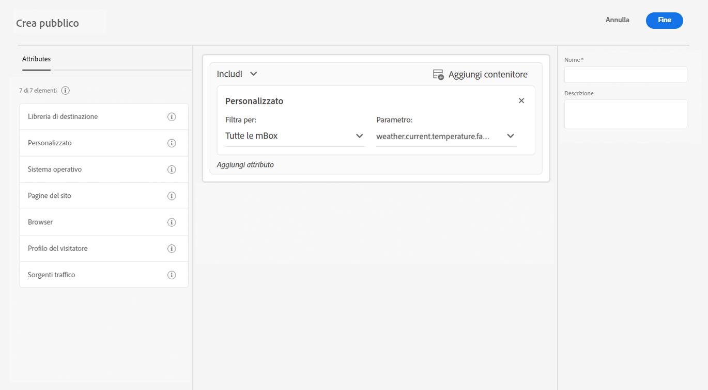

# Migliora la raccolta dati con i dati meteo da [!DNL The Weather Channel]

Adobe ha collaborato con [!DNL [The Weather Company]](https://www.ibm.com/weather) per portare il contesto aggiuntivo del meteo degli Stati Uniti ai dati raccolti tramite stream di dati. Puoi utilizzare questi dati per l’analisi, il targeting e la creazione di tipi di pubblico in Experience Platform.

Sono disponibili tre tipi di dati da [!DNL The Weather Channel]:

* **[!UICONTROL Meteo attuale]**: le condizioni meteo attuali dell’utente, in base alla sua posizione. Ciò include la temperatura corrente, le precipitazioni, la copertura nuvolosa e altro ancora.
* **[!UICONTROL Meteo previsto]**: la previsione include 1, 2, 3, 5, 7 e 10 giorni per la posizione utente.
* **[!UICONTROL Trigger]**: i trigger sono combinazioni specifiche che vengono mappate su diverse condizioni meteo semantiche. Esistono tre diversi tipi di trigger meteo:

   * **[!UICONTROL Trigger meteo]**: condizioni semanticamente significative, come meteo freddo o piovoso. Questi possono differire nelle loro definizioni tra i vari climi.
   * **[!UICONTROL Trigger prodotto]**: condizioni che porterebbero all’acquisto di diversi tipi di prodotti. Ad esempio: le previsioni del tempo freddo potrebbero indicare che gli acquisti di impermeabili sono più probabili.
   * **[!UICONTROL Trigger meteo gravi]**: avvisi meteo gravi, come tempeste invernali o avvisi di uragani.

## Prerequisiti {#prerequisites}

Prima di utilizzare i dati meteo, è necessario soddisfare i seguenti prerequisiti:

* È necessario concedere in licenza i dati meteo che verranno utilizzati da [!DNL The Weather Channel]. Seguirà l’abilitazione del meteo sul tuo account.
* I dati meteo sono disponibili solo attraverso stream di dati. Per utilizzare i dati meteo, è necessario utilizzare [!DNL Web SDK], [!DNL Mobile Edge Extension] o [Server API](../../server-api/overview.md) per includere tali dati.
* Lo stream di dati deve avere abilitata la funzione di [[!UICONTROL geolocalizzazione]](../configure.md#advanced-options).
* Aggiungi il [gruppo di campi meteo](#schema-configuration) allo schema in uso.

## Provisioning {#provisioning}

Dopo aver concesso la licenza ai dati da [!DNL The Weather Channel], il tuo account potrà accedere ai dati. Successivamente, contatta l’Assistenza clienti di Adobe perché i dati siano abilitati nello stream di dati. Una volta abilitati, i dati verranno aggiunti automaticamente.

Puoi convalidarne l’aggiunta eseguendo un controllo Edge con il Debugger o utilizzando Assurance per tracciare un hit attraverso [!DNL Edge Network].

### Configurazione dello schema {#schema-configuration}

È necessario aggiungere i gruppi di campi meteo allo schema di Experience Platform corrispondente al set di dati dell’evento che stai utilizzando nello stream di dati. Sono disponibili cinque gruppi di campo:

* [!UICONTROL Meteo previsto]
* [!UICONTROL Meteo attuale]
* [!UICONTROL Trigger del prodotto]
* [!UICONTROL Trigger relativi]
* [!UICONTROL Trigger meteo gravi]

## Accedere ai dati meteo {#access-weather-data}

Una volta che i dati sono concessi in licenza e disponibili, puoi accedervi in vari modi in tutti i servizi Adobe.

### Adobe Analytics {#analytics}

In [!DNL Adobe Analytics], i dati meteo sono disponibili per la mappatura tramite regole di elaborazione, insieme al resto dello schema [!DNL XDM].

Puoi trovare l’elenco di campi da mappare nella pagina di [riferimento meteo](weather-reference.md). Come per tutti gli schemi di [!DNL XDM], le chiavi hanno il prefisso `a.x`. Ad esempio, un campo denominato `weather.current.temperature.farenheit` in [!DNL Analytics] verrebbe visualizzato come `a.x.weather.current.temperature.farenheit`.

### Adobe Customer Journey Analytics {#cja}

In [!DNL Adobe Customer Journey Analytics], i dati meteo sono disponibili nel set di dati specificato nello stream di dati. Se gli attributi meteo sono [aggiunti allo schema](#prerequisites-prerequisites), saranno disponibili per [aggiungere a una visualizzazione dati](https://experienceleague.adobe.com/docs/analytics-platform/using/cja-dataviews/create-dataview.html?lang=it) in [!DNL Customer Journey Analytics].

### Real-Time Customer Data Platform {#rtcdp}

I dati meteo sono disponibili in [Real-time Customer Data Platform](../../rtcdp/overview.md), per l&#39;utilizzo in audience. I dati meteo sono collegati agli eventi.

Poiché le condizioni atmosferiche cambiano frequentemente, Adobe consiglia di impostare vincoli di tempo per i tipi di pubblico, come illustrato nell’esempio precedente. Registrare un giorno freddo nell’ultimo giorno o due ha un maggiore impatto averlo registrato 6 mesi fa.

Consulta il [riferimento meteo](weather-reference.md) per i campi disponibili.

### Adobe Target {#target}

In [!DNL Adobe Target], puoi utilizzare i dati meteo per stimolare la personalizzazione in tempo reale. I dati meteo vengono trasmessi a [!DNL Target] come parametri [!UICONTROL mBox] e puoi accedervi tramite un parametro [!UICONTROL mBox].

Il parametro è il percorso [!DNL XDM] di un campo specifico. Consulta il [riferimento meteo](weather-reference.md) per i campi disponibili e i percorsi corrispondenti.

## Passaggi successivi {#next-steps}

Dopo aver letto questo documento, ora hai una migliore comprensione di come utilizzare i dati meteo nelle varie soluzioni di Adobe. Per ulteriori informazioni sulla mappatura dei campi dei dati meteo, consulta il [riferimento alla mappatura del campo](weather-reference.md).
