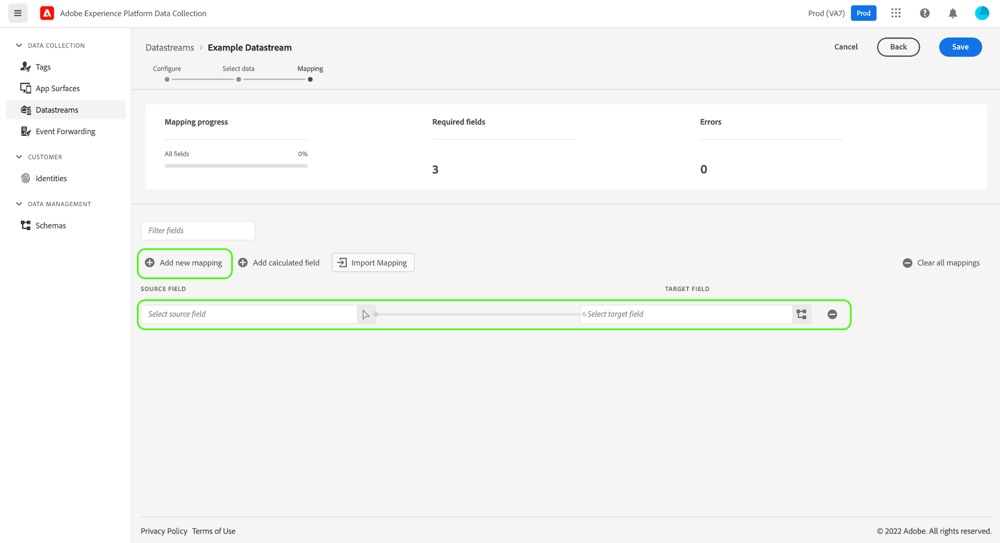
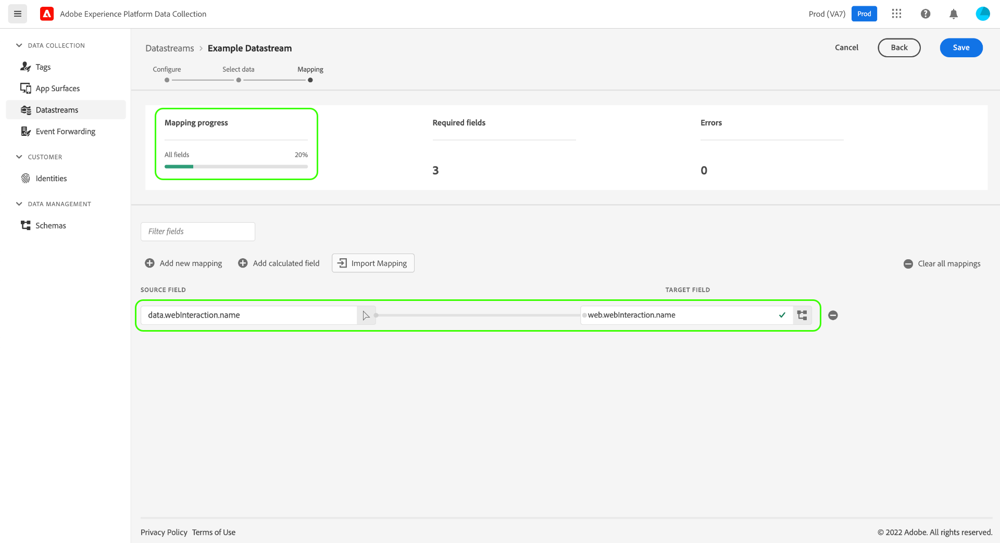
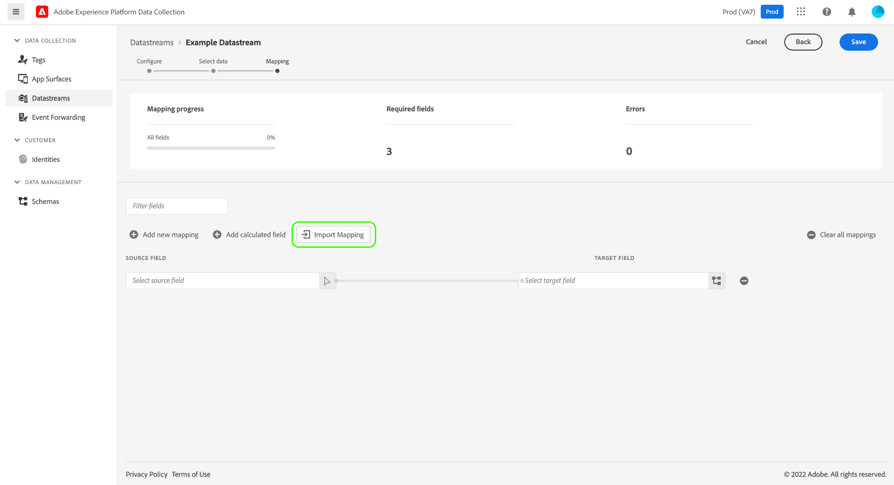
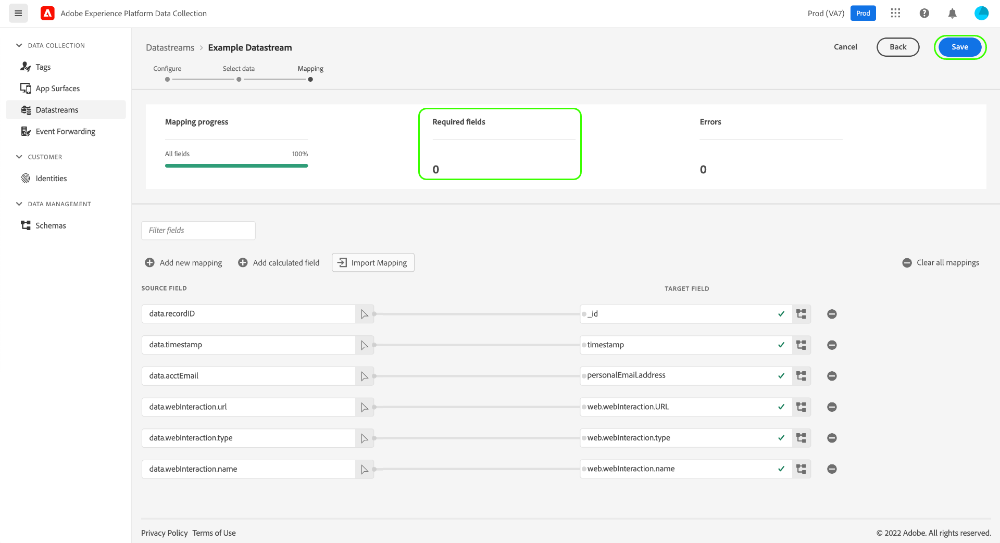

# Preparazione dei dati per la raccolta dati

Utilizza [!DNL Data Prep], un servizio [!DNL Adobe Experience Platform], per mappare, trasformare e convalidare i dati da e verso [Experience Data Model (XDM)](/help/xdm/home.md). Durante la configurazione di un [flusso di dati](/help/datastreams/overview.md) abilitato per Experience Platform, puoi utilizzare le funzionalità [!DNL Data Prep] per mappare i dati di origine su XDM durante l&#39;invio a [!DNL Adobe Experience Platform Edge Network].

Tutti i dati inviati da una pagina web devono pervenire ad Experience Platform come XDM. Sono disponibili tre modi per tradurre i dati da un livello dati su pagina a XDM accettato da Experience Platform:

1. Riformattare il livello dati in XDM sulla pagina web stessa.
2. Utilizza la funzionalità integrata di [!DNL Tags] elementi dati per riformattare in XDM il formato di livello dati esistente di una pagina web.
3. Riformattare il formato del livello dati esistente di una pagina web in XDM tramite [!DNL Edge Network], utilizzando la preparazione dati per la raccolta dati.

Questa guida descrive la terza opzione.

## Quando utilizzare la preparazione dati per la raccolta dati {#when-to-use-data-prep}

La preparazione per la raccolta dei dati è utile in due situazioni:

1. Il sito Web dispone di un livello dati ben formato, gestito e gestito e preferisci inviarlo direttamente a [!DNL Edge Network] invece di utilizzare la manipolazione di JavaScript per convertirlo in XDM sulla pagina (tramite elementi dati [!DNL Tags] o tramite la manipolazione manuale di JavaScript).
2. Nel sito è stato distribuito un sistema di assegnazione tag diverso da [!DNL Tags].

## Inviare un livello dati esistente ad Edge Network tramite Web SDK {#send-datalayer-via-websdk}

Il livello dati esistente deve essere inviato utilizzando l&#39;oggetto [`data`](/help/collection/js/commands/sendevent/data.md) nel comando `sendEvent`.

Se si utilizza [!DNL Tags], è necessario utilizzare il campo **[!UICONTROL Data]** del tipo di azione [**[!UICONTROL Send Event]**](/help/tags/extensions/client/web-sdk/actions/send-event.md).

Il resto di questa guida illustra come mappare il livello dati agli standard XDM dopo che è stato inviato dal Web SDK.

>[!NOTE]
>
>Per informazioni complete su tutte le funzionalità di [!DNL Data Prep], incluse le funzioni di trasformazione per i campi calcolati, vedere la seguente documentazione:
>
>* [Panoramica sulla preparazione dei dati](/help/data-prep/home.md)
>* [Funzioni di mappatura della preparazione dei dati](/help/data-prep/functions.md)
>* [Gestione dei formati dei dati con la preparazione dei dati](/help/data-prep/data-handling.md)

Questa guida illustra come mappare i dati nell’interfaccia utente. Per completare i passaggi, avvia il processo di creazione di uno stream di dati fino al [passaggio di configurazione di base](/help/datastreams/configure.md#create) (incluso).

Per una dimostrazione rapida del processo di preparazione dei dati per la raccolta dei dati, guarda il video seguente:

>[!VIDEO](https://video.tv.adobe.com/v/345565?captions=ita&quality=12&enable10seconds=on&speedcontrol=on)

## Fornisci dati di esempio {#select-data}

Selezionare **[!UICONTROL Save and Add Mapping]** dopo aver completato la configurazione di base per uno stream di dati e viene visualizzato il passaggio **[!UICONTROL Select data]**. Da qui, devi fornire un oggetto JSON campione che rappresenti la struttura dei dati che intendi inviare ad Experience Platform.

Per acquisire proprietà direttamente dal livello dati, l’oggetto JSON deve avere una singola proprietà principale `data`. Le sottoproprietà dell&#39;oggetto `data` devono quindi essere costruite in modo da eseguire il mapping alle proprietà del livello dati che si desidera acquisire. Seleziona la sezione seguente per visualizzare un esempio di oggetto JSON formattato correttamente con una radice `data`.

+++File JSON di esempio con radice `data`

```json
{
  "data": {
    "eventMergeId": "cce1b53c-571f-4f36-b3c1-153d85be6602",
    "eventType": "view:load",
    "timestamp": "2021-09-30T14:50:09.604Z",
    "web": {
      "webPageDetails": {
        "siteSection": "Product section",
        "server": "example.com",
        "name": "product home",
        "URL": "https://www.example.com"
      },
      "webReferrer": {
        "URL": "https://www.adobe.com/index2.html",
        "type": "external"
      }
    },
    "commerce": {
      "purchase": 1,
      "order": {
        "orderID": "1234"
      }
    },
    "product": [
      {
        "productInfo": {
          "productID": "123"
        }
      },
      {
        "productInfo": {
          "productID": "1234"
        }
      }
    ],
    "reservation": {
      "id": "anc45123xlm",
      "name": "Embassy Suits",
      "SKU": "12345-L",
      "skuVariant": "12345-LG-R",
      "priceTotal": "112.99",
      "currencyCode": "USD",
      "adults": 2,
      "children": 3,
      "productAddMethod": "PDP",
      "_namespace": {
        "test": 1,
        "priceTotal": "112.99",
        "category": "Overnight Stay"
      },
      "freeCancellation": false,
      "cancellationFee": 20,
      "refundable": true
    }
  }
}
```

+++

Per acquisire proprietà da un elemento dati di un oggetto XDM, all’oggetto JSON si applicano le stesse regole, ma la proprietà principale deve essere invece impostata come `xdm`. Seleziona la sezione seguente per visualizzare un esempio di oggetto JSON formattato correttamente con una radice `xdm`.

+++File JSON di esempio con radice `xdm`

```json
{
  "xdm": {
    "environment": {
      "type": "browser",
      "browserDetails": {
        "userAgent": "Mozilla/5.0 (Macintosh; Intel Mac OS X 10_7_5) AppleWebkit/537.36 (KHTML, like Gecko) Chrome/49.0.2623.112 Safari/537.36",
        "javaScriptEnabled": true,
        "javaScriptVersion": "1.8.5",
        "cookiesEnabled": true,
        "viewportHeight": 900,
        "viewportWidth": 1680,
        "javaEnabled": true
      },
      "domain": "adobe.com",
      "colorDepth": 24,
      "viewportHeight": 1050,
      "viewportWidth": 1680
    },
    "device": {
      "screenHeight": 1050,
      "screenWidth": 1680
    }
  }
}
```

+++

È possibile selezionare l’opzione per caricare l’oggetto come file oppure incollarlo nella casella di testo specificata. Se il JSON è valido, nel pannello di destra viene visualizzato uno schema di anteprima. Selezionare **[!UICONTROL Next]** per continuare.


>[!NOTE]
>
>Utilizza un oggetto JSON di esempio che rappresenta ogni elemento del livello dati che può essere utilizzato su qualsiasi pagina. Ad esempio, non tutte le pagine utilizzano gli elementi del livello dati del carrello. Tuttavia, includi gli elementi del livello dati del carrello in questo oggetto JSON di esempio.

## Mappare i dati {#mapping}

Viene visualizzato il passaggio **[!UICONTROL Mapping]**, che consente di mappare i campi nei dati di origine a quelli dello schema dell&#39;evento di destinazione in Experience Platform. Da qui puoi configurare la mappatura in due modi:

* [Crea regole di mappatura](#create-mapping) per questo flusso di dati tramite un processo manuale.
* [Importare regole di mappatura](#import-mapping) da un flusso di dati esistente.

>[!IMPORTANT]
>
>La mappatura [!DNL Data Prep] sostituisce i payload XDM `identityMap`, il che può influire ulteriormente sulla corrispondenza dei profili rispetto a [!DNL Real-Time CDP] tipi di pubblico.

### Creare regole di mappatura {#create-mapping}

Per creare una regola di mappatura, selezionare **[!UICONTROL Add new mapping]**.



Seleziona l&#39;icona di origine () e nella finestra di dialogo visualizzata seleziona il campo di origine da mappare nell&#39;area di lavoro fornita. Dopo aver scelto un campo, utilizzare il pulsante **[!UICONTROL Select]** per continuare.


Quindi, seleziona l&#39;icona dello schema () per aprire una finestra di dialogo simile per lo schema dell&#39;evento di destinazione. Scegliere il campo a cui si desidera mappare i dati prima di confermare con **[!UICONTROL Select]**.


Viene visualizzata di nuovo la pagina della mappatura con la mappatura di campi completata. La sezione **[!UICONTROL Mapping progress]** viene aggiornata per riflettere il numero totale di campi mappati correttamente.



>[!TIP]
>
>Per mappare un array di oggetti (nel campo di origine) su un array di oggetti diversi (nel campo di destinazione), aggiungi `[*]` dopo il nome dell’array nei percorsi dei campi di origine e di destinazione, come illustrato di seguito.
>
>

### Importare regole di mappatura esistenti {#import-mapping}

Se in precedenza hai creato un flusso di dati, puoi riutilizzarne le regole di mappatura configurate per un nuovo flusso di dati.

>[!WARNING]
>
>L’importazione di regole di mappatura da un altro stream di dati sovrascrive eventuali mappature di campo aggiunte prima dell’importazione.

Per iniziare, selezionare **[!UICONTROL Import Mapping]**.



Nella finestra di dialogo visualizzata, seleziona lo stream di dati di cui desideri importare le regole di mappatura. Una volta scelto lo stream di dati, selezionare **[!UICONTROL Preview]**.


>[!NOTE]
>
>Gli stream di dati possono essere importati solo all’interno della stessa [sandbox](/help/sandboxes/home.md). Non puoi importare un flusso di dati da una sandbox all’altra.

La schermata successiva mostra un’anteprima delle regole di mappatura salvate per lo stream di dati selezionato. Verificare che i mapping visualizzati siano quelli previsti, quindi selezionare **[!UICONTROL Import]** per confermare e aggiungere i mapping al nuovo flusso di dati.


>[!NOTE]
>
>Se un campo di origine nelle regole di mappatura importate non è incluso nei dati JSON di esempio [forniti in precedenza](#select-data), tali mappature di campi non saranno incluse nell’importazione.

### Completare la mappatura {#complete-mapping}

Continua a mappare i campi rimanenti sullo schema di destinazione. Anche se non è necessario mappare tutti i campi sorgente disponibili, tutti i campi nello schema di destinazione impostati come richiesto devono essere mappati per completare questo passaggio. Il contatore **[!UICONTROL Required fields]** indica quanti campi obbligatori non sono ancora mappati nella configurazione corrente.

Quando il conteggio dei campi richiesto raggiunge zero e la mappatura è soddisfacente, selezionare **[!UICONTROL Save]** per finalizzare le modifiche.



## Passaggi successivi {#next-steps}

Questa guida illustra come mappare i dati su XDM durante la configurazione di uno stream di dati nell’interfaccia utente. Se stavi seguendo l&#39;esercitazione generale sui flussi di dati, ora puoi tornare al passaggio [visualizzazione dei dettagli dello stream di dati](/help/datastreams/overview.md).
