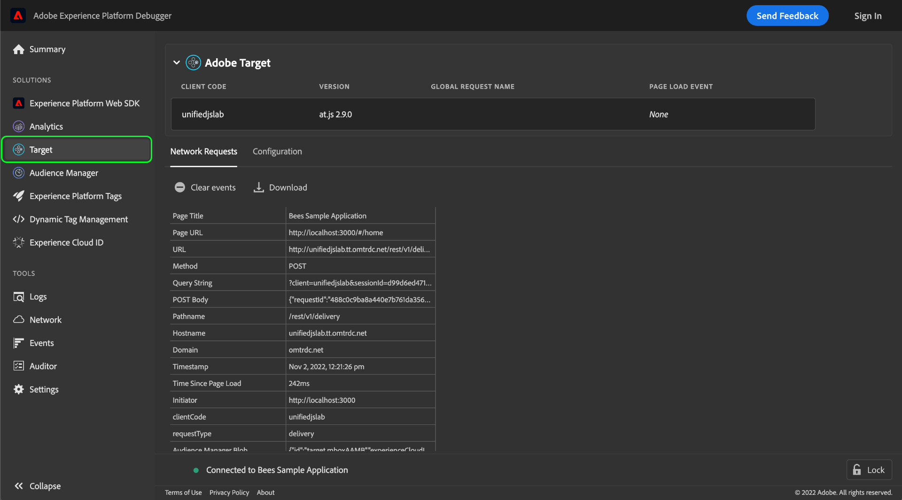

# Testare un’implementazione di Adobe Target con Adobi Experience Platform Debugger

Adobi Experience Platform Debugger fornisce una suite di utili strumenti per testare e eseguire il debug di un sito web che è stato dotato di un’implementazione di Adobe Target. Questa guida descrive alcuni flussi di lavoro comuni e best practice per l’utilizzo di Platform Debugger su un sito web abilitato per Target.

## Prerequisiti

Per utilizzare Platform Debugger per Target, il sito web deve utilizzare [Libreria at.js](https://developer.adobe.com/target/implement/client-side/atjs/how-atjs-works/) versione 1.x o successiva. Le versioni precedenti non sono supportate.

## Inizializzazione di Platform Debugger

Apri il sito web da testare in un browser, quindi apri l’estensione Platform Debugger.

Seleziona **[!DNL Target]** (Progetti) nel pannello di navigazione a sinistra. Se Platform Debugger rileva che sul sito è in esecuzione una versione compatibile di at.js, vengono visualizzati i dettagli di implementazione di Adobe Target.

## Informazioni di configurazione globali

Le informazioni sulla configurazione globale dell’implementazione vengono visualizzate nella parte superiore della vista Target in Platform Debugger.

| Nome | Descrizione |
| --- | --- |
| Codice client | Un ID univoco che identifica la tua organizzazione. |
| Versione | Versione della libreria di Adobe Target attualmente installata sul sito web. |
| Nome richiesta globale | Il nome del [mbox globale](https://developer.adobe.com/target/implement/client-side/atjs/global-mbox/global-mbox-overview/?) per l’implementazione di Target, il nome predefinito è `target-global-mbox`. |
| Evento caricamento pagina | Valore booleano che indica se [evento di caricamento pagina](https://developer.adobe.com/target/implement/client-side/atjs/how-atjs-works/how-atjs-works/#atjs-2x-diagrams) ha avuto luogo. Gli eventi di caricamento pagina sono supportati solo per at.js 2.x. Per le versioni non compatibili, il valore predefinito è `None`. |

{style="table-layout:auto"}

## [!DNL Network Requests] {#network}

Seleziona **[!DNL Network Requests]** per visualizzare informazioni di riepilogo su ogni richiesta di rete effettuata sulla pagina.

![Il [!DNL Network Requests] sezione per Target selezionata in Platform Debugger](../images/solutions/target/network-requests.png)

Quando esegui azioni sulla pagina (compreso il ricaricamento della pagina), vengono aggiunte automaticamente nuove colonne alla tabella, che ti consentono di visualizzare la sequenza delle azioni e il modo in cui i valori vengono modificati tra ogni richiesta.

![Il [!DNL Network Requests] sezione per Target selezionata in Platform Debugger](../images/solutions/target/new-request.png)

Vengono acquisiti i seguenti valori:

| Nome | Descrizione |
| --- | --- |
| [!DNL Page Title] | Titolo della pagina che ha avviato la richiesta. |
| [!DNL Page URL] | URL della pagina che ha avviato la richiesta. |
| [!DNL URL] | L’URL non elaborato della richiesta. |
| [!DNL Method] | Il metodo HTTP per la richiesta. |
| [!DNL Query String] | Stringa di query della richiesta, tratta dall’URL. |
| [!DNL POST Body] | Corpo della richiesta (impostato solo per le richieste POST). |
| [!DNL Pathname] | Il percorso dell’URL della richiesta. |
| [!DNL Hostname] | Il nome host dell’URL della richiesta. |
| [!DNL Domain] | Dominio dell’URL della richiesta. |
| [!DNL Timestamp] | Una marca temporale di quando si è verificata la richiesta (o l’evento), entro il fuso orario del browser. |
| [!DNL Time Since Page Load] | Tempo trascorso dal caricamento iniziale della pagina al momento della richiesta. |
| [!DNL Initiator] | Iniziatore della richiesta. In altre parole, chi ha presentato la richiesta? |
| [!DNL clientCode] | L’identificatore dell’account della tua organizzazione come riconosciuto da Target. |
| [!DNL requestType] | API utilizzata per la richiesta. Se utilizzi at.js 1.x, il valore è `/json`. Se utilizzi at.js 2.x, il valore è `delivery`. |
| [!DNL Audience Manager Blob] | Fornisce informazioni sui metadati di Audience Manager crittografati denominati BLOB. |
| [!DNL Audience Location Hint] | L&#39;ID della regione di raccolta dati. Questo è un identificatore numerico per la posizione geografica di un particolare datacenter del servizio ID. Per ulteriori informazioni, consulta la documentazione di Audience Manager su [ID regioni DCS, posizioni e nomi host](https://experienceleague.adobe.com/docs/audience-manager/user-guide/api-and-sdk-code/dcs/dcs-api-reference/dcs-regions.html?lang=it) e la guida del servizio Experience Cloud Identity su [`getLocationHint`](https://experienceleague.adobe.com/docs/id-service/using/id-service-api/methods/getlocationhint.html#reference-a761030ff06c4439946bb56febf42d4c). |
| [!DNL Browser Height] | Altezza del browser in pixel. |
| [!DNL Browser Time Offset] | Offset orario del browser associato al relativo fuso orario. |
| [!DNL Browser Width] | Larghezza del browser in pixel. |
| [!DNL Color Depth] | Profondità colore dello schermo. |
| [!DNL context] | Oggetto che contiene informazioni contestuali sul browser utilizzato per effettuare la richiesta, incluse le dimensioni dello schermo e la piattaforma client. |
| [!DNL prefetch] | I parametri utilizzati in durante `prefetch` elaborazione. |
| [!DNL execute] | I parametri utilizzati durante `execute` elaborazione. |
| [!DNL Experience Cloud Visitor ID] | Se ne viene rilevata una, fornisce informazioni sulla [ID Experience Cloud (ECID)](https://experienceleague.adobe.com/docs/id-service/using/intro/overview.html?lang=it) che è assegnato al visitatore del sito corrente. |
| [!DNL experienceCloud] | Contiene gli ID Experience Cloud per questa sessione utente specifica: a4T [ID dati supplementare](https://experienceleague.adobe.com/docs/target/using/integrate/a4t/before-implement.html?#section_2C1F745A2B7D41FE9E30915539226E3A), e un [ID visitatore (ECID)](https://experienceleague.adobe.com/docs/id-service/using/intro/overview.html?lang=it). |
| [!DNL id] | Il [ID destinazione](https://developers.adobetarget.com/api/delivery-api/#section/Identifying-Visitors/Target-ID) per il visitatore. |
| [!DNL Mbox Host] | Il [host](https://experienceleague.adobe.com/docs/target/using/administer/hosts.html?lang=it) che la richiesta di Target è stata effettuata a. |
| [!DNL Mbox PC] | Una stringa che racchiude il [`mbox`](https://developer.adobe.com/target/implement/client-side/atjs/global-mbox/global-mbox-overview/) session ID e [Adobe Target Edge](https://experienceleague.adobe.com/docs/target/using/introduction/how-target-works.html#concept_0AE2ED8E9DE64288A8B30FCBF1040934) hint di posizione. Questo valore viene utilizzato da at.js per garantire che la sessione e la posizione Edge rimangano permanenti. |
| [!DNL Mbox Referrer] | Il referente URL per il [`mbox`](https://developer.adobe.com/target/implement/client-side/atjs/global-mbox/global-mbox-overview/) richiesta. |
| [!DNL Mbox URL] | L&#39;URL per [`mbox`](https://developer.adobe.com/target/implement/client-side/atjs/global-mbox/global-mbox-overview/) server. |
| [!DNL Mbox Version] | Versione di [`mbox`](https://developer.adobe.com/target/implement/client-side/atjs/global-mbox/global-mbox-overview/) in uso. |
| [!DNL mbox3rdPartyId] | Il [`mbox3rdPartyId`](https://experienceleague.adobe.com/docs/target/using/audiences/visitor-profiles/3rd-party-id.html) assegnato al visitatore corrente. |
| [!DNL mboxRid] | Il [`mbox`](https://developer.adobe.com/target/implement/client-side/atjs/global-mbox/global-mbox-overview/) ID richiesta. |
| [!DNL requestId] | Un ID univoco per la richiesta. |
| [!DNL Screen Height] | Altezza dello schermo in pixel. |
| [!DNL Screen Width] | Larghezza dello schermo in pixel. |
| [!DNL Supplemental Data ID] | ID generato dal sistema e utilizzato per associare i visitatori alle chiamate corrispondenti di Adobe Target e Adobe Analytics. Consulta la [Guida alla risoluzione dei problemi di A4T](https://experienceleague.adobe.com/docs/target/using/integrate/a4t/troubleshoot-a4t/a4t-troubleshooting.html?#section_75002584FA63456D8D9086172925DD8D) per ulteriori informazioni. |
| [!DNL vst] | Il [Configurazione API del servizio Experience Cloud Identity](https://experienceleague.adobe.com/docs/id-service/using/id-service-api/configurations/function-vars.html). |
| [!DNL webGLRenderer] | Fornisce informazioni sul renderer WebGL utilizzato nella pagina, se applicabile. |

{style="table-layout:auto"}

Per visualizzare i dettagli di un parametro in un particolare evento di rete, selezionare la cella della tabella in questione. Viene visualizzata una finestra a comparsa che fornisce ulteriori informazioni sul parametro, inclusa una descrizione e il relativo valore. Se il valore è un oggetto JSON, la finestra di dialogo include una visualizzazione completamente navigabile della struttura dell’oggetto.

![Il [!DNL Network Requests] sezione per Target selezionata in Platform Debugger](../images/solutions/target/request-param-details.png)

## [!DNL Configuration]

Seleziona **[!DNL Configuration]** per abilitare o disabilitare una selezione di strumenti di debug aggiuntivi per Target.

![Il [!DNL Configuration Requests] sezione per Target selezionata in Platform Debugger](../images/solutions/target/configuration.png)

| Strumento di debug | Descrizione |
| --- | --- |
| [!DNL Target Console Logging] | Quando è abilitata, ti consente di accedere ai registri at.js nella scheda della console del browser. Questa funzione può essere abilitata anche aggiungendo un’ `mboxDebug` parametro di query (con qualsiasi valore) per l’URL del browser. |
| [!DNL Target Diable] | Quando è abilitata, tutte le funzionalità di Target sono disabilitate sulla pagina. Questa può essere utilizzata per determinare se l’origine del problema sulla pagina è un’offerta specifica di Target. |
| [!DNL Target Trace] | **Nota**: per abilitare questa funzione devi aver effettuato l’accesso.  Quando questa opzione è abilitata, i token di tracciamento vengono inviati con ogni richiesta e in ogni risposta viene restituito un oggetto di traccia. `at.js` analizza la risposta `window.__targetTraces`. Ogni oggetto trace contiene le stesse informazioni del [[!DNL Network Requests] tab], con le seguenti aggiunte:<ul><li>Uno snapshot del profilo, che consente di visualizzare gli attributi prima e dopo le richieste.</li><li>Corrispondenza e non corrispondenza [attività](https://experienceleague.adobe.com/docs/target/using/activities/target-activities-guide.html), che mostra perché il profilo corrente è idoneo o meno per attività specifiche.<ul><li>Questo può aiutare a identificare i tipi di pubblico per cui un profilo si qualifica in un dato punto e perché.</li><li>I documenti di Target contengono ulteriori informazioni su diversi tipi di attività</li></ul></li></ul> |

{style="table-layout:auto"}
