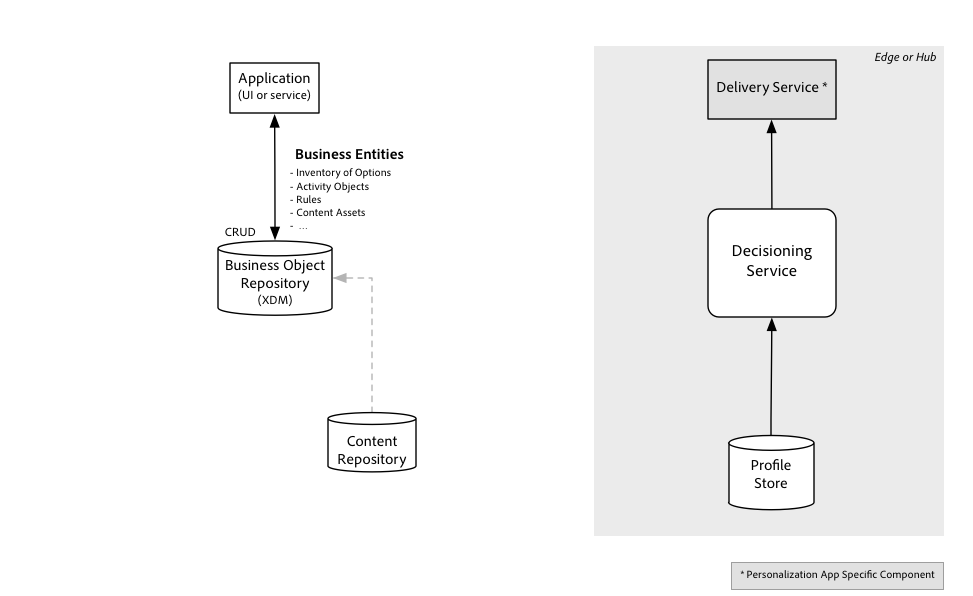

# Panoramica sul servizio di disattivazione

[!DNL Decisioning Service] consente di creare esperienze personalizzate, ottimizzate e orchestrate in applicazioni eseguite  Adobe Experience Platform. Utilizzando [!DNL Decisioning Service]potete determinare l&#39; *opzione* migliore da un set di scelte disponibili. Queste opzioni, denominate anche alternative, potrebbero essere offerte, raccomandazioni di prodotto, componenti di contenuto per un&#39;esperienza Web, script di conversazione e azioni da intraprendere. Attualmente il caso d&#39;uso e il dominio di *Offer Decisioning* sono supportati, dove le opzioni di decisione sono modellate specificatamente come offerte, con il supporto per ulteriori casi d&#39;uso a venire.

I clienti [!DNL Decisioning Service]possono riutilizzare la logica aziendale e condividere un catalogo di opzioni tra canali e applicazioni. Invece di gestire le opzioni decisionali e le strategie per selezionarle direttamente all&#39;interno di un&#39;applicazione, ora possono essere sfruttate indipendentemente da quando, come e su quale canale l&#39;utente finale di un cliente interagisce con un&#39;azienda o un&#39;organizzazione.

Le strategie di decisione possono essere fattori nelle molteplici interazioni che un cliente ha avuto, su diversi canali e applicazioni. Ad esempio, l&#39;attività dell&#39;applicazione call center potrebbe abilitare o sopprimere un messaggio di marketing per un certo periodo di tempo a seguito di un reclamo, e tale messaggio stesso potrebbe essere basato su acquisti effettuati e recensioni pubblicate dal cliente.

[!DNL Decisioning Service] semplifica la personalizzazione dell&#39;esperienza evoluta.

| Prima della decisione dell&#39;esperienza | Dopo la decisione dell&#39;esperienza |
| --- | --- |
| Personalizza e ottimizza le esperienze dell’utente all’interno di un singolo canale o in un piccolo set di punti di contatto esperienza. | Le esperienze sono risposte orchestrate tra le varie interazioni. |
| Le ottimizzazioni si concentrano su una fase singola e tipicamente breve del percorso dell&#39;utente finale | Le decisioni si basano sull&#39;intera storia dell&#39;interazione, passando dai comportamenti rilevati in passato all&#39;ultimo contesto situazionale. |
| Le opzioni e le strategie per la scelta delle opzioni da presentare durante l&#39;esperienza del cliente sono in genere codificate profondamente all&#39;interno di un&#39;applicazione. | Le strategie per selezionare l&#39;opzione migliore sono definite al di fuori delle applicazioni specifiche del canale e diventano riutilizzabili. |
| Le esperienze dei clienti sono personalizzate e ottimizzate in base a un obiettivo semplicistico, ad esempio per aumentare il numero di pagamenti di successo in una pagina Web o per accettare un&#39;offerta presentata in un&#39;interazione con un rappresentante. | Le esperienze cliente sono ottimizzate in base a una comprensione olistica delle attuali esigenze del cliente e si adattano a tutte le esperienze dell&#39;utente, buone o cattive. Ad esempio, una campagna di marketing potrebbe non essere appropriata per un cliente che ha recentemente presentato un reclamo su un prodotto o un servizio. |

[!DNL Decisioning Service] sposta le funzionalità di personalizzazione dell&#39;esperienza da un targeting in un singolo canale a una determinazione dello stadio generale del ciclo di vita del coinvolgimento dei clienti con il tuo marchio, indipendentemente dai canali. Una fase del ciclo di vita è molto più complessa di un&#39;appartenenza a un segmento ed è quasi sempre basata su flussi di eventi complessi, regole aziendali e attributi previsti.

Altri termini utilizzati da prodotti e servizi destinati a casi d’uso simili:

- Gestione interazione in tempo reale (RTIM)
- Gestione del viaggio
- Marketing e personalizzazione omnicanale
- Decisioni in tempo reale

## Come [!DNL Decisioning Service] funziona?

Le esperienze possono essere personalizzate utilizzando [!DNL Decisioning Service] in tempo reale, man mano che il cliente interagisce con il tuo marchio tramite un canale in ingresso, come il tuo sito o l&#39;app mobile. La decisione può essere utilizzata anche per personalizzare i messaggi tramite il canale in uscita, come una notifica e-mail o push.

Le decisioni possono essere prese in molti modi. Un approccio consiste nell&#39;eliminare le opzioni in successione fino a quando non ne viene lasciata una sola o le opzioni non sono state ridotte e rimane qualche sottoinsieme o un vincitore viene scelto in modo casuale dal set ridotto. Una variante di questo approccio per scegliere l&#39;opzione vincente in base a una formula calcolata. La classificazione delle opzioni è realizzata utilizzando una funzione. Per la decisione dell&#39;offerta, tale funzione potrebbe calcolare il costo, il valore dell&#39;offerta all&#39;azienda e utilizzare una predeterminata probabilità che l&#39;offerta venga accettata dall&#39;utente finale. La valutazione risultante potrebbe essere utilizzata per ordinare le offerte.

In alternativa o in aggiunta, una strategia potrebbe essere basata sui risultati raccolti dalle interazioni precedenti con clienti simili a cui sono state proposte opzioni simili. In questa strategia viene appresa la funzione che ha calcolato i valori di priorità. Il valore di risultato ottimale è legato agli obiettivi dell&#39;attività e l&#39;indicatore di prestazioni per la previsione è la frequenza con cui il risultato è stato raggiunto dopo la proposta dell&#39;opzione.

### Strategia di decisione

Le strategie decisionali sono configurate tramite oggetti denominati _attività_. Ogni strategia di decisione è essenzialmente un algoritmo o una funzione che utilizza le opzioni N {o1, o2, ...oN} come input e produce un elenco ordinato di opzioni (o1, o2,...oK) in cui la prima opzione nell&#39;elenco viene considerata la migliore in base a criteri di ottimizzazione, la seconda opzione nell&#39;elenco dei risultati viene quindi considerata la seconda opzione migliore e così via.

In qualsiasi momento durante il percorso del cliente, l&#39;opzione migliore per una determinata attività viene rivalutata in base al set più recente di variabili di contesto, regole e vincoli. Le variabili di contesto includono i record memorizzati in [!DNL Real Time Customer Profile]. Un&#39;entità record centrale è un profilo del cliente, ma altre entità come i dati aziendali operativi sono ugualmente disponibili per l&#39;attività.

L&#39;algoritmo o la funzione che genera l&#39;elenco delle opzioni principali K varia in base al caso d&#39;uso. I componenti interni di tale algoritmo sono diversi per i diversi casi di utilizzo. I componenti sono definiti in un repository in fase di progettazione e &quot;compilati&quot; in istruzioni per la strategia decisionale specifica per il caso d’uso.

## Utilizzo [!DNL Decisioning Service]

Come [!DNL Decisioning Service]altri [!DNL Platform] servizi, la prima filosofia dell&#39;API viene adottata. Ciò significa che l&#39;API è l&#39;interfaccia principale in cui tutte le funzioni, comprese quelle amministrative, sono rese disponibili tramite le API. Significa anche che altri [!DNL Platform] servizi, soluzioni  Adobi e integrazioni di terze parti utilizzano le stesse API.

Potete utilizzare [!DNL Decisioning Service] in una modalità di interazione richiesta-risposta sincrona facilitata da una semplice API REST HTTP. La chiamata API restituisce l’opzione ottimale per un singolo profilo. La selezione &quot;attualmente migliore opzione&quot; cambierà in base alle regole e ai vincoli applicati a tutte le opzioni che sono in considerazione da una determinata attività. L&#39;API REST consente di ottenere l&#39;opzione migliore successiva per più attività alla volta. Questo consente di arbitrare le opzioni tra i canali. Quando si ottengono insieme risposte per più attività, possono essere applicate regole aggiuntive.

### Integrazione con altri [!DNL Platform] flussi di lavoro

L&#39;utilizzo di [!DNL Decisioning Service] è facoltativo e richiede solo alcuni passaggi oltre ai tipici passaggi necessari per creare [!DNL Profile] entità e gestirle.

>[!NOTE]
>
>Per sfruttare al meglio [!DNL Real-time Customer Profile], l&#39;integrazione [!DNL Decisioning Service] diretta con lo store del profilo. Le chiamate API devono solo indicare una delle identità per un determinato profilo.

La sequenza tipica di passaggi inizia con la creazione di profili:

- Eseguire l&#39;autenticazione su [!DNL Experience Platform].
- Definire uno schema basato sulla classe del profilo e, facoltativamente, definire uno schema basato sulla classe dell&#39;evento esperienza.
- Configurare un dataset in cui caricare dati di record e serie temporali [!DNL Customer Profile].
- Aggiungere i dati tramite il dataset configurato nel passaggio o nei dati dell&#39;istanza di flusso precedente tramite Pipeline.
- Trasferite gli eventi esperienza in [!DNL Platform] modo da arricchire il profilo con i dati comportamentali.

Inoltre, per utilizzare [!DNL Decisioning Service]i seguenti passaggi:

- Definite i componenti decisionali utilizzando le API Repository. Queste sono le entità di business logic che compongono la strategia decisionale. I componenti delle decisioni verranno compilati automaticamente in un formato utilizzato dal [!DNL Decision Service Runtime]. Le API Repository sono illustrate a sinistra nel diagramma seguente.
- Richiamate l&#39;API Runtime per ottenere l&#39;opzione migliore in base alla logica di business definita nel passaggio precedente. Le [!DNL Decision Service Runtime] API sono illustrate a destra nel diagramma seguente.

L&#39;attivazione delle entità business logic avviene automaticamente e in modo continuo. Non appena viene salvata una nuova opzione nella directory archivio e contrassegnata come &quot;approvata&quot;, sarà possibile inserirla nel set di opzioni disponibili. Non appena una regola di decisione viene aggiornata, il set di regole verrà riassemblato e preparato per l&#39;esecuzione in fase di esecuzione. In questa fase di attivazione automatica, verranno valutati tutti i vincoli definiti dalla logica aziendale che non dipendono dal contesto di runtime. I risultati di questo passaggio di attivazione vengono inviati a una cache in cui sono disponibili per il [!DNL Decisioning Service] runtime. Questo è illustrato nel diagramma seguente.

Una volta attivati i set di opzioni, i set di regole e i vincoli e inviati ai [!DNL Decisioning Service] nodi, viene utilizzata una semplice API per inviare una richiesta di decisione. L&#39;API viene generalmente chiamata da un servizio di consegna che prende l&#39;opzione proposta (ad esempio, l&#39;azione migliore successiva o l&#39;offerta migliore successiva) e assembla l&#39;esperienza o esegue l&#39;azione. Se la proposta è un&#39;offerta, il contenuto che rappresenta tale offerta viene ricercato e inserito in un&#39;esperienza consegnata all&#39;utente finale. Questo è illustrato nel diagramma seguente.

[!DNL Delivery Service] raccoglie i dati per la richiesta di decisione. Determina l&#39;ID dell&#39;entità profilo per la quale è decisa l&#39;opzione migliore. Assembla inoltre tutti i dati contestuali non memorizzati in [!DNL Customer Profile] ma potenzialmente utilizzati dalla logica decisionale.

La logica decisionale è organizzata per attività, ciascuna delle quali specifica un filtro per il sottoinsieme di opzioni che dovrebbe essere preso in considerazione per questa attività, insieme a una singola opzione di fallback.

Ogni decisione viene presa applicando prima vincoli per ridurre il numero di opzioni e quindi classificando le opzioni rimanenti. Anche se la maggior parte della logica viene valutata all&#39;interno [!DNL Decisioning Service], vari servizi di aggiunta vengono utilizzati per aiutare con questi due aspetti. Ad esempio, un servizio di capping gestisce i limiti superiori per la frequenza con cui un&#39;opzione può essere utilizzata in qualsiasi decisione e un altro servizio può ospitare un modello di machine learning utilizzato per calcolare i punteggi per un profilo e un&#39;opzione.

Per ulteriori informazioni sull&#39;utilizzo delle API Repository, consultate l&#39;esercitazione sulla [gestione delle entità e delle regole di gestione tramite API](./tutorials/entities.md)

Per ulteriori informazioni sull&#39;utilizzo del [!DNL Decisioning Service] runtime, vedete l&#39;esercitazione su [Utilizzo del runtime del servizio di disattivazione mediante le API](./tutorials/runtime.md)