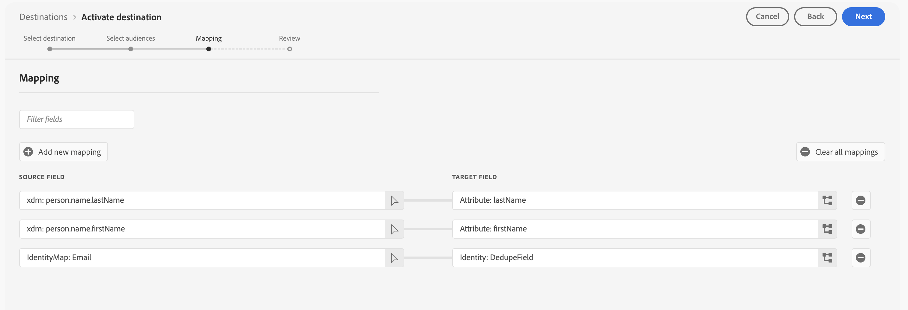

# Connessione Marketo Engage

## Panoramica {#overview}

[!DNL Marketo Engage] è l&#39;unica soluzione CXM (Customer Experience Management) end-to-end per il marketing, la pubblicità, l&#39;analisi e il commerce. Consente di automatizzare e gestire le attività, dalla gestione dei lead CRM al coinvolgimento dei clienti, fino all’attribuzione dei ricavi e al marketing basato sull’account.

Utilizza questa destinazione per la sincronizzazione in tempo reale dei dati del pubblico e degli attributi del profilo tra Adobe Experience Platform e Marketo Engage.

## Casi d’uso {#use-cases}

Per capire meglio come e quando utilizzare la destinazione [!DNL Marketo Engage], ecco alcuni esempi di casi d&#39;uso che i clienti Adobe Experience Platform possono risolvere utilizzando questa destinazione.

### Casi di utilizzo della sincronizzazione del pubblico {#audience-sync-use-cases}

**Richiama solo lead noti**

Il team marketing vuole eseguire una campagna di recupero indirizzata ai lead che non hanno trascorso più di 90 giorni ma che esistono già in Marketo.

Possono attivare il pubblico in Marketo Engage e utilizzare il tipo di sincronizzazione **[!UICONTROL Solo pubblico]**.

### Casi d’uso per la sincronizzazione di pubblici e profili {#audience-profile-sync-use-cases}

**Rivolgiti ai lead noti e aggiorna i lead**

Il team marketing desidera avviare una campagna di ricoinvolgimento per i contatti Marketo esistenti che hanno mostrato interesse in base alle visite al sito Web. Desiderano anche aggiornare le informazioni sui lead (come preferenze, dati demografici), ma non creare nuove persone in Marketo.

Possono attivare i tipi di pubblico in Marketo Engage e utilizzare il tipo di sincronizzazione **[!UICONTROL Pubblico e profilo]** combinato con l&#39;azione **[!UICONTROL Aggiorna solo persone esistenti]** per assicurarsi che vengano indirizzati solo ai tipi di pubblico già esistenti in Marketo.

**Interagisci di nuovo ed espandi la portata con la sincronizzazione completa dei profili**

Il team marketing desidera attivare un pubblico di interesse per il prodotto per una nuova campagna. Anche se molti dei profili esistono già in Marketo, alcuni sono nuovi e presenti solo in Real-Time CDP. Le persone esistenti desiderano assicurarsi di aggiornare tali persone in Marketo, ma anche creare nuovi profili.

Possono attivare i propri tipi di pubblico in Marketo Engage e utilizzare il tipo di sincronizzazione **[!UICONTROL Pubblico e profilo]** combinato con l&#39;azione **[!UICONTROL Aggiorna esistente e crea nuove persone]** per assicurarsi che eseguano il targeting dei lead esistenti da Marketo e crearne di nuovi per i nuovi tipi di pubblico esportati da Real-Time CDP.

## Prerequisiti {#prerequisites}

* L&#39;utente che imposta la destinazione deve disporre dell&#39;autorizzazione [Modifica persona](https://experienceleague.adobe.com/en/docs/marketo/using/product-docs/administration/users-and-roles/descriptions-of-role-permissions#access-database) nell&#39;istanza e nella partizione di Marketo.
* Solo le istanze di Marketo Engage nella stessa organizzazione Adobe Real-Time CDP saranno disponibili durante la configurazione di questa destinazione.
* Questa destinazione può essere utilizzata solo dalle istanze di Marketo Engage con i relativi utenti gestiti in Adobe Admin Console.

## Identità supportate {#supported-identities}

[!DNL Marketo Engage] supporta l&#39;attivazione delle identità descritte nella tabella seguente. Ulteriori informazioni su [identità](/help/identity-service/features/namespaces.md).

| Identità di destinazione | Descrizione | Considerazioni |
|---|---|---|
| `DedupeField` | Campo utilizzato per identificare e abbinare i lead esistenti in Marketo. | Durante il passaggio [mappatura](#mapping), mappa qualsiasi campo di origine (ad esempio `Email` o altri identificatori personalizzati) che desideri utilizzare come campo di deduplicazione su questa identità di destinazione. Per ottenere risultati ottimali, scegli un campo che sia disponibile in modo coerente e univoco in tutti i profili cliente. `ECID` non è supportato come campo di deduplicazione. |

{style="table-layout:auto"}

## Tipi di pubblico supportati {#supported-audiences}

Questa sezione descrive quali tipi di pubblico puoi esportare in questa destinazione. Le due tabelle seguenti indicano i tipi di pubblico supportati dal connettore, per _origine pubblico_ e _tipi di profilo inclusi nel pubblico_:

| Origine pubblico | Supportato | Descrizione |
|---------|----------|----------|
| [!DNL Segmentation Service] | ✓ | Tipi di pubblico generati tramite Experience Platform [Segmentation Service](../../../segmentation/home.md). |
| Tutte le altre origini del pubblico | ✓ | Questa categoria include tutte le origini del pubblico al di fuori dei tipi di pubblico generati tramite [!DNL Segmentation Service]. Leggi informazioni sulle [diverse origini del pubblico](/help/segmentation/ui/audience-portal.md#customize). Alcuni esempi includono: <ul><li> i tipi di pubblico per caricamento personalizzati [importati](../../../segmentation/ui/audience-portal.md#import-audience) in Experience Platform da file CSV,</li><li> pubblico simile, </li><li> pubblico federato, </li><li> tipi di pubblico generati in altre app di Experience Platform come Adobe Journey Optimizer, </li><li> e altro ancora. </li></ul>   |

{style="table-layout:auto"}

Tipi di pubblico supportati per tipo di dati sul pubblico:

| Tipo di dati del pubblico | Supportato | Descrizione | Casi d’uso |
|--------------------|-----------|-------------|-----------|
| [Tipi di pubblico per persone](/help/segmentation/types/people-audiences.md) | Sì | In base ai profili dei clienti, consente di eseguire il targeting di gruppi specifici di persone per campagne di marketing. | Acquirenti frequenti, abbandoni del carrello |
| [Pubblico dell&#39;account](/help/segmentation/types/account-audiences.md) | No | Puoi indirizzare l’attività a singoli utenti all’interno di organizzazioni specifiche per strategie di marketing basate sull’account. | Marketing B2B |
| [Pubblico potenziale](/help/segmentation/types/prospect-audiences.md) | No | Puoi indirizzare l’attività a singoli utenti che non sono ancora clienti, ma che condividono alcune caratteristiche con il tuo pubblico di destinazione. | Ricerca di dati di terze parti |
| [Esportazioni set di dati](/help/catalog/datasets/overview.md) | No | Raccolte di dati strutturati archiviati nel Data Lake di Adobe Experience Platform. | Reporting, flussi di lavoro di data science |

{style="table-layout:auto"}

## Tipo e frequenza di esportazione {#export-type-frequency}

Per informazioni sul tipo e sulla frequenza di esportazione della destinazione, consulta la tabella seguente.

| Elemento | Tipo | Note |
---------|----------|---------|
| Tipo di esportazione | **[!UICONTROL Esportazione pubblico]** | Stai esportando tutti i membri di un pubblico con gli identificatori (e-mail, ECID) utilizzati nella destinazione [!DNL Marketo Engage]. |
| Frequenza di esportazione | **[!UICONTROL Streaming]** | Le destinazioni di streaming sono connessioni &quot;sempre attive&quot; basate su API. Non appena un profilo viene aggiornato in Experience Platform in base alla valutazione del pubblico, il connettore invia l’aggiornamento a valle alla piattaforma di destinazione. Ulteriori informazioni sulle [destinazioni di streaming](/help/destinations/destination-types.md#streaming-destinations). |

{style="table-layout:auto"}

## Comportamento di corrispondenza lead {#lead-matching}

Comprendere come funziona la corrispondenza dei lead in Marketo consente di scegliere la configurazione giusta per il caso d’uso. Il comportamento corrispondente dipende dalle impostazioni **[!UICONTROL Tipo di sincronizzazione]** e **[!UICONTROL Azione persona]** selezionate.

Marketo utilizza il **[!UICONTROL campo di deduplicazione di Marketo]** selezionato per far corrispondere i profili di Experience Platform con i lead di Marketo esistenti. Il processo corrispondente esegue ricerche in tutte le partizioni nell’istanza Marketo per trovare lead esistenti. Fai riferimento alla tabella seguente per comprendere come vengono creati e aggiornati i lead nell’istanza di Marketo in base alla configurazione selezionata.

| Tipo di sincronizzazione | Azione della persona | Comportamento corrispondente |
|-----------|---------------|-------------------|
| **[!UICONTROL Solo profilo]** | **[!UICONTROL Aggiorna persone esistenti e creane di nuove]** | <ul><li>Aggiorna i lead esistenti con nuovi dati profilo</li><li>Crea nuovi lead nella partizione selezionata per profili senza corrispondenza</li></ul> |
| **[!UICONTROL Solo profilo]** | **[!UICONTROL Aggiorna solo persone esistenti]** | <ul><li>Aggiorna i lead esistenti con nuovi dati profilo</li><li>Nessun nuovo lead creato per profili senza corrispondenza</li></ul> |
| **[!UICONTROL Solo pubblico]** | N/D | <ul><li>Aggiunge i lead esistenti agli elenchi di pubblico</li><li>Nessun nuovo lead creato per profili senza corrispondenza</li></ul> |
| **[!UICONTROL Pubblico e profilo]** | **[!UICONTROL Aggiorna persone esistenti e creane di nuove]** | <ul><li>Aggiorna i lead esistenti con nuovi dati profilo</li><li>Aggiunge i lead esistenti agli elenchi di pubblico</li><li>Crea nuovi lead nella partizione selezionata per profili senza corrispondenza</li><li>Aggiunge nuovi lead agli elenchi di pubblico</li></ul> |
| **[!UICONTROL Pubblico e profilo]** | **[!UICONTROL Aggiorna solo persone esistenti]** | <ul><li>Aggiorna i lead esistenti con nuovi dati profilo</li><li>Aggiunge i lead esistenti agli elenchi di pubblico</li><li>Nessun nuovo lead creato per profili senza corrispondenza</li></ul> |

{style="table-layout:auto"}

### Considerazioni importanti

* **Selezione di campi di deduplicazione**: scegli un campo disponibile e univoco in tutti i profili cliente (ad esempio: indirizzo e-mail, ID cliente)
* **Gestione partizione**: durante la creazione di nuovi lead, questi vengono inseriti nella partizione selezionata (o nella partizione **[!UICONTROL Predefinita]** se non è stata selezionata alcuna partizione)
* **Gestione duplicata**: se più lead Marketo corrispondono allo stesso profilo, verrà aggiornato solo il lead aggiornato più di recente
* **Corrispondenza tra partizioni**: il sistema esegue una ricerca in tutte le partizioni per trovare i lead esistenti, indipendentemente dalla partizione selezionata per i nuovi lead

## Connettersi alla destinazione {#connect}

>[!IMPORTANT]
> 
>* Per connettersi alla destinazione, sono necessarie le **[!UICONTROL Destinazioni visualizzazione]** e le **[!UICONTROL Autorizzazioni di gestione delle destinazioni]** [per il controllo degli accessi](/help/access-control/home.md#permissions).
>
>* Per attivare i dati, è necessario **[!UICONTROL Visualizza destinazioni]**, **[!UICONTROL Attiva destinazioni]**, **[!UICONTROL Visualizza profili]** e **[!UICONTROL Visualizza segmenti]** [Autorizzazioni di controllo di accesso](/help/access-control/home.md#permissions). Leggi la [panoramica sul controllo degli accessi](/help/access-control/ui/overview.md) o contatta l&#39;amministratore del prodotto per ottenere le autorizzazioni necessarie.

Per connettersi a questa destinazione, seguire i passaggi descritti nell&#39;esercitazione [sulla configurazione della destinazione](../../ui/connect-destination.md). Nel flusso di lavoro di configurazione della destinazione, compila i campi elencati nelle due sezioni seguenti.

### Autenticarsi nella destinazione {#authenticate}

Per eseguire l&#39;autenticazione nella destinazione, selezionare **[!UICONTROL Connetti alla destinazione]**.

### Inserire i dettagli della destinazione {#destination-details}

Per configurare i dettagli per la destinazione, compila i campi obbligatori e facoltativi seguenti. Un asterisco accanto a un campo nell’interfaccia utente indica che il campo è obbligatorio.

* **[!UICONTROL Nome]**: un nome con cui riconoscerai questa destinazione in futuro.
* **[!UICONTROL Descrizione]**: una descrizione che ti aiuterà a identificare questa destinazione in futuro.
* **[!UICONTROL Munchkin ID]**: selezionare [!DNL Marketo Munchkin ID] da utilizzare per questa destinazione.
* **[!UICONTROL Workspace ID]**: seleziona l&#39;ID area di lavoro Marketo.
* **[!UICONTROL Tipo di sincronizzazione]**: selezionare il tipo di sincronizzazione che si desidera utilizzare per questa destinazione:
   * **[!UICONTROL Pubblico e profilo]**: seleziona questa opzione se desideri sia aggiungere membri del pubblico agli elenchi di Marketo che mantenere aggiornate le informazioni sul profilo.
   * **[!UICONTROL Solo profilo]**: seleziona questa opzione se desideri mantenere aggiornati i profili lead di Marketo con le informazioni più recenti di Experience Platform.
   * **[!UICONTROL Solo pubblico]**: seleziona questa opzione se desideri aggiungere membri del pubblico agli elenchi di Marketo senza aggiornare le informazioni sul profilo.
* **[!UICONTROL Partizione]**: *La selezione della partizione è disponibile solo quando si sceglie **[!UICONTROL Solo profilo]**o **[!UICONTROL Tipi di sincronizzazione pubblico e profilo]***. Selezionare un ID di partizione Marketo associato all&#39;area di lavoro selezionata. Questo consente di specificare quale partizione lead in Marketo riceverà i dati esportati. Se non si sceglie una partizione specifica, i dati verranno inviati alla partizione **[!UICONTROL Predefinita]** in Marketo.
* **[!UICONTROL Campo di deduplicazione Marketo]**: selezionare il campo di deduplicazione Marketo che si desidera utilizzare per aggiornare i lead Marketo esistenti. Questo selettore mostra i campi contrassegnati come campi di deduplicazione in Marketo. Se desideri che un campo specifico di Marketo venga visualizzato come campo di deduplicazione, devi contrassegnarlo come [campo ricercabile](https://experienceleague.adobe.com/en/docs/marketo-developer/marketo/rest/lead-database/lead-database) in Marketo.

  >[!NOTE]
  >
  >Marketo `Lead ID` e Experience Cloud ID (`ECID`) non sono supportati per la deduplicazione.

* **[!UICONTROL Azione persona]**: selezionare l&#39;azione Marketo che si desidera eseguire durante l&#39;esportazione dei dati.
   * **[!UICONTROL Aggiorna persone esistenti e creane di nuove]**: seleziona questa opzione per aggiornare i lead di Marketo esistenti e crearne di nuovi per i membri del pubblico che non sono già in Marketo. Verranno creati nuovi lead nella partizione selezionata. Se non hai selezionato una partizione, vengono creati nuovi lead nella partizione **[!UICONTROL Default]**.
   * **[!UICONTROL Aggiorna solo persone esistenti]**: selezionare questa opzione se si desidera aggiornare solo i lead Marketo esistenti senza crearne di nuovi. Se più lead corrispondono allo stesso profilo, solo il lead Marketo aggiornato più di recente verrà aggiornato con i dati di Experience Platform.

### Abilita avvisi {#enable-alerts}

Puoi abilitare gli avvisi per ricevere notifiche sullo stato del flusso di dati verso la tua destinazione. Seleziona un avviso dall’elenco per abbonarti e ricevere notifiche sullo stato del flusso di dati. Per ulteriori informazioni sugli avvisi, consulta la guida su [abbonamento a destinazioni avvisi tramite l&#39;interfaccia utente](../../ui/alerts.md).

Dopo aver fornito i dettagli per la connessione di destinazione, seleziona **[!UICONTROL Avanti]**.

## Attivare tipi di pubblico in questa destinazione {#activate}

>[!IMPORTANT]
> 
>* Per attivare i dati, è necessario **[!UICONTROL Visualizza destinazioni]**, **[!UICONTROL Attiva destinazioni]**, **[!UICONTROL Visualizza profili]** e **[!UICONTROL Visualizza segmenti]** [Autorizzazioni di controllo di accesso](/help/access-control/home.md#permissions). Leggi la [panoramica sul controllo degli accessi](/help/access-control/ui/overview.md) o contatta l&#39;amministratore del prodotto per ottenere le autorizzazioni necessarie.
>* Per esportare *identità*, è necessario disporre dell&#39;autorizzazione **[!UICONTROL Visualizza grafo identità]** [Controllo di accesso](/help/access-control/home.md#permissions).   {width="100" zoomable="yes"}

Leggi [Attivare profili e tipi di pubblico nelle destinazioni di esportazione del pubblico di streaming](/help/destinations/ui/activate-segment-streaming-destinations.md) per le istruzioni sull&#39;attivazione dei tipi di pubblico in questa destinazione.

### Mappature richieste {#required-mappings}

Durante il passaggio di mappatura, mappare qualsiasi campo di origine (ad esempio `email` o altri identificatori personalizzati) che si desidera utilizzare come campo di deduplicazione all&#39;identità di destinazione `DedupeField`. Per ottenere risultati ottimali, scegli un campo che sia disponibile in modo coerente e univoco in tutti i profili cliente.

Affinché Marketo possa creare correttamente i lead, è necessario mappare anche i seguenti attributi di destinazione richiesti:

* `firstName`: nome del lead
* `lastName`: cognome del lead
* `email`: l&#39;indirizzo e-mail del lead

Se utilizzi `email` come campo di deduplicazione, devi mappare anche gli attributi `firstName` e `lastName` come mostrato nell&#39;immagine seguente.

Se si utilizza un campo di deduplicazione diverso, è necessario mappare manualmente tutti e tre gli attributi richiesti (`firstName`, `lastName`, `email`) come illustrato nell&#39;immagine seguente.

## Dati esportati / Convalida esportazione dati {#exported-data}

Dopo aver esportato i tipi di pubblico in Marketo Engage, devi accedere al tuo account Marketo per verificare che i tipi di pubblico siano stati attivati come previsto. Controlla le partizioni dei lead e le aree di lavoro pertinenti in Marketo per verificare che i dati del pubblico vengano visualizzati correttamente e che le azioni previste (ad esempio l’aggiornamento o la creazione di persone) siano state eseguite.

Se non visualizzi i dati previsti, controlla le impostazioni di mappatura ed esportazione in Adobe Experience Platform e riprova.

## Utilizzo dei dati e governance {#data-usage-governance}

Tutte le destinazioni [!DNL Adobe Experience Platform] sono conformi ai criteri di utilizzo dei dati durante la gestione dei dati. Per informazioni dettagliate su come [!DNL Adobe Experience Platform] applica la governance dei dati, leggere la [Panoramica sulla governance dei dati](/help/data-governance/home.md).
