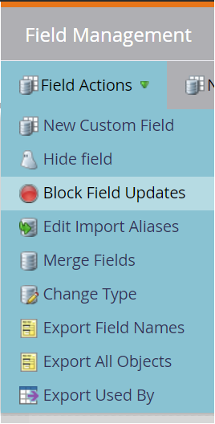

# Connessione Marketo Engage Person Sync {#marketo-engage-person-sync}

>[!IMPORTANT]
>
>Al momento il connettore destinazione è in versione Beta ed è disponibile solo per una clientela selezionata. Per richiedere l’accesso, contatta il tuo rappresentante Adobe.

>[!IMPORTANT]
>
>La scheda di destinazione **[!UICONTROL Marketo Engage Person Sync]** diventerà obsoleta il **ottobre 2025**.
>
>Per garantire una transizione fluida verso la nuova destinazione **[[!UICONTROL Marketo Engage]](marketo-engage-connection.md)**, rivedi i seguenti punti chiave e le azioni richieste:
>
>* Tutti gli utenti devono **interrompere l&#39;utilizzo della destinazione Marketo Engage Person Sync** ed effettuare la migrazione alla nuova destinazione **[[!UICONTROL Marketo Engage]](marketo-engage-connection.md)** entro ottobre 2025.
>* **La migrazione dei flussi di dati esistenti non verrà effettuata automaticamente.** Sarà necessario [configurare una nuova connessione](marketo-engage-connection.md#connect-to-the-destination) alla nuova destinazione **[!UICONTROL Marketo Engage]** e attivare lì i propri tipi di pubblico.

## Panoramica {#overview}

Utilizza il connettore Marketo Engage Person Sync per inviare in streaming gli aggiornamenti dai tipi di pubblico personali ai record corrispondenti nell’istanza Marketo Engage.

>[!IMPORTANT]
> 
>Il connettore di sincronizzazione del pubblico [Marketo V2](/help/destinations/catalog/adobe/marketo-engage.md) non deve essere utilizzato in modalità creazione insieme al connettore di sincronizzazione dell&#39;aggiornamento del profilo

## Identità e attributi supportati {#support-identities-and-attributes}

### Identità supportate {#supported-identities}

| Identità di destinazione | Descrizione |
| --------------- | ---------------------------------------------------------------------------------------------------------------------------------------------------------------------------------------- |
| E-mail | Uno spazio dei nomi che rappresenta un indirizzo e-mail. Questo tipo di spazio dei nomi è spesso associato a una singola persona e può quindi essere utilizzato per identificarla tra canali diversi. |

{style="table-layout:auto"}

### Attributi supportati {#supported-attributes}

È possibile mappare gli attributi da Experience Platform a qualsiasi attributo a cui la tua organizzazione ha accesso in Marketo. In Marketo è possibile utilizzare la richiesta [Descrivi API](https://developer.adobe.com/marketo-apis/api/mapi/#tag/Leads/operation/describeUsingGET_6) per recuperare i campi degli attributi a cui la tua organizzazione ha accesso.

## Tipi di pubblico supportati {#supported-audiences}

Questa sezione descrive quali tipi di pubblico puoi esportare in questa destinazione.

| Origine pubblico | Supportato | Descrizione |
| -------------------- | :-------: | ------------------------------------------------------------------------------------------------------------------------------------------------------------- |
| Servizio di segmentazione | ✓ | Tipi di pubblico generati tramite Experience Platform [Segmentation Service](https://experienceleague.adobe.com/it/docs/experience-platform/segmentation/home). |
| Caricamenti personalizzati | ✓ | Tipi di pubblico importati in Experience Platform da file CSV. |

## Tipo e frequenza di esportazione {#export-type-and-frequency}

Per informazioni sul tipo e sulla frequenza di esportazione della destinazione, consulta la tabella seguente.

| Elemento | Tipo | Note |
| ---------------- | --------- | ----------------------------------------------------------------------------------------------------------------------------------------------------------------------------------------------------------------------------------------------------------------------------------------------------------------------------------------------------------------------------------------- |
| Frequenza di esportazione | Streaming | Le destinazioni di streaming sono connessioni &quot;sempre attive&quot; basate su API. Non appena un profilo viene aggiornato in Experience Platform in base alla valutazione del pubblico, il connettore invia l’aggiornamento a valle alla piattaforma di destinazione. Ulteriori informazioni sulle [destinazioni di streaming](/help/destinations/destination-types.md#streaming-destinations). |

{style="table-layout:auto"}

## Configurare la destinazione {#set-up-destination}

>[!IMPORTANT]
>
>* Per connettersi alla destinazione, sono necessarie le **[!UICONTROL Destinazioni visualizzazione]** e le **[!UICONTROL Autorizzazioni di gestione delle destinazioni]** [per il controllo degli accessi](/help/access-control/home.md#permissions).

Se la tua azienda ha accesso a più organizzazioni, assicurati di utilizzare la stessa organizzazione sia in Marketo Engage che in Real-Time CDP, dove stai configurando il connettore di destinazione per Marketo.  Se hai già configurato una destinazione, puoi selezionare un account Marketo esistente da utilizzare con la nuova configurazione.  In caso contrario, fare clic sul prompt Connettore a destinazione, che consente di impostare il nome, la descrizione e l&#39;ID Marketo Munchkin della destinazione desiderata.  L’ID Munchkin dell’istanza Marketo si trova nel menu Amministratore->Munchkin.

>[!IMPORTANT]
>
>L&#39;utente che imposta la destinazione deve disporre dell&#39;autorizzazione [Modifica persona](https://experienceleague.adobe.com/en/docs/marketo/using/product-docs/administration/users-and-roles/descriptions-of-role-permissions#access-database) nell&#39;istanza e nella partizione di Marketo.

* **[!UICONTROL Nome]**: un nome con cui riconoscerai questa destinazione in futuro.
* **[!UICONTROL Descrizione]**: una descrizione che ti aiuterà a identificare questa destinazione in futuro.
* **[!UICONTROL Munchkin ID]**: Munchkin ID è l&#39;identificatore univoco di un&#39;istanza Marketo specifica.
* **[!UICONTROL Partizione]**: un concetto in Marketo Engage utilizzato per separare i record dei lead in base alle esigenze aziendali
* **[!UICONTROL Primo campo ricercabile]**: campo su cui eseguire la deduplicazione. Il campo deve essere presente in ogni record di lead dell’input. Impostazione predefinita e-mail
* **[!UICONTROL Primo campo ricercabile]**: campo secondario su cui eseguire la deduplicazione. Il campo deve essere presente in ogni record di lead dell’input. Facoltativo

Dopo aver selezionato l’istanza, dovrai selezionare anche la partizione lead con cui desideri integrare la configurazione. Una [partizione lead](https://experienceleague.adobe.com/en/docs/marketo/using/product-docs/administration/workspaces-and-person-partitions/understanding-workspaces-and-person-partitions) è un concetto in Marketo Engage utilizzato per separare i record dei lead in base alle esigenze aziendali, ad esempio un marchio o un&#39;area di vendita. Se la sottoscrizione Marketo non dispone della funzionalità Aree di lavoro e partizioni o se non sono state create ulteriori partizioni nella sottoscrizione, sarà disponibile solo la partizione predefinita. Una singola configurazione può aggiornare solo i record dei lead presenti nella partizione configurata.

>[!IMPORTANT]
> 
>Dopo la prima attivazione di un pubblico nella destinazione Marketo, la compilazione di profili già presenti nel pubblico prima dell&#39;attivazione della destinazione Marketo può richiedere *fino a 24 ore*. In futuro, ogni volta che i profili verranno aggiunti al pubblico, verranno aggiunti immediatamente a Marketo.

### Campi di deduplicazione {#deduplication-fields}

Quando si inviano aggiornamenti a Marketo, i record vengono selezionati in base alla partizione selezionata e a uno o due campi selezionati dall&#39;utente. Se la destinazione è configurata con la partizione Nord America e i campi Indirizzo e-mail e Nome società sono configurati come campi di deduplicazione, tutti e tre i campi devono corrispondere per applicare le modifiche a un record esistente. Ad esempio:

* La destinazione è configurata con la partizione Nord America
* La persona con e-mail <test@example.com> e nome società Example Inc. in Experience Platform corrisponde al pubblico di destinazione
* Se nella partizione Nord America di Marketo non esiste già un record con questi valori, verrà creato un nuovo record lead

Se non viene trovato alcun record lead corrispondente, verrà creato un nuovo record.

## Attiva tipi di pubblico {#activate-audiences}

>[!IMPORTANT]
> 
>* Per attivare i dati, è necessario **[!UICONTROL Visualizza destinazioni]**, **[!UICONTROL Attiva destinazioni]**, **[!UICONTROL Visualizza profili]** e **[!UICONTROL Visualizza segmenti]** [Autorizzazioni di controllo di accesso](/help/access-control/home.md#permissions). Leggi la [panoramica sul controllo degli accessi](/help/access-control/ui/overview.md) o contatta l&#39;amministratore del prodotto per ottenere le autorizzazioni necessarie.

Leggi [Attivare profili e segmenti nelle destinazioni di esportazione dei segmenti di streaming](/help/destinations/ui/activate-segment-streaming-destinations.md) per le istruzioni sull&#39;attivazione dei segmenti di pubblico in questa destinazione.

Nel passaggio Attiva tipi di pubblico, potrai selezionare tra tutti i tipi di pubblico di persone visibili.

## Mappatura campi {#field-mapping}

Per inviare a Marketo Engage le modifiche a un particolare attributo di persona, il campo deve essere mappato da un campo Real-Time CDP a un campo Marketo.

I tipi di dati di Experience Platform e Marketo possono essere mappati nei seguenti modi:

| Tipo di dati Experience Platform | Tipo di dati Marketo |
| ----------------------------- | ------------------------------------ |
| Stringa | Stringa, Area Di Testo, Url, Telefono, E-Mail |
| Enumerazione | Stringa |
| Data | Data |
| Data-ora | Data e ora |
| Intero | Intero |
| Breve | Intero |
| Lungo | A virgola mobile |
| Doppio | Valuta, mobile, percentuale |
| Booleano | Booleano |
| Array | Non supportato |
| Oggetto | Non supportato |
| Mappa | Non supportato |
| Byte | Non supportato |

{style="table-layout:auto"}

In alcuni casi è consigliabile consentire alle integrazioni di impostare il valore di un campo, se non esiste, impedendo al contempo alle integrazioni di apportare aggiornamenti ai campi che hanno già un valore.  Se devi evitare che il connettore di destinazione sovrascriva i valori esistenti nell’istanza Marketo Engage, puoi configurare i campi in modo da bloccare gli aggiornamenti nella sezione Admin->Field Management (Gestione campi) dell’istanza Marketo e attivare/disattivare il tipo di origine Adobe Experience Platform.

## Utilizzo dei dati e governance {#data-usage-and-governance}

Tutte le destinazioni Adobe Experience Platform sono conformi ai criteri di utilizzo dei dati durante la gestione dei dati. Per informazioni dettagliate su come Adobe Experience Platform applica la governance dei dati, consulta la [panoramica sulla governance dei dati](/help/data-governance/home.md).
