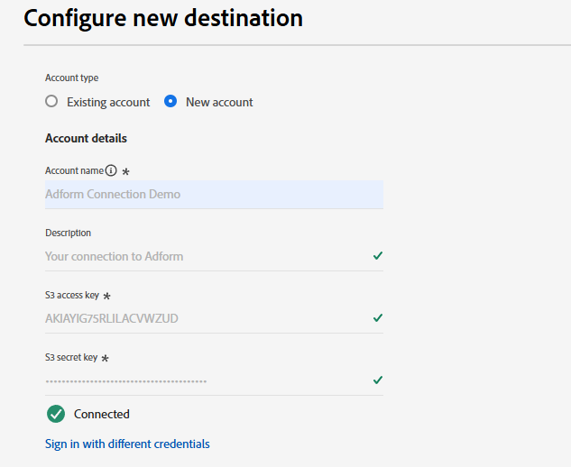

# Adform connection {#adform}

## Panoramica {#overview}

Adform è uno dei principali fornitori di soluzioni di acquisto e vendita di contenuti multimediali a livello di programmazione. Collegando Adform a Adobe Experience Platform, puoi attivare i tipi di pubblico di prime parti tramite Adform basato sull’Experience Cloud ID (ECID).

>[!IMPORTANT]
>
>Il connettore di destinazione e la pagina della documentazione vengono creati e gestiti dal team Adform. Per richieste di informazioni o richieste di aggiornamento, contattale direttamente all&#39;indirizzo `support@adform.com`.

## Casi d’uso {#use-cases}

Per aiutarti a capire meglio come e quando utilizzare la destinazione Adform, ecco alcuni esempi di casi d’uso che i clienti di Adobe Experience Platform possono risolvere utilizzando questa destinazione.

### Attivazione pubblico Adobe Real-Time CDP {#use-case-1}

Utilizza questa destinazione per inviare i tipi di pubblico di Adobe Real-Time CDP ad Adform per l’attivazione basata su Experience Cloud ID (ECID) e sulla Fusione ID di Adobe. ID Fusion di Adform è il servizio di risoluzione ID di Adform che consente di attivare i tipi di pubblico di prime parti in base all’Experience Cloud ID (ECID).

Un caso comune è il retargeting dei visitatori del sito web per il sito web o l’app in base all’Experience Cloud ID (ECID). È sufficiente inviare l&#39;Experience Cloud ID (ECID) ad Adform tramite le estensioni Adform [Event Streaming](https://exchange.adobe.com/apps/ec/600102/adform-s2s-site-tracking) o [lato client](https://experienceleague.adobe.com/en/docs/experience-platform/destinations/catalog/analytics/adform) prontamente disponibili. Dopodiché puoi condividere i tipi di pubblico con Adform tramite la destinazione Adform per l’attivazione, esclusivamente in base all’Experience Cloud ID (ECID).

## Prerequisiti {#prerequisites}

* Per utilizzare questa destinazione devi essere già un cliente Adform.
* Devi disporre delle credenziali Adform Audience Base Data Connection.
   * Se non disponi delle credenziali Adform Audience Base Data Connection, contatta il tuo rappresentante Adform.
* Per una corretta sincronizzazione è necessario disporre di una connessione [Streaming eventi](https://exchange.adobe.com/apps/ec/600102/adform-s2s-site-tracking) o [lato client](https://experienceleague.adobe.com/en/docs/experience-platform/destinations/catalog/analytics/adform) dalle entità ad Adform Site Tracking.
   * Se non disponi di una connessione lato client o streaming di eventi dalle entità ad Adform Site Tracking, contatta il tuo rappresentante Adform.
   * Adform fornisce estensioni Adobe Experience Cloud sia per [Event Streaming](https://exchange.adobe.com/apps/ec/600102/adform-s2s-site-tracking) che per [client-side](https://experienceleague.adobe.com/en/docs/experience-platform/destinations/catalog/analytics/adform).

## Identità supportate {#supported-identities}

Adform supporta l’attivazione delle identità descritte nella tabella seguente. Ulteriori informazioni su [identità](/help/identity-service/features/namespaces.md).

| Identità di destinazione | Descrizione | Considerazioni |
|---|---|---|
| ECID | Experience Cloud ID | Uno spazio dei nomi che rappresenta ECID. A questo spazio dei nomi possono fare riferimento anche i seguenti alias: &quot;Adobe Marketing Cloud ID&quot;, &quot;Adobe Experience Cloud ID&quot;, &quot;Adobe Experience Platform ID&quot;. Per ulteriori informazioni, consulta il seguente documento su [ECID](/help/identity-service/features/ecid.md). |

{style="table-layout:auto"}

## Tipi di pubblico supportati {#supported-audiences}

Questa sezione descrive il tipo di pubblico che puoi esportare in questa destinazione.

| Origine pubblico | Supportato | Descrizione |
|---------|----------|----------|
| [!DNL Segmentation Service] | Sì | Tipi di pubblico generati tramite Experience Platform [Segmentation Service](../../../segmentation/home.md). |
| Tutte le altre origini del pubblico | No | Questa categoria include tutte le origini del pubblico al di fuori dei tipi di pubblico generati tramite [!DNL Segmentation Service]. Leggi informazioni sulle [diverse origini del pubblico](/help/segmentation/ui/audience-portal.md#customize). Alcuni esempi includono: <ul><li> i tipi di pubblico per caricamento personalizzati [importati](../../../segmentation/ui/audience-portal.md#import-audience) in Experience Platform da file CSV,</li><li> pubblico simile, </li><li> pubblico federato, </li><li> tipi di pubblico generati in altre app di Experience Platform come Adobe Journey Optimizer, </li><li> e altro ancora. </li></ul> |

{style="table-layout:auto"}

Tipi di pubblico supportati per tipo di dati sul pubblico:

| Tipo di dati del pubblico | Supportato | Descrizione | Casi d’uso |
|--------------------|-----------|-------------|-----------|
| [Tipi di pubblico per persone](/help/segmentation/types/people-audiences.md) | Sì | In base ai profili dei clienti, consente di eseguire il targeting di gruppi specifici di persone per campagne di marketing. | Acquirenti frequenti, abbandoni del carrello |
| [Pubblico dell&#39;account](/help/segmentation/types/account-audiences.md) | No | Puoi indirizzare l’attività a singoli utenti all’interno di organizzazioni specifiche per strategie di marketing basate sull’account. | Marketing B2B |
| [Pubblico potenziale](/help/segmentation/types/prospect-audiences.md) | No | Puoi indirizzare l’attività a singoli utenti che non sono ancora clienti, ma che condividono alcune caratteristiche con il tuo pubblico di destinazione. | Ricerca di dati di terze parti |
| [Esportazioni set di dati](/help/catalog/datasets/overview.md) | No | Raccolte di dati strutturati archiviati nel Data Lake di Adobe Experience Platform. | Reporting, flussi di lavoro di data science |

{style="table-layout:auto"}

## Tipo e frequenza di esportazione {#export-type-frequency}

Per informazioni sul tipo e sulla frequenza di esportazione della destinazione, consulta la tabella seguente.

| Elemento | Tipo | Note |
|---------|----------|---------|
| Tipo di esportazione | **[!UICONTROL Segment export]** | Stai esportando tutti i membri di un segmento (pubblico) con gli identificatori (nome, numero di telefono o altri) utilizzati nella destinazione *YourDestination*. |
| Frequenza di esportazione | **[!UICONTROL Batch]** | Le destinazioni batch esportano i file sulle piattaforme a valle con incrementi di tre, sei, otto, dodici o ventiquattro ore. Ulteriori informazioni sulle [destinazioni basate su file batch](/help/destinations/destination-types.md#file-based). |

{style="table-layout:auto"}

## Connettersi alla destinazione {#connect}

>[!IMPORTANT]
> 
>Per connettersi alla destinazione, è necessario disporre dell&#39;autorizzazione di controllo di accesso **[!UICONTROL View Destinations]** e **[!UICONTROL Manage Destinations]** [&#128279;](/help/access-control/home.md#permissions). Leggi la [panoramica sul controllo degli accessi](/help/access-control/ui/overview.md) o contatta l&#39;amministratore del prodotto per ottenere le autorizzazioni necessarie.

Per connettersi a questa destinazione, seguire i passaggi descritti nell&#39;esercitazione [sulla configurazione della destinazione](../../ui/connect-destination.md). Nel flusso di lavoro di configurazione della destinazione, compila i campi elencati nelle due sezioni seguenti.

### Autenticarsi nella destinazione {#authenticate}

Per autenticare nella destinazione, compilare i campi obbligatori e selezionare **[!UICONTROL Connect to destination]**.

* **[!UICONTROL Account name]**: immettere un nome account in base al quale identificare la connessione di destinazione in futuro.
* **[!UICONTROL S3 Access Key ID]**: compilare la chiave di accesso S3 fornita da Adform.
* **[!UICONTROL S3 Secret Access Key]**: compilare la chiave di accesso segreta S3 fornita da Adform.

### Inserire i dettagli della destinazione {#destination-details}

Per configurare i dettagli per la destinazione, compila i campi obbligatori e facoltativi seguenti. Un asterisco accanto a un campo nell’interfaccia utente indica che il campo è obbligatorio.

* **[!UICONTROL Name]**: nome con cui riconoscerai questa destinazione in futuro.
* **[!UICONTROL Description]**: una descrizione che ti aiuterà a identificare questa destinazione in futuro.
* **[!UICONTROL Provider Name]**: il nome account Adform fornito da Adform.

### Abilita avvisi {#enable-alerts}

Puoi abilitare gli avvisi per ricevere notifiche sullo stato del flusso di dati verso la tua destinazione. Seleziona un avviso dall’elenco per abbonarti e ricevere notifiche sullo stato del flusso di dati. Per ulteriori informazioni sugli avvisi, consulta la guida su [abbonamento a destinazioni avvisi tramite l&#39;interfaccia utente](../../ui/alerts.md).

Dopo aver fornito i dettagli della connessione di destinazione, selezionare **[!UICONTROL Next]**.

## Attivare tipi di pubblico in questa destinazione {#activate}

>[!IMPORTANT]
> 
>* Per attivare i dati, sono necessarie le **[!UICONTROL View Destinations]**, **[!UICONTROL Activate Destinations]**, **[!UICONTROL View Profiles]** e **[!UICONTROL View Segments]** [autorizzazioni di controllo di accesso](/help/access-control/home.md#permissions). Leggi la [panoramica sul controllo degli accessi](/help/access-control/ui/overview.md) o contatta l&#39;amministratore del prodotto per ottenere le autorizzazioni necessarie.
>* Per esportare *identità*, è necessario disporre dell&#39;autorizzazione **[!UICONTROL View Identity Graph]** [per il controllo degli accessi](/help/access-control/home.md#permissions).   {width="100" zoomable="yes"}

Per istruzioni sull&#39;attivazione di segmenti di pubblico in questa destinazione, leggi [Attiva dati pubblico per esportare i profili in batch](/help/destinations/ui/activate-batch-profile-destinations.md).

### Mappare attributi e identità {#map}

* **ECID** (Experience Cloud ID)

Durante il passaggio di mappatura, utilizzare solo il mapping delle identità di destinazione [!DNL ECID]. Non includere altri campi di identità, in quanto questo impedirà il completamento dell’attivazione.

## Dati esportati / Convalida esportazione dati {#exported-data}

Il connettore di destinazione esporta solo l’identità ECID nella destinazione. Non viene esportata alcuna altra identità. Per verificare se l’esportazione dei dati è avvenuta correttamente, accedi al tuo account Adform Audience Base e controlla se i tipi di pubblico sono disponibili.

## Utilizzo dei dati e governance {#data-usage-governance}

Tutte le destinazioni [!DNL Adobe Experience Platform] sono conformi ai criteri di utilizzo dei dati durante la gestione dei dati. Per informazioni dettagliate su come [!DNL Adobe Experience Platform] applica la governance dei dati, leggere la [Panoramica sulla governance dei dati](/help/data-governance/home.md).

## Risorse aggiuntive {#additional-resources}

Per ulteriori informazioni su Adform Audience Base, consulta la [documentazione di Adform Audience Base](https://www.adformhelp.com/hc/en-us/categories/9738365991697-Data-Management-Platform).
