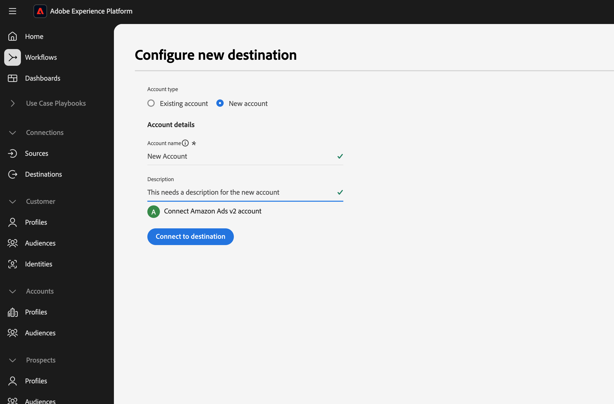

# Connessione Amazon Ads v2 {#amazon-ads-v2}

## Panoramica {#overview}

[!DNL Amazon Ads v2] consente agli inserzionisti di acquisire, gestire, attivare e riutilizzare in modo efficiente i dati sul pubblico in [!DNL Amazon Ads] prodotti.

>[!IMPORTANT]
>
>[!DNL Amazon Ads v2] è la destinazione corrente per tutte le nuove connessioni [!DNL Amazon Ads]. Se si dispone di una connessione [(Legacy) [!DNL Amazon Ads]](./amazon-ads.md) esistente, questa continuerà a funzionare senza le modifiche necessarie. [!DNL Amazon Ads v2] si connette a [!DNL Ads Data Manager], che fornisce supporto per tipi di identità espansi, campi relativi all&#39;indirizzo e condivisione di dati tra i prodotti [!DNL Amazon Ads], migliorando il targeting e le percentuali di corrispondenza del pubblico rispetto a [(Legacy) [!DNL Amazon Ads]](./amazon-ads.md).
>
>Dopo la fine di aprile 2026, [!DNL Amazon Ads v2] verrà rinominato in [!DNL Amazon Ads] e la scheda legacy verrà nascosta, lasciando una singola scheda di destinazione nel catalogo. I flussi di dati legacy esistenti continueranno a funzionare e potrai gestirli nella scheda **[!UICONTROL Browse]** dopo tale data.

L&#39;integrazione di [!DNL Amazon Ads v2] con [!DNL Adobe Experience Platform] fornisce una connessione diretta per l&#39;acquisizione dei membri del pubblico in [!DNL Amazon Ads]. I tipi di pubblico caricati sono disponibili nella console [!DNL Ads Data Manager (ADM)] in [!DNL Amazon Ads]. È possibile utilizzare la console [!DNL Ads Data Manager] per condividere i dati tra diversi prodotti [!DNL Amazon Ads].

Per ulteriori informazioni su [!DNL Ads Data Manager], vedere:

* [Gestione dati annunci - Panoramica della console](https://advertising.amazon.com/API/docs/en-us/adm/1_ads-data-manager-console-overview)
* [Utilizzo della console Gestione dati annunci](https://advertising.amazon.com/API/docs/en-us/adm/2_ads-data-manager-console)
* [Configurazione account in Ads Data Manager](https://advertising.amazon.com/API/docs/en-us/adm/2a_ads-data-manager_account_setup)

>[!IMPORTANT]
>
>Il connettore di destinazione e la pagina della documentazione vengono creati e gestiti dal team *[!DNL Amazon Ads]*. Per richieste di informazioni o richieste di aggiornamento, contattale direttamente all&#39;indirizzo *`amc-support@amazon.com`.*

## Casi d’uso {#use-cases}

Per aiutarti a capire meglio come e quando utilizzare la destinazione [!DNL Amazon Ads v2], ecco alcuni esempi di casi d&#39;uso che i clienti [!DNL Adobe Experience Platform] possono risolvere utilizzando questa destinazione.

### Acquisizione e attivazione del pubblico {#activation-and-targeting}

Un marchio di abbigliamento sportivo vuole raggiungere i suoi clienti esistenti con annunci pertinenti in [!DNL Amazon Ads]. Il brand può acquisire gli indirizzi e-mail dei clienti dal CRM in [!DNL Adobe Experience Platform], creare tipi di pubblico utilizzando i dati offline di prime parti e attivare questi tipi di pubblico in [!DNL Amazon Ads] tramite la destinazione [!DNL Amazon Ads v2]. Dopo l&#39;attivazione, puoi utilizzare questi tipi di pubblico per indirizzare gli annunci a tali clienti in [!DNL Amazon Ads] inventario, aiutando il brand a coinvolgere nuovamente i clienti noti e a stimolare acquisti ripetuti. Per ulteriori informazioni, consulta [Gestione dati](https://advertising.amazon.com/API/docs/en-us/adm/6_adm-manage-data).

## Prerequisiti {#prerequisites}

Per utilizzare la connessione [!DNL Amazon Ads v2] con [!DNL Adobe Experience Platform], è necessario avere accesso a **[!DNL Amazon Ads Data Manager]** utilizzando un account [Manager](https://advertising.amazon.com/help/G69CDSR9MNSWJH95). Per informazioni dettagliate, consulta [Introduzione a Amazon Ads Data Manager](https://advertising.amazon.com/API/docs/en-us/adm/1_ads-data-manager-console-overview).

### Accettare i termini e le condizioni di Amazon Ads Data Manager {#accept-terms}

Prima di configurare la destinazione [!DNL Amazon Ads v2], accedi al tuo account [!DNL Amazon Ads] e accetta i termini e le condizioni di [!DNL Ads Data Manager]. Passare alla console [!DNL Ads Data Manager] all&#39;interno di [!DNL Amazon Ads] e accettare i termini quando richiesto. Se non si accettano i termini e le condizioni, i tipi di pubblico non vengono creati in [!DNL Amazon Ads].

## Identità supportate {#supported-identities}

La destinazione [!DNL Amazon Ads v2] supporta l&#39;attivazione delle identità seguenti. Ulteriori informazioni su [identità](/help/identity-service/features/namespaces.md).

| Identità di destinazione | Descrizione | Considerazioni |
|---|---|---|
| `phone` | Numeri di telefono con hash con algoritmo SHA256 | I numeri di telefono con hash SHA256 e testo normale sono supportati da [!DNL Adobe Experience Platform]. Se il campo di origine contiene attributi senza hash, selezionare l&#39;opzione **[!UICONTROL Apply transformation]** per impostare [!DNL Experience Platform] per l&#39;hashing automatico dei dati all&#39;attivazione. |
| `email` | Indirizzi e-mail (in minuscolo) con hash con algoritmo SHA256 | Gli indirizzi e-mail con hash SHA256 e testo normale sono supportati da [!DNL Adobe Experience Platform]. Se il campo di origine contiene attributi senza hash, selezionare l&#39;opzione **[!UICONTROL Apply transformation]** per impostare [!DNL Experience Platform] per l&#39;hashing automatico dei dati all&#39;attivazione. |
| `firstname` | Nome dell’utente | I nomi con hash SHA256 e il testo normale sono supportati da [!DNL Adobe Experience Platform]. Se il campo di origine contiene attributi senza hash, selezionare l&#39;opzione **[!UICONTROL Apply transformation]** per impostare [!DNL Experience Platform] per l&#39;hashing automatico dei dati all&#39;attivazione. |
| `lastname` | Cognome dell’utente | I cognomi con hash SHA256 e testo normale sono supportati da [!DNL Adobe Experience Platform]. Se il campo di origine contiene attributi senza hash, selezionare l&#39;opzione **[!UICONTROL Apply transformation]** per impostare [!DNL Experience Platform] per l&#39;hashing automatico dei dati all&#39;attivazione. |
| `address` | Indirizzo dell&#39;utente | Le strade con hash SHA256 e testo normale sono supportate da [!DNL Adobe Experience Platform]. Se il campo di origine contiene attributi senza hash, selezionare l&#39;opzione **[!UICONTROL Apply transformation]** per impostare [!DNL Experience Platform] per l&#39;hashing automatico dei dati all&#39;attivazione. |
| `city` | Città dell’utente | Le città con hash SHA256 e testo normale sono supportate da [!DNL Adobe Experience Platform]. Se il campo di origine contiene attributi senza hash, selezionare l&#39;opzione **[!UICONTROL Apply transformation]** per impostare [!DNL Experience Platform] per l&#39;hashing automatico dei dati all&#39;attivazione. |
| `state` | Stato o provincia dell&#39;utente | Gli stati di testo normale e di hash SHA256 sono supportati da [!DNL Adobe Experience Platform]. Se il campo di origine contiene attributi senza hash, selezionare l&#39;opzione **[!UICONTROL Apply transformation]** per impostare [!DNL Experience Platform] per l&#39;hashing automatico dei dati all&#39;attivazione. |
| `zip` | Codice postale dell’utente | [!DNL Adobe Experience Platform] supporta sia il testo normale che i file ZIP con hash SHA256. Se il campo di origine contiene attributi senza hash, selezionare l&#39;opzione **[!UICONTROL Apply transformation]** per impostare [!DNL Experience Platform] per l&#39;hashing automatico dei dati all&#39;attivazione. |
| `countryCode` | Paese dell’utente (codice ISO di 2 caratteri) | Supporta l&#39;immissione di testo normale. |
| `experianId` | Identificatore assegnato da [!DNL Experian] | Supporta l&#39;immissione di testo normale. |
| `kantarId` | Identificatore assegnato da [!DNL Kantar] | Supporta l&#39;immissione di testo normale. |
| `liveRampId` | Identificatore assegnato da [!DNL LiveRamp] | Supporta l&#39;immissione di testo normale. |
| `maId` | Identificatore assegnato da un’app mobile | Supporta l&#39;immissione di testo normale. |
| `merkleId` | Identificatore assegnato da [!DNL Merkle] | Supporta l&#39;immissione di testo normale. |
| `neustarId` | Identificatore assegnato da [!DNL Neustar] | Supporta l&#39;immissione di testo normale. |
| `realId` | Identificatore assegnato dal grafo di identità Real ID | Supporta l&#39;immissione di testo normale. |
| `sambaTvId` | Identificatore assegnato da [!DNL Samba TV] | Supporta l&#39;immissione di testo normale. |

{style="table-layout:auto"}

## Tipi di pubblico supportati {#supported-audiences}

Questa sezione descrive quali tipi di pubblico puoi esportare in questa destinazione.

| Origine pubblico | Supportato | Descrizione |
|---------|----------|----------|
| [!DNL Segmentation Service] | Sì | Tipi di pubblico generati tramite [!DNL Experience Platform] [Segmentation Service](/help/segmentation/home.md). |
| Tutte le altre origini del pubblico | Sì | Questa categoria include tutte le origini del pubblico al di fuori dei tipi di pubblico generati tramite [!DNL Segmentation Service]. Leggi informazioni sulle [diverse origini del pubblico](/help/segmentation/ui/audience-portal.md#customize). Alcuni esempi includono: <ul><li> i tipi di pubblico per caricamento personalizzati [importati](/help/segmentation/ui/audience-portal.md#import-audience) in [!DNL Experience Platform] da file CSV,</li><li> pubblico simile, </li><li> pubblico federato, </li><li> tipi di pubblico generati in altre app [!DNL Experience Platform] come [!DNL Adobe Journey Optimizer], </li><li> e altro ancora. </li></ul> |

{style="table-layout:auto"}

Tipi di pubblico supportati per tipo di dati sul pubblico:

| Tipo di dati del pubblico | Supportato | Descrizione | Casi d’uso |
|--------------------|-----------|-------------|-----------|
| [Tipi di pubblico per persone](/help/segmentation/types/people-audiences.md) | Sì | In base ai profili dei clienti, consente di eseguire il targeting di gruppi specifici di persone per campagne di marketing. | Acquirenti frequenti, abbandoni del carrello |
| [Pubblico dell&#39;account](/help/segmentation/types/account-audiences.md) | No | Puoi indirizzare l’attività a singoli utenti all’interno di organizzazioni specifiche per strategie di marketing basate sull’account. | Marketing B2B |
| [Pubblico potenziale](/help/segmentation/types/prospect-audiences.md) | No | Puoi indirizzare l’attività a singoli utenti che non sono ancora clienti, ma che condividono alcune caratteristiche con il tuo pubblico di destinazione. | Ricerca di dati di terze parti |
| [Esportazioni set di dati](/help/catalog/datasets/overview.md) | No | Raccolte di dati strutturati archiviati nel Data Lake [!DNL Adobe Experience Platform]. | Reporting, flussi di lavoro di data science |

{style="table-layout:auto"}

## Tipo e frequenza di esportazione {#export-type-frequency}

La tabella seguente descrive il tipo e la frequenza di esportazione della destinazione.

| Elemento | Tipo | Note |
| ---------|----------|---------|
| Tipo di esportazione | **[!UICONTROL Audience export]** | Stai esportando tutti i membri di un pubblico con identificatori supportati da [!DNL Amazon Ads]. |
| Frequenza di esportazione | **[!UICONTROL Streaming]** | Le destinazioni di streaming sono connessioni &quot;sempre attive&quot; basate su API. Gli aggiornamenti del pubblico in [!DNL Experience Platform] vengono inviati immediatamente a [!DNL Ads Data Manager]. |

{style="table-layout:auto"}

## Connettersi alla destinazione {#connect}

>[!IMPORTANT]
>
>Per connettersi alla destinazione, sono necessarie le **[!UICONTROL View Destinations]** e le **[!UICONTROL Manage Destinations]** [autorizzazioni di controllo di accesso](/help/access-control/home.md#permissions). Leggi la [panoramica sul controllo degli accessi](/help/access-control/ui/overview.md) o contatta l&#39;amministratore del prodotto per ottenere le autorizzazioni necessarie.

Per connettersi a questa destinazione, seguire i passaggi descritti nell&#39;esercitazione [sulla configurazione della destinazione](/help/destinations/ui/connect-destination.md). Nel flusso di lavoro di configurazione della destinazione, compila i campi elencati nelle due sezioni seguenti.

### Autenticarsi nella destinazione {#authenticate}

Per autenticare nella destinazione, compilare i campi obbligatori e selezionare **[!UICONTROL Connect to destination]**.

* **[!UICONTROL Account name]**: immettere un nome che consenta di identificare questo account di destinazione. Questa funzione è particolarmente utile se hai più connessioni per la stessa destinazione.
* **[!UICONTROL Description]** (facoltativo): aggiungi dettagli che aiutano te o il tuo team a distinguere gli account, ad esempio lo scopo della connessione o il contesto di business pertinente.

Sei stato reindirizzato all&#39;interfaccia [!DNL Amazon Ads v2]. Seleziona **[!UICONTROL Allow]** per accedere al tuo account Amazon.

Dopo l&#39;autenticazione, si viene reindirizzati a [!DNL Adobe Experience Platform] con la nuova connessione.

### Inserire i dettagli della destinazione {#destination-details}

Per configurare i dettagli per la destinazione, compila i campi obbligatori e facoltativi seguenti. Un asterisco accanto a un campo nell’interfaccia utente indica che il campo è obbligatorio.

* **[!UICONTROL Name]**: nome utilizzato per riconoscere la destinazione.
* **[!UICONTROL Description]**: descrizione che consente di identificare questa destinazione.
* **[!UICONTROL Manager Account]**: ID account del gestore di destinazione dal menu a discesa.
* **[!UICONTROL All audience members sent to Amazon are consented for use for Advertising]**: specificare il consenso per l&#39;utilizzo dei dati (`GRANTED` o `DENIED`).
* **[!UICONTROL Ads data manager Terms & Conditions]**: accettare i termini e le condizioni di [!DNL Amazon Ads] Data Manager. Per ulteriori informazioni, leggere la sezione [Accetta termini](#accept-terms).

### Abilita avvisi {#enable-alerts}

Puoi abilitare gli avvisi per ricevere notifiche sullo stato del flusso di dati verso la tua destinazione. Seleziona un avviso dall’elenco per abbonarti e ricevere notifiche sullo stato del flusso di dati. Per ulteriori informazioni sugli avvisi, consulta la guida su [abbonamento a destinazioni avvisi tramite l&#39;interfaccia utente](/help/destinations/ui/alerts.md).

Dopo aver fornito i dettagli della connessione di destinazione, selezionare **[!UICONTROL Next]**.

## Attivare tipi di pubblico in questa destinazione {#activate}

>[!IMPORTANT]
>
>* Per attivare i dati, sono necessarie le **[!UICONTROL View Destinations]**, **[!UICONTROL Activate Destinations]**, **[!UICONTROL View Profiles]** e **[!UICONTROL View Segments]** [autorizzazioni di controllo di accesso](/help/access-control/home.md#permissions). Leggi la [panoramica sul controllo degli accessi](/help/access-control/ui/overview.md) o contatta l&#39;amministratore del prodotto per ottenere le autorizzazioni necessarie.
>* Per esportare le identità, è necessario disporre dell&#39;autorizzazione **[!UICONTROL View Identity Graph]** [per il controllo degli accessi](/help/access-control/home.md#permissions).   {width="100" zoomable="yes"}

Leggi [Attivare profili e tipi di pubblico nelle destinazioni di esportazione del pubblico di streaming](/help/destinations/ui/activate-segment-streaming-destinations.md) per le istruzioni sull&#39;attivazione dei tipi di pubblico in questa destinazione.

### Mappature obbligatorie {#map}

Per la destinazione [!DNL Amazon Ads v2] è necessario configurare le seguenti mappature per l&#39;attivazione dei dati.

| Campo di origine | Campo di destinazione | Descrizione |
|---------|----------|---------|
| `IdentityMap: Email_LC_SHA256` o `IdentityMap: Email` | `Identity: email` | Se il campo di origine contiene attributi senza hash, selezionare l&#39;opzione **[!UICONTROL Apply transformation]** per impostare [!DNL Experience Platform] per l&#39;hashing automatico dei dati all&#39;attivazione. |
| `xdm: homeAddress.countryCode` | `Identity: countryCode` | Paese dell’utente (codice ISO di 2 caratteri) |

### Best practice per la mappatura {#mapping-best-practices}

Combina gli identificatori di prime parti (come numero di telefono e indirizzo) con gli identificatori forniti dai partner. Ciò consente a [!DNL Amazon Ads] di utilizzare più segnali di identità durante la corrispondenza del pubblico, con conseguente miglioramento delle percentuali di corrispondenza.

Utilizza gli identificatori forniti dai partner solo quando sono inseriti nei dati sorgente. Se un campo dell’identificatore del partner mappato è vuoto o non presente per un determinato profilo, viene ignorato durante la corrispondenza dell’audience e non contribuisce alle percentuali di corrispondenza.

### Esempi {#examples}

* Utilizza `kantarId` quando attivi tipi di pubblico generati o arricchiti utilizzando i dati di identità [!DNL Kantar].
* Utilizza `merkleId` quando i dati del pubblico provengono da soluzioni di identità gestite da [!DNL Merkle].
* Utilizzare `neustarId` quando i dati sono collegati tramite la risoluzione identità [!DNL Neustar].
* Utilizza `experianId` per tipi di pubblico arricchiti utilizzando i dati di identità [!DNL Experian].
* Utilizza `liveRampId` per attivare tipi di pubblico che si basano sulla risoluzione dell&#39;identità [!DNL LiveRamp].
* Utilizza `sambaTvId` quando lavori con i dati del pubblico forniti da [!DNL Samba TV].

Questi identificatori vengono generalmente forniti dai rispettivi partner come identificatori di testo normale e non richiedono l’hashing.

## Convalidare l’esportazione dei dati {#exported-data}

Dopo l&#39;attivazione, convalidare l&#39;acquisizione del pubblico nella console **[!DNL Ads Data Manager]**.

Passare a **[!UICONTROL Audiences]** → **[!UICONTROL Uploaded Sources]**. Controlla lo stato di acquisizione del pubblico, le dimensioni ed eventuali registri di errore. Le pagine [Gestione dati](https://advertising.amazon.com/API/docs/en-us/adm/6_adm-manage-data) e [Destinazioni](https://advertising.amazon.com/API/docs/en-us/adm/7_adm-destinations) nella documentazione di [!DNL Amazon Ads] forniscono ulteriori indicazioni sulla convalida.

## Utilizzo dei dati e governance {#data-usage-governance}

Tutte le destinazioni [!DNL Adobe Experience Platform] sono conformi ai criteri di utilizzo dei dati durante la gestione dei dati. Per informazioni dettagliate su come [!DNL Adobe Experience Platform] applica la governance dei dati, leggere la [Panoramica sulla governance dei dati](/help/data-governance/home.md).

## Risorse aggiuntive {#additional-resources}

Per ulteriori informazioni su [!DNL Amazon Ads Data Manager], vedere la risorsa seguente:

* [Panoramica di Amazon Ads Data Manager](https://advertising.amazon.com/API/docs/en-us/adm/1_ads-data-manager-console-overview)
