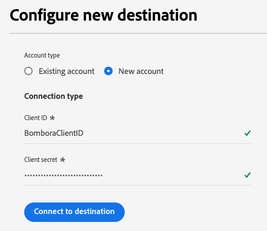
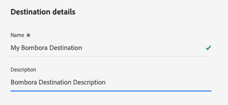

# Connessione Bombora {#bombora}

>[!AVAILABILITY]
>
>La funzionalità per attivare il pubblico dell&#39;account nella destinazione Bombora è disponibile per le aziende che acquistano le edizioni [Business-to-Business](/help/rtcdp/overview.md#rtcdp-b2b) e [Business-to-Person](/help/rtcdp/overview.md#rtcdp-b2p) di Real-Time Customer Data Platform.

Attiva profili per le campagne Bombora per il targeting, la personalizzazione e l&#39;eliminazione del pubblico, in base a [tipi di pubblico dell&#39;account](/help/segmentation/types/account-audiences.md).

## Casi d’uso {#use-case}

Per aiutarti a capire meglio come e quando utilizzare la destinazione Bombora, ecco alcuni esempi di casi d&#39;uso che i clienti di Adobe Experience Platform possono risolvere utilizzando questa destinazione.

### Integrazione con DSP {#dsp-integration}

In qualità di esperto di marketing B2B, puoi creare un elenco di account in Real-time CDP, identificando le aziende che mostrano un intento elevato per i tuoi prodotti, quindi utilizza questa destinazione per attivare l’elenco in Bombora.

Grazie all&#39;integrazione di Bombora con le DSP è possibile eseguire campagne pubblicitarie mirate utilizzando i dati di Bombora. In questo modo la spesa pubblicitaria si concentra sulle aziende che hanno maggiori probabilità di essere convertite.

### Account-Based Marketing {#abm}

In qualità di esperto di marketing B2B, puoi creare un elenco di account basato sui segnali di gestione delle relazioni con i clienti e di marketing. Puoi quindi utilizzare questa destinazione per attivare l’elenco a Bombora, dove i controlli basati su ABM consentono di eseguire il targeting dei decision maker di queste aziende.

### Attivazione marketing basata su account multicanale {#multi-channel-abm}

In qualità di esperto di marketing B2B, puoi creare un elenco di account in Real-time CDP, identificando le aziende con intenzioni elevate. Puoi quindi utilizzare questa destinazione per attivare l’elenco in Bombora e avviare campagne mirate su più canali.

Sui social media a pagamento, è possibile distribuire annunci personalizzati ai professionisti degli account di destinazione su piattaforme come [!DNL LinkedIn] e [!DNL Facebook]. Utilizzando piattaforme di annunci native, puoi assicurarti che il contenuto raggiunga i decision maker rilevanti.

Puoi anche estendere le campagne alla TV avanzata, distribuendo annunci agli account chiave.

Questo approccio multicanale garantisce la coerenza dei messaggi tra le piattaforme, massimizzando i tassi di coinvolgimento e conversione.

## Tipi di pubblico supportati {#supported-audiences}

Questa sezione descrive il tipo di pubblico che puoi esportare in questa destinazione.

| Origine pubblico | Supportato | Descrizione |
|---------|----------|----------|
| [!DNL Segmentation Service] | ✓ | Tipi di pubblico generati tramite Experience Platform [Segmentation Service](../../../segmentation/home.md). |
| Caricamenti personalizzati | X | Tipi di pubblico [importati](../../../segmentation/ui/overview.md#import-audience) in Experience Platform da file CSV. |

{style="table-layout:auto"}

## Identità supportate {#supported-identities}

Bombora richiede la mappatura dell&#39;identità di destinazione descritta nella tabella seguente. Ulteriori informazioni su [identità](/help/identity-service/features/namespaces.md).

| Identità di destinazione | Descrizione |
|---|---|
| `primaryId` | Bombora richiede la mappatura di questa identità di destinazione per il corretto funzionamento dell&#39;integrazione. Puoi mappare qualsiasi campo sorgente a questa identità. Questa mappatura è obbligatoria, ma non esporta i dati in Bombora. |

{style="table-layout:auto"}

## Tipo e frequenza di esportazione {#export-type-and-frequency}

Per informazioni sul tipo e sulla frequenza di esportazione della destinazione, consulta la tabella seguente.

| Elemento | Tipo | Note |
|---------|----------|---------|
| Tipo di esportazione | **[!UICONTROL Audience export]** | Stai esportando tutti i membri di un pubblico con gli identificatori (nome, numero di telefono o altri) utilizzati nella destinazione [!DNL Bombora]. |
| Frequenza di esportazione | **[!UICONTROL Streaming]** | Le destinazioni di streaming sono connessioni &quot;sempre attive&quot; basate su API. Non appena un profilo viene aggiornato in Experience Platform in base alla valutazione del pubblico, il connettore invia l’aggiornamento a valle alla piattaforma di destinazione. Ulteriori informazioni sulle [destinazioni di streaming](/help/destinations/destination-types.md#streaming-destinations). |

{style="table-layout:auto"}

## Prerequisiti {#prerequisites}

Per esportare i tipi di pubblico dell&#39;account su Bombora, è necessario disporre delle seguenti informazioni.

1. Un account di Bombora.
2. Bombora **[!UICONTROL client ID]** e **[!UICONTROL client secret]**.

## Connettersi alla destinazione {#connect}

>[!IMPORTANT]
> 
>Per connettersi alla destinazione, è necessario disporre dell&#39;autorizzazione di controllo di accesso **[!UICONTROL View Destinations]** e **[!UICONTROL Manage Destinations]** [&#128279;](/help/access-control/home.md#permissions). Leggi la [panoramica sul controllo degli accessi](/help/access-control/ui/overview.md) o contatta l&#39;amministratore del prodotto per ottenere le autorizzazioni necessarie.

Per connettersi a questa destinazione, seguire i passaggi descritti nell&#39;esercitazione [sulla configurazione della destinazione](../../ui/connect-destination.md). Nel flusso di lavoro di configurazione della destinazione, compila i campi elencati nelle due sezioni seguenti.

### Autenticarsi nella destinazione {#authenticate}

Per autenticare nella destinazione, compilare i campi obbligatori e selezionare **[!UICONTROL Connect to destination]**.

* **[!UICONTROL Client ID]**: immetti l&#39;ID client [!DNL Bombora].
* **[!UICONTROL Client secret]**: immetti il segreto client [!DNL Bombora].

### Inserire i dettagli della destinazione {#destination-details}

Per configurare i dettagli per la destinazione, compila i campi obbligatori e facoltativi seguenti. Un asterisco accanto a un campo nell’interfaccia utente indica che il campo è obbligatorio.

* **[!UICONTROL Name]**: nome con cui riconoscerai questa destinazione in futuro.
* **[!UICONTROL Description]**: una descrizione che ti aiuterà a identificare questa destinazione in futuro.

Ora puoi attivare i tuoi tipi di pubblico in Bombora.

## Attivare tipi di pubblico in questa destinazione {#activate}

>[!IMPORTANT]
> 
>* Per attivare i dati, sono necessarie le **[!UICONTROL View Destinations]**, **[!UICONTROL Activate Destinations]**, **[!UICONTROL View Profiles]** e **[!UICONTROL View Segments]** [autorizzazioni di controllo di accesso](/help/access-control/home.md#permissions). Leggi la [panoramica sul controllo degli accessi](/help/access-control/ui/overview.md) o contatta l&#39;amministratore del prodotto per ottenere le autorizzazioni necessarie.
>* Per esportare *identità*, è necessario disporre dell&#39;autorizzazione **[!UICONTROL View Identity Graph]** [per il controllo degli accessi](/help/access-control/home.md#permissions).   {width="100" zoomable="yes"}

Leggi [Attiva pubblico account](/help/destinations/ui/activate-account-audiences.md) per le istruzioni sull&#39;attivazione del pubblico account in questa destinazione.

### Mappature obbligatorie {#mapping}

La destinazione Bombora richiede di configurare le seguenti mappature per l&#39;attivazione dei dati.

| Campo di origine | Campo di destinazione | Descrizione |
|---------|----------|---------|
| Qualsiasi valore | `Identity: primaryId` | Questa mappatura è obbligatoria per Experience Platform per stabilire una connessione con Bombora. Questo valore non viene esportato in Bombora, ma è richiesto per la configurazione di destinazione. È possibile selezionare qualsiasi attributo per il campo di origine. |
| `xdm: accountOrganization.domain` | `xdm: companyWebsiteDomain` | Bombora utilizza indirizzi di siti web o di dominio per creare un elenco di account. |

## Note aggiuntive e callout importanti {#additional-notes}

Se un pubblico con lo stesso nome è stato attivato in precedenza su Bombora, riceverai un errore se tenti di attivarlo nuovamente attraverso un flusso di dati diverso verso la destinazione di Bombora.
