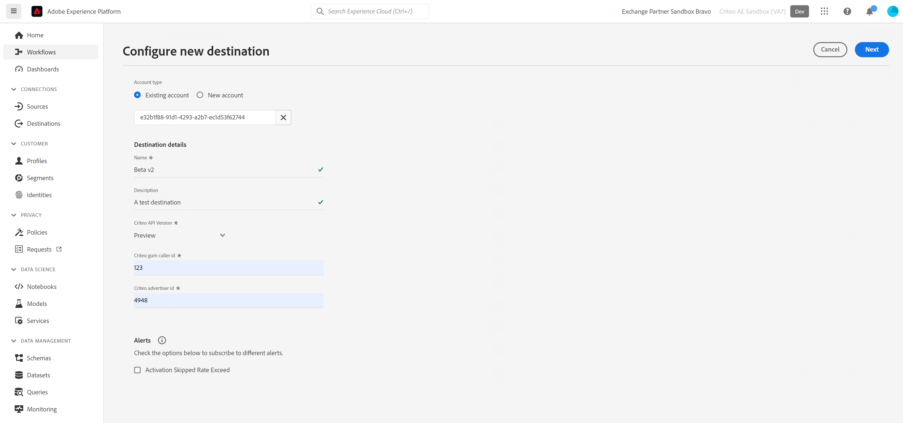

# (Beta) Connessione dei criteri

## Panoramica {#overview}

>[!IMPORTANT]
>
>Questa pagina della documentazione è stata creata da Criteo. Attualmente si tratta di un prodotto beta. Per qualsiasi domanda o richiesta di aggiornamento, contatta direttamente Criteo [qui](mailto:criteoTechnicalPartnerships@criteo.com).

Criteo potenzia una pubblicità affidabile e di impatto per portare esperienze più ricche a ogni consumatore attraverso l&#39;internet aperto. Con il set di dati di e-commerce più grande al mondo e l’intelligenza artificiale di livello superiore, Criteo assicura che ogni punto di contatto all’interno del percorso acquisti sia personalizzato per raggiungere i clienti con l’annuncio giusto al momento giusto.

## Prerequisiti {#prerequisites}

* È necessario disporre di un account utente amministratore su [Centro di gestione dei criteri](https://marketing.criteo.com).
* Avrai bisogno del tuo ID inserzionista Criteo (chiedi al tuo contatto Criteo se non hai questo ID).
* Criteo accetta solo le e-mail SHA-256 e di testo normale (da trasformare in SHA-256 prima dell’invio). Non inviare alcun PII (Dati personali identificabili, come i nomi o i numeri di telefono dei singoli).


## Identità supportate {#supported-identities}

Criteo supporta l’attivazione delle identità descritte nella tabella seguente. Ulteriori informazioni [identità](https://experienceleague.adobe.com/docs/experience-platform/identity/namespaces.html?lang=en#getting-started).

| Identità di destinazione | Descrizione | Considerazioni |
| --- | --- | --- |
| `email_sha256` | Indirizzi e-mail con hash con l’algoritmo SHA-256 | Gli indirizzi e-mail con hash a testo normale e SHA-256 sono supportati da Adobe Experience Platform. Quando il campo di origine contiene attributi senza hash, seleziona la [!UICONTROL Applica trasformazione] affinché Platform esegua automaticamente l’hash dei dati all’attivazione. |

## Tipo e frequenza di esportazione {#export-type-frequency}

Per informazioni sul tipo e sulla frequenza di esportazione della destinazione, fare riferimento alla tabella seguente.

| Elemento | Tipo | Note |
| --- | --- | --- |
| Tipo di esportazione | Esportazione del segmento | Stai esportando tutti i membri di un segmento (pubblico) con gli identificatori (nome, numero di telefono o altri) utilizzati nel [!DNL Criteo] destinazione. |
| Frequenza delle esportazioni | Streaming | Le destinazioni di streaming sono connessioni basate su API &quot;sempre attive&quot;. Non appena un profilo viene aggiornato in Experience Platform in base alla valutazione del segmento, il connettore invia l’aggiornamento a valle alla piattaforma di destinazione. Ulteriori informazioni [destinazioni di streaming](../../destination-types.md#streaming-destinations). |

## Casi d’uso {#use-cases}

Per aiutarti a capire meglio come utilizzare il [!DNL Criteo] destinazione, ecco alcuni obiettivi che i clienti Adobe Experience Platform possono raggiungere con [!DNL Criteo]:

### Caso d’uso 1 : Ottieni traffico

Presenta la tua azienda con offerte di prodotti rilevanti e creativi flessibili. Con i consigli di prodotto intelligenti, i tuoi annunci presenteranno automaticamente i prodotti che più probabilmente attiveranno visite e coinvolgimento. Il targeting flessibile ti consente di creare tipi di pubblico dal set di dati di e-commerce di Criteo o dai tuoi elenchi di potenziali clienti e dai segmenti CDP di Adobe.

### Caso d’uso 2 : Aumenta le conversioni di siti web

Quando i visitatori abbandonano il tuo sito web, ricorda loro cosa si stanno perdendo con gli annunci di retargeting che aumentano le conversioni mostrando offerte speciali e offerte iperrilevanti, ovunque vadano. Collega il tuo segmento CDP Adobe per coinvolgere nuovamente i clienti esistenti o target di consumatori simili ai tuoi acquirenti più fedeli.

## Connetti a Criteo {#connect}

Per connettersi a questa destinazione, segui i passaggi descritti in [esercitazione sulla configurazione della destinazione](../../ui/connect-destination.md).

### Autentica secondo criterio

I passaggi per connettersi sono i seguenti:

1. Accedi a Adobe Experience Platform e collegati alla destinazione Criteo.

   

1. Verrai reindirizzato a Criteo per autorizzare la connessione. Potrebbe essere necessario prima accedere con le credenziali Criteo:

   

   

   


### Parametri di connessione {#connection-parameters}

Dopo l&#39;autenticazione alla destinazione, compila i seguenti parametri di connessione.



| Campo | Descrizione | Obbligatorio |
| --- | --- | --- |
| Nome | Un nome che ti aiuterà a riconoscere questa destinazione in futuro. Il nome scelto sarà il [!DNL Audience] nome in Criteo Management Center e non può essere modificato in una fase successiva. | Sì |
| Descrizione | Una descrizione per identificare questa destinazione in futuro. | No |
| Versione API | Versione API del criterio. Selezionare Anteprima. | Sì |
| ID inserzionista | ID inserzionista criterio della tua organizzazione. Per ottenere queste informazioni, contatta il tuo account manager Criteo. | Sì |

## Attiva i segmenti in questa destinazione {#activate-segments}

Leggi [Attivare profili e segmenti nelle destinazioni di esportazione dei segmenti in streaming](../../ui/activate-segment-streaming-destinations.md) per istruzioni su come attivare i segmenti di pubblico a questa destinazione.

## Dati esportati {#exported-data}

Puoi visualizzare i segmenti esportati nella sezione [Centro di gestione dei criteri](https://marketing.criteo.com/audience-manager/dashboard).

L&#39;organismo della richiesta ricevuto da [!DNL Criteo] la connessione è simile alla seguente:

```json
{ 
  "data": { 
    "type": "ContactlistWithUserAttributesAmendment", 
    "attributes": { 
      "operation": "add", 
      "identifierType": "sha256email", 
      "identifiers": [ 
        { 
          "identifier": "1c8494bbc4968277345133cca6ba257b9b3431b8a84833a99613cf075a62a16d", 
          "attributes": [{ "key": "customValue", "value": "1" }] 
        } 
      ] 
    } 
  } 
} 
```

## Utilizzo e governance dei dati {#data-usage}

Tutte le destinazioni Adobe Experience Platform sono conformi ai criteri di utilizzo dei dati durante la gestione dei dati. Per informazioni dettagliate su come Adobe Experience Platform applica la governance dei dati, consulta la sezione [Panoramica sulla governance dei dati](https://experienceleague.adobe.com/docs/experience-platform/data-governance/home.html?lang=en).

## Risorse aggiuntive

* [Centro assistenza per i criteri](https://help.criteo.com/kb/en)
* [Criterio Developer Portal](https://developers.criteo.com/marketing-solutions/v2022.04/reference/modifyaudienceuserswithattributes)
