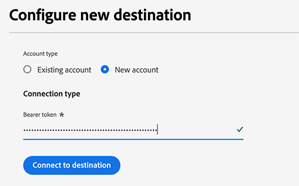
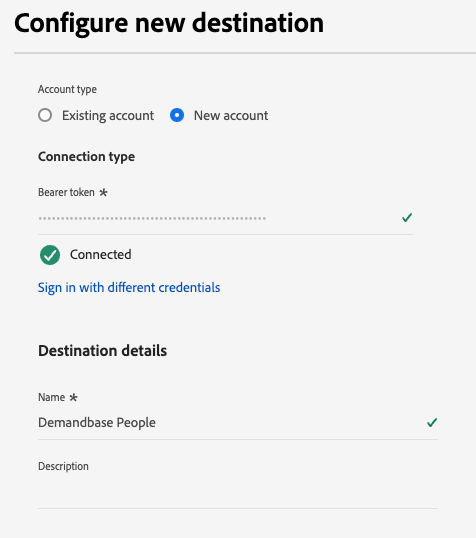

# Connessione Demandbase People {#demandbase-people}

Attiva profili per le campagne Demandbase per il targeting, la personalizzazione e l’eliminazione del pubblico.

>[!IMPORTANT]
>
>Per i casi di utilizzo B2B in cui è necessario [attivare i tipi di pubblico dell&#39;account](../../ui/activate-account-audiences.md), utilizza il connettore di destinazione [Demandbase](demandbase.md).

## Caso d’uso {#use-case}

Gli addetti al marketing possono utilizzare Adobe Real-Time CDP per creare un Elenco persone di contatti di prime parti e attivarlo in Demandbase per un coinvolgimento ottimizzato e orchestrato sulla piattaforma lato domanda (DSP) e su altri canali come LinkedIn.

Questo approccio consente agli addetti al marketing di dare priorità alla spesa delle campagne su individui noti provenienti dal proprio sistema di gestione delle relazioni con i clienti o di automazione del marketing, garantendo che le attività di marketing si concentrino su potenziali clienti di alto valore.

Una volta attivata, Demandbase ottimizza la distribuzione degli annunci, perfezionando le strategie di targeting per massimizzare il coinvolgimento, la portata e i tassi di conversione, migliorando in ultima analisi l’efficienza della campagna.

## Identità supportate {#supported-identities}

La connessione [!DNL Demandbase People] supporta l&#39;attivazione delle identità descritte nella tabella seguente. Ulteriori informazioni su [identità](/help/identity-service/features/namespaces.md).

| Identità di destinazione | Descrizione | Considerazioni |
|---|---|---|
| e-mail | Indirizzi e-mail in testo normale | Solo gli indirizzi di posta elettronica in testo normale sono supportati dalla connessione [!DNL Demandbase People]. |

{style="table-layout:auto"}

## Tipi di pubblico supportati {#supported-audiences}

Questa sezione descrive il tipo di pubblico che puoi esportare in questa destinazione.

| Origine pubblico | Supportato | Descrizione |
|---------|----------|----------|
| [!DNL Segmentation Service] | Sì | Tipi di pubblico generati tramite Experience Platform [Segmentation Service](../../../segmentation/home.md). |
| Tutte le altre origini del pubblico | Sì | Questa categoria include tutte le origini del pubblico al di fuori dei tipi di pubblico generati tramite [!DNL Segmentation Service]. Leggi informazioni sulle [diverse origini del pubblico](/help/segmentation/ui/audience-portal.md#customize). Alcuni esempi includono: <ul><li> i tipi di pubblico per caricamento personalizzati [importati](../../../segmentation/ui/audience-portal.md#import-audience) in Experience Platform da file CSV,</li><li> pubblico simile, </li><li> pubblico federato, </li><li> tipi di pubblico generati in altre app di Experience Platform come Adobe Journey Optimizer, </li><li> e altro ancora. </li></ul> |

{style="table-layout:auto"}

Tipi di pubblico supportati per tipo di dati sul pubblico:

| Tipo di dati del pubblico | Supportato | Descrizione | Casi d’uso |
|--------------------|-----------|-------------|-----------|
| [Tipi di pubblico per persone](/help/segmentation/types/people-audiences.md) | Sì | In base ai profili dei clienti, consente di eseguire il targeting di gruppi specifici di persone per campagne di marketing. | Acquirenti frequenti, abbandoni del carrello |
| [Pubblico dell&#39;account](/help/segmentation/types/account-audiences.md) | No | Puoi indirizzare l’attività a singoli utenti all’interno di organizzazioni specifiche per strategie di marketing basate sull’account. | Marketing B2B |
| [Pubblico potenziale](/help/segmentation/types/prospect-audiences.md) | No | Puoi indirizzare l’attività a singoli utenti che non sono ancora clienti, ma che condividono alcune caratteristiche con il tuo pubblico di destinazione. | Ricerca di dati di terze parti |
| [Esportazioni set di dati](/help/catalog/datasets/overview.md) | No | Raccolte di dati strutturati archiviati nel Data Lake di Adobe Experience Platform. | Reporting, flussi di lavoro di data science |

{style="table-layout:auto"}

## Tipo e frequenza di esportazione {#export-type-and-frequency}

Per informazioni sul tipo e sulla frequenza di esportazione della destinazione, consulta la tabella seguente.

| Elemento | Tipo | Note |
|--------------|-----------|---------------------------|
| Tipo di esportazione | Esportazione pubblico | Stai esportando tutti i membri di un pubblico con gli identificatori (nome, numero di telefono o altri) utilizzati nella destinazione *Demandbase*. |
| Frequenza | Streaming | Le destinazioni di streaming sono connessioni &quot;sempre attive&quot; basate su API. Non appena un profilo viene aggiornato in Experience Platform in base alla valutazione del pubblico, il connettore invia l’aggiornamento a valle alla piattaforma di destinazione. Ulteriori informazioni sulle [destinazioni di streaming](/help/destinations/destination-types.md#streaming-destinations). |

{style="table-layout:auto"}

## Prerequisiti {#prerequisites}

Per esportare i tipi di pubblico in Demandbase, è necessario quanto segue:

1. Un account Demandbase.
2. Un token API Demandbase. Puoi generare un token API con l’utente in Demandbase. Per generare un token, passa a [Profilo personale > Token API](https://web.demandbase.com/o/ad/at) dopo aver effettuato l&#39;accesso all&#39;account Demandbase.

## Connettersi alla destinazione {#connect}

>[!IMPORTANT]
> 
>Per connettersi alla destinazione, è necessario disporre dell&#39;autorizzazione di controllo di accesso **[!UICONTROL View Destinations]** e **[!UICONTROL Manage Destinations]** [&#128279;](/help/access-control/home.md#permissions). Leggi la [panoramica sul controllo degli accessi](/help/access-control/ui/overview.md) o contatta l&#39;amministratore del prodotto per ottenere le autorizzazioni necessarie.

Per connettersi a questa destinazione, seguire i passaggi descritti nell&#39;esercitazione [sulla configurazione della destinazione](../../ui/connect-destination.md). Nel flusso di lavoro di configurazione della destinazione, compila i campi elencati nelle due sezioni seguenti.

### Autenticarsi nella destinazione {#authenticate}

Per autenticare nella destinazione, compilare i campi obbligatori e selezionare **[!UICONTROL Connect to destination]**.

* **[!UICONTROL Bearer token]**: compila il token Bearer per l&#39;autenticazione nella destinazione. Visualizza [prerequisiti](#prerequisites) per informazioni su come ottenere il token.

### Inserire i dettagli della destinazione {#destination-details}

Per configurare i dettagli per la destinazione, compila i campi obbligatori e facoltativi seguenti. Un asterisco accanto a un campo nell’interfaccia utente indica che il campo è obbligatorio.

* **[!UICONTROL Name]**: nome con cui riconoscerai questa destinazione in futuro.
* **[!UICONTROL Description]**: una descrizione che ti aiuterà a identificare questa destinazione in futuro.

Ora puoi attivare i tuoi tipi di pubblico in Demandbase People.

## Attivare tipi di pubblico in questa destinazione {#activate}

>[!IMPORTANT]
> 
>* Per attivare i dati, sono necessarie le **[!UICONTROL View Destinations]**, **[!UICONTROL Activate Destinations]**, **[!UICONTROL View Profiles]** e **[!UICONTROL View Segments]** [autorizzazioni di controllo di accesso](/help/access-control/home.md#permissions). Leggi la [panoramica sul controllo degli accessi](/help/access-control/ui/overview.md) o contatta l&#39;amministratore del prodotto per ottenere le autorizzazioni necessarie.
>* Per esportare *identità*, è necessario disporre dell&#39;autorizzazione **[!UICONTROL View Identity Graph]** [per il controllo degli accessi](/help/access-control/home.md#permissions).   {width="100" zoomable="yes"}

Leggi [Attivare profili e tipi di pubblico nelle destinazioni di esportazione del pubblico di streaming](/help/destinations/ui/activate-segment-streaming-destinations.md) per le istruzioni sull&#39;attivazione dei tipi di pubblico in questa destinazione.

### Mappature obbligatorie {#mandatory-mappings}

Quando si attivano i tipi di pubblico nella destinazione [!DNL Demandbase People], è necessario configurare le seguenti mappature di campi obbligatorie nel passaggio di mappatura:

| Campo di origine | Campo di destinazione | Descrizione |
|--------------|--------------|-------------|
| `xdm: workEmail.address` | `Identity: email` | Indirizzo e-mail aziendale della persona |
| `xdm: b2b.personKey.sourceKey` | `xdm: externalPersonId` | Identificatore univoco della persona |

### Mappature consigliate {#recommended-mappings}

Per una precisione di corrispondenza ottimale, includi le seguenti mappature facoltative nel flusso di attivazione, oltre alle [mappature obbligatorie](#mandatory-mappings) di cui sopra.

| Campo di origine | Campo di destinazione | Descrizione |
|--------------|--------------|-------------|
| `xdm: person.name.lastName` | `xdm: lastName` | Cognome della persona |
| `xdm: person.name.firstName` | `xdm: firstName` | Nome della persona |

### Best practice per la mappatura {#mapping-best-practices}

Durante il mapping dei campi a [!DNL Demandbase People], considera il seguente comportamento di corrispondenza:

* **Corrispondenza primaria**: Demandbase utilizza `externalPersonId` come identificatore primario per la corrispondenza persona.
* **Corrispondenza fallback**: se `externalPersonId` non è disponibile, Demandbase utilizza il campo `email` per l&#39;identificazione.
* **Campi consigliati**: sebbene siano necessari solo `email` e `externalPersonId`, Adobe consiglia di mappare tutti i campi disponibili nella tabella delle mappature consigliata sopra per migliorare la precisione della corrispondenza e le prestazioni della campagna.

Queste mappature sono necessarie per il corretto funzionamento della destinazione e devono essere configurate prima di poter procedere con il flusso di lavoro di attivazione.

## Note aggiuntive e callout importanti {#additional-notes}

* **Guardrail API Demandbase**: se hai esportato tipi di pubblico in Demandbase e le esportazioni hanno avuto esito positivo in Experience Platform, ma non tutti i dati raggiungono Demandbase, potresti aver riscontrato una limitazione API sul lato Demandbase. Rivolgiti a loro per chiarimenti.
* **Eliminazione elenco**: gli elenchi Persone sono univoci, pertanto non è possibile ricreare un nuovo elenco con un nome già in uso. Quando si rimuovono persone da un elenco, queste non saranno più disponibili, ma non verranno eliminate.
* **Ora di attivazione**: il caricamento dei dati in Demandbase è soggetto a elaborazione notturna.
* **Denominazione pubblico**: se un pubblico di persone con lo stesso nome è stato attivato in precedenza in Demandbase, non è possibile riattivarlo tramite un flusso di dati diverso nella destinazione Demandbase.
