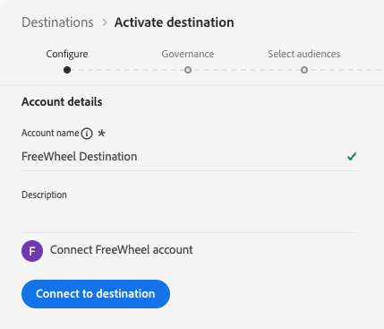
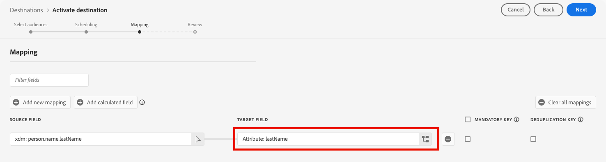

# Connessione [!DNL FreeWheel] {#freewheel}

>[!AVAILABILITY]
>
>La destinazione [!DNL FreeWheel] è attualmente in Beta ed è disponibile solo per alcuni clienti. Per richiedere l’accesso, contatta il tuo rappresentante Adobe.

## Panoramica {#overview}

[!DNL FreeWheel] è una piattaforma tecnologica globale per la pubblicità che consente di effettuare acquisti e vendite programmatici tra TV collegate (CTV), video e display. [!DNL FreeWheel] fornisce un marketplace basato sui dati che collega gli inserzionisti ai proprietari di supporti di livello superiore in tutto il mondo.

Utilizzare questa destinazione per inviare tipi di pubblico da [!DNL Adobe Experience Platform] a [!DNL FreeWheel]. I tipi di pubblico vengono consegnati come file batch giornalieri e sono resi disponibili per il targeting in [!DNL FreeWheel] offerte e campagne.

## Prerequisiti {#prerequisites}

Prima di poter attivare i tipi di pubblico in [!DNL FreeWheel], controlla i seguenti requisiti:

* **ID rete FreeWheel**: è necessario disporre di un ID rete [!DNL FreeWheel] valido. Questo viene fornito da [!DNL FreeWheel] quando il tuo account è configurato.

## Identità supportate {#supported-identities}

[!DNL FreeWheel] supporta l&#39;attivazione delle identità descritte nella tabella seguente. Oltre a queste identità, puoi utilizzare qualsiasi identità disponibile nel tuo account [!DNL FreeWheel]. Consulta [Mappa attributi e identità](#map) per istruzioni su come mappare un&#39;identità che non è nella tabella seguente. Ulteriori informazioni su [identità](/help/identity-service/features/namespaces.md).

| Identità di destinazione | Descrizione | Considerazioni |
|---|---|---|
| `idfa` | Apple ID per inserzionisti | Selezionare questa identità di destinazione quando l&#39;identità di origine è uno spazio dei nomi IDFA. |
| `aaid` | ANDROID ADVERTISING ID | Seleziona questa identità di destinazione quando l&#39;identità di origine è uno spazio dei nomi GAID. |
| `ctv` | ID dispositivo TV collegato | Seleziona questa identità di destinazione quando esegui il targeting di dispositivi CTV. |
| `ip` | Indirizzo IPv4 | Seleziona questa identità di destinazione per indirizzare gli utenti in base al loro indirizzo IP. Mappa un attributo di profilo contenente un indirizzo IPv4 valido oppure utilizza un campo calcolato per derivare il valore. |
| `ipv6` | Indirizzo IPv6 | Seleziona questa identità di destinazione per indirizzare gli utenti in base al loro indirizzo IPv6. Mappa un attributo di profilo contenente un indirizzo IPv6 valido oppure utilizza un campo calcolato per derivare il valore. |

{style="table-layout:auto"}

## Tipi di pubblico supportati {#supported-audiences}

Questa sezione descrive quali tipi di pubblico puoi esportare in questa destinazione.

| Origine pubblico | Supportato | Descrizione |
|---------|----------|----------|
| [!DNL Segmentation Service] | Sì | Tipi di pubblico generati tramite Experience Platform [Segmentation Service](../../../segmentation/home.md). |
| Tutte le altre origini del pubblico | Sì | Questa categoria include tutte le origini del pubblico al di fuori dei tipi di pubblico generati tramite [!DNL Segmentation Service]. Leggi informazioni sulle [diverse origini del pubblico](/help/segmentation/ui/audience-portal.md#customize). Alcuni esempi includono: <ul><li>i tipi di pubblico per caricamento personalizzati [importati](../../../segmentation/ui/audience-portal.md#import-audience) in Experience Platform da file CSV,</li><li>pubblico simile,</li><li>pubblico federato,</li><li>tipi di pubblico generati in altre app Experience Platform come [!DNL Adobe Journey Optimizer],</li><li>e altro ancora.</li></ul> |

{style="table-layout:auto"}

Tipi di pubblico supportati per tipo di dati sul pubblico:

| Tipo di dati del pubblico | Supportato | Descrizione | Casi d’uso |
|--------------------|-----------|-------------|-----------|
| [Tipi di pubblico per persone](/help/segmentation/types/people-audiences.md) | Sì | In base ai profili dei clienti, consente di eseguire il targeting di gruppi specifici di persone per campagne di marketing. | Retargeting CTV, soppressione della portata |
| [Pubblico dell&#39;account](/help/segmentation/types/account-audiences.md) | No | Puoi indirizzare l’attività a singoli utenti all’interno di organizzazioni specifiche per strategie di marketing basate sull’account. | Marketing B2B |
| [Pubblico potenziale](/help/segmentation/types/prospect-audiences.md) | No | Puoi indirizzare l’attività a singoli utenti che non sono ancora clienti, ma che condividono alcune caratteristiche con il tuo pubblico di destinazione. | Ricerca di dati di terze parti |
| [Esportazioni set di dati](/help/catalog/datasets/overview.md) | No | Raccolte di dati strutturati archiviati nel Data Lake [!DNL Adobe Experience Platform]. | Reporting, flussi di lavoro di data science |

{style="table-layout:auto"}

## Tipo e frequenza di esportazione {#export-type-frequency}

Per informazioni sul tipo e sulla frequenza di esportazione della destinazione, consulta la tabella seguente.

| Elemento | Tipo | Note |
|---------|----------|---------|
| Tipo di esportazione | **[!UICONTROL Profile-based]** | Stai esportando tutti i membri di un pubblico, insieme ai campi di identità desiderati come scelto nel passaggio di mappatura del [flusso di lavoro di attivazione della destinazione](/help/destinations/ui/activate-batch-profile-destinations.md#select-attributes). |
| Frequenza di esportazione | **[!UICONTROL Batch]** | La prima esportazione è un’istantanea completa di tutti i profili qualificati per il pubblico attivato. Le esportazioni successive sono aggiornamenti incrementali giornalieri che includono nuove qualifiche del pubblico (aggiunte) ed uscite del pubblico (rimozioni). È inoltre disponibile un intervallo di aggiornamento completo configurabile per il pubblico (4, 8 o 12 settimane), che attiva esportazioni complete periodiche oltre agli incrementi giornalieri. Le esportazioni complete contengono solo profili attualmente qualificati. Le uscite del pubblico non sono incluse e vengono distribuite esclusivamente tramite gli aggiornamenti incrementali giornalieri. Ulteriori informazioni sulle [destinazioni basate su file batch](/help/destinations/destination-types.md#file-based). |

{style="table-layout:auto"}

## Connettersi alla destinazione {#connect}

>[!IMPORTANT]
>
>Per connettersi alla destinazione, sono necessarie le **[!UICONTROL View Destinations]** e le **[!UICONTROL Manage Destinations]** [autorizzazioni di controllo di accesso](/help/access-control/home.md#permissions). Leggi la [panoramica sul controllo degli accessi](/help/access-control/ui/overview.md) o contatta l&#39;amministratore del prodotto per ottenere le autorizzazioni necessarie.

Per connettersi a questa destinazione, seguire i passaggi descritti nell&#39;esercitazione [sulla configurazione della destinazione](../../ui/connect-destination.md). Nel flusso di lavoro di configurazione della destinazione, compila i campi elencati nelle due sezioni seguenti.

### Autenticarsi nella destinazione {#authenticate}

L&#39;autenticazione nella destinazione [!DNL FreeWheel] viene gestita automaticamente da Adobe. Non sono richieste credenziali o chiavi API durante l’autenticazione. Adobe gestisce la connessione protetta a [!DNL FreeWheel] per tuo conto.



Selezionare **[!UICONTROL Connect to destination]** per procedere al passaggio dei dettagli della destinazione.

### Inserire i dettagli della destinazione {#destination-details}

>[!CONTEXTUALHELP]
>id="platform_destinations_freewheel_backfill"
>title="Intervallo di aggiornamento pubblico completo"
>abstract="Selezionare l&#39;intervallo di invio di un&#39;esportazione di un pubblico completo a [!DNL FreeWheel] oltre agli aggiornamenti incrementali giornalieri. Un&#39;esportazione completa del pubblico impedisce ai membri del pubblico di scadere tra [!DNL FreeWheel], in modo da non riscontrare cali nei membri target mentre le campagne sono in esecuzione. Le opzioni disponibili sono 4 settimane, 8 settimane e 12 settimane."

Per configurare i dettagli per la destinazione, compila i campi obbligatori e facoltativi seguenti. Un asterisco accanto a un campo nell’interfaccia utente indica che il campo è obbligatorio.


* **[!UICONTROL Name]**: nome con cui riconoscerai questa destinazione in futuro.
* **[!UICONTROL Description]**: una descrizione che ti aiuterà a identificare questa destinazione in futuro.
* **[!UICONTROL Region]**: l&#39;area [!DNL FreeWheel] in cui è ospitato l&#39;account. Selezionare una delle opzioni seguenti:
   * **[!UICONTROL US East]**
   * **[!UICONTROL Europe]**
   * **[!UICONTROL Asia Pacific]**
* **[!UICONTROL FreeWheel network ID]**: ID di rete [!DNL FreeWheel]. Questo valore è fornito da [!DNL FreeWheel] e identifica in modo univoco l&#39;organizzazione nella piattaforma [!DNL FreeWheel].
* **[!UICONTROL Full audience refresh interval]**: frequenza con cui viene inviata un&#39;esportazione completa del pubblico a [!DNL FreeWheel] oltre agli aggiornamenti incrementali giornalieri. Un&#39;esportazione completa del pubblico impedisce ai membri del pubblico di scadere tra [!DNL FreeWheel], in modo da non riscontrare cali nei membri target mentre le campagne sono in esecuzione. Seleziona un intervallo dal menu a discesa.

### Abilita avvisi {#enable-alerts}

Puoi abilitare gli avvisi per ricevere notifiche sullo stato del flusso di dati verso la tua destinazione. Seleziona un avviso dall’elenco per abbonarti e ricevere notifiche sullo stato del flusso di dati. Per ulteriori informazioni sugli avvisi, consulta la guida su [abbonamento a destinazioni avvisi tramite l&#39;interfaccia utente](../../ui/alerts.md).

Dopo aver fornito i dettagli della connessione di destinazione, selezionare **[!UICONTROL Next]**.

## Attivare tipi di pubblico in questa destinazione {#activate}

>[!IMPORTANT]
>
>* Per attivare i dati, sono necessarie le **[!UICONTROL View Destinations]**, **[!UICONTROL Activate Destinations]**, **[!UICONTROL View Profiles]** e **[!UICONTROL View Segments]** [autorizzazioni di controllo di accesso](/help/access-control/home.md#permissions). Leggi la [panoramica sul controllo degli accessi](/help/access-control/ui/overview.md) o contatta l&#39;amministratore del prodotto per ottenere le autorizzazioni necessarie.
>* Per esportare *identità*, è necessario disporre dell&#39;autorizzazione **[!UICONTROL View Identity Graph]** [per il controllo degli accessi](/help/access-control/home.md#permissions). <br> {width="100" zoomable="yes"}

Per istruzioni sull&#39;attivazione dei tipi di pubblico in questa destinazione, leggi [Attiva dati pubblico per esportare i profili in batch](/help/destinations/ui/activate-batch-profile-destinations.md).

### Pianificare le esportazioni del pubblico {#schedule}


Nel passaggio **[!UICONTROL Scheduling]**, configura la pianificazione dell&#39;esportazione per ogni pubblico. [!DNL FreeWheel] utilizza un modello di esportazione ibrido: la prima esportazione per ogni pubblico attivato è uno snapshot completo, seguito da aggiornamenti incrementali giornalieri.

Configura i campi seguenti:

* **[!UICONTROL File export options]**: **[!UICONTROL Export incremental files]** è preselezionato ed è l&#39;unica opzione supportata. La prima esportazione include automaticamente un’istantanea completa di tutti i profili qualificati. Le esportazioni successive forniscono solo nuove qualifiche e uscite per il pubblico dall’ultima esportazione.
* **[!UICONTROL Frequency]**: Selezionare **[!UICONTROL Daily]**. [!DNL FreeWheel] prevede la consegna giornaliera incrementale dei file.
* **[!UICONTROL Scheduled start time]**: immettere l&#39;ora in UTC in cui eseguire l&#39;esportazione giornaliera.
* **[!UICONTROL Date]**: impostare la data di inizio e di fine per l&#39;attivazione. La data di inizio determina quando viene inviata la prima esportazione completa di snapshot.

>[!NOTE]
>
>Le esportazioni complete (istantanea iniziale e aggiornamenti completi periodici) contengono solo profili attualmente qualificati. Le uscite di pubblico non sono incluse nelle esportazioni complete e vengono distribuite esclusivamente tramite gli aggiornamenti incrementali giornalieri.

### Mappare attributi e identità {#map}

Nel passaggio di mappatura, seleziona i campi di origine dai profili Experience Platform e mappali ai tipi di identità supportati da [!DNL FreeWheel]. È necessaria almeno una mappatura.

>[!IMPORTANT]
>
>I tipi di identità supportati da [!DNL FreeWheel] sono presentati come **attributi di destinazione** nell&#39;interfaccia utente di mappatura, non come spazi dei nomi di identità.

Se l&#39;account [!DNL FreeWheel] supporta tipi di identità non elencati nella tabella [identità supportate](#supported-identities), è possibile eseguire il mapping a tali tipi immettendo manualmente il nome dell&#39;identità nel campo di destinazione anziché selezionarlo dall&#39;elenco predefinito.



Di seguito sono riportati alcuni esempi di mappature. Le mappature effettive dipenderanno dallo schema del profilo e dai tipi di identità supportati dall&#39;account [!DNL FreeWheel].

| Campo di origine | Campo di destinazione |
| --- | --- |
| `identityMap.IDFA` | `idfa` |
| `identityMap.GAID` | `aaid` |
| `homeAddress.ipAddress` | `ip` |

{style="table-layout:auto"}

>[!NOTE]
>
>Non vengono applicate mappature obbligatorie. Tuttavia, i profili senza almeno una mappatura di identità valida non verranno inclusi nei file esportati.

## Dati esportati / Convalida esportazione dati {#exported-data}

[!DNL FreeWheel] riceve due tipi di file per esportazione. Entrambi i tipi di file vengono generati e consegnati automaticamente. Non è richiesta alcuna azione da parte tua.

**I file di identità (dati)** contengono i dati di appartenenza del pubblico. Ogni riga associa un identificatore utente a uno o più ID di pubblico. I file vengono consegnati a [!DNL FreeWheel] in formato CSV senza intestazioni di colonna. Vengono prodotti file separati per ogni tipo di identità presente nell&#39;esportazione, ad esempio un file per `aaid` e un file separato per `idfa`.

Esempio di formato del file di dati:

```csv
aebc1234-56f7-89ab-cdef-0123456789ab,segment_1,segment_2
f7c9a8b0-4d33-11ec-81d3-0242ac130003,segment_1,segment_3
123e4567-e89b-12d3-a456-426614174000,segment_2
```

**File di tassonomia** descrivono i tipi di pubblico inclusi nell&#39;esportazione. Questi file vengono consegnati insieme ai file di dati e includono l’ID pubblico, il nome e il TTL (time to live) in giorni. Il TTL massimo supportato da [!DNL FreeWheel] è di 90 giorni. I valori nell’esempio seguente sono illustrativi.

Esempio di formato del file di tassonomia:

```csv
Segment ID,Segment Name,TTL
segment_1,my_first_segment,30
segment_2,my_second_segment,30
segment_3,my_third_segment,30
```

## Utilizzo dei dati e governance {#data-usage-governance}

Tutte le destinazioni [!DNL Adobe Experience Platform] sono conformi ai criteri di utilizzo dei dati durante la gestione dei dati. Per informazioni dettagliate su come [!DNL Adobe Experience Platform] applica la governance dei dati, vedi [Panoramica sulla governance dei dati](/help/data-governance/home.md).

## Risorse aggiuntive {#additional-resources}

Per ulteriori informazioni su [!DNL FreeWheel] e la relativa piattaforma di tecnologia pubblicitaria, visitare il sito Web [FreeWheel](https://www.freewheel.com){target="_blank"}.
