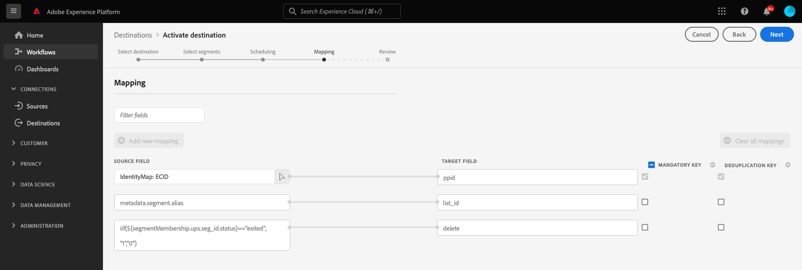

# (Beta) [!DNL Google Ad Manager 360] connection

## Panoramica {#overview}

La [!DNL Google Ad Manager 360] la connessione abilita il caricamento batch per [!DNL publisher provided identifiers] (PPID) in [!DNL Google Ad Manager 360], tramite [!DNL Google Cloud Storage].

Per ulteriori dettagli sul funzionamento degli identificatori forniti dall&#39;editore in Google Ad Manager 360, consulta la sezione [documentazione ufficiale di Google](https://support.google.com/admanager/answer/2880055?hl=en).

>[!IMPORTANT]
>
>Questa destinazione è attualmente in versione beta ed è disponibile solo per un numero limitato di clienti. Per richiedere l’accesso al [!DNL Google Ad Manager 360] contatta il tuo rappresentante di Adobe e fornisci [!DNL IMS Organization ID].

La [!DNL Google Ad Manager 360] esportazioni di destinazione [!DNL CSV] file nel tuo [!DNL Google Cloud Storage] secchio. Una volta esportato il [!DNL CSV] file, è necessario importarli nel [!DNL Google Ad Manager 360] conto.

## Specifiche di destinazione {#specifics}

Tieni presente i seguenti dettagli specifici per [!DNL Google Ad Manager 360] destinazioni.

* I tipi di pubblico attivati vengono creati a livello di programmazione nella piattaforma Google e compilati nel file CSV.

## Identità supportate {#supported-identities}

[!DNL This integration] supporta l’attivazione delle identità descritte nella tabella seguente.

| Identità di destinazione | Descrizione | Considerazioni |
|---|---|---|
| PPID | [!DNL Publisher provided ID] | Seleziona questa identità target a cui inviare i tipi di pubblico [!DNL Google Ad Manager 360] |

{style=&quot;table-layout:auto&quot;}

## Tipo e frequenza di esportazione {#export-type-frequency}

Per informazioni sul tipo e sulla frequenza di esportazione della destinazione, fare riferimento alla tabella seguente.

| Elemento | Tipo | Note |
---------|----------|---------|
| Tipo di esportazione | **[!UICONTROL Basato su profilo]** | Stai esportando tutti i membri di un segmento, insieme ai campi dello schema desiderati (ad esempio: indirizzo e-mail, numero di telefono, cognome), come scelto nella schermata seleziona attributi profilo del [flusso di lavoro di attivazione della destinazione](/help/destinations/ui/activate-batch-profile-destinations.md#select-attributes). |
| Frequenza delle esportazioni | **[!UICONTROL Batch]** | Le destinazioni batch esportano file su piattaforme downstream con incrementi di tre, sei, otto, dodici o ventiquattro ore. Ulteriori informazioni [destinazioni batch basate su file](/help/destinations/destination-types.md#file-based). |

{style=&quot;table-layout:auto&quot;}

## Prerequisiti {#prerequisites}

### Inserimento nell’elenco Consentiti {#allow-listing}

>[!NOTE]
>
>L’elenco consentiti è obbligatorio prima di configurare il primo [!DNL Google Ad Manager] in Platform. Assicurati che il processo di elenco consentiti descritto di seguito sia stato completato da [!DNL Google] prima di creare una destinazione.

Prima di creare il [!DNL Google Ad Manager 360] in Platform, devi contattare [!DNL Google] ad Adobe da inserire nell’elenco dei provider di dati consentiti e da aggiungere all’elenco consentiti il tuo account. Contatto [!DNL Google] e fornire le seguenti informazioni:

* **ID account**: ID account di Adobe con Google. ID account: 87933855.
* **ID cliente**: ID account cliente di Adobe con Google. ID cliente: 89690775.
* **ID di rete**: questo è il tuo account con [!DNL Google Ad Manager]
* **ID collegamento pubblico**: questo è il tuo account con [!DNL Google Ad Manager]
* Tipo di account. DFP per Google o acquirente AdX.

## Collegati alla destinazione {#connect}

>[!IMPORTANT]
> 
>Per connettersi alla destinazione, è necessario **[!UICONTROL Gestire le destinazioni]** [autorizzazione controllo accessi](/help/access-control/home.md#permissions). Leggi la sezione [panoramica sul controllo degli accessi](/help/access-control/ui/overview.md) oppure contatta l’amministratore del prodotto per ottenere le autorizzazioni richieste.

Per connettersi a questa destinazione, segui i passaggi descritti in [esercitazione sulla configurazione della destinazione](../../ui/connect-destination.md).

### Parametri di connessione {#parameters}

Quando [configurazione](../../ui/connect-destination.md) questa destinazione, devi fornire le seguenti informazioni:

* **[!UICONTROL Nome]**: Compila il nome preferito per questa destinazione.
* **[!UICONTROL Descrizione]**: Facoltativo. Ad esempio, è possibile indicare per quale campagna si utilizza questa destinazione.
* **[!UICONTROL Nome blocco]**: immetti il nome della [!DNL Google Cloud Storage] bucket utilizzato da questa destinazione.
* **[!UICONTROL Percorso cartella]**: immetti il percorso della cartella di destinazione che ospiterà i file esportati.

## Attiva i segmenti in questa destinazione {#activate}

>[!IMPORTANT]
> 
>Per attivare i dati, è necessario **[!UICONTROL Gestire le destinazioni]**, **[!UICONTROL Attivare le destinazioni]**, **[!UICONTROL Visualizza profili]** e **[!UICONTROL Visualizzare i segmenti]** [autorizzazioni di controllo accessi](/help/access-control/home.md#permissions). Leggi la sezione [panoramica sul controllo degli accessi](/help/access-control/ui/overview.md) oppure contatta l’amministratore del prodotto per ottenere le autorizzazioni richieste.

Vedi [Attivare i dati del pubblico nelle destinazioni di esportazione del profilo batch](../../ui/activate-batch-profile-destinations.md) per istruzioni su come attivare i segmenti di pubblico a questa destinazione.

Nel passaggio di mappatura identità , puoi vedere le seguenti mappature precompilate:

| Mappatura precompilata | Descrizione |
|---------|----------|
| `ECID` -> `ppid` | Questa è l’unica mappatura precompilata modificabile dall’utente. Puoi selezionare uno qualsiasi degli attributi o dei namespace di identità da Platform e mapparli su `ppid`. |
| `metadata.segment.alias` -> `list_id` | Mappa i nomi dei segmenti di Experience Platform agli ID dei segmenti nella piattaforma Google. |
| `iif(${segmentMembership.ups.seg_id.status}=="exited", "1","0")` -> `delete` | Indica alla piattaforma Google quando rimuovere utenti squalificati dai segmenti. |

Queste mappature sono richieste da [!DNL Google Ad Manager 360] e vengono create automaticamente da Adobe Experience Platform per tutti [!DNL Google Ad Manager 360] connessioni.

## Dati esportati {#exported-data}

Per verificare se i dati sono stati esportati correttamente, controlla il tuo [!DNL Google Cloud Storage] e assicurati che i file esportati contengano le popolazioni di profilo previste.
