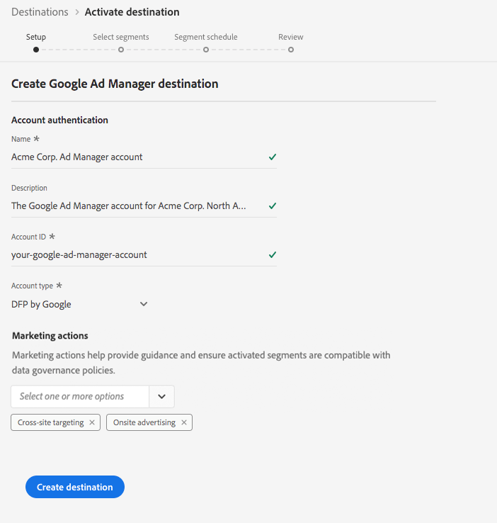

# [!DNL Google Ad Manager Destination]

## Panoramica

[!DNL Google Ad Manager], precedentemente noto come  [!DNL DoubleClick] per gli editori o  [!DNL DoubleClick AdX]per gli editori, è una piattaforma di annunci da  [!DNL Google] cui gli editori possono gestire la visualizzazione degli annunci sui propri siti Web, attraverso video e nelle app mobili.

## Specifiche di destinazione

Tenete presenti i seguenti dettagli specifici per le destinazioni [!DNL Google Ad Manager]:

* È possibile inviare le seguenti [identità](../../../identity-service/namespaces.md) alle [!DNL Google Ads] destinazioni: [AAM UUID](https://experienceleague.adobe.com/docs/audience-manager/user-guide/reference/ids-in-aam.html?lang=en), ID cookie Google, IDFA, GAID, ID Roku, ID Microsoft e ID  Amazon Fire TV.
   * Google utilizzerà [AAM UUID](https://experienceleague.adobe.com/docs/audience-manager/user-guide/reference/ids-in-aam.html?lang=en) per eseguire il targeting degli utenti in California e il Google Cookie ID per tutti gli altri utenti.
* I tipi di pubblico attivati vengono creati a livello di programmazione nella piattaforma [!DNL Google].
* Al momento la piattaforma non include una metrica di misura per convalidare l&#39;attivazione. Per convalidare l&#39;integrazione e comprendere le dimensioni del targeting dell&#39;audience, fare riferimento ai conteggi dell&#39;audience in Google.

>[!IMPORTANT]
>
>Se stai cercando di creare la tua prima destinazione con [!DNL Google Ad Manager] e non hai attivato la [funzionalità di sincronizzazione ID](https://experienceleague.adobe.com/docs/id-service/using/id-service-api/methods/idsync.html) in  Experience Cloud ID Service in passato (con  Audience Manager o altre applicazioni), contatta  Consulente Adobe o l&#39;Assistenza clienti per abilitare le sincronizzazioni ID. Se in precedenza erano state configurate [!DNL Google] integrazioni in  Audience Manager, le sincronizzazioni ID configurate per il passaggio alla piattaforma.

### Tipo di esportazione {#export-type}

**Esportazione**  segmento: tutti i membri di un segmento (pubblico) vengono esportati nella destinazione Google.

## Prerequisiti

### elenco consentiti 

>[!NOTE]
>
>Il elenco consentiti  è obbligatorio prima di configurare la prima [!DNL Google Ad Manager] destinazione in Platform. Prima di creare una destinazione, verificare che il processo di elenco consentiti  descritto di seguito sia stato completato da [!DNL Google].

Prima di creare la destinazione [!DNL Google Ad Manager] nella piattaforma, è necessario contattare [!DNL Google] per  Adobe nell&#39;elenco dei provider di dati consentiti e per aggiungere l&#39;account al elenco consentiti . Contattare [!DNL Google] e fornire le seguenti informazioni:

* **ID**  account:  ID account  Adobe con  [!DNL Google]. Per ottenere questo ID, contatta &#39;Assistenza clienti di Adobe o il rappresentante del Adobe .
* **ID**  cliente: si tratta  ID account  cliente con  [!DNL Google]. Per ottenere questo ID, contatta &#39;Assistenza clienti di Adobe o il rappresentante del Adobe .
* **ID**  rete: questo è il tuo account con  [!DNL Google Ad Manager]
* **ID**  collegamento pubblico: questo è il tuo account con  [!DNL Google Ad Manager]
* Il tipo di account. DFP di Google o dell&#39;acquirente AdX.

## Configura destinazione

In **[!UICONTROL Connections]** > **[!UICONTROL Destinations]**, selezionare **[!DNL Google Ad Manager]**, quindi selezionare **[!UICONTROL Configure]**.

>[!NOTE]
>
>Se esiste già una connessione con questa destinazione, è possibile visualizzare un pulsante **[!UICONTROL Activate]** sulla scheda di destinazione. Per ulteriori informazioni sulla differenza tra **[!UICONTROL Activate]** e **[!UICONTROL Configure]**, fare riferimento alla sezione [Catalog](../../ui/destinations-workspace.md#catalog) della documentazione relativa all&#39;area di lavoro di destinazione.

Nel passaggio **Setup** del flusso di lavoro di creazione della destinazione, compilare il [!UICONTROL Basic Information] per la destinazione.

* **[!UICONTROL Name]**: Compila il nome preferito per questa destinazione.
* **[!UICONTROL Description]**: Facoltativo. Ad esempio, potete specificare per quale campagna state utilizzando questa destinazione.
* **[!UICONTROL Account Type]**: Selezionate un’opzione, a seconda dell’account con Google:
   * Utilizzate `DFP by Google` per [!DNL DoubleClick] per gli editori
   * Utilizzare `AdX buyer` per [!DNL Google AdX]
* **[!UICONTROL Account ID]**: Compila il tuo ID account con  [!DNL Google]. Può trattarsi dell’ID di rete o dell’ID collegamento pubblico. In genere si tratta di un ID di otto cifre.
* **[!UICONTROL Marketing use case]**: I casi di utilizzo del marketing indicano l&#39;intento per il quale i dati verranno esportati nella destinazione. Puoi scegliere tra  casi di utilizzo di marketing definiti dal Adobe o creare un caso di utilizzo di marketing personale. Per ulteriori informazioni sui casi di utilizzo del marketing, vedere la [panoramica dei criteri di utilizzo dei dati](../../../data-governance/policies/overview.md).

>[!NOTE]
>
>Quando si configura una destinazione [!DNL Google Ad Manager], è necessario utilizzare il proprio [!DNL Google Account Manager] o  rappresentante del Adobe per capire quale tipo di account si dispone.

## Attivare i segmenti in [!DNL Google Ad Manager]

Per istruzioni su come attivare i segmenti in [!DNL Google Ad Manager], vedere [Attivare i dati sulle destinazioni](../../ui/activate-destinations.md).

## Dati esportati

Per verificare se i dati sono stati esportati correttamente nella destinazione [!DNL Google Ad Manager], controlla il tuo account [!DNL Google Ad Manager]. Se l&#39;attivazione ha avuto esito positivo, l&#39;audience viene popolata nel vostro account.