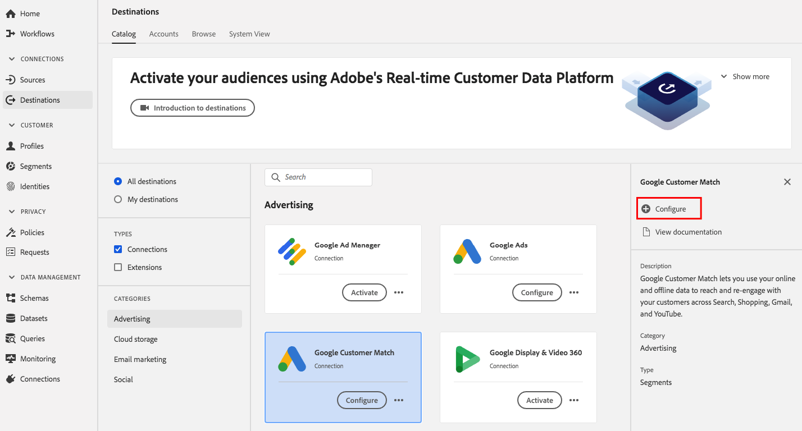
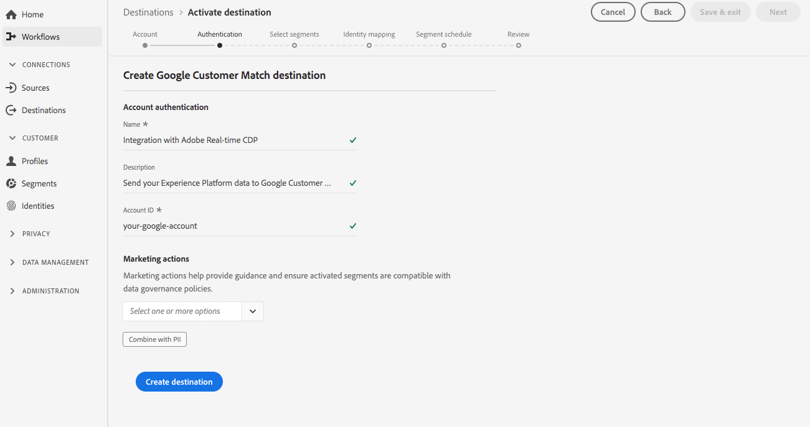
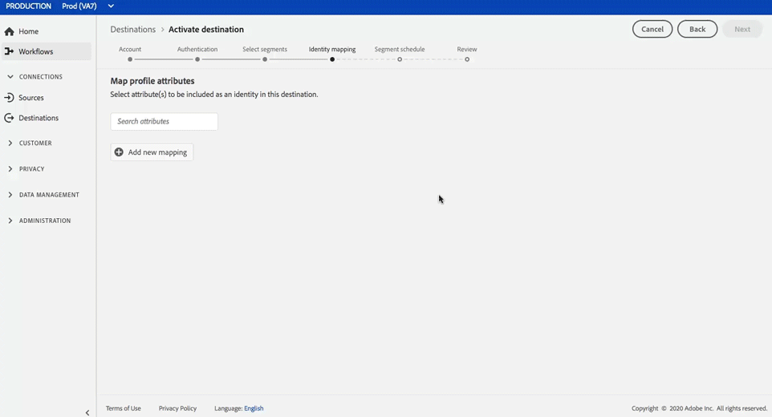

# Destinazione di corrispondenza cliente Google

## Panoramica {#overview}

[Google Customer ](https://support.google.com/google-ads/answer/6379332?hl=en) Matchlet consente di utilizzare i dati online e offline per raggiungere e coinvolgere nuovamente i clienti attraverso le proprietà di Google possedute e gestite, ad esempio:  [!DNL Search],  [!DNL Shopping],  [!DNL Gmail], e  [!DNL YouTube].

## Casi d’uso

Per comprendere meglio come e quando utilizzare la destinazione [!DNL Google Customer Match], ecco alcuni esempi di casi d&#39;uso che i clienti della piattaforma dati cliente in tempo reale possono risolvere utilizzando questa funzione.

### Caso di utilizzo n. 1

Un marchio di abbigliamento atletico vuole raggiungere i clienti esistenti attraverso [!DNL Google Search] e [!DNL Google Shopping] per personalizzare offerte e articoli in base ai loro acquisti passati e alla cronologia di navigazione. Il marchio dell&#39;abbigliamento può acquisire indirizzi e-mail da CRM a CDP in tempo reale, creare segmenti dai propri dati offline e inviare questi segmenti a [!DNL Google Customer Match] da utilizzare tra [!DNL Search] e [!DNL Shopping], ottimizzando le spese pubblicitarie.

### Caso di utilizzo n. 2

Un&#39;importante azienda tecnologica ha appena lanciato un nuovo telefono. Nel tentativo di promuovere questo nuovo modello di telefono, stanno cercando di sensibilizzare i clienti che possiedono i loro modelli precedenti di telefoni sulle nuove funzionalità e caratteristiche del telefono.

Per promuovere il rilascio, caricano gli indirizzi e-mail dal loro database CRM in CDP in tempo reale, utilizzando gli indirizzi e-mail come identificatori. I segmenti vengono creati in base ai clienti che possiedono vecchi modelli di telefono e li inviano a [!DNL Google Customer Match] in modo da poter essere indirizzati ai clienti attuali, ai clienti che possiedono modelli di telefono meno recenti e a clienti simili su [!DNL YouTube].

## Specifiche di destinazione {#destination-specs}

### Gestione dei dati per [!DNL Google Customer Match] destinazioni {#data-governance}

Le destinazioni in CDP in tempo reale possono avere determinate regole e obblighi per i dati inviati o ricevuti dalla piattaforma di destinazione. L&#39;Utente è tenuto a comprendere i limiti e gli obblighi dei propri dati e come li utilizza in Adobe Experience Platform e nella piattaforma di destinazione. Adobe Experience Platform offre strumenti per la gestione dei dati che consentono di gestire alcuni di questi obblighi di utilizzo dei dati. [Scopri ](../../..//data-governance/labels/overview.md) di più sugli strumenti e sulle politiche per la gestione dei dati.

### Tipo di esportazione e identità {#export-type}

**Esportazione**  segmento - vengono esportati tutti i membri di un segmento (pubblico) con gli identificatori (nome, numero di telefono, ecc.) utilizzato nella destinazione [!DNL Google Customer Match].

**Identità** : puoi utilizzare e-mail non utilizzate o con hash come ID cliente in Google

### [!DNL Google Customer Match] prerequisiti account  {#google-account-prerequisites}

Prima di impostare una destinazione [!DNL Google Customer Match] in CDP in tempo reale, accertatevi di leggere e aderire ai criteri Google per l&#39;utilizzo di [!DNL Customer Match], descritti nella [documentazione di supporto di Google](https://support.google.com/google-ads/answer/6299717).

### elenco consentiti  {#allowlist}

>[!NOTE]
>
>È obbligatorio aggiungere al elenco consentiti  Google prima di configurare la prima [!DNL Google Customer Match] destinazione in CDP in tempo reale. Prima di creare una destinazione, verificare che il processo di elenco consentiti  descritto di seguito sia stato completato da Google.

Prima di creare la destinazione [!DNL Google Customer Match] in CDP in tempo reale, è necessario contattare Google e seguire le istruzioni  elenco consentiti in [Usa partner di corrispondenza clienti per caricare i dati](https://support.google.com/google-ads/answer/7361372?hl=en&amp;ref_topic=6296507) nella documentazione di Google.

Inoltre, è disponibile un secondo elenco consentiti di Google  a cui è necessario aggiungere il proprio account se si intende caricare i dati utilizzando l&#39; [User_ID](https://developers.google.com/adwords/api/docs/guides/remarketing#customer_match_with_email_address_address_or_user_id) di Google. Contattate il vostro account manager Google per essere certi di essere aggiunti ai elenchi consentiti .

### Requisiti di corrispondenza ID {#id-matching-requirements}

[!DNL Google] richiede che non siano inviate informazioni personali (PII) in modo chiaro. Di conseguenza, è possibile disattivare gli identificatori [!DNL Google Customer Match] con hash *con*, ad esempio indirizzi e-mail o numeri di telefono.

A seconda del tipo di ID che trasferisci in Adobe Experience Platform, devi soddisfare i requisiti corrispondenti.

#### Requisiti di hashing del numero di telefono {#phone-number-hashing-requirements}

Esistono due metodi per attivare i numeri di telefono in [!DNL Google Customer Match]:

* **Inserimento di numeri** di telefono non elaborati: è possibile inserire i numeri di telefono non elaborati nel  [!DNL E.164] formato  [!DNL Platform], che verranno automaticamente crittografati al momento dell&#39;attivazione. Se scegliete questa opzione, accertatevi di inserire sempre i numeri di telefono non elaborati nello spazio dei nomi `Phone_E.164`.
* **Inserimento di numeri** di telefono con hash: è possibile pre-hash i numeri di telefono prima di inviarli in  [!DNL Platform]. Se scegliete questa opzione, accertatevi di inserire sempre i numeri di telefono con hash nello spazio dei nomi `PHONE_SHA256_E.164`.

>[!NOTE]
>
>I numeri di telefono acquisiti nello spazio dei nomi `Phone` non possono essere attivati in [!DNL Google Customer Match].

#### Requisiti di hashing e-mail {#hashing-requirements}

Potete scegliere di hash gli indirizzi e-mail prima di inviarli in Adobe Experience Platform, oppure potete scegliere di lavorare con gli indirizzi e-mail in  Experience Platform e ottenere l&#39;hash del nostro algoritmo al momento dell&#39;attivazione.

Per ulteriori informazioni sui requisiti di hashing di Google e altre restrizioni all&#39;attivazione, consulta le sezioni seguenti nella documentazione di Google:

* [[!DNL Customer Match] con indirizzo e-mail, indirizzo o ID utente](https://developers.google.com/adwords/api/docs/guides/remarketing#customer_match_with_email_address_address_or_user_id)
* [[!DNL Customer Match] considerazioni](https://developers.google.com/adwords/api/docs/guides/remarketing#customer_match_considerations)
* [Corrispondenza cliente con numero di telefono](https://developers.google.com/adwords/api/docs/guides/remarketing#customer_match_with_phone_number)
* [Corrispondenza cliente con ID dispositivo mobile](https://developers.google.com/adwords/api/docs/guides/remarketing#customer_match_with_mobile_device_ids)

Per informazioni sull&#39;acquisizione di indirizzi e-mail in  Experience Platform, vedere la [panoramica sull&#39;assimilazione batch](../../../ingestion/batch-ingestion/overview.md) e la [panoramica sull&#39;assimilazione in streaming](../../../ingestion/streaming-ingestion/overview.md).

Se selezionate di hash gli indirizzi e-mail, accertatevi di soddisfare i requisiti di Google, descritti nei collegamenti sopra.

#### Utilizzo di spazi dei nomi personalizzati {#custom-namespaces}

Prima di poter utilizzare lo spazio dei nomi `User_ID` per inviare dati a Google, assicurarsi di sincronizzare i propri identificatori utilizzando [!DNL gTag]. Per informazioni dettagliate, vedere la [documentazione ufficiale](https://support.google.com/google-ads/answer/9199250).

<!-- Data from unhashed namespaces is automatically hashed by [!DNL Platform] upon activation.

Attribute source data is not automatically hashed. When your source field contains unhashed attributes, check the **[!UICONTROL Apply transformation]** option, to have [!DNL Platform] automatically hash the data on activation.
 -->

## Connetti alla destinazione {#connect-destination}

In **[!UICONTROL Destinations]** > **[!UICONTROL Catalog]**, scorrere fino alla categoria **[!UICONTROL Advertising]**. Selezionare [!DNL Google Customer Match], quindi selezionare **[!UICONTROL Configure]**.

>[!NOTE]
>
>Se esiste già una connessione con questa destinazione, è possibile visualizzare un pulsante **[!UICONTROL Activate]** sulla scheda di destinazione. Per ulteriori informazioni sulla differenza tra **[!UICONTROL Activate]** e **[!UICONTROL Configure]**, fare riferimento alla sezione [Catalog](../../ui/destinations-workspace.md#catalog) della documentazione relativa all&#39;area di lavoro di destinazione.

Nel passaggio **Account**, se in precedenza è stata impostata una connessione alla destinazione [!DNL Google Customer Match], selezionare **[!UICONTROL Existing Account]** e selezionare la connessione esistente. In alternativa, è possibile selezionare **[!UICONTROL New Account]** per impostare una nuova connessione a [!DNL Google Customer Match]. Selezionare **[!UICONTROL Connect to destination]** per accedere e collegare Adobe Experience Cloud al proprio account [!DNL Google Ad].

>[!NOTE]
>
>CDP in tempo reale supporta la convalida delle credenziali nel processo di autenticazione e visualizza un messaggio di errore se vengono immesse credenziali non corrette nell&#39;account [!DNL Google Ad]. In questo modo si evita di completare il flusso di lavoro con credenziali non corrette.

Una volta confermate le credenziali e che Adobe Experience Cloud è connesso al tuo account Google, puoi selezionare **[!UICONTROL Next]** per passare al passaggio **[!UICONTROL Setup]**.

Nel passaggio **[!UICONTROL Authentication]**, immettete un [!UICONTROL Name] e un [!UICONTROL Description] per il flusso di attivazione e riempite Google con il [!UICONTROL Account ID].

Inoltre in questo passaggio, è possibile selezionare qualsiasi **[!UICONTROL Marketing use case]** da applicare a questa destinazione. I casi di utilizzo del marketing indicano l&#39;intento per il quale i dati verranno esportati nella destinazione. Puoi scegliere tra  casi di utilizzo di marketing definiti dal Adobe o creare un caso di utilizzo di marketing personale. Per ulteriori informazioni sui casi di utilizzo del marketing, vedere la pagina [Governance dei dati in CDP in tempo reale](../../../rtcdp/privacy/data-governance-overview.md#destinations). Per informazioni sui singoli casi d&#39;uso di marketing definiti dal Adobe , vedere la [panoramica dei criteri di utilizzo dei dati](../../../data-governance/policies/overview.md#core-actions).

Selezionare **[!UICONTROL Create Destination]** dopo aver compilato i campi riportati sopra.

>[!IMPORTANT]
>
> * Il caso di utilizzo di **[!UICONTROL Combine with PII]** marketing è selezionato per impostazione predefinita per la destinazione [!DNL Google Customer Match] e non può essere rimosso.
> * Per le destinazioni [!DNL Google Customer Match]. **[!UICONTROL Account ID]** è l&#39;ID cliente con Google. Il formato dell&#39;ID è xxx-xxx-xxxx.

La destinazione è stata creata. È possibile selezionare **[!UICONTROL Save & Exit]** se si desidera attivare i segmenti in un secondo momento oppure selezionare **[!UICONTROL Next]** per continuare il flusso di lavoro e selezionare i segmenti da attivare. In entrambi i casi, per il resto del flusso di lavoro, vedere la sezione successiva, [Attivare i segmenti su [!DNL Google Customer Match]](#activate-segments).

## Attivare i segmenti su [!DNL Google Customer Match] {#activate-segments}

Per istruzioni su come attivare i segmenti in [!DNL Google Customer Match], vedere [Attivare i dati sulle destinazioni](../../ui/activate-destinations.md).

Nel passaggio **[!UICONTROL Segment schedule]**, è necessario fornire i segmenti [!UICONTROL App ID] durante l&#39;invio di [!DNL IDFA] o [!DNL GAID] a [!DNL Google Customer Match].

Per informazioni dettagliate su come trovare la [!DNL App ID], consultare la [documentazione ufficiale](https://developers.google.com/adwords/api/docs/reference/v201809/AdwordsUserListService.CrmBasedUserList#appid).

<!-- 
To activate segments to [!DNL Google Customer Match], follow the steps below: 

In **[!UICONTROL Destinations > Browse]**, select the [!DNL Google Customer Match] destination where you want to activate your segments.

Click the name of the destination. This takes you to the Activate flow.

Note that if an activation flow already exists for a destination, you can see the segments that are currently being sent to the destination. Select **[!UICONTROL Edit activation]** in the right rail and follow the steps below to modify the activation details.

Select **[!UICONTROL Activate]**. In the **[!UICONTROL Activate destination]** workflow, on the **[!UICONTROL Select Segments]** page, select which segments to send to [!DNL Google Customer Match].

In the **[!UICONTROL Identity mapping]** step, select which attributes to be included as an identity in this destination. Select **[!UICONTROL Add new mapping]** and browse your schema, select email and/or hashed email, and map them to the corresponding target identity.

 

**Plain text email address as primary identity**: If you have plain text (unhashed) email addresses as primary identity in your schema, select the email field in your **[!UICONTROL Source Attributes]** and map to the Email field in the right column under **[!UICONTROL Target Identities]**, as shown below:

 

**Hashed email address as primary identity**: If you have hashed email addresses as primary identity in your schema, select the hashed email field in your **[!UICONTROL Source Attributes]** and map to the Email_LC_SHA256 field in the right column under **[!UICONTROL Target Identities]**, as shown below:

On the **[!UICONTROL Segment schedule]** page, you can set the start date for sending data to the destination.

On the **[!UICONTROL Review]** page, you can see a summary of your selection. Select **[!UICONTROL Cancel]** to break up the flow, **[!UICONTROL Back]** to modify your settings, or **[!UICONTROL Finish]** to confirm your selection and start sending data to the destination.

>[!IMPORTANT]
>
>In this step, Real-time CDP checks for data usage policy violations. Shown below is an example where a policy is violated. You cannot complete the segment activation workflow until you have resolved the violation. For information on how to resolve policy violations, see [Policy enforcement](../../../rtcdp/privacy/data-governance-overview.md#enforcement) in the data governance documentation section.
 

If no policy violations have been detected, select **[!UICONTROL Finish]** to confirm your selection and start sending data to the destination.

 -->

## Verificare che l&#39;attivazione del segmento sia stata eseguita correttamente{#verify-activation}

Dopo aver completato il flusso di attivazione, passate all&#39;account **[!UICONTROL Google Ads]**. I segmenti attivati verranno ora visualizzati nel tuo account Google come elenchi di clienti. A seconda delle dimensioni del segmento, alcuni tipi di pubblico non verranno popolati a meno che non ci siano più di 100 utenti attivi da distribuire.

Quando si esegue la mappatura di un segmento agli ID [!DNL IDFA] e [!DNL GAID] mobili, [!DNL Google Customer Match] crea un segmento separato per ogni mappatura ID. Il tuo account [!DNL Google Ads] mostrerà due segmenti diversi, uno per il [!DNL IDFA] e uno per il mapping [!DNL GAID].

## Risorse aggiuntive {#additional-resources}

* [Integrare Google Customer Match - Esercitazione video](https://experienceleague.adobe.com/docs/platform-learn/tutorials/rtcdp/integrate-with-google-customer-match.html)