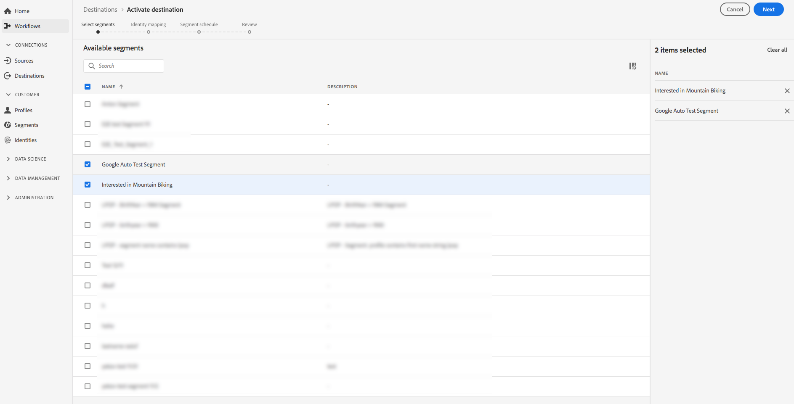

# [!DNL Google Customer Match] connection

[Google Customer ](https://support.google.com/google-ads/answer/6379332?hl=en) Matchlets consente di utilizzare i dati online e offline per raggiungere e coinvolgere nuovamente i clienti nelle proprietà di Google possedute e gestite, ad esempio:  [!DNL Search],  [!DNL Shopping],  [!DNL Gmail], e  [!DNL YouTube].

## Casi d’uso

Per comprendere meglio come e quando utilizzare la destinazione [!DNL Google Customer Match], di seguito sono riportati alcuni esempi di casi d’uso che i clienti Adobe Experience Platform possono risolvere utilizzando questa funzione.

### Caso d&#39;uso n. 1

Un marchio di abbigliamento atletico vuole raggiungere i clienti esistenti attraverso [!DNL Google Search] e [!DNL Google Shopping] per personalizzare offerte e articoli in base ai loro acquisti precedenti e alla cronologia di navigazione. Il brand di abbigliamento può acquisire indirizzi e-mail dal proprio CRM all’Experience Platform, creare segmenti dai propri dati offline e inviare tali segmenti a [!DNL Google Customer Match] da utilizzare in [!DNL Search] e [!DNL Shopping], ottimizzando le spese pubblicitarie.

### Caso d&#39;uso n. 2

Un&#39;importante azienda tecnologica ha appena pubblicato un nuovo telefono. Nel tentativo di promuovere questo nuovo modello di telefono, stanno cercando di sensibilizzare i clienti sulle nuove caratteristiche e funzionalità del telefono ai clienti che possiedono i modelli precedenti dei loro telefoni.

Per promuovere il rilascio, caricano gli indirizzi e-mail dal loro database CRM in Experience Platform, utilizzando gli indirizzi e-mail come identificatori. I segmenti vengono creati in base ai clienti che possiedono modelli di telefono precedenti e inviati a [!DNL Google Customer Match] in modo che possano essere indirizzati ai clienti correnti, ai clienti che possiedono modelli di telefono precedenti e a clienti simili su [!DNL YouTube].

## Specifiche di destinazione {#destination-specs}

### Governance dei dati per le destinazioni [!DNL Google Customer Match] {#data-governance}

Le destinazioni di cui all’Experience Platform possono avere determinate regole e obblighi per i dati inviati o ricevuti dalla piattaforma di destinazione. Sei responsabile di comprendere i limiti e gli obblighi dei tuoi dati e come li utilizzi in Adobe Experience Platform e nella piattaforma di destinazione. Adobe Experience Platform fornisce strumenti di governance dei dati per aiutarti a gestire alcuni di questi obblighi di utilizzo dei dati. [Ulteriori ](../../..//data-governance/labels/overview.md) informazioni sugli strumenti e i criteri di governance dei dati.

### Tipo di esportazione e identità {#export-type}

**Esportazione segmento** : stai esportando tutti i membri di un segmento (pubblico) con gli identificatori (nome, numero di telefono, ecc.) utilizzato nella destinazione [!DNL Google Customer Match].

**Identità** : puoi utilizzare e-mail non elaborate o con hash come ID cliente in Google.

### [!DNL Google Customer Match] prerequisiti dell’account  {#google-account-prerequisites}

Prima di configurare una destinazione [!DNL Google Customer Match] in Experience Platform, assicurati di leggere e rispettare i criteri di Google per l&#39;utilizzo di [!DNL Customer Match], descritti nella [documentazione di supporto di Google](https://support.google.com/google-ads/answer/6299717).

### Consenti elenco {#allowlist}

>[!NOTE]
>
>È obbligatorio da aggiungere all’elenco Consentiti di Google prima di configurare la tua prima destinazione [!DNL Google Customer Match] nell’Experience Platform. Prima di creare una destinazione, assicurati che Google abbia completato il processo di elenco Consentiti descritto di seguito.

Prima di creare la destinazione [!DNL Google Customer Match] nell&#39;Experience Platform, è necessario contattare Google e seguire le istruzioni dell&#39;elenco Consentiti in [Utilizza i partner Customer Match per caricare i tuoi dati](https://support.google.com/google-ads/answer/7361372?hl=en&amp;ref_topic=6296507) nella documentazione di Google.

Inoltre, esiste un secondo elenco Consentiti di Google a cui devi aggiungere il tuo account se intendi caricare dati utilizzando Google [User_ID](https://developers.google.com/adwords/api/docs/guides/remarketing#customer_match_with_email_address_address_or_user_id). Contatta il tuo account manager Google per assicurarti di essere aggiunto agli elenchi consentiti.

### Requisiti di corrispondenza ID {#id-matching-requirements}

[!DNL Google] richiede che non siano inviate informazioni personali identificabili (PII) in modo chiaro. Pertanto, i tipi di pubblico attivati in [!DNL Google Customer Match] possono essere contrassegnati da identificatori *con hash* come indirizzi e-mail o numeri di telefono.

A seconda del tipo di ID che trasferisci in Adobe Experience Platform, devi soddisfare i requisiti corrispondenti.

#### Requisiti di hashing del numero di telefono {#phone-number-hashing-requirements}

Esistono due metodi per attivare i numeri di telefono in [!DNL Google Customer Match]:

* **Inserimento di numeri** di telefono non elaborati: è possibile acquisire i numeri di telefono non elaborati in  [!DNL E.164] formato in  [!DNL Platform], che verrà automaticamente hashing al momento dell’attivazione. Se scegli questa opzione, accertati di inserire sempre i numeri di telefono non elaborati nello spazio dei nomi `Phone_E.164` .
* **Inserimento di numeri** di telefono con hash: è possibile pre-hash i numeri di telefono prima dell’inserimento in  [!DNL Platform]. Se scegli questa opzione, accertati di inserire sempre i numeri di telefono con hash nello spazio dei nomi `PHONE_SHA256_E.164` .

>[!NOTE]
>
>I numeri di telefono acquisiti nello spazio dei nomi `Phone` non possono essere attivati in [!DNL Google Customer Match].

#### Requisiti di hash e-mail {#hashing-requirements}

Puoi scegliere di aggiungere hash agli indirizzi e-mail prima di inviarli in Adobe Experience Platform, oppure puoi scegliere di lavorare con gli indirizzi e-mail in modo chiaro nell’Experience Platform e ottenere l’hash dal nostro algoritmo all’attivazione.

Per ulteriori informazioni sui requisiti di hashing di Google e su altre restrizioni all’attivazione, consulta le sezioni seguenti nella documentazione di Google:

* [[!DNL Customer Match] con indirizzo e-mail, indirizzo o ID utente](https://developers.google.com/adwords/api/docs/guides/remarketing#customer_match_with_email_address_address_or_user_id)
* [[!DNL Customer Match] considerazioni](https://developers.google.com/adwords/api/docs/guides/remarketing#customer_match_considerations)
* [Customer Match con numero di telefono](https://developers.google.com/adwords/api/docs/guides/remarketing#customer_match_with_phone_number)
* [Corrispondenza cliente con ID dispositivo mobile](https://developers.google.com/adwords/api/docs/guides/remarketing#customer_match_with_mobile_device_ids)

Per informazioni sull’acquisizione degli indirizzi e-mail in Experience Platform, consulta la [panoramica sull’acquisizione batch](../../../ingestion/batch-ingestion/overview.md) e la [panoramica sull’acquisizione in streaming](../../../ingestion/streaming-ingestion/overview.md).

Se scegli di aggiungere l’hash agli indirizzi e-mail da solo, assicurati di soddisfare i requisiti di Google, descritti nei collegamenti di cui sopra.

#### Utilizzo di spazi dei nomi personalizzati {#custom-namespaces}

Prima di poter utilizzare lo spazio dei nomi `User_ID` per inviare dati a Google, assicurati di sincronizzare i tuoi identificatori utilizzando [!DNL gTag]. Per informazioni dettagliate, consulta la [documentazione ufficiale di Google](https://support.google.com/google-ads/answer/9199250) .

<!-- Data from unhashed namespaces is automatically hashed by [!DNL Platform] upon activation.

Attribute source data is not automatically hashed. When your source field contains unhashed attributes, check the **[!UICONTROL Apply transformation]** option, to have [!DNL Platform] automatically hash the data on activation.
 -->

## Connetti alla destinazione {#connect-destination}

In **[!UICONTROL Destinations]** > **[!UICONTROL Catalog]**, scorri fino alla categoria **[!UICONTROL Advertising]** . Selezionare [!DNL Google Customer Match], quindi selezionare **[!UICONTROL Configure]**.

>[!NOTE]
>
>Se esiste già una connessione con questa destinazione, è possibile visualizzare un pulsante **[!UICONTROL Activate]** sulla scheda di destinazione. Per ulteriori informazioni sulla differenza tra **[!UICONTROL Activate]** e **[!UICONTROL Configure]**, consulta la sezione [Catalogo](../../ui/destinations-workspace.md#catalog) della documentazione dell&#39;area di lavoro di destinazione.

Nel passaggio **Account**, se in precedenza hai impostato una connessione alla destinazione [!DNL Google Customer Match], seleziona **[!UICONTROL Existing Account]** e seleziona la connessione esistente. In alternativa, è possibile selezionare **[!UICONTROL New Account]** per impostare una nuova connessione a [!DNL Google Customer Match]. Seleziona **[!UICONTROL Connect to destination]** per accedere e collegare Adobe Experience Cloud al tuo account [!DNL Google Ad].

>[!NOTE]
>
>Experience Platform supporta la convalida delle credenziali nel processo di autenticazione e visualizza un messaggio di errore se immetti credenziali errate nel tuo account [!DNL Google Ad]. In questo modo non completa il flusso di lavoro con credenziali errate.

Una volta confermate le credenziali e quando Adobe Experience Cloud è connesso al tuo account Google, puoi selezionare **[!UICONTROL Next]** per procedere al passaggio **[!UICONTROL Authentication]** .

Nel passaggio **[!UICONTROL Authentication]** , immetti un **[!UICONTROL Name]** e un **[!UICONTROL Description]** per il flusso di attivazione e compila il tuo Google **[!UICONTROL Account ID]**.

In questo passaggio, puoi anche selezionare qualsiasi **[!UICONTROL Marketing actions]** da applicare a questa destinazione. Le azioni di marketing indicano l’intento per il quale i dati verranno esportati nella destinazione. Puoi scegliere tra azioni di marketing definite da Adobi o creare una tua azione di marketing. Per ulteriori informazioni sulle azioni di marketing, consulta la [Panoramica sui criteri di utilizzo dei dati](../../../data-governance/policies/overview.md).

Selezionare **[!UICONTROL Create Destination]** dopo aver compilato i campi precedenti.

>[!IMPORTANT]
>
> * L’azione di marketing **[!UICONTROL Combine with PII]** è selezionata per impostazione predefinita per la destinazione [!DNL Google Customer Match] e non può essere rimossa.
> * Per le destinazioni [!DNL Google Customer Match]. **[!UICONTROL Account ID]** è l&#39;ID cliente con Google. Il formato dell&#39;ID è xxx-xxx-xxxx.

La destinazione viene ora creata. Puoi selezionare **[!UICONTROL Save & Exit]** se desideri attivare i segmenti in un secondo momento oppure puoi selezionare **[!UICONTROL Next]** per continuare il flusso di lavoro e selezionare i segmenti da attivare. In entrambi i casi, consulta la sezione successiva [Attivare i segmenti su [!DNL Google Customer Match]](#activate-segments), per il resto del flusso di lavoro.

## Attiva i segmenti in [!DNL Google Customer Match] {#activate-segments}

Per istruzioni su come attivare i segmenti su [!DNL Google Customer Match], consulta [Attivare i dati sulle destinazioni](../../ui/activate-destinations.md).

Nel passaggio **[!UICONTROL Segment schedule]** , devi fornire [!UICONTROL App ID] quando invii segmenti [!DNL IDFA] o [!DNL GAID] a [!DNL Google Customer Match].

Per informazioni su come trovare il [!DNL App ID], consulta la [documentazione ufficiale di Google](https://developers.google.com/adwords/api/docs/reference/v201809/AdwordsUserListService.CrmBasedUserList#appid).

<!-- 
To activate segments to [!DNL Google Customer Match], follow the steps below: 

In **[!UICONTROL Destinations > Browse]**, select the [!DNL Google Customer Match] destination where you want to activate your segments.

Click the name of the destination. This takes you to the Activate flow.

Note that if an activation flow already exists for a destination, you can see the segments that are currently being sent to the destination. Select **[!UICONTROL Edit activation]** in the right rail and follow the steps below to modify the activation details.

Select **[!UICONTROL Activate]**. In the **[!UICONTROL Activate destination]** workflow, on the **[!UICONTROL Select Segments]** page, select which segments to send to [!DNL Google Customer Match].

In the **[!UICONTROL Identity mapping]** step, select which attributes to be included as an identity in this destination. Select **[!UICONTROL Add new mapping]** and browse your schema, select email and/or hashed email, and map them to the corresponding target identity.

 

**Plain text email address as primary identity**: If you have plain text (unhashed) email addresses as primary identity in your schema, select the email field in your **[!UICONTROL Source Attributes]** and map to the Email field in the right column under **[!UICONTROL Target Identities]**, as shown below:

 

**Hashed email address as primary identity**: If you have hashed email addresses as primary identity in your schema, select the hashed email field in your **[!UICONTROL Source Attributes]** and map to the Email_LC_SHA256 field in the right column under **[!UICONTROL Target Identities]**, as shown below:

On the **[!UICONTROL Segment schedule]** page, you can set the start date for sending data to the destination.

On the **[!UICONTROL Review]** page, you can see a summary of your selection. Select **[!UICONTROL Cancel]** to break up the flow, **[!UICONTROL Back]** to modify your settings, or **[!UICONTROL Finish]** to confirm your selection and start sending data to the destination.

>[!IMPORTANT]
>
>In this step, Real-time CDP checks for data usage policy violations. Shown below is an example where a policy is violated. You cannot complete the segment activation workflow until you have resolved the violation. For information on how to resolve policy violations, see [Policy enforcement](../../../rtcdp/privacy/data-governance-overview.md#enforcement) in the data governance documentation section.
 

If no policy violations have been detected, select **[!UICONTROL Finish]** to confirm your selection and start sending data to the destination.

 -->

## Verifica che l&#39;attivazione del segmento sia avvenuta correttamente {#verify-activation}

Dopo aver completato il flusso di attivazione, passa al tuo account **[!UICONTROL Google Ads]** . I segmenti attivati verranno ora visualizzati nel tuo account Google come elenchi di clienti. Tieni presente che a seconda della dimensione del segmento, alcuni tipi di pubblico non verranno compilati a meno che non vi siano più di 100 utenti attivi da servire.

Quando mappi un segmento con gli ID mobili [!DNL IDFA] e [!DNL GAID] , [!DNL Google Customer Match] crea un segmento separato per ogni mappatura ID. Il tuo account [!DNL Google Ads] mostrerà due segmenti diversi, uno per il [!DNL IDFA] e uno per la mappatura [!DNL GAID].

## Risorse aggiuntive {#additional-resources}

* [Integrare Google Customer Match - Esercitazione video](https://experienceleague.adobe.com/docs/platform-learn/tutorials/rtcdp/integrate-with-google-customer-match.html)