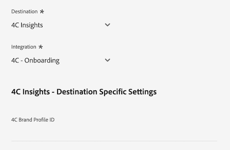
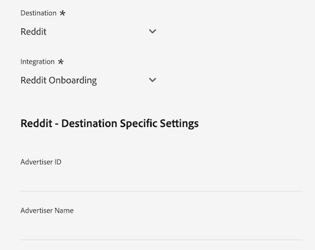

# Connessione [!DNL LiveRamp - Distribution]

La connessione [!DNL LiveRamp - Distribution] consente di attivare i tipi di pubblico da Experience Platform agli editori Premium su supporti TV connessi, mobili, Web e display.

>[!IMPORTANT]
>
>Il connettore di destinazione e la pagina della documentazione vengono creati e gestiti da LiveRamp. Per richieste di informazioni o richieste di aggiornamento, contatta direttamente LiveRamp [qui](mailto:adobertcdp@liveramp.com).

## Destinazioni supportati {#supported-destinations}

[!DNL LiveRamp - Distribution] attualmente supporta l&#39;attivazione del pubblico per le seguenti piattaforme:

* [[!DNL 4C Insights]](#insights)
* [[!DNL Acast]](#acast)
* [[!DNL Nexxen]](#nexxen)
* [[!DNL Ampersand.tv]](#ampersand-tv)
* [[!DNL Captify]](#captify)
* [[!DNL Cardlytics]](#cardlytics)
* [[!DNL Disney (Hulu/ESPN/ABC)]](#disney)
* [[!DNL iHeartMedia]](#iheartmedia)
* [[!DNL Index Exchange]](#index-exchange)
* [[!DNL Magnite CTV Platform]](#magnite)
* [[!DNL Magnite DV+ (Rubicon Project)]](#magnite-dv)
* [[!DNL One Fox]](#fox)
* [[!DNL Pandora]](#pandora)
* [[!DNL Reddit]](#reddit)
* [[!DNL Roku]](#roku)
* [[!DNL Spotify]](#spotify)
* [[!DNL Taboola]](#taboola)
* [[!DNL TargetSpot]](#targetspot)
* [[!DNL Teads]](#teads)
* [[!DNL WB Discovery]](#wb-discovery)

## Casi d’uso {#use-cases}

Per aiutarti a capire meglio come e quando utilizzare la destinazione [!DNL LiveRamp - Distribution], ecco un esempio di caso d&#39;uso che i clienti Adobe Experience Platform possono risolvere utilizzando questa destinazione.

Il team marketing di un rivenditore di abbigliamento sportivo ha utilizzato la connessione [LiveRamp - Onboarding](liveramp-onboarding.md) per inviare il pubblico da Experience Platform al proprio account LiveRamp.

Tramite la connessione [!DNL LiveRamp - Distribution] possono ora attivare i tipi di pubblico onboarded per le [destinazioni supportate](#supported-destinations). Potranno quindi eseguire il targeting degli utenti su piattaforme mobili, open web, social e [!DNL CTV].

## Onboarding del pubblico in LiveRamp {#onboarding}

Prima di attivare i tipi di pubblico tramite la connessione [!DNL LiveRamp - Distribution], utilizza la connessione [LiveRamp - Onboarding](liveramp-onboarding.md) per esportare i tipi di pubblico Experienci Platform in LiveRamp.

Dopo aver effettuato l&#39;onboarding dei tipi di pubblico in LiveRamp, continua il flusso di lavoro di attivazione dal passaggio [connettiti alla destinazione](#connect) per selezionare e configurare le piattaforme di destinazione di destinazione per l&#39;attivazione dei dati.

## Connettersi alla destinazione {#connect}

>[!CONTEXTUALHELP]
>id="platform_destinations_liveramp_distribution_identifier_settings"
>title="Impostazioni identificatore"
>abstract="Seleziona gli identificatori supportati dalla destinazione. Consulta la documentazione per l’elenco completo degli identificatori supportati per ogni destinazione."

>[!IMPORTANT]
> 
>Per connettersi alla destinazione, sono necessarie le **[!UICONTROL Destinazioni visualizzazione]** e le **[!UICONTROL Autorizzazioni di gestione delle destinazioni]** [per il controllo degli accessi](/help/access-control/home.md#permissions). Leggi la [panoramica sul controllo degli accessi](/help/access-control/ui/overview.md) o contatta l&#39;amministratore del prodotto per ottenere le autorizzazioni necessarie.

Per connettersi a questa destinazione, seguire i passaggi descritti nell&#39;esercitazione [sulla configurazione della destinazione](../../ui/connect-destination.md). Nel flusso di lavoro di configurazione della destinazione, compila i campi elencati nelle due sezioni seguenti.

### Autentica su LiveRamp {#authenticate}

Per eseguire l&#39;autenticazione nella destinazione, compilare i campi obbligatori e selezionare **[!UICONTROL Connetti alla destinazione]**.

* **[!UICONTROL ID organizzazione LiveRamp]**: l&#39;ID organizzazione del tuo account LiveRamp (elencato come _owner_org_ nelle credenziali fornite da LiveRamp).
* **[!UICONTROL Password]**: password dell&#39;account LiveRamp (elencata come _secret_key_ nelle credenziali fornite da LiveRamp).
* **[!UICONTROL URL token]**: l&#39;URL del token LiveRamp.
* **[!UICONTROL Nome utente]**: il nome utente dell&#39;account LiveRamp (indicato come _account_id_ nelle credenziali fornite da LiveRamp).

### Configurare i dettagli della destinazione {#destination-details}

Dopo aver effettuato correttamente la connessione all’account LiveRamp, inserisci le informazioni necessarie per connettersi alla destinazione a cui desideri attivare i tipi di pubblico.

* **[!UICONTROL Nome]**: inserisci il nome preferito per la connessione di destinazione.

>[!NOTE]
>
>Per la denominazione della destinazione, Adobe consiglia di seguire questo formato: `LiveRamp - Downstream Destination Name`. Questo modello di denominazione consente di identificare rapidamente le destinazioni nella scheda [Sfoglia](../../ui/destinations-workspace.md#browse) dell&#39;area di lavoro delle destinazioni.
> 
>Esempio: `LiveRamp - Roku`.

* **[!UICONTROL Descrizione]**: immetti una descrizione per la destinazione. Utilizza una descrizione che ti aiuta a identificare facilmente lo scopo di questa destinazione.
* **[!UICONTROL Destinazione]**: utilizza il menu a discesa per selezionare la destinazione in cui desideri attivare i tipi di pubblico. La destinazione selezionata influisce direttamente su quanto visualizzato nella schermata [impostazioni specifiche per la destinazione](#destination-settings).
* **[!UICONTROL Integrazione]**: selezionare l&#39;account di integrazione che si desidera utilizzare per la destinazione.
* **[!UICONTROL Identificatore]**: seleziona gli identificatori supportati dalla destinazione. Attualmente, tutti gli identificatori supportati nelle destinazioni sono precompilati nel menu a discesa.

## Impostazioni specifiche per la destinazione {#destination-settings}

Ognuna delle destinazioni [supportate](#supported-destinations) da [!DNL LiveRamp - Distribution] richiede di compilare opzioni di configurazione specifiche.

Consulta le sezioni seguenti per istruzioni dettagliate su come configurare ciascuna destinazione.

### [!DNL 4C Insights] {#insights}

>[!CONTEXTUALHELP]
>id="platform_destinations_liveramp_distribution_4cinsights_profile_id"
>title="ID profilo marchio 4C"
>abstract="Immetti l’ID numerico associato al tuo profilo marchio 4C. Se non disponi di questo ID, contatta il rappresentante dei servizi del cliente 4C."

Per configurare i dettagli per la destinazione, compila i campi seguenti.

* **[!UICONTROL 4C Brand Profile ID]**: immetti l&#39;ID numerico associato al tuo 4C Brand Profile. Se non disponi di questo ID, contatta il rappresentante dei servizi del cliente 4C.

### [!DNL Acast] {#acast}

>[!CONTEXTUALHELP]
>id="platform_destinations_liveramp_distribution_acast_client"
>title="Nome cliente"
>abstract="Il nome dell’account dell’inserzionista, come desideri che appaia al partner di destinazione. Utilizza il nome della tua azienda. Non utilizzare spazi o caratteri speciali."

Per configurare i dettagli per la destinazione, compila i campi seguenti.

* **[!UICONTROL Nome client]**: il nome dell&#39;account dell&#39;inserzionista, che si desidera mostrare al partner di destinazione. Utilizza il nome della tua azienda. Non utilizzare spazi o caratteri speciali.

### [!DNL Ampersand.tv] {#ampersand-tv}

>[!CONTEXTUALHELP]
>id="platform_destinations_liveramp_distribution_ampersand_company_name"
>title="Nome società"
>abstract="Il nome della società, come desideri che appaia al partner di destinazione. Non utilizzare spazi o caratteri speciali."

Per configurare i dettagli per la destinazione, compila i campi seguenti.

* **[!UICONTROL Nome società]**: nome società, come si desidera che venga visualizzato al partner di destinazione. Non utilizzare spazi o caratteri speciali.

### [!DNL Captify] {#captify}

>[!CONTEXTUALHELP]
>id="platform_destinations_liveramp_distribution_captify_client"
>title="Nome cliente"
>abstract="Il nome dell’account dell’inserzionista, come desideri che appaia al partner di destinazione. Utilizza il nome della tua azienda. Non utilizzare spazi o caratteri speciali."

Per configurare i dettagli per la destinazione, compila i campi seguenti.

* **[!UICONTROL Nome client]**: il nome dell&#39;account dell&#39;inserzionista, che si desidera mostrare al partner di destinazione. Utilizza il nome della tua azienda. Non utilizzare spazi o caratteri speciali.

### [!DNL Cardlytics] {#cardlytics}

>[!CONTEXTUALHELP]
>id="platform_destinations_liveramp_distribution_cardlytics_client"
>title="Nome cliente"
>abstract="Il nome dell’account dell’inserzionista, come desideri che appaia al partner di destinazione. Utilizza il nome della tua azienda. Non utilizzare spazi o caratteri speciali."

Per configurare i dettagli per la destinazione, compila i campi seguenti.

* **[!UICONTROL Nome client]**: il nome dell&#39;account dell&#39;inserzionista, che si desidera mostrare al partner di destinazione. Utilizza il nome della tua azienda. Non utilizzare spazi o caratteri speciali.

### [!DNL Disney (Hulu/ESPN/ABC)] {#disney}

>[!CONTEXTUALHELP]
>id="platform_destinations_liveramp_distribution_agreement"
>title="Accordo sui termini di destinazione dei dati per gli inserzionisti"
>abstract="Digita `I AGREE` per confermare l’accettazione e l’accordo alle condizioni dei dati degli inserzionisti Disney."

<!-- >additional-url="<https://www.disneyadvertising.com/ADVERTISER-DATA-DESTINATION-TERMS/>" text="Read the agreement" -->

>[!CONTEXTUALHELP]
>id="platform_destinations_liveramp_distribution_disney_client"
>title="Nome cliente"
>abstract="Il nome dell’account dell’inserzionista, come desideri che appaia al partner di destinazione. Utilizza il nome della tua azienda. Non utilizzare spazi o caratteri speciali."

>[!CONTEXTUALHELP]
>id="platform_destinations_liveramp_distribution_disney_email"
>title="Indirizzo e-mail"
>abstract="Inserisci un indirizzo e-mail associato a un individuo. Questo indirizzo e-mail funge da firma per il contratto sulle condizioni dei dati dell’inserzionista. Se necessario, questo indirizzo e-mail verrà utilizzato anche per contattarti."

Per configurare i dettagli per la destinazione, compila i campi seguenti.

* **[!UICONTROL Accordo sui termini di destinazione dei dati dell&#39;inserzionista]**: digita in `I AGREE` per confermare la conferma e l&#39;accordo sui termini dei dati dell&#39;inserzionista Disney.
* **[!UICONTROL Nome client]**: immettere il nome della società che si desidera venga visualizzato al partner di destinazione.
* **[!UICONTROL Indirizzo e-mail]**: immetti un indirizzo e-mail associato a un utente. Questo indirizzo e-mail funge da firma per il contratto sui termini di dati dell’inserzionista.

### [!DNL iHeartMedia] {#iheartmedia}

>[!CONTEXTUALHELP]
>id="platform_destinations_liveramp_distribution_iheartmedia_client"
>title="Nome cliente"
>abstract="Il nome dell’account dell’inserzionista, come desideri che appaia al partner di destinazione. Utilizza il nome della tua azienda. Non utilizzare spazi o caratteri speciali."

Per configurare i dettagli per la destinazione, compila i campi seguenti.

* **[!UICONTROL Nome client]**: il nome dell&#39;account dell&#39;inserzionista, che si desidera mostrare al partner di destinazione. Utilizza il nome della tua azienda. Non utilizzare spazi o caratteri speciali.

### [!DNL Index Exchange] {#index-exchange}

>[!CONTEXTUALHELP]
>id="platform_destinations_liveramp_distribution_index_advertiseraccountname"
>title="Nome account"
>abstract="Nome dell’account cliente di Index Exchange. Non utilizzare spazi o caratteri speciali."

Per configurare i dettagli per la destinazione, compila i campi seguenti.

* **[!UICONTROL Nome account]**: nome dell&#39;account client di Exchange dell&#39;indice. Non utilizzare spazi o caratteri speciali.

### [!DNL Magnite CTV Platform] {#magnite}

>[!CONTEXTUALHELP]
>id="platform_destinations_liveramp_distribution_magnitectv_client"
>title="Client"
>abstract="Il nome dell’account, come desideri che appaia al partner di destinazione. Utilizza il nome della tua azienda. Non utilizzare spazi o caratteri speciali."

Per configurare i dettagli per la destinazione, compila i campi seguenti.

* **[!UICONTROL Client]**: il nome del client, come si desidera che venga visualizzato al partner di destinazione. Utilizza il nome della tua azienda. Non utilizzare spazi o caratteri speciali.

### [!DNL Magnite DV+ (Rubicon Project)] {#magnite-dv}

>[!CONTEXTUALHELP]
>id="platform_destinations_liveramp_distribution_magnitedv+_partnerid"
>title="ID partner"
>abstract="L’ID partner di Rubicon Project associato all’editore a cui appartiene il segmento o i dati. Contatta il rappresentante account di Rubicon Project in caso di dubbi sul valore da utilizzare."

>[!CONTEXTUALHELP]
>id="platform_destinations_liveramp_distribution_magnitedv+_seatid"
>title="ID postazione"
>abstract="ID postazione Magnite DV+ fornito dal tuo account manager Magnite"

Per configurare i dettagli per la destinazione, compila i campi seguenti.

* **[!UICONTROL ID partner]**: l&#39;ID partner del progetto Rubicon associato all&#39;editore proprietario del segmento o dei dati. Contatta il rappresentante account di Rubicon Project in caso di dubbi sul valore da utilizzare.
* **[!UICONTROL ID postazione]**: ID postazione Magnite DV+ fornito dall&#39;account manager Magnite

### [!DNL Nexxen (formerly known as [!DNL Amobee])] {#nexxen}

>[!CONTEXTUALHELP]
>id="platform_destinations_liveramp_distribution_nexxen_ratetype"
>title="Tipo di tariffa"
>abstract="Il tipo di tariffa rappresenta il modo in cui l’utilizzo dei dati deve essere fatturato. Tutte le tariffe 0,00$ devono essere a prezzo fisso. Se non sai con certezza quale tipo di tariffa utilizzare, contatta il rappresentante Nexxen."

>[!CONTEXTUALHELP]
>id="platform_destinations_liveramp_distribution_nexxen_marketid"
>title="ID mercato"
>abstract="Immetti l’ID di mercato numerico in cui creare il contratto dati Nexxen. Se stai facendo la sindacazione “AlwaysOn” in ogni mercato della piattaforma Nexxen, immetti -1."

>[!CONTEXTUALHELP]
>id="platform_destinations_liveramp_distribution_nexxen_advertiserid"
>title="ID inserzionista"
>abstract="Se invii dati a un singolo inserzionista sulla piattaforma Nexxen, immetti l’ID inserzionista numerico Amobee. Se desideri rendere i dati disponibili a tutti gli inserzionisti in un mercato o se questi segmenti sono “AlwaysOn”, immetti -1."

>[!CONTEXTUALHELP]
>id="platform_destinations_liveramp_distribution_nexxen_contactemail"
>title="E-mail di contatto"
>abstract="Inserisci l’indirizzo e-mail che Nexxen deve utilizzare per inviare i dettagli del contratto dati. Probabilmente si tratta del tuo indirizzo e-mail, ma può anche essere un alias e-mail. Per più destinatari, separa utilizzando le virgole (`email1@domain.com`, `email2@domain.com` e così via.)."

Per configurare i dettagli per la destinazione, compila i campi seguenti.

* **[!UICONTROL Tipo di tariffa]**: il tipo di tariffa rappresenta il modo in cui l&#39;utilizzo dei dati deve essere fatturato. Tutte le tariffe 0,00$ devono essere a prezzo fisso. Se non sai con certezza quale tipo di tariffa utilizzare, contatta il rappresentante Nexxen.
* **[!UICONTROL ID mercato]**: immettere l&#39;ID mercato numerico in cui creare il contratto dati Nexxen. Se stai facendo la sindacazione “AlwaysOn” in ogni mercato della piattaforma Nexxen, immetti -1.
* **[!UICONTROL ID inserzionista]**: se invii dati a un singolo inserzionista nella piattaforma Nexxen, immetti l&#39;ID inserzionista numerico Nexxen. Se si desidera rendere i dati disponibili a tutti gli inserzionisti in un mercato o se questi segmenti sono &quot;AlwaysOn&quot;, immettere -1.
* **[!UICONTROL E-mail di contatto]**: immetti l&#39;indirizzo e-mail che Nexxen deve utilizzare per inviare i dettagli del contratto dei dati. Probabilmente si tratta del tuo indirizzo e-mail, ma può anche essere un alias e-mail. Per più destinatari, separare utilizzando le virgole ( `email1@domain.com`, `email2@domain.com`).

### [!DNL One Fox] {#fox}

>[!CONTEXTUALHELP]
>id="platform_destinations_liveramp_distribution_fox_client"
>title="Client"
>abstract="Il nome dell’azienda/account di distribuzione che si desidera venga visualizzato al partner. In caso di dubbi sul nome da utilizzare, contatta il rappresentante del tuo account partner. Non utilizzare spazi o caratteri speciali."

Per configurare i dettagli per la destinazione, compila i campi seguenti.

* **[!UICONTROL Client]**: nome dell&#39;azienda/account di distribuzione che si desidera venga visualizzato al partner. Utilizza il nome della tua azienda per impostazione predefinita. In caso di dubbi sul nome da utilizzare, contatta il rappresentante del tuo account partner. Non utilizzare spazi o caratteri speciali.

### [!DNL Pandora] {#pandora}

>[!CONTEXTUALHELP]
>id="platform_destinations_liveramp_distribution_pandora_account_name"
>title="Nome account"
>abstract="Il nome del tuo account Pandora. Contatta il rappresentante del tuo account Pandora se non sai con certezza quale sia il nome del tuo account. Non utilizzare spazi o caratteri speciali."

Per configurare i dettagli per la destinazione, compila i campi seguenti.

* **[!UICONTROL Nome account]**: nome dell&#39;account Pandora. Contatta il rappresentante del tuo account Pandora se non sai con certezza quale sia il nome del tuo account. Non utilizzare spazi o caratteri speciali.

### [!DNL Reddit] {#reddit}

>[!CONTEXTUALHELP]
>id="platform_destinations_liveramp_distribution_reddit_advertiser_id"
>title="ID inserzionista Reddit"
>abstract="Il tuo ID inserzionista Reddit. Deve iniziare con “t2_” o “a2_”. Se non conosci il tuo ID inserzionista, contatta il rappresentante Reddit."

>[!CONTEXTUALHELP]
>id="platform_destinations_liveramp_distribution_reddit_advertiser_name"
>title="Nome inserzionista Reddit"
>abstract="Il tuo nome inserzionista Reddit. Non utilizzare spazi o caratteri speciali."

Per configurare i dettagli per la destinazione, compila i campi seguenti.

* **[!UICONTROL ID inserzionista Reddit]**: ID inserzionista Reddit. Deve iniziare con “t2_” o “a2_”. Se non conosci il tuo ID inserzionista, contatta il rappresentante Reddit.
* **[!UICONTROL Nome inserzionista Reddit]**: nome dell&#39;inserzionista Reddit. Non utilizzare spazi o caratteri speciali.

### [!DNL Roku] {#roku}

>[!CONTEXTUALHELP]
>id="platform_destinations_liveramp_distribution_roku_email"
>title="Indirizzo e-mail dell’account Roku"
>abstract="Inserisci l’indirizzo e-mail associato al tuo account Roku."

>[!CONTEXTUALHELP]
>id="platform_destinations_liveramp_distribution_roku_representative_email"
>title="Indirizzo e-mail del rappresentante dell’account Roku"
>abstract="Inserisci l’indirizzo e-mail del rappresentante del tuo account Roku. Questo indirizzo viene utilizzato per inviare aggiornamenti della tassonomia. Per immettere più indirizzi, separali con virgole."

Per configurare i dettagli per la destinazione, compila i campi seguenti.

* **[!UICONTROL Indirizzo e-mail account Roku]**: immetti l&#39;indirizzo e-mail associato al tuo account Roku.
* **[!UICONTROL Indirizzo e-mail del rappresentante dell&#39;account Roku]**: immetti l&#39;indirizzo e-mail del rappresentante dell&#39;account Roku. Per immettere più indirizzi, separali con virgole.

### [!DNL Spotify] {#spotify}

>[!CONTEXTUALHELP]
>id="platform_destinations_liveramp_distribution_spotify_client"
>title="Nome cliente"
>abstract="Il nome dell’account dell’inserzionista, come desideri che appaia al partner di destinazione. Utilizza il nome della tua azienda. Non utilizzare spazi o caratteri speciali."

Per configurare i dettagli per la destinazione, compila i campi seguenti.

* **[!UICONTROL Nome client]**: il nome dell&#39;account dell&#39;inserzionista, che si desidera mostrare al partner di destinazione. Utilizza il nome della tua azienda. Non utilizzare spazi o caratteri speciali.

### [!DNL Taboola] {#taboola}

>[!CONTEXTUALHELP]
>id="platform_destinations_liveramp_distribution_taboola_rep_email"
>title="Indirizzo e-mail dell’account manager"
>abstract="Indirizzo e-mail del tuo account manager Taboola."

>[!CONTEXTUALHELP]
>id="platform_destinations_liveramp_distribution_taboola_seg_type"
>title="Tipo di segmento"
>abstract="Il tipo di segmento. Al momento sono supportati solo i segmenti di prime parti."

Per configurare i dettagli per la destinazione, compila i campi seguenti.

* **[!UICONTROL Indirizzo e-mail dell&#39;account manager]**: l&#39;indirizzo e-mail dell&#39;account manager Taboola.
* **[!UICONTROL Tipo di segmento]**: il tipo di segmento. Al momento sono supportati solo i segmenti di prime parti.

### [!DNL TargetSpot] {#targetspot}

>[!CONTEXTUALHELP]
>id="platform_destinations_liveramp_distribution_targetspot_client"
>title="Nome cliente"
>abstract="Il nome dell’account dell’inserzionista, come desideri che appaia al partner di destinazione. Utilizza il nome della tua azienda. Non utilizzare spazi o caratteri speciali."

Per configurare i dettagli per la destinazione, compila i campi seguenti.

* **[!UICONTROL Nome client]**: il nome dell&#39;account dell&#39;inserzionista, che si desidera mostrare al partner di destinazione. Utilizza il nome della tua azienda. Non utilizzare spazi o caratteri speciali.

### [!DNL Teads] {#teads}

>[!CONTEXTUALHELP]
>id="platform_destinations_liveramp_distribution_teads_teadsid"
>title="ID Teads"
>abstract="Il tuo ID Teads"

Per configurare i dettagli per la destinazione, compila i campi seguenti.

* **[!UICONTROL ID teads]**: ID teads

### [!DNL WB Discovery] {#wb-discovery}

>[!CONTEXTUALHELP]
>id="platform_destinations_liveramp_distribution_wb_client"
>title="Nome cliente"
>abstract="Il nome dell’account dell’inserzionista, come desideri che appaia al partner di destinazione. Utilizza il nome della tua azienda. Non utilizzare spazi o caratteri speciali."

Per configurare i dettagli per la destinazione, compila i campi seguenti.

* **[!UICONTROL Nome client]**: il nome dell&#39;account dell&#39;inserzionista, che si desidera mostrare al partner di destinazione. Utilizza il nome della tua azienda. Non utilizzare spazi o caratteri speciali.

### Abilita avvisi {#enable-alerts}

Puoi abilitare gli avvisi per ricevere notifiche sullo stato del flusso di dati verso la tua destinazione. Per ricevere notifiche sullo stato del flusso di dati, seleziona un avviso dall’elenco. Per ulteriori informazioni sugli avvisi, consulta la guida su [abbonamento a destinazioni avvisi tramite l&#39;interfaccia utente](../../ui/alerts.md).

Dopo aver fornito i dettagli per la connessione di destinazione, seleziona **[!UICONTROL Avanti]**.

## Attivare tipi di pubblico in questa destinazione {#activate}

>[!IMPORTANT]
> 
>Per attivare i dati, è necessario **[!UICONTROL Visualizza destinazioni]**, **[!UICONTROL Attiva destinazioni]**, **[!UICONTROL Visualizza profili]** e **[!UICONTROL Visualizza segmenti]** [Autorizzazioni di controllo di accesso](/help/access-control/home.md#permissions). Leggi la [panoramica sul controllo degli accessi](/help/access-control/ui/overview.md) o contatta l&#39;amministratore del prodotto per ottenere le autorizzazioni necessarie.

La connessione [!DNL LiveRamp - Distribution] attiva i tipi di pubblico che sono già stati caricati sul tuo account LiveRamp tramite la connessione [LiveRamp - Onboarding](liveramp-onboarding.md).

Per attivare correttamente i tipi di pubblico, devi selezionare **gli stessi tipi di pubblico** per i quali hai eseguito l&#39;onboarding [in precedenza](liveramp-onboarding.md) in LiveRamp.

>[!IMPORTANT]
>
>La selezione dei tipi di pubblico per i quali non è stato eseguito l&#39;onboarding in precedenza tramite la connessione [LiveRamp - Onboarding](liveramp-onboarding.md) non attiva l&#39;onboarding dei nuovi tipi di pubblico.

## Dati esportati / Convalida esportazione dati {#exported-data}

Per verificare e monitorare l&#39;attivazione dei tipi di pubblico, accedi al tuo account LiveRamp e controlla le metriche di attivazione.

Se hai domande sull&#39;attivazione del pubblico, contatta il rappresentante del tuo account LiveRamp.

## Utilizzo dei dati e governance {#data-usage-governance}

Tutte le destinazioni [!DNL Adobe Experience Platform] sono conformi ai criteri di utilizzo dei dati durante la gestione dei dati. Per informazioni dettagliate su come [!DNL Adobe Experience Platform] applica la governance dei dati, leggere la [Panoramica sulla governance dei dati](/help/data-governance/home.md).

## Risorse aggiuntive {#additional-resources}

Per ulteriori dettagli su come configurare la destinazione [!DNL LiveRamp - Onboarding], consulta la [documentazione di LiveRamp - Onboarding](liveramp-onboarding.md).
