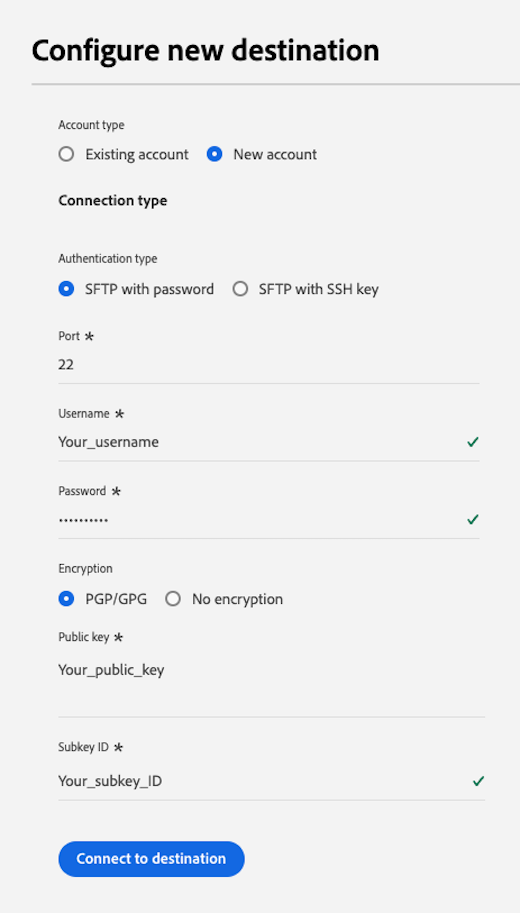

# Connessione [!DNL LiveRamp - Onboarding] {#liveramp-onboarding}

Utilizza la connessione [!DNL LiveRamp - Onboarding] per integrare i tipi di pubblico da Adobe Real-time Customer Data Platform a [!DNL LiveRamp Connect].

## Casi d’uso {#use-cases}

Per aiutarti a capire meglio come e quando utilizzare la destinazione [!DNL LiveRamp - Onboarding], ecco un esempio di caso d&#39;uso che i clienti Adobe Experience Platform possono risolvere utilizzando questa destinazione.

In qualità di addetto al marketing, desidero inviare tipi di pubblico da Adobe Experience Platform alle identità onboarding in [!DNL LiveRamp Connect] in modo da poter indirizzare gli utenti su piattaforme mobili, open web, social e [!DNL CTV], utilizzando l&#39;identificatore [!DNL Ramp ID].

## Prerequisiti {#prerequisites}

La connessione [!DNL LiveRamp - Onboarding] esporta i file utilizzando l&#39;archiviazione SFTP](https://docs.liveramp.com/connect/en/upload-a-file-via-liveramp-s-sftp.html) di [LiveRamp.

Prima di poter inviare dati da Experience Platform a [!DNL LiveRamp - Onboarding], sono necessarie le credenziali [!DNL LiveRamp]. Rivolgiti al tuo rappresentante [!DNL LiveRamp] per ottenere le tue credenziali, se non le hai già.

## Identità supportate {#supported-identities}

[!DNL LiveRamp - Onboarding] supporta l&#39;attivazione di identità quali identificatori basati su PII, identificatori noti e ID personalizzati, descritti nella [documentazione LiveRamp ufficiale](https://docs.liveramp.com/connect/en/identity-and-identifier-terms-and-concepts.html#known-identifiers).

Nel [passaggio di mappatura](#map) del flusso di lavoro di attivazione, è necessario definire le mappature di destinazione come attributi personalizzati.

## Tipi di pubblico supportati {#supported-audiences}

Questa sezione descrive quali tipi di pubblico puoi esportare in questa destinazione.

| Origine pubblico | Supportato | Descrizione |
|---------|----------|----------|
| [!DNL Segmentation Service] | ✓ | Tipi di pubblico generati tramite il servizio di segmentazione [Experience Platform](../../../segmentation/home.md). |
| Caricamenti personalizzati | ✓ | Tipi di pubblico [importati](../../../segmentation/ui/audience-portal.md#import-audience) in Experience Platform da file CSV. |

{style="table-layout:auto"}

## Tipo e frequenza di esportazione {#export-type-frequency}

Per informazioni sul tipo e sulla frequenza di esportazione della destinazione, consulta la tabella seguente.

| Elemento | Tipo | Note |
---------|----------|---------|
| Tipo di esportazione | **[!UICONTROL Esportazione pubblico]** | Stai esportando tutti i membri di un pubblico con gli identificatori (nome, numero di telefono o altri) utilizzati nella destinazione [!DNL LiveRamp - Onboarding]. |
| Frequenza di esportazione | **[!UICONTROL Batch giornaliero]** | Poiché i profili vengono aggiornati in Experience Platform in base alla valutazione del pubblico, i profili (identità) vengono aggiornati una volta al giorno a valle della piattaforma di destinazione. Ulteriori informazioni sulle [destinazioni basate su file batch](/help/destinations/destination-types.md#file-based). |

{style="table-layout:auto"}

## Connettersi alla destinazione {#connect}

>[!IMPORTANT]
> 
>Per connettersi alla destinazione, sono necessarie le **[!UICONTROL Destinazioni visualizzazione]** e le **[!UICONTROL Autorizzazioni di gestione delle destinazioni]** [per il controllo degli accessi](/help/access-control/home.md#permissions). Leggi la [panoramica sul controllo degli accessi](/help/access-control/ui/overview.md) o contatta l&#39;amministratore del prodotto per ottenere le autorizzazioni necessarie.

Per connettersi a questa destinazione, seguire i passaggi descritti nell&#39;esercitazione [sulla configurazione della destinazione](../../ui/connect-destination.md). Nel flusso di lavoro di configurazione della destinazione, compila i campi elencati nelle due sezioni seguenti.

### Autenticarsi nella destinazione {#authenticate}

Per eseguire l&#39;autenticazione nella destinazione, compilare i campi obbligatori e selezionare **[!UICONTROL Connetti alla destinazione]**.

**Autenticazione SFTP con password** {#sftp-password}



* **[!UICONTROL Porta]**: la porta utilizzata per il percorso di archiviazione [!DNL LiveRamp - Onboarding].  Utilizza la porta corrispondente alla tua posizione geografica, come descritto di seguito:
   * **[!UICONTROL NA]**: utilizzare la porta `22`
   * **[!UICONTROL AU]**: Usa porta `2222`
* **[!UICONTROL Nome utente]**: il nome utente per il percorso di archiviazione [!DNL LiveRamp - Onboarding].
* **[!UICONTROL Password]**: password per il percorso di archiviazione [!DNL LiveRamp - Onboarding].
* **[!UICONTROL Chiave di crittografia PGP/GPG]**: è possibile allegare la chiave pubblica in formato RSA per aggiungere la crittografia ai file esportati. Visualizza un esempio di chiave di crittografia formattata correttamente nell’immagine seguente.
  
* **[!UICONTROL ID sottochiave]**:Se si fornisce una chiave di crittografia, è necessario fornire anche un **[!UICONTROL ID sottochiave]** di crittografia. Per informazioni su come ottenere l&#39;ID della sottochiave, consulta la [!DNL LiveRamp] [documentazione sulla crittografia](https://docs.liveramp.com/connect/en/encrypting-files-for-uploading.html#downloading-the-current-encryption-key).

**SFTP con autenticazione con chiave SSH** {#sftp-ssh}


* **[!UICONTROL Porta]**: la porta utilizzata per il percorso di archiviazione [!DNL LiveRamp - Onboarding].  Utilizza la porta corrispondente alla tua posizione geografica, come descritto di seguito:
   * **[!UICONTROL EU]**: usa porta `4222`
* **[!UICONTROL Nome utente]**: il nome utente per il percorso di archiviazione [!DNL LiveRamp - Onboarding].
* **[!UICONTROL Chiave SSH]**: la chiave [!DNL SSH] privata utilizzata per accedere al percorso di archiviazione [!DNL LiveRamp - Onboarding]. La chiave privata deve essere formattata come stringa con codifica [!DNL Base64] e non deve essere protetta da password.

   * Per connettere la chiave [!DNL SSH] al server [!DNL LiveRamp - Onboarding], è necessario inviare un ticket tramite il portale di supporto tecnico di [!DNL LiveRamp] e fornire la chiave pubblica. Ulteriori informazioni sono disponibili nella [documentazione di LiveRamp](https://docs.liveramp.com/connect/en/upload-a-file-via-liveramp-s-sftp.html#upload-with-an-sftp-client).

* **[!UICONTROL Chiave di crittografia PGP/GPG]**: è possibile allegare la chiave pubblica in formato RSA per aggiungere la crittografia ai file esportati. Visualizza un esempio di chiave di crittografia formattata correttamente nell’immagine seguente.
  
* **[!UICONTROL ID sottochiave]**:Se si fornisce una chiave di crittografia, è necessario fornire anche un **[!UICONTROL ID sottochiave]** di crittografia. Per informazioni su come ottenere l&#39;ID della sottochiave, consulta la [!DNL LiveRamp] [documentazione sulla crittografia](https://docs.liveramp.com/connect/en/encrypting-files-for-uploading.html#downloading-the-current-encryption-key).

### Inserire i dettagli della destinazione {#destination-details}

>[!CONTEXTUALHELP]
>id="platform_destinations_liveramp_subkey"
>title="ID sottochiave di crittografia"
>abstract="ID della sottochiave utilizzato per la crittografia, in base alla chiave di crittografia pubblica LiveRamp. Questo campo è obbligatorio se hai fornito una chiave di crittografia nel passaggio di autenticazione."
>additional-url="https://docs.liveramp.com/connect/en/encrypting-files-for-uploading.html#downloading-the-current-encryption-key" text="Scopri come ottenere l’ID della sottochiave"

Per configurare i dettagli per la destinazione, compila i campi obbligatori e facoltativi seguenti. Un asterisco accanto a un campo nell’interfaccia utente indica che il campo è obbligatorio.


* **[!UICONTROL Nome]**: un nome con cui riconoscerai questa destinazione in futuro.
* **[!UICONTROL Descrizione]**: una descrizione che ti aiuterà a identificare questa destinazione in futuro.
* **[!UICONTROL Area geografica]**: area geografica per l&#39;istanza dell&#39;archiviazione SFTP LiveRamp.
* **[!UICONTROL Percorso cartella]**: percorso della sottocartella [!DNL LiveRamp] `uploads` che ospiterà i file esportati. Il prefisso `uploads` viene aggiunto automaticamente al percorso della cartella. [!DNL LiveRamp] consiglia di creare una sottocartella dedicata per le consegne da Adobe Real-Time CDP per mantenere i file separati da altri feed esistenti e garantire il corretto funzionamento di tutte le attività di automazione.
   * Se ad esempio si desidera esportare i file in `uploads/my_export_folder`, digitare `my_export_folder` nel campo **[!UICONTROL Percorso cartella]**.
* **[!UICONTROL Formato di compressione]**: selezionare il tipo di compressione che Experience Platform deve utilizzare per i file esportati. Le opzioni disponibili sono **[!UICONTROL GZIP]** o **[!UICONTROL None]**.

### Abilita avvisi {#enable-alerts}

Puoi abilitare gli avvisi per ricevere notifiche sullo stato del flusso di dati verso la tua destinazione. Seleziona un avviso dall’elenco per abbonarti e ricevere notifiche sullo stato del flusso di dati. Per ulteriori informazioni sugli avvisi, consulta la guida su [abbonamento a destinazioni avvisi tramite l&#39;interfaccia utente](../../ui/alerts.md).

Dopo aver fornito i dettagli per la connessione di destinazione, seleziona **[!UICONTROL Avanti]**.

## Attivare tipi di pubblico in questa destinazione {#activate}

>[!IMPORTANT]
> 
>Per attivare i dati, è necessario **[!UICONTROL Visualizza destinazioni]**, **[!UICONTROL Attiva destinazioni]**, **[!UICONTROL Visualizza profili]** e **[!UICONTROL Visualizza segmenti]** [Autorizzazioni di controllo di accesso](/help/access-control/home.md#permissions). Leggi la [panoramica sul controllo degli accessi](/help/access-control/ui/overview.md) o contatta l&#39;amministratore del prodotto per ottenere le autorizzazioni necessarie.

Per istruzioni sull&#39;attivazione dei tipi di pubblico in questa destinazione, leggi [Attiva dati pubblico per esportare i profili in batch](/help/destinations/ui/activate-batch-profile-destinations.md).

### Pianificazione {#scheduling}

Nel passaggio [!UICONTROL Pianificazione], crea una pianificazione di esportazione per ogni pubblico, con le impostazioni mostrate di seguito.

* **[!UICONTROL Opzioni di esportazione file]**: [!UICONTROL Esporta file completi]. [Le esportazioni di file incrementali](../../ui/activate-batch-profile-destinations.md#export-incremental-files) non sono attualmente supportate per la destinazione [!DNL LiveRamp].
* **[!UICONTROL Frequenza]**: [!UICONTROL Giornaliera]
* **[!UICONTROL Data]**: seleziona l&#39;ora di inizio e di fine dell&#39;esportazione come preferisci.


Il nome del file esportato non è attualmente configurabile dall&#39;utente. Tutti i file esportati nella destinazione [!DNL LiveRamp - Onboarding] vengono denominati automaticamente in base al seguente modello:

`%ORGANIZATION_NAME%_%DESTINATION%_%DESTINATION_INSTANCE_ID%_%DATETIME%`


Ad esempio, il nome di un file esportato per un&#39;organizzazione denominata [!DNL Luma] potrebbe essere simile al seguente:

```json
Luma_LiveRamp_52137231-4a99-442d-804c-39a09ddd005d_20230330_153857.csv
```

### Mappare attributi e identità {#map}

Nel passaggio **[!UICONTROL Mappatura]**, puoi selezionare gli attributi e le identità da esportare per i profili.

>[!IMPORTANT]
>
>Questa destinazione supporta l’attivazione di uno spazio dei nomi dell’identità di origine per ogni flusso di attivazione. Se devi esportare più spazi dei nomi di identità, come `Email` e `Phone`, devi [creare un flusso di attivazione separato](../../ui/activate-batch-profile-destinations.md) per ogni identità.

Nel passaggio **[!UICONTROL Mappatura]**, la mappatura **[!UICONTROL Campo di destinazione]** definisce il nome dell&#39;intestazione di colonna nel file CSV esportato. È possibile modificare le intestazioni di colonna CSV nel file esportato con qualsiasi nome descrittivo desiderato, fornendo un nome personalizzato per il **[!UICONTROL campo di destinazione]**.

>[!IMPORTANT]
>
>Per qualsiasi modifica apportata ai campi di destinazione dopo la consegna iniziale del file a [!DNL LiveRamp], invia una notifica al team dell&#39;account [!DNL LiveRamp] o [invia un ticket al supporto LiveRamp](https://docs.liveramp.com/connect/en/considerations-when-uploading-the-first-file-to-an-audience.html#creating-a-support-case) per garantire che le modifiche vengano applicate al processo di automazione.

1. Nel passaggio **[!UICONTROL Mapping]**, seleziona **[!UICONTROL Aggiungi nuovo mapping]**. Viene visualizzata una nuova riga di mappatura.

   

2. Nella finestra **[!UICONTROL Seleziona campo di origine]**, scegli la categoria **[!UICONTROL Seleziona attributi]** e seleziona l&#39;attributo XDM da mappare, oppure scegli la categoria **[!UICONTROL Seleziona spazio dei nomi identità]** e seleziona un&#39;identità da mappare alla destinazione.

   

3. Nella finestra **[!UICONTROL Seleziona campo di destinazione]**, immettere il nome dell&#39;attributo a cui si desidera mappare il campo di origine selezionato. Il nome dell’attributo qui definito si rifletterà nel file CSV esportato come intestazione di colonna.

   

   È inoltre possibile immettere il nome dell&#39;attributo digitandolo direttamente nel **[!UICONTROL campo di destinazione]**.

   

Dopo aver aggiunto tutte le mappature desiderate, seleziona **[!UICONTROL Avanti]** e completa il flusso di lavoro di attivazione.

## Dati esportati / Convalida esportazione dati {#exported-data}

I dati vengono esportati nel percorso di archiviazione [!DNL LiveRamp - Onboarding] configurato come file CSV.

I file esportati hanno una dimensione massima di 10 milioni di righe. Experience Platform genera più file per consegna se il pubblico selezionato supera i 10 milioni di righe. Se prevedi di superare il limite per i singoli file, contatta il rappresentante [!DNL LiveRamp] e chiedi loro di configurare l&#39;acquisizione batch.

Durante l&#39;esportazione dei file nella destinazione [!DNL LiveRamp - Onboarding], Platform genera un file CSV per ogni [ID del criterio di unione](../../../profile/merge-policies/overview.md).

Ad esempio, prendiamo in considerazione i seguenti tipi di pubblico:

* Pubblico A (criterio di unione 1)
* Pubblico B (criterio di unione 2)
* Pubblico C (criterio di unione 1)
* Pubblico D (criterio di unione 1)

Platform esporterà due file CSV in [!DNL LiveRamp - Onboarding]:

* Un file CSV contenente i tipi di pubblico A, C e D;
* Un file CSV contenente il pubblico B.

I file CSV esportati contengono profili con gli attributi selezionati e lo stato del pubblico corrispondente, in colonne separate, con il nome dell’attributo e `audience_namespace:audience_ID` coppie come intestazioni di colonna, come mostrato nell’esempio seguente:

`ATTRIBUTE_NAME, AUDIENCE_NAMESPACE_1_AUDIENCE_ID_1, AUDIENCE_NAMESPACE_2_AUDIENCE_ID_2,..., AUDIENCE_NAMESPACE_X_AUDIENCE_ID_X`

I profili inclusi nei file esportati possono corrispondere a uno dei seguenti stati di qualificazione del pubblico:

* `Active`: il profilo è attualmente qualificato per il pubblico.
* `Expired`: il profilo non è più qualificato per il pubblico, ma lo è già stato in passato.
* `""`(stringa vuota): il profilo non è mai qualificato per il pubblico.

Ad esempio, un file CSV esportato con un attributo `email`, due tipi di pubblico provenienti dall&#39;Experience Platform [Servizio di segmentazione](../../../segmentation/home.md) e un pubblico esterno [importato](../../../segmentation/ui/audience-portal.md#import-audience) potrebbe essere simile al seguente:

```csv
email,ups_aa2e3d98-974b-4f8b-9507-59f65b6442df,ups_45d4e762-6e57-4f2f-a3e0-2d1893bcdd7f,CustomerAudienceUpload_7729e537-4e42-418e-be3b-dce5e47aaa1e
abc117@testemailabc.com,active,,
abc111@testemailabc.com,,,active
abc102@testemailabc.com,,,active
abc116@testemailabc.com,active,,
abc107@testemailabc.com,active,expired,active
abc101@testemailabc.com,active,active,
```

Nell&#39;esempio precedente, le sezioni `ups_aa2e3d98-974b-4f8b-9507-59f65b6442df` e `ups_45d4e762-6e57-4f2f-a3e0-2d1893bcdd7f` descrivono i tipi di pubblico provenienti dal servizio di segmentazione, mentre `CustomerAudienceUpload_7729e537-4e42-418e-be3b-dce5e47aaa1e` descrive un pubblico importato in Platform come [caricamento personalizzato](../../../segmentation/ui/audience-portal.md#import-audience).

Dal momento che Platform genera un file CSV per ogni [ID del criterio di unione](../../../profile/merge-policies/overview.md), genera anche un flusso di dati separato per ogni ID del criterio di unione.

Ciò significa che le metriche **[!UICONTROL Identità attivate]** e **[!UICONTROL Profili ricevuti]** nella pagina [esecuzioni del flusso di dati](../../../dataflows/ui/monitor-destinations.md#dataflow-runs-for-batch-destinations) sono aggregate per ogni gruppo di tipi di pubblico che utilizzano lo stesso criterio di unione, anziché essere visualizzate per ogni pubblico.

In seguito alla generazione del flusso di dati per un gruppo di tipi di pubblico che utilizzano lo stesso criterio di unione, i nomi dei tipi di pubblico non vengono visualizzati nel [dashboard di monitoraggio](../../../dataflows/ui/monitor-destinations.md#dataflow-runs-for-batch-destinations).


## Caricare i dati esportati su LiveRamp {#upload-to-liveramp}

Dopo l&#39;esportazione dei dati nell&#39;archivio [!DNL LiveRamp - Onboarding], è necessario caricare i dati nella piattaforma [!DNL LiveRamp].

Per ulteriori informazioni su come caricare i file dall&#39;archivio [!DNL LiveRamp - Onboarding] a un pubblico [!DNL LiveRamp], consulta la seguente documentazione: [Considerazioni durante il caricamento del primo file a un pubblico](https://docs.liveramp.com/connect/en/considerations-when-uploading-the-first-file-to-an-audience.html#considerations-when-uploading-the-first-file-to-an-audience).

## Utilizzo dei dati e governance {#data-usage-governance}

Tutte le destinazioni [!DNL Adobe Experience Platform] sono conformi ai criteri di utilizzo dei dati durante la gestione dei dati. Per informazioni dettagliate su come [!DNL Adobe Experience Platform] applica la governance dei dati, leggere la [Panoramica sulla governance dei dati](/help/data-governance/home.md).

## Risorse aggiuntive {#additional-resources}

Per ulteriori dettagli su come configurare l&#39;archiviazione [!DNL LiveRamp - Onboarding], vedere la [documentazione ufficiale](https://docs.liveramp.com/connect/en/upload-a-file-via-liveramp-s-sftp.html).

## Changelog {#changelog}

Questa sezione acquisisce le funzionalità e i significativi aggiornamenti alla documentazione apportati al connettore di destinazione.

+++ Visualizza changelog

| Mese di rilascio | Tipo di aggiornamento | Descrizione |
|---|---|---|
| Marzo 2024 | Aggiornamento della funzionalità e della documentazione | <ul><li>È stato aggiunto il supporto per le consegne in Europa e Australia [!DNL LiveRamp] [!DNL SFTP] istanze.</li><li>È stata aggiornata la documentazione per descrivere configurazioni specifiche per le nuove aree geografiche supportate.</li><li>La dimensione massima del file è stata aumentata a 10 milioni di righe (rispetto ai 5 milioni precedenti).</li><li>La documentazione è stata aggiornata per riflettere le maggiori dimensioni dei file.</li></ul> |
| Luglio 2023 | Versione iniziale | Versione di destinazione iniziale e documentazione pubblicata. |

{style="table-layout:auto"}

+++
