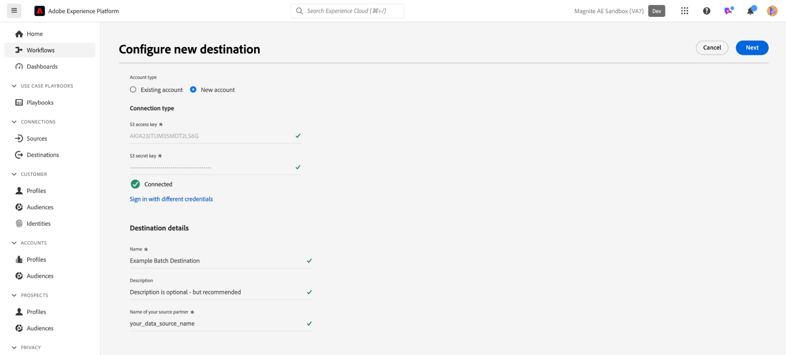

# Magnite: connessione in batch {#magnite-streaming-batch}

## Panoramica {#overview}

Questo documento descrive la destinazione Magnite: Batch e fornisce alcuni esempi di casi d’uso per comprendere meglio come attivare ed esportare i tipi di pubblico.

I tipi di pubblico di Adobe Real-Time CDP possono essere inviati alla piattaforma Magnite Streaming in due modi: una volta al giorno oppure in tempo reale:

1. Se desideri e/o vuoi consegnare i tipi di pubblico una sola volta al giorno, puoi utilizzare la destinazione Magnite: Batch, che distribuisce i tipi di pubblico a Magnite Streaming tramite una consegna giornaliera di file batch S3. Questi tipi di pubblico in batch vengono memorizzati indefinitamente nella piattaforma Magnite, a differenza dei tipi di pubblico in tempo reale, che vengono memorizzati solo per un paio di giorni.

2. Tuttavia, se desideri o vuoi inviare i tipi di pubblico più frequentemente, dovrai utilizzare la destinazione [Magnite Real-Time](/help/destinations/catalog/advertising/magnite-streaming.md). Quando si utilizza la destinazione in tempo reale, Magnite Streaming riceverà i tipi di pubblico in tempo reale, ma Magnite può memorizzare solo i tipi di pubblico in tempo reale temporaneamente nella propria piattaforma e verranno rimossi dal sistema entro un paio di giorni. Per questo motivo, se desideri utilizzare la destinazione Magnite in tempo reale, *anche* dovrai utilizzare la destinazione Magnite: Batch - ogni pubblico che attivi nella destinazione in tempo reale, dovrai attivare anche nella destinazione Batch.

Per ricapitolare: se desideri distribuire i tipi di pubblico di Adobe Real-Time CDP solo una volta al giorno, utilizzerai solo la destinazione Magnite: Batch e i tipi di pubblico verranno consegnati una volta al giorno. Se desideri distribuire il pubblico di Adobe Real-Time CDP in tempo reale, utilizzerai *sia* la destinazione Magnite: Batch che la destinazione Magnite Real-Time. Per ulteriori informazioni, contattare Magnite: Streaming.

Continua a leggere di seguito per ulteriori informazioni sulla destinazione Magnite: Batch, su come connettersi ad essa e su come attivare i tipi di pubblico di Adobe Real-Time CDP.
Per ulteriori informazioni sulla destinazione in tempo reale, consulta [questa pagina della documentazione](magnite-streaming.md).

>[!IMPORTANT]
>
>Questo connettore di destinazione è in versione beta ed è disponibile solo per alcuni clienti. Per richiedere l’accesso, contatta il rappresentante del tuo Adobe.
>
>Il connettore di destinazione e la pagina della documentazione vengono creati e gestiti dal team [!DNL Magnite]. Per richieste di informazioni o richieste di aggiornamento, contattale direttamente all&#39;indirizzo `adobe-tech@magnite.com`.

## Casi d’uso {#use-cases}

Per aiutarti a capire meglio come e quando utilizzare la destinazione Batch Magnite:, ecco alcuni esempi di casi d’uso che i clienti di Adobe Experience Platform possono risolvere utilizzando questa destinazione.

### #1 del caso d’uso {#use-case-1}

Hai attivato un pubblico sulla destinazione Magnite in tempo reale.

Tutti i tipi di pubblico attivati tramite la destinazione Magnite in tempo reale devono utilizzare anche la destinazione Magnite: Batch, in quanto i dati della consegna Batch sono intesi a sostituire/mantenere i dati della consegna in tempo reale all’interno della piattaforma Magnite Streaming.

### #2 del caso d’uso {#use-case-2}

Desideri attivare un pubblico solo in una cadenza batch/giornaliera sulla piattaforma Magnite Streaming.

Tutti i tipi di pubblico attivati tramite la destinazione Magnite: Batch verranno consegnati in batch/cadenza giornaliera e saranno quindi disponibili per il targeting nella piattaforma Magnite Streaming.

## Prerequisiti {#prerequisites}

Per utilizzare le destinazioni [!DNL Magnite] in Adobe Experience Platform, è innanzitutto necessario disporre di un account Magnite Streaming. Se hai un account [!DNL Magnite Streaming], contatta il tuo account manager [!DNL Magnite] per ricevere le credenziali per accedere a [!DNL Magnite's] destinazioni. Se non disponi di un account [!DNL Magnite Streaming], contatta adobe-tech@magnite.com

## Identità supportate {#supported-identities}

La destinazione Magnite: Batch può ricevere *qualsiasi* origine identità da Adobe CDP. Attualmente, questa destinazione dispone di tre campi di identità di Target a cui eseguire il mapping.

>[!NOTE]
>
>*Qualsiasi* origine identità può essere mappata a una qualsiasi delle `magnite_deviceId` identità di destinazione.

| Identità di destinazione | Descrizione | Considerazioni |
|:--------------------------- |:------------------------------------------------------------------------------------------------ |:------------------------------------------------------------------------------------- |
| magnite_deviceId_GAID | GOOGLE ADVERTISING ID | Seleziona questa identità di destinazione quando l&#39;identità di origine è un GAID |
| magnite_deviceId_IDFA | Apple ID per inserzionisti | Seleziona questa identità di destinazione quando l&#39;identità di origine è un identificatore IDFA |
| magnite_deviceId_CUSTOM | ID personalizzato/definito dall&#39;utente | Seleziona questa identità di destinazione se l&#39;identità di origine non è un GAID o un IDFA o se è un ID personalizzato o definito dall&#39;utente |

{style="table-layout:auto"}

## Tipi di pubblico supportati {#supported-audiences}

| Origine pubblico | Supportato | Descrizione |
|-----------------------------|----------|----------|
| [!DNL Segmentation Service] | ✓ | Tipi di pubblico generati tramite il servizio di segmentazione [Experience Platform](../../../segmentation/home.md). |
| Caricamenti personalizzati | ✓ | Tipi di pubblico [importati](../../../segmentation/ui/audience-portal.md#import-audience) in Experience Platform da file CSV. |

{style="table-layout:auto"}

## Tipo e frequenza di esportazione {#export-type-frequency}

| Elemento | Tipo | Note |
|-----------------------------|----------|----------|
| Tipo di esportazione | Esportazione pubblico | Stai esportando tutti i membri di un pubblico con gli identificatori (nome, numero di telefono o altri) utilizzati nella destinazione Magnite: Batch. |
| Frequenza di esportazione | Batch | Le destinazioni batch esportano i file sulle piattaforme a valle con incrementi di tre, sei, otto, dodici o ventiquattro ore. Ulteriori informazioni sulle [destinazioni basate su file](/help/destinations/destination-types.md) batch. |

{style="table-layout:auto"}

## Connettersi alla destinazione {#connect}

Dopo aver approvato l’utilizzo della destinazione e aver condiviso le tue credenziali, Magnite Streaming ti consente di seguire i passaggi seguenti per autenticare, mappare e condividere i dati.

### Autenticarsi nella destinazione {#authenticate}

Individua la destinazione Magnite: Batch nel catalogo delle esperienze Adobe. Fai clic sul pulsante delle opzioni aggiuntive (\...) e quindi configura la connessione/istanza di destinazione.

Se disponi già di un account, puoi trovarlo modificando l’opzione Tipo di account in &quot;Account esistente&quot;. In caso contrario, verrà creato un account di seguito:

Per creare un nuovo account e autenticarlo per la prima volta nella destinazione, compila i campi obbligatori &quot;Chiave di accesso S3&quot; e &quot;Chiave segreta S3&quot; (forniti tramite il tuo account manager) e seleziona **[!UICONTROL Connetti alla destinazione]**

>[!NOTE]
>
>I criteri di protezione di Magnite Streaming richiedono una rotazione regolare delle chiavi S3. In futuro, dovrai aggiornare il tuo account con i nuovi accessi S3 e le nuove chiavi segrete S3. È sufficiente aggiornare l’account stesso: le destinazioni che utilizzano tale account utilizzeranno automaticamente le chiavi aggiornate. Se non si caricano le nuove chiavi, i dati non verranno inviati a questa destinazione.

### Inserire i dettagli della destinazione {#destination-details}

Per configurare i dettagli per la destinazione, compila i campi obbligatori e facoltativi seguenti. Un asterisco accanto a un campo nell’interfaccia utente indica che il campo è obbligatorio.

* **[!UICONTROL Nome]**: un nome con cui riconoscere questa connessione/istanza di destinazione in
futuro.
* **[!UICONTROL Descrizione]**: una descrizione che ti aiuterà a identificare questo
connessione/istanza di destinazione in futuro.
* **[!UICONTROL Nome del partner di origine]**: il nome che si desidera utilizzare come origine nella piattaforma di Magnite Streaming

>[!NOTE]
>
>Se prevedi di inviare più tipi di ID (GAID, IDFA, ecc.) utilizzando la destinazione Batch, per ciascuna è necessaria una nuova connessione/istanza di destinazione. Per ulteriori informazioni, contatta il rappresentante dell’account Magnite.

Puoi quindi procedere selezionando **[!UICONTROL Avanti]**

Nella schermata successiva, intitolata &quot;Governance Policy and Enforcement Actions (Optional)&quot; (Criteri di governance e azioni di applicazione (Facoltativo)), puoi selezionare facoltativamente tutti i criteri di governance dei dati rilevanti. &quot;Esportazione dati&quot; è generalmente selezionato per la destinazione Magnite: Batch.

Una volta selezionata o se desideri saltare questa schermata facoltativa, seleziona **[!UICONTROL Crea]**

### Abilita avvisi {#enable-alerts}

Puoi abilitare gli avvisi per ricevere notifiche sullo stato del flusso di dati verso la tua destinazione. Seleziona un avviso dall’elenco per abbonarti e ricevere notifiche sullo stato del flusso di dati. Per ulteriori informazioni sugli avvisi, consulta la guida su [abbonamento a destinazioni avvisi tramite l&#39;interfaccia utente](../../ui/alerts.md).

Dopo aver fornito i dettagli per la connessione di destinazione, seleziona **[!UICONTROL Avanti]**.

### Attiva i segmenti in questa destinazione {#activate}

>[!IMPORTANT]
> 
>* Per attivare i dati, è necessario **[!UICONTROL Visualizza destinazioni]**, **[!UICONTROL Attiva destinazioni]**, **[!UICONTROL Visualizza profili]** e **[!UICONTROL Visualizza segmenti]** [Autorizzazioni di controllo di accesso](/help/access-control/home.md#permissions). Leggi la [panoramica sul controllo degli accessi](/help/access-control/ui/overview.md) o contatta l&#39;amministratore del prodotto per ottenere le autorizzazioni necessarie.
>* Per esportare *identità*, è necessario disporre dell&#39;autorizzazione **[!UICONTROL Visualizza grafo identità]** [Controllo di accesso](/help/access-control/home.md#permissions).   {width="100" zoomable="yes"}

Per istruzioni sull&#39;attivazione di segmenti di pubblico in questa destinazione, leggi [Attiva dati pubblico per esportare i profili in batch](/help/destinations/ui/activate-batch-profile-destinations.md).

### Mappare attributi e identità {#map}

Nel campo **[!UICONTROL Source]**, puoi selezionare qualsiasi attributo o identità per i dispositivi. In questo esempio, abbiamo selezionato una IdentityMap personalizzata denominata &quot;DeviceId&quot;

Nel campo **[!UICONTROL Destinazione]**:
 Per ulteriori informazioni, vedere [Identità supportate](#supported-identities).
In questo esempio, abbiamo selezionato il **[!UICONTROL campo di destinazione]**: magnite_deviceId_CUSTOM, perché il nostro **[!UICONTROL campo Source]** è stato definito come IdentityMap personalizzato: DeviceID.

>[!NOTE]
>
>Se prevedi di inviare/mappare più tipi di ID (GAID, IDFA, ecc.) utilizzando la destinazione Batch, per ciascuna è necessaria una nuova connessione/istanza di destinazione. Per ulteriori informazioni, contatta il rappresentante dell’account Magnite.

Nella schermata &quot;Configure a filename and export schedule for each audience&quot; (Configurare un nome file ed esportare una pianificazione per ogni pubblico), ora devi configurare una data di inizio (obbligatoria), una data di fine (facoltativa) e un ID di mappatura (obbligatorio) per ogni pubblico.

>[!IMPORTANT]
>
> Per questa destinazione è richiesto un ID di mappatura o &quot;NONE&quot;.
>
> Un ID di mappatura deve essere fornito quando un pubblico ha un ID segmento preesistente noto in precedenza per Magnite Streaming. In caso contrario, utilizza &quot;NONE&quot; come ID di mappatura.
>
> Quando configuri il nome del file per ogni pubblico, includi l’ID mappatura tramite il campo &quot;Testo personalizzato&quot; da aggiungere. L&#39;ID mappatura verrà aggiunto come: `{previous_filename}\_\[MAPPING_ID\].` Se questo pubblico non ha mai utilizzato la funzione Streaming di ingrandimento e non fornirai un ID mappatura, nel campo &quot;Testo personalizzato&quot; verrà immesso &quot;NONE&quot;. In questo caso, il nuovo nome file deve essere: `{previous_filename}\_\[NONE\]`.

## Dati esportati / Convalida esportazione dati {#exported-data}

Una volta caricati i tipi di pubblico, puoi verificare che siano stati creati e caricati correttamente.

* La destinazione Magnite: Batch distribuisce i file S3 a Magnite Streaming con cadenza giornaliera. Dopo la consegna e l’acquisizione, i tipi di pubblico/segmenti dovrebbero apparire in Magnite Streaming e possono essere applicati a un’offerta. Puoi confermarlo cercando l’ID segmento o il nome segmento condiviso durante i passaggi di attivazione in Adobe Experience Platform.

>[!NOTE]
>
>I tipi di pubblico attivati/recapitati alla destinazione Magnite: Batch *sostituiranno* gli stessi tipi di pubblico attivati/recapitati tramite la destinazione Magnite in tempo reale. Se cerchi un segmento utilizzando il nome del segmento, è possibile che il segmento non venga trovato in tempo reale, fino a quando il batch non viene acquisito ed elaborato dalla piattaforma Magnite Streaming.

## Utilizzo dei dati e governance {#data-usage-governance}

Tutte le destinazioni [!DNL Adobe Experience Platform] sono conformi ai criteri di utilizzo dei dati durante la gestione dei dati. Per informazioni dettagliate su come [!DNL Adobe Experience Platform] applica la governance dei dati, leggere la [Panoramica sulla governance dei dati](/help/data-governance/home.md).

## Risorse aggiuntive {#additional-resources}

Per ulteriori informazioni, visitare il [Centro assistenza Magnite](https://help.magnite.com/help).
