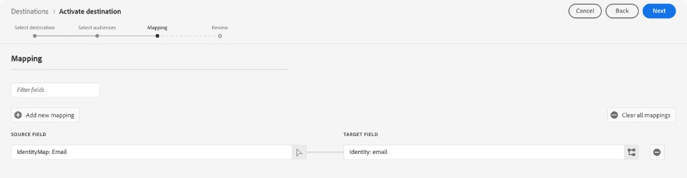

# Connessione [!DNL Microsoft Ads Customer Match] {#microsoft-ads-customer-match-destination}

>[!AVAILABILITY]
>
>Al momento il connettore di destinazione è a disponibilità limitata. Per potervi accedere, contatta il tuo rappresentante Adobe.

## Panoramica {#overview}

Utilizza la destinazione [!DNL Microsoft Ads Customer Match] per associare i clienti per indirizzo e-mail e interagire nuovamente con loro in [!DNL Microsoft Advertising Network], inclusi gli annunci Search&amp;Audience. Collega l&#39;account [!DNL Microsoft Advertising] a [!DNL Real-Time CDP] per automatizzare la creazione e la gestione degli elenchi di corrispondenze dei clienti direttamente da Experience Platform.

## Casi d’uso {#use-cases}

Per aiutarti a capire meglio come e quando utilizzare la destinazione [!DNL Microsoft Ads Customer Match], ecco alcuni esempi di casi d&#39;uso che i clienti di Adobe Experience Platform possono risolvere utilizzando questa funzione.

### Esegui il retargeting dei clienti esistenti con offerte personalizzate {#use-case-1}

Un marchio di e-commerce desidera raggiungere i clienti esistenti tramite [!DNL Microsoft Search] e [!DNL Microsoft Audience Network] per personalizzare le offerte in base ai loro acquisti passati e alla cronologia di navigazione. Il brand può acquisire gli indirizzi e-mail dal proprio CRM in Experience Platform, creare tipi di pubblico dai propri dati offline e inviare tali tipi di pubblico a [!DNL Microsoft Ads Customer Match] per utilizzarli negli annunci di ricerca e pubblico, ottimizzando le spese pubblicitarie.

### Promuovi nuovi prodotti ai clienti esistenti {#use-case-2}

Un’azienda tecnologica ha lanciato un nuovo prodotto e desidera sensibilizzare i clienti che hanno acquistato in precedenza prodotti correlati. Caricano indirizzi e-mail dal proprio database CRM in Experience Platform, utilizzando gli indirizzi e-mail come identificatori. I tipi di pubblico vengono creati in base ai clienti che possiedono prodotti correlati. Tali tipi di pubblico vengono inviati a [!DNL Microsoft Ads Customer Match], in modo che l&#39;azienda possa eseguire il targeting dei clienti correnti e di clienti simili in [!DNL Microsoft Advertising Network].

## Identità supportate {#supported-identities}

[!DNL Microsoft Ads Customer Match] supporta l&#39;attivazione delle identità descritte nella tabella seguente. Ulteriori informazioni su [identità](/help/identity-service/features/namespaces.md).

| Identità di destinazione | Descrizione | Considerazioni |
|---|---|---|
| `email` | Indirizzi e-mail in testo normale | Solo gli indirizzi e-mail di testo normale (senza hash) sono supportati come campi **source** nel passaggio di mappatura. I campi sorgente con pre-hash non sono supportati. Experience Platform esegue sempre l&#39;hash degli indirizzi di posta elettronica prima di esportarli in [!DNL Microsoft Ads]. |

{style="table-layout:auto"}

## Tipi di pubblico supportati {#supported-audiences}

Questa sezione descrive quali tipi di pubblico puoi esportare in questa destinazione.

| Origine pubblico | Supportato | Descrizione |
|---------|----------|----------|
| [!DNL Segmentation Service] | Sì | Tipi di pubblico generati tramite Experience Platform [Segmentation Service](../../../segmentation/home.md). |
| Tutte le altre origini del pubblico | Sì | Questa categoria include tutte le origini del pubblico al di fuori dei tipi di pubblico generati tramite [!DNL Segmentation Service]. Leggi informazioni sulle [diverse origini del pubblico](/help/segmentation/ui/audience-portal.md#customize). Alcuni esempi includono: <ul><li> i tipi di pubblico per caricamento personalizzati [importati](../../../segmentation/ui/audience-portal.md#import-audience) in Experience Platform da file CSV,</li><li> pubblico simile, </li><li> pubblico federato, </li><li> tipi di pubblico generati in altre app Experience Platform come [!DNL Adobe Journey Optimizer], </li><li> e altro ancora. </li></ul> |

{style="table-layout:auto"}

Tipi di pubblico supportati per tipo di dati sul pubblico:

| Tipo di dati del pubblico | Supportato | Descrizione | Casi d’uso |
|--------------------|-----------|-------------|-----------|
| [Tipi di pubblico per persone](/help/segmentation/types/people-audiences.md) | Sì | In base ai profili dei clienti, consente di eseguire il targeting di gruppi specifici di persone per campagne di marketing. | Acquirenti frequenti, abbandoni del carrello |
| [Pubblico dell&#39;account](/help/segmentation/types/account-audiences.md) | No | Puoi indirizzare l’attività a singoli utenti all’interno di organizzazioni specifiche per strategie di marketing basate sull’account. | Marketing B2B |
| [Pubblico potenziale](/help/segmentation/types/prospect-audiences.md) | No | Puoi indirizzare l’attività a singoli utenti che non sono ancora clienti, ma che condividono alcune caratteristiche con il tuo pubblico di destinazione. | Ricerca di dati di terze parti |
| [Esportazioni set di dati](/help/catalog/datasets/overview.md) | No | Raccolte di dati strutturati archiviati nel Data Lake [!DNL Adobe Experience Platform]. | Reporting, flussi di lavoro di data science |

{style="table-layout:auto"}

## Tipo e frequenza di esportazione {#export-type-frequency}

Per informazioni sul tipo e sulla frequenza di esportazione della destinazione, consulta la tabella seguente.

| Elemento | Tipo | Note |
|---------|----------|---------|
| Tipo di esportazione | **[!UICONTROL Audience export]** | Stai esportando tutti i membri di un pubblico con gli identificatori (indirizzi e-mail) utilizzati nella destinazione [!DNL Microsoft Ads Customer Match]. |
| Frequenza di esportazione | **[!UICONTROL Streaming]** | Le destinazioni di streaming sono connessioni &quot;sempre attive&quot; basate su API. Non appena un profilo viene aggiornato in Experience Platform in base alla valutazione del pubblico, il connettore invia l’aggiornamento a valle alla piattaforma di destinazione. Ulteriori informazioni sulle [destinazioni di streaming](/help/destinations/destination-types.md#streaming-destinations). |

{style="table-layout:auto"}

## Prerequisiti {#prerequisites}

Per inviare i dati sul pubblico a [!DNL Microsoft Ads], è necessario disporre di un account [!DNL Microsoft Advertising] attivo. Per informazioni dettagliate sulla creazione di un account, consulta la [documentazione di Microsoft Advertising](https://help.ads.microsoft.com/#apex/ads/en/53090/0).

### Accetta termini e condizioni di corrispondenza cliente {#accept-customer-match-terms}

Prima di attivare i tipi di pubblico tramite questa destinazione, è necessario creare manualmente un elenco di corrispondenza clienti nel proprio account [!DNL Microsoft Advertising]. Questa creazione manuale iniziale è necessaria per accettare i termini e le condizioni della corrispondenza del cliente, il che consente la creazione automatica dei tipi di pubblico inviati da Experience Platform. Il mancato completamento di questo passaggio può causare errori durante l’attivazione dei tipi di pubblico.

### Approvazione dell&#39;amministratore IT dell&#39;account di lavoro (MS Entra) {#work-account-admin-approval}

Se si esegue l&#39;autenticazione con un account di lavoro di Microsoft (noto anche come account Microsoft Entra), l&#39;amministratore IT dell&#39;organizzazione potrebbe dover concedere l&#39;approvazione prima di connettersi a [!DNL Microsoft Advertising].

Quando si tenta di eseguire l&#39;autenticazione utilizzando un account di lavoro, è possibile che venga reindirizzato a una pagina **Approvazione richiesta**. Questa pagina richiede una giustificazione per il collegamento dell&#39;app ed elenca le autorizzazioni richieste, incluso `ads.manage`. Inviando la richiesta, l&#39;amministratore IT riceverà una notifica per esaminarla. Riceverai anche un’e-mail di conferma dell’invio della richiesta.

Una volta che l’amministratore IT approva la richiesta nel portale Azure, puoi tornare ad Experience Platform e autenticarti utilizzando il tuo account di lavoro. Per maggiori informazioni, consulta la documentazione di Microsoft:

* [Rivedere e intervenire sulle richieste di consenso degli amministratori](https://learn.microsoft.com/en-us/entra/identity/enterprise-apps/review-admin-consent-requests)
* [Configurare il flusso di lavoro di autorizzazione dell’amministratore](https://learn.microsoft.com/en-us/entra/identity/enterprise-apps/configure-admin-consent-workflow)
* [Configurare il modo in cui gli utenti acconsentono alle applicazioni](https://learn.microsoft.com/en-us/entra/identity/enterprise-apps/configure-user-consent)

Se l&#39;amministratore IT non ha ancora approvato la richiesta, l&#39;autenticazione avrà esito negativo con il seguente errore: `AADSTS650052: The app needs access to a service ('https://ads.microsoft.com') that your organization has not subscribed to or enabled. Contact your IT Admin to review the configuration of your service subscriptions.`

### Configurazione account {#account-configuration}

Durante la configurazione della destinazione, devi fornire le seguenti informazioni:

* [!UICONTROL Customer ID]: l&#39;ID cliente [!DNL Microsoft Ads] (CID), in formato intero. Per istruzioni su come trovare il tuo ID cliente, consulta la [documentazione di Microsoft Advertising](https://learn.microsoft.com/it/advertising/guides/get-started?view=bingads-13#get-ids).
* [!UICONTROL Customer Account ID]: ID del tuo account cliente [!DNL Microsoft Ads]. Consulta la [documentazione di Microsoft Advertising](https://learn.microsoft.com/it/advertising/guides/get-started?view=bingads-13#get-ids) per istruzioni su come trovare il tuo ID account cliente.

## Connettersi alla destinazione {#connect}

>[!IMPORTANT]
>
>Per connettersi alla destinazione, sono necessarie le **[!UICONTROL View Destinations]** e le **[!UICONTROL Manage Destinations]** [autorizzazioni di controllo di accesso](/help/access-control/home.md#permissions). Leggi la [panoramica sul controllo degli accessi](/help/access-control/ui/overview.md) o contatta l&#39;amministratore del prodotto per ottenere le autorizzazioni necessarie.

Per connettersi a questa destinazione, seguire i passaggi descritti nell&#39;esercitazione [sulla configurazione della destinazione](../../ui/connect-destination.md).

### Inserire i dettagli della destinazione {#parameters}

>[!CONTEXTUALHELP]
>id="platform_destinations_microsoft_ads_cm_customer_id"
>title="ID cliente"
>abstract="Il tuo ID cliente Microsoft Advertising, noto anche come ID account manager. Si tratta dell’identificatore di livello superiore in Microsoft Advertising che può contenere più account di inserzionisti (ID account cliente)."
>additional-url="https://learn.microsoft.com/it/advertising/guides/get-started?view=bingads-13#get-ids" text="Trova il tuo ID cliente"

>[!CONTEXTUALHELP]
>id="platform_destinations_microsoft_ads_cm_customer_account_id"
>title="ID account cliente"
>abstract="Il tuo ID account cliente Microsoft Advertising, noto anche come ID account inserzionista. Identifica un account inserzionista specifico collegato al tuo ID cliente."
>additional-url="https://learn.microsoft.com/it/advertising/guides/get-started?view=bingads-13#get-ids" text="Trova il tuo ID account cliente"

>[!CONTEXTUALHELP]
>id="platform_destinations_microsoft_ads_cm_membership_duration"
>title="Durata iscrizione"
>abstract="Il numero di giorni in cui un utente rimane nell’elenco delle corrispondenze clienti. I valori consentiti sono compresi tra 1 e 390 giorni."

>[!CONTEXTUALHELP]
>id="platform_destinations_microsoft_ads_cm_list_availability"
>title="Disponibilità elenco delle corrispondenze clienti"
>abstract="Specifica se l’elenco delle corrispondenze clienti è disponibile per un singolo account inserzionista o per tutti gli account collegati all’account manager. Seleziona ID cliente per rendere l’elenco disponibile per tutti gli account di inserzionisti collegati al tuo ID cliente. Seleziona ID account cliente per limitare l’elenco all’ID account cliente specifico."
>additional-url="https://help.ads.microsoft.com/apex/index/3/it/56727" text="Ulteriori informazioni sulla condivisione dell’elenco di tipi di pubblico in Microsoft Advertising"

Durante la [configurazione](../../ui/connect-destination.md) di questa destinazione, è necessario fornire le seguenti informazioni:

* **[!UICONTROL Name]**: nome con cui riconoscerai questa destinazione in futuro.
* **[!UICONTROL Description]**: una descrizione che ti aiuterà a identificare questa destinazione in futuro.
* **[!UICONTROL Customer ID]**: ID cliente [!DNL Microsoft Ads]. Per istruzioni su come trovare il tuo ID cliente, consulta la [documentazione di Microsoft Advertising](https://learn.microsoft.com/it/advertising/guides/get-started?view=bingads-13#get-ids).
* **[!UICONTROL Customer Account ID]**: ID del tuo account cliente [!DNL Microsoft Ads]. Consulta la [documentazione di Microsoft Advertising](https://learn.microsoft.com/it/advertising/guides/get-started?view=bingads-13#get-ids) per istruzioni su come trovare il tuo ID account cliente.
* **[!UICONTROL Membership Duration]**: il numero di giorni in cui un utente rimane nell&#39;elenco di corrispondenza cliente. I valori consentiti sono compresi tra 1 e 390 giorni.
* **[!UICONTROL Customer Match List Availability]**: selezionare la disponibilità dell&#39;elenco di corrispondenze cliente. In [!DNL Microsoft Advertising] un ID cliente può avere più ID account cliente (account inserzionista). Seleziona **[!UICONTROL Customer ID (all advertising accounts)]** per rendere l&#39;elenco disponibile per tutti gli account inserzionisti con il tuo ID cliente, oppure **[!UICONTROL Customer Account ID (single advertising account)]** per limitare l&#39;elenco allo specifico ID account cliente fornito in precedenza. Per ulteriori dettagli, consulta la [documentazione di Microsoft Advertising](https://help.ads.microsoft.com/apex/index/3/it/56727).

  

### Abilita avvisi {#enable-alerts}

Puoi abilitare gli avvisi per ricevere notifiche sullo stato del flusso di dati verso la tua destinazione. Seleziona un avviso dall’elenco per abbonarti e ricevere notifiche sullo stato del flusso di dati. Per ulteriori informazioni sugli avvisi, consulta la guida su [abbonamento a destinazioni avvisi tramite l&#39;interfaccia utente](../../ui/alerts.md).

Dopo aver fornito i dettagli della connessione di destinazione, selezionare **[!UICONTROL Next]**.

## Attivare tipi di pubblico in questa destinazione {#activate}

>[!IMPORTANT]
>
>* Per attivare i dati, sono necessarie le **[!UICONTROL View Destinations]**, **[!UICONTROL Activate Destinations]**, **[!UICONTROL View Profiles]** e **[!UICONTROL View Segments]** [autorizzazioni di controllo di accesso](/help/access-control/home.md#permissions). Leggi la [panoramica sul controllo degli accessi](/help/access-control/ui/overview.md) o contatta l&#39;amministratore del prodotto per ottenere le autorizzazioni necessarie.
>* Per esportare *identità* nelle destinazioni, è necessario disporre dell&#39;**[!UICONTROL View Identity Graph]** [autorizzazione di controllo dell&#39;accesso](/help/access-control/home.md#permissions).   {width="100" zoomable="yes"}

Per istruzioni sull&#39;attivazione dei tipi di pubblico in questa destinazione, consulta [Attivare i dati del pubblico nelle destinazioni di esportazione del pubblico in streaming](../../ui/activate-segment-streaming-destinations.md).

### Mappatura {#mapping}

Nel passaggio **[!UICONTROL Mapping]**, è necessario mappare l&#39;identità e-mail dai profili di origine all&#39;identità di destinazione in [!DNL Microsoft Ads Customer Match].

* **Campo Source**: seleziona `IdentityMap: Email` come campo di origine per mappare le identità e-mail dai profili. In alternativa, è possibile selezionare un attributo XDM come `personalEmail.address` come campo di origine.
* **Campo destinazione**: selezionare `Identity: email` come campo destinazione.

>[!IMPORTANT]
>
>Devi mappare gli indirizzi e-mail in testo normale (senza hash) come **campi sorgente**. Le identità di origine con pre-hash come `Emails (SHA256, lowercased)` non sono supportate. Experience Platform esegue sempre l&#39;hash degli indirizzi di posta elettronica prima di esportarli in [!DNL Microsoft Ads].

## Dati esportati {#exported-data}

Per verificare se i dati sono stati esportati correttamente nella destinazione [!DNL Microsoft Ads Customer Match], controllare l&#39;account [!DNL Microsoft Advertising]. Se l&#39;attivazione ha esito positivo, i tipi di pubblico vengono inseriti nel tuo account come elenchi di corrispondenza dei clienti.

## Risorse aggiuntive {#additional-resources}

Per ulteriori informazioni, visitare il [Centro assistenza di Microsoft Advertising](https://help.ads.microsoft.com/).
