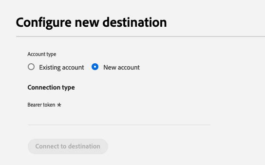
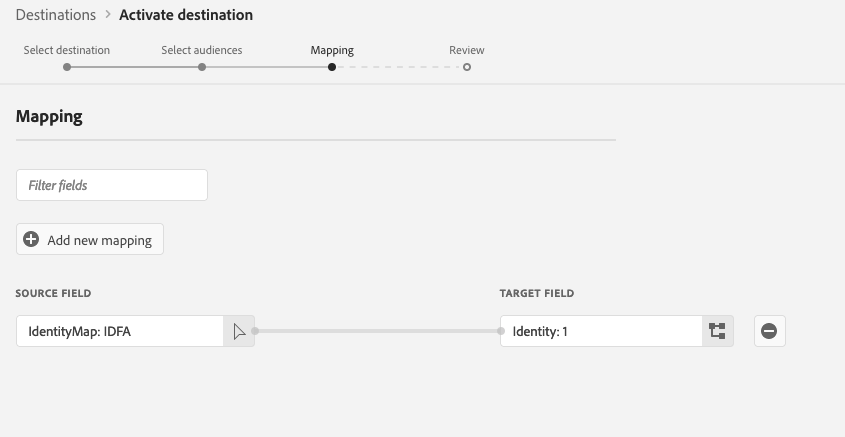

# Destinazione PubMatic Connect {#pubmatic-connect}

## Panoramica {#overview}

Utilizza [!DNL PubMatic Connect] per massimizzare il valore del cliente distribuendo il supply chain di marketing digitale programmatico del futuro. [!DNL PubMatic Connect] combina tecnologia Platform e servizio dedicato per migliorare il modo in cui l&#39;inventario e i dati vengono assemblati e scambiati.

Sono disponibili due destinazioni che ti consentono di inviare dati sul pubblico alla piattaforma PubMatic Connect. Le funzionalità sono leggermente diverse:

1. Connessione PubMatic

   Durante l’attivazione iniziale, questa destinazione registrerà automaticamente i tipi di pubblico nella piattaforma PubMatic e utilizzerà l’ID Adobe Experience Platform interno per la mappatura.

2. PubMatic Connect (mappatura ID pubblico personalizzata)

   Questa destinazione ti consentirà di aggiungere manualmente un ID di mappatura durante il flusso di lavoro di attivazione. Utilizza questa destinazione quando i dati devono essere inviati a tipi di pubblico esistenti nella piattaforma PubMatic o se è richiesto un &quot;ID pubblico di Source&quot; personalizzato.

>[!IMPORTANT]
>
> Il connettore di destinazione e la pagina della documentazione vengono creati e gestiti dal team [!DNL PubMatic]. Per richieste di informazioni o richieste di aggiornamento, contattale direttamente all&#39;indirizzo `support@pubmatic.com`.

## Casi d’uso {#use-cases}

Per aiutarti a capire meglio come e quando utilizzare la destinazione [!DNL PubMatic Connect], ecco un esempio di caso d&#39;uso che i clienti Adobe Experience Platform possono risolvere utilizzando questa destinazione.

### Targeting degli utenti su piattaforme mobili, web e CTV {#targeting}

Gli editori o i provider di dati desiderano inviare tipi di pubblico da Adobe Experience Platform a [!DNL PubMatic Connect] per il targeting degli utenti su piattaforme mobili, web e CTV, utilizzando un&#39;ampia gamma di identificatori.

## Prerequisiti {#prerequisites}

Rivolgiti al tuo Account Manager [!DNL PubMatic] per assicurarti che il tuo account sia configurato correttamente e supporti l&#39;onboarding dei segmenti di pubblico. Inoltre, si assicureranno che tu disponga di tutti i dettagli rilevanti per utilizzare questa destinazione e per fornirti supporto durante la configurazione.

## Identità supportate {#supported-identities}

[!DNL PubMatic Connect] supporta l&#39;attivazione delle identità descritte nella tabella seguente. Ulteriori informazioni su [identità](/help/identity-service/features/namespaces.md).

| Identità di destinazione | Descrizione | Considerazioni |
| --------------- | ------------------------ | ------------------------------------------------------------------------------- |
| GAID | GOOGLE ADVERTISING ID | Seleziona l’identità di destinazione GAID quando l’identità di origine è uno spazio dei nomi GAID. |
| IDFA | Apple ID per inserzionisti | Selezionare l&#39;identità di destinazione IDFA quando l&#39;identità di origine è uno spazio dei nomi IDFA. |
| extern_id | ID utente personalizzati | Seleziona questa identità di destinazione quando l&#39;identità di origine è uno spazio dei nomi personalizzato. |

{style="table-layout:auto"}

## Tipi di pubblico supportati {#supported-audiences}

Questa sezione descrive il tipo di pubblico che puoi esportare in questa destinazione.

| Origine pubblico | Supportato | Descrizione |
|---------|----------|----------|
| [!DNL Segmentation Service] | Sì | Tipi di pubblico generati tramite Experience Platform [Segmentation Service](../../../segmentation/home.md). |
| Tutte le altre origini del pubblico | No | Questa categoria include tutte le origini del pubblico al di fuori dei tipi di pubblico generati tramite [!DNL Segmentation Service]. Leggi informazioni sulle [diverse origini del pubblico](/help/segmentation/ui/audience-portal.md#customize). Alcuni esempi includono: <ul><li> i tipi di pubblico per caricamento personalizzati [importati](../../../segmentation/ui/audience-portal.md#import-audience) in Experience Platform da file CSV,</li><li> pubblico simile, </li><li> pubblico federato, </li><li> tipi di pubblico generati in altre app di Experience Platform come Adobe Journey Optimizer, </li><li> e altro ancora. </li></ul> |

{style="table-layout:auto"}

Tipi di pubblico supportati per tipo di dati sul pubblico:

| Tipo di dati del pubblico | Supportato | Descrizione | Casi d’uso |
|--------------------|-----------|-------------|-----------|
| [Tipi di pubblico per persone](/help/segmentation/types/people-audiences.md) | Sì | In base ai profili dei clienti, consente di eseguire il targeting di gruppi specifici di persone per campagne di marketing. | Acquirenti frequenti, abbandoni del carrello |
| [Pubblico dell&#39;account](/help/segmentation/types/account-audiences.md) | No | Puoi indirizzare l’attività a singoli utenti all’interno di organizzazioni specifiche per strategie di marketing basate sull’account. | Marketing B2B |
| [Pubblico potenziale](/help/segmentation/types/prospect-audiences.md) | No | Puoi indirizzare l’attività a singoli utenti che non sono ancora clienti, ma che condividono alcune caratteristiche con il tuo pubblico di destinazione. | Ricerca di dati di terze parti |
| [Esportazioni set di dati](/help/catalog/datasets/overview.md) | No | Raccolte di dati strutturati archiviati nel Data Lake di Adobe Experience Platform. | Reporting, flussi di lavoro di data science |

{style="table-layout:auto"}

## Tipo e frequenza di esportazione {#export-type-frequency}

Per informazioni sul tipo e sulla frequenza di esportazione della destinazione, consulta la tabella seguente.

| Elemento | Tipo | Note |
| ---------------- | ------------------------------- | ---------------------------------------------------------------------------------------------------------------------------------------------------------------------------------------------------------------------------------------------------------------------------------------------------------------------------- |
| Tipo di esportazione | **[!UICONTROL Segment export]** | Stai esportando tutti i membri di un segmento (pubblico) con gli identificatori (nome, numero di telefono o altri) utilizzati nella destinazione PubMatic Connect. |
| Frequenza di esportazione | **[!UICONTROL Streaming]** | Le destinazioni di streaming sono connessioni &quot;sempre attive&quot; basate su API. Quando un profilo viene aggiornato in Experience Platform in base alla valutazione dei segmenti, il connettore invia l’aggiornamento a valle alla piattaforma di destinazione. Ulteriori informazioni sulle [destinazioni di streaming](/help/destinations/destination-types.md#streaming-destinations). |

{style="table-layout:auto"}

## Connettersi alla destinazione {#connect}

>[!IMPORTANT]
>
> Per connettersi alla destinazione, è necessario disporre dell&#39;autorizzazione **[!UICONTROL Manage Destinations]** [per il controllo degli accessi](/help/access-control/home.md#permissions). Leggi la [panoramica sul controllo degli accessi](/help/access-control/ui/overview.md) o contatta l&#39;amministratore del prodotto per ottenere le autorizzazioni necessarie.

Per connettersi a questa destinazione, seguire i passaggi descritti nell&#39;esercitazione [sulla configurazione della destinazione](../../ui/connect-destination.md). Nel flusso di lavoro di configurazione della destinazione, compila i campi elencati nelle due sezioni seguenti.

### Autenticarsi nella destinazione {#authenticate}

Per autenticare nella destinazione, compilare i campi obbligatori e selezionare **[!UICONTROL Connect to destination]**.

- **[!UICONTROL Bearer token]**: compila il token Bearer per l&#39;autenticazione nella destinazione.

### Inserire i dettagli della destinazione {#destination-details}

Per configurare i dettagli per la destinazione, compila i campi obbligatori e facoltativi seguenti. Un asterisco accanto a un campo nell’interfaccia utente indica che il campo è obbligatorio.

- **[!UICONTROL Name]**: nome con cui riconoscerai questa destinazione in futuro.
- **[!UICONTROL Description]**: una descrizione che ti aiuterà a identificare questa destinazione in futuro.
- **[!UICONTROL Data partner ID]**: l&#39;ID partner dati configurato nell&#39;account [!DNL PubMatic] per questa integrazione.
- **[!UICONTROL Default country code]**: il codice paese predefinito da applicare a tutte le identità se nel profilo non ne viene fornita alcuna.
- **[!UICONTROL Account ID]**: ID account [!DNL PubMatic Connect].
- **[!UICONTROL Account type]**: il tipo di account dell&#39;account piattaforma [!DNL PubMatic]. In caso di domande su cui scegliere, rivolgiti al tuo account manager [!DNL PubMatic]. Le opzioni disponibili sono:
   - [!UICONTROL PUBLISHER]
   - [!UICONTROL DEMAND_PARTNER]
   - [!UICONTROL BUYER]

### Abilita avvisi {#enable-alerts}

Puoi abilitare gli avvisi per ricevere notifiche sullo stato del flusso di dati verso la tua destinazione. Seleziona un avviso dall’elenco per abbonarti e ricevere notifiche sullo stato del flusso di dati. Per ulteriori informazioni sugli avvisi, consulta la guida su [abbonamento a destinazioni avvisi tramite l&#39;interfaccia utente](../../ui/alerts.md).

Dopo aver fornito i dettagli della connessione di destinazione, selezionare **[!UICONTROL Next]**.

## Attiva i segmenti in questa destinazione {#activate}

>[!IMPORTANT]
>
> - Per attivare i dati, sono necessarie le **[!UICONTROL View Destinations]**, **[!UICONTROL Activate Destinations]**, **[!UICONTROL View Profiles]** e **[!UICONTROL View Segments]** [autorizzazioni di controllo di accesso](/help/access-control/home.md#permissions). Leggi la [panoramica sul controllo degli accessi](/help/access-control/ui/overview.md) o contatta l&#39;amministratore del prodotto per ottenere le autorizzazioni necessarie.
>
> - Per esportare _identità_, è necessario disporre dell&#39;autorizzazione **[!UICONTROL View Identity Graph]** [per il controllo degli accessi](/help/access-control/home.md#permissions).   {width="100" zoomable="yes"}

Leggi [Attivare profili e segmenti nelle destinazioni di esportazione dei segmenti di streaming](/help/destinations/ui/activate-segment-streaming-destinations.md) per le istruzioni sull&#39;attivazione dei segmenti di pubblico in questa destinazione.

### Mappare attributi e identità {#map}

Selezione dei campi di origine:

- Seleziona un identificatore (in genere spazi dei nomi come IDFA o uno spazio dei nomi ID personalizzato).

Selezione dei campi di destinazione:

- Rivolgiti al tuo Account Manager [!DNL PubMatic] per ottenere le informazioni sul tipo di UID corretto durante questo passaggio.
- Selezionare il numero del tipo [!DNL PubMatic UID] che corrisponde all&#39;identificatore selezionato nel primo passaggio.

### Pianificazione del pubblico

Se utilizzi la destinazione PubMatic Connect (Custom Audience ID Mapping), devi fornire un ID di mappatura per ogni pubblico che corrisponda all’ID pubblico Source nella piattaforma PubMatic.

## Dati esportati / Convalida esportazione dati {#exported-data}

L&#39;interfaccia utente di [!DNL PubMatic] consente di verificare se i dati sono stati inviati correttamente e se i segmenti sono disponibili. L&#39;aggiornamento dell&#39;interfaccia utente [!DNL PubMatic] può richiedere fino a 24 ore dopo il push dei dati.

## Utilizzo dei dati e governance {#data-usage-governance}

Tutte le destinazioni [!DNL Adobe Experience Platform] sono conformi ai criteri di utilizzo dei dati durante la gestione dei dati. Per informazioni dettagliate su come [!DNL Adobe Experience Platform] applica la governance dei dati, leggere la [Panoramica sulla governance dei dati](/help/data-governance/home.md).
