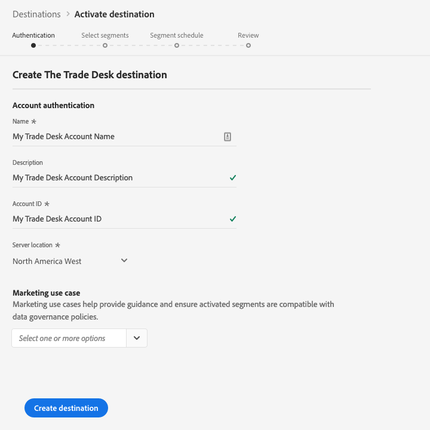

# [!DNL The Trade Desk] destinazione

## Panoramica {#overview}

[!DNL The Trade Desk] la destinazione consente di inviare i dati del profilo a  [!DNL The Trade Desk].

[!DNL The Trade Desk] è una piattaforma self-service per gli acquirenti di annunci che consente di eseguire il retargeting e campagne digitali mirate per il pubblico attraverso le origini di visualizzazione, video e inventario mobile.

Per inviare i dati del profilo a [!DNL The Trade Desk], è innanzitutto necessario connettersi alla destinazione.

## Specifiche di destinazione {#destination-specs}

Notate i seguenti dettagli specifici della destinazione [!DNL The Trade Desk]:

* È possibile inviare le seguenti [identità](../../../identity-service/namespaces.md) alle [!DNL The Trade Desk] destinazioni: [!DNL The Trade Desk ID], [!DNL IDFA], [!DNL GAID].

## Casi d’uso {#use-cases}

In qualità di esperto di marketing, voglio essere in grado di utilizzare i segmenti generati da [!DNL Trade Desk IDs] o ID dispositivo per creare retargeting o campagne digitali mirate per l&#39;audience.

## Tipo di esportazione {#export-type}

**[!DNL Segment export]** - tutti i membri di un segmento (pubblico) vengono esportati verso la destinazione.

## Connetti alla destinazione {#connect-destination}

In **[!UICONTROL Connections]** > **[!UICONTROL Destinations]**, selezionare [!DNL The Trade Desk], quindi selezionare **[!UICONTROL Configure]**.

>[!NOTE]
>
>Se esiste già una connessione con questa destinazione, è possibile visualizzare un pulsante **[!UICONTROL Activate]** sulla scheda di destinazione. Per ulteriori informazioni sulla differenza tra **[!UICONTROL Activate]** e **[!UICONTROL Configure]**, fare riferimento alla sezione [Catalog](../../ui/destinations-workspace.md#catalog) della documentazione relativa all&#39;area di lavoro di destinazione.
>
>

Nel passaggio [!UICONTROL Authentication], è necessario immettere i dettagli di connessione [!DNL The Trade Desk]:

* **[!UICONTROL Name]**: Un nome con cui riconoscerete questa destinazione in futuro.
* **[!UICONTROL Description]**: Descrizione che ti aiuterà a identificare questa destinazione in futuro.
* **[!UICONTROL Account ID]**: Il [!DNL Trade Desk] [!UICONTROL Account ID].
* **[!UICONTROL Client Secret]**: Il  `clientSecret` parametro utilizzato nelle credenziali  [!DNL OAuth2] client.
* **[!UICONTROL Server Location]**: Chiedi al tuo  [!DNL The Trade Desk] rappresentante quale server regionale utilizzare. Sono disponibili i seguenti server regionali:

   * **[!UICONTROL Europe]**
   * **[!UICONTROL Singapore]**
   * **[!UICONTROL Tokyo]**
   * **[!UICONTROL North America East]**
   * **[!UICONTROL North America West]**
   * **[!UICONTROL Latin America]**

* **[!UICONTROL Marketing use case]**: I casi di utilizzo del marketing indicano l&#39;intento per il quale i dati verranno esportati nella destinazione. Puoi scegliere tra  casi di utilizzo di marketing definiti dal Adobe o creare un caso di utilizzo di marketing personale. Per ulteriori informazioni sui casi di utilizzo del marketing, vedere la pagina [Governance dei dati in Adobe Experience Platform](../../../data-governance/policies/overview.md). Per informazioni sui singoli casi d&#39;uso di marketing definiti dal Adobe , vedere la [panoramica dei criteri di utilizzo dei dati](../../../data-governance/policies/overview.md).

Fai clic su **[!UICONTROL Create destination]**. La destinazione è stata creata. È possibile fare clic su [!UICONTROL Save & Exit] se si desidera attivare i segmenti in un secondo momento, oppure è possibile selezionare [!UICONTROL Next] per continuare il flusso di lavoro e selezionare i segmenti da attivare. In entrambi i casi, vedere la sezione successiva, [Attiva segmenti](#activate-segments), per il resto del flusso di lavoro.

## Attivare i segmenti {#activate-segments}

Per informazioni sul flusso di lavoro di attivazione dei segmenti, vedere [Attivare profili e segmenti in una destinazione](../../ui/activate-destinations.md#select-attributes).

Nel passaggio [Programmazione segmenti](../../ui/activate-destinations.md#segment-schedule), devi mappare manualmente i segmenti sul relativo ID o nome descrittivo nella destinazione.

Per la mappatura dei segmenti, si consiglia di utilizzare il nome del segmento [!DNL Platform] o una forma più breve, per semplificare l&#39;utilizzo. Tuttavia, l&#39;ID o il nome del segmento nella destinazione non deve corrispondere a quello nell&#39;account [!DNL Platform]. Qualsiasi valore inserito nel campo di mappatura verrà riflesso dalla destinazione.

Se utilizzate più mappature dispositivo (ID cookie, [!DNL IDFA], [!DNL GAID]), accertatevi di utilizzare lo stesso valore di mappatura per tutte e tre le mappature. [!DNL The Trade Desk] vengono aggregati tutti in un singolo segmento, con una suddivisione a livello di dispositivo.

## Dati esportati {#exported-data}

Per verificare se i dati sono stati esportati correttamente in [!DNL The Trade Desk] destinazione, controlla il tuo account [!DNL The Trade Desk]. Se l&#39;attivazione ha avuto esito positivo, l&#39;audience viene popolata nel vostro account.
