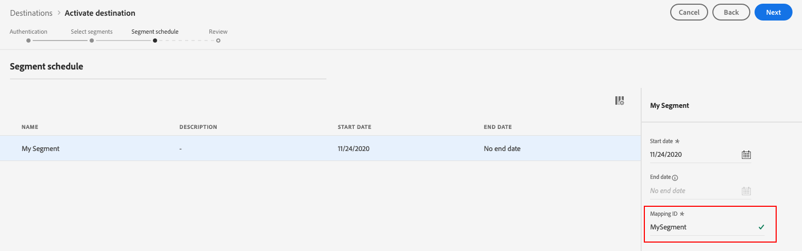

# Connessione [!DNL The Trade Desk]

## Panoramica {#overview}

La destinazione [!DNL The Trade Desk] ti consente di inviare i dati del profilo a [!DNL The Trade Desk].

[!DNL The Trade Desk] è una piattaforma self-service per consentire agli acquirenti di annunci di eseguire campagne digitali di retargeting e targeting del pubblico tra sorgenti di visualizzazione, video e inventario mobile.

Per inviare i dati del profilo a [!DNL Trade Desk], è necessario prima connettersi alla destinazione.

## Casi d’uso {#use-cases}

In qualità di addetto al marketing, desidero poter utilizzare tipi di pubblico creati da [!DNL Trade Desk IDs] o ID dispositivo per creare campagne digitali di retargeting o targeting di pubblico.

## Identità supportate {#supported-identities}

[!DNL The Trade Desk] supporta l&#39;attivazione di tipi di pubblico in base alle identità mostrate nella tabella seguente. Ulteriori informazioni su [identità](/help/identity-service/features/namespaces.md).

| Identità | Descrizione |
|---|---|
| GAID | [!DNL Google Advertising ID] |
| IDFA | [!DNL Apple ID for Advertisers] |
| ID Trade Desk | ID inserzionista nella piattaforma Trade Desk |

{style="table-layout:auto"}

## Tipi di pubblico supportati {#supported-audiences}

Questa sezione descrive quali tipi di pubblico puoi esportare in questa destinazione.

| Origine pubblico | Supportato | Descrizione |
|---------|----------|----------|
| [!DNL Segmentation Service] | ✓ | Tipi di pubblico generati tramite il servizio di segmentazione [Experience Platform](../../../segmentation/home.md). |
| Caricamenti personalizzati | ✓ | Tipi di pubblico [importati](../../../segmentation/ui/audience-portal.md#import-audience) in Experience Platform da file CSV. |

{style="table-layout:auto"}

## Tipo e frequenza di esportazione {#export-type-frequency}

Per informazioni sul tipo e sulla frequenza di esportazione della destinazione, consulta la tabella seguente.

| Elemento | Tipo | Note |
---------|----------|---------|
| Tipo di esportazione | **[!UICONTROL Esportazione pubblico]** | Stai esportando tutti i membri di un pubblico nella destinazione. |
| Frequenza di esportazione | **[!UICONTROL Streaming]** | Le destinazioni di streaming sono connessioni &quot;sempre attive&quot; basate su API. Non appena un profilo viene aggiornato in Experience Platform in base alla valutazione del pubblico, il connettore invia l’aggiornamento a valle alla piattaforma di destinazione. Ulteriori informazioni sulle [destinazioni di streaming](/help/destinations/destination-types.md#streaming-destinations). |

{style="table-layout:auto"}

## Prerequisiti {#prerequisites}

>[!IMPORTANT]
>
>Se stai cercando di creare la tua prima destinazione con [!DNL The Trade Desk] e non hai abilitato in passato la funzionalità di sincronizzazione [ID](https://experienceleague.adobe.com/docs/id-service/using/id-service-api/methods/idsync.html) nel servizio ID Experience Cloud (con Adobe Audience Manager o altre applicazioni), contatta Adobe Consulting o l&#39;Assistenza clienti per abilitare le sincronizzazioni ID. Se in precedenza hai configurato [!DNL The Trade Desk] integrazioni in Audience Manager, le sincronizzazioni ID configurate vengono trasferite a Platform.

## Connettersi alla destinazione {#connect}

>[!IMPORTANT]
> 
>Per connettersi alla destinazione, sono necessarie le **[!UICONTROL Destinazioni visualizzazione]** e le **[!UICONTROL Autorizzazioni di gestione delle destinazioni]** [per il controllo degli accessi](/help/access-control/home.md#permissions). Leggi la [panoramica sul controllo degli accessi](/help/access-control/ui/overview.md) o contatta l&#39;amministratore del prodotto per ottenere le autorizzazioni necessarie.

Per connettersi a questa destinazione, seguire i passaggi descritti nell&#39;esercitazione [sulla configurazione della destinazione](../../ui/connect-destination.md).

### Parametri di connessione {#parameters}

Durante la [configurazione](../../ui/connect-destination.md) di questa destinazione, è necessario fornire le seguenti informazioni:

* **[!UICONTROL Nome]**: un nome con cui riconoscerai questa destinazione in futuro.
* **[!UICONTROL Descrizione]**: una descrizione che ti aiuterà a identificare questa destinazione in futuro.
* **[!UICONTROL ID account]**: [!DNL Trade Desk] [!UICONTROL ID account].
* **[!UICONTROL Posizione server]**: chiedere al rappresentante [!DNL Trade Desk] quale server regionale utilizzare. Si tratta dei server regionali disponibili tra cui è possibile scegliere:
   * **[!UICONTROL Europa]**
   * **[!UICONTROL Singapore]**
   * **[!UICONTROL Tokyo]**
   * **[!UICONTROL Nord America orientale]**
   * **[!UICONTROL Nord America occidentale]**
   * **[!UICONTROL America Latina]**

### Abilita avvisi {#enable-alerts}

Puoi abilitare gli avvisi per ricevere notifiche sullo stato del flusso di dati verso la tua destinazione. Seleziona un avviso dall’elenco per abbonarti e ricevere notifiche sullo stato del flusso di dati. Per ulteriori informazioni sugli avvisi, consulta la guida su [abbonamento a destinazioni avvisi tramite l&#39;interfaccia utente](../../ui/alerts.md).

Dopo aver fornito i dettagli per la connessione di destinazione, seleziona **[!UICONTROL Avanti]**.

## Attivare tipi di pubblico in questa destinazione {#activate}

>[!IMPORTANT]
> 
>* Per attivare i dati, è necessario **[!UICONTROL Visualizza destinazioni]**, **[!UICONTROL Attiva destinazioni]**, **[!UICONTROL Visualizza profili]** e **[!UICONTROL Visualizza segmenti]** [Autorizzazioni di controllo di accesso](/help/access-control/home.md#permissions). Leggi la [panoramica sul controllo degli accessi](/help/access-control/ui/overview.md) o contatta l&#39;amministratore del prodotto per ottenere le autorizzazioni necessarie.
>* Per esportare *identità*, è necessario disporre dell&#39;autorizzazione **[!UICONTROL Visualizza grafo identità]** [Controllo di accesso](/help/access-control/home.md#permissions).   {width="100" zoomable="yes"}

Per istruzioni sull&#39;attivazione dei tipi di pubblico in questa destinazione, consulta [Attivare i dati del pubblico nelle destinazioni di esportazione del pubblico in streaming](../../ui/activate-segment-streaming-destinations.md).

Nel passaggio [Pianificazione pubblico](../../ui/activate-segment-streaming-destinations.md#scheduling), devi mappare manualmente i tipi di pubblico al loro ID o nome descrittivo corrispondente nella piattaforma di destinazione.

Durante la mappatura dei segmenti, ti consigliamo di utilizzare il nome del pubblico di Platform, o una forma più breve, per facilitarne l’utilizzo. Tuttavia, l’ID o il nome del pubblico nella destinazione non deve necessariamente corrispondere a quello nell’account Platform. Qualsiasi valore inserito nel campo di mappatura verrà riflesso dalla destinazione.

Se utilizzi più mappature dispositivo (ID cookie, [!DNL IDFA], [!DNL GAID]), assicurati di utilizzare lo stesso valore di mappatura per tutte e tre le mappature. [!DNL The Trade Desk] li aggregherà tutti in un singolo segmento, con un raggruppamento a livello di dispositivo.

## Dati esportati {#exported-data}

Per verificare se i dati sono stati esportati correttamente nella destinazione [!DNL The Trade Desk], controllare l&#39;account [!DNL Trade Desk]. Se l&#39;attivazione ha esito positivo, i tipi di pubblico vengono popolati nel tuo account.
