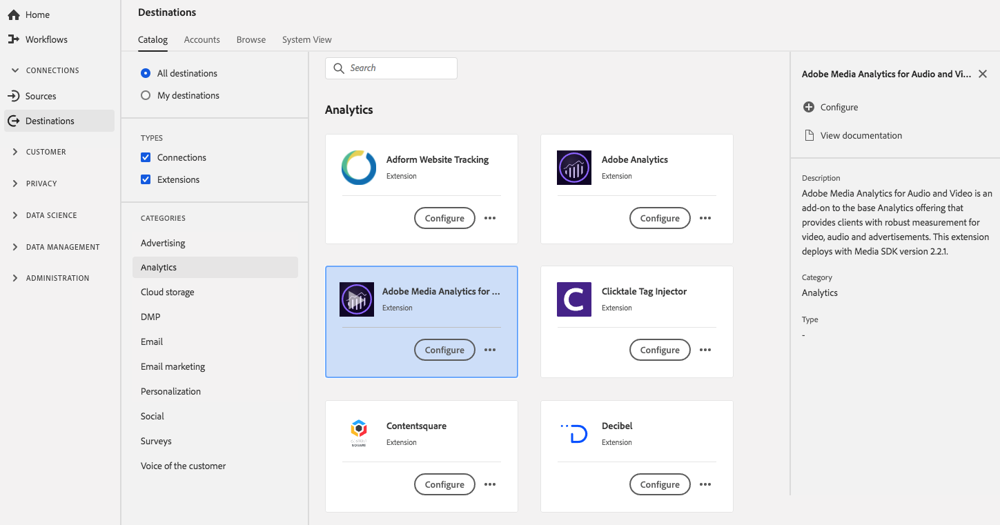

# Estensione Adobe Media Analytics for Audio and Video {#adobe-analytics-for-video-extension}

## Panoramica {#overview}

Adobe Medium Analytics for Audio and Video è un componente aggiuntivo dell’offerta Analytics di base che fornisce ai clienti misurazioni affidabili per video, audio e annunci pubblicitari.

Adobe Medium Analytics for Audio and Video è un’estensione Analytics in Adobe Experience Platform. Per ulteriori informazioni sulla funzionalità di estensione, consulta la pagina dell&#39;estensione in [Adobe Exchange](https://exchange.adobe.com/experiencecloud.details.100157.html).

Questa destinazione è un&#39;estensione [!DNL Adobe Experience Platform Launch]. Per ulteriori informazioni sul funzionamento delle estensioni [!DNL Platform Launch] in Platform, consulta [Panoramica delle estensioni di Experience Platform Launch](../launch-extensions/overview.md).

## Prerequisiti {#prerequisites}

Questa estensione è disponibile nel catalogo [!DNL Destinations] per tutti i clienti che hanno acquistato Platform.

Per utilizzare questa estensione, devi accedere a [!DNL Adobe Experience Platform Launch]. [!DNL Platform Launch] è offerto ai clienti Adobe Experience Cloud come funzionalità inclusa a valore aggiunto. Contatta l’amministratore dell’organizzazione per accedere a [!DNL Platform Launch] e chiedere loro di concedere l’autorizzazione **[!UICONTROL manage_properties]** in modo da poter installare le estensioni.

## Installa l&#39;estensione {#install-extension}

Per installare l’estensione Adobe Analytics for Video:

Nell’ [Interfaccia piattaforma](http://platform.adobe.com/), vai a **[!UICONTROL Destinations]** > **[!UICONTROL Catalog]**.

Seleziona l’estensione dal catalogo o utilizza la barra di ricerca.

Fai clic sulla destinazione per evidenziarla, quindi seleziona **[!UICONTROL Configure]** nella barra a destra. Se il controllo **[!UICONTROL Configure]** è disabilitato, manca l&#39;autorizzazione **[!UICONTROL manage_properties]**. Consulta [Prerequisiti](#prerequisites).

Nella finestra **[!UICONTROL Select available Platform Launch property]**, seleziona la proprietà [!DNL Platform Launch] in cui desideri installare l&#39;estensione. Puoi anche creare una nuova proprietà in [!DNL Platform Launch]. Una proprietà è una raccolta di regole, elementi di dati, estensioni configurate, ambienti e librerie. Ulteriori informazioni sulle proprietà nella sezione [Proprietà pagina](https://experienceleague.adobe.com/docs/launch/using/reference/admin/companies-and-properties.html#properties-page) della documentazione [!DNL Launch].

Il flusso di lavoro ti porta a [!DNL Platform Launch] per completare l’installazione.

Per informazioni sulle opzioni di configurazione dell&#39;estensione, consulta la [pagina dell&#39;estensione Adobe Medium Analytics for Audio and Video](https://experienceleague.adobe.com/docs/launch/using/extensions-ref/adobe-extension/media-analytics-extension/overview.html) nella documentazione [!DNL Experience Launch] .

Puoi anche installare l&#39;estensione direttamente nell&#39; [interfaccia Adobe Experience Platform Launch](https://launch.adobe.com/). Consulta [Aggiungi una nuova estensione](https://experienceleague.adobe.com/docs/launch/using/reference/manage-resources/extensions/overview.html?lang=en#add-a-new-extension) nella documentazione [!DNL Platform Launch] .

## Come utilizzare l&#39;estensione {#how-to-use}

Dopo aver installato l&#39;estensione, puoi avviare l&#39;impostazione delle regole per essa direttamente in [!DNL Platform Launch].

In [!DNL Platform Launch], puoi impostare regole per le estensioni installate per inviare dati evento alla destinazione dell&#39;estensione solo in determinate situazioni. Per ulteriori informazioni sull&#39;impostazione delle regole per le estensioni, consulta la [documentazione sulle regole](https://experienceleague.adobe.com/docs/launch/using/reference/manage-resources/rules.html).

## Configura, aggiorna ed elimina l&#39;estensione {#configure-upgrade-delete}

Puoi configurare, aggiornare ed eliminare le estensioni nell&#39;interfaccia [!DNL Platform Launch] .

>[!TIP]
>
>Se l’estensione è già installata su una delle tue proprietà, l’interfaccia utente di Platform visualizza ancora **[!UICONTROL Install]** per l’estensione. Per passare a [!DNL Platform Launch] e configurare o eliminare l&#39;estensione, fai clic sul flusso di lavoro di installazione come descritto in [Installa l&#39;estensione](#install-extension) .

Per aggiornare l&#39;estensione, consulta [Aggiornamento dell&#39;estensione](https://experienceleague.adobe.com/docs/launch/using/reference/manage-resources/extensions/extension-upgrade.html) nella documentazione [!DNL Platform Launch] .

