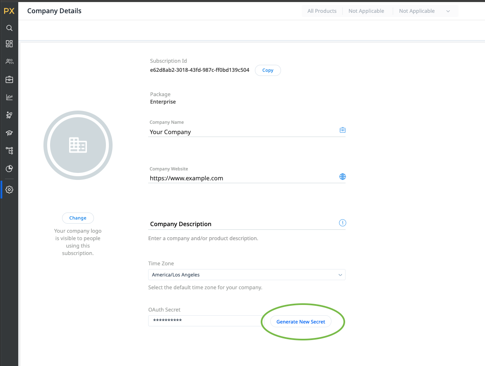

# Connessione PX Gainsight {#gainsight-px}

## Panoramica {#overview}

[[!DNL Gainsight PX]](https://www.gainsight.com/product-experience/) è una piattaforma di esperienza dei prodotti che consente ai team di prodotto di comprendere in che modo gli utenti utilizzano i loro prodotti, raccogliere feedback e creare impegni in-app, come le procedure dettagliate sui prodotti, per stimolare l’onboarding degli utenti e l’adozione dei prodotti.

>[!IMPORTANT]
>
>Il connettore di destinazione e la pagina della documentazione vengono creati e gestiti da *Gainsight PX* team. Per eventuali richieste di informazioni o richieste di aggiornamento, contattale direttamente all’indirizzo *`pxsupport@gainsight.com`*.

## Casi d’uso {#use-cases}

Per aiutarti a capire meglio come e quando utilizzare il *Gainsight PX* destinazione: di seguito sono riportati alcuni casi di utilizzo esemplificativi che i clienti di Adobe Experience Platform possono risolvere utilizzando questa destinazione.

### Targeting degli accordi in-app {#targeting-in-app-engagements}

Un&#39;azienda SaaS vuole coinvolgere i propri clienti tramite una guida in-application costruita su Gainsight PX. Un pubblico per ricevere questo coinvolgimento è stato creato su Adobe Experience Platform. La destinazione PX di Gainsight riceve il pubblico e lo rende disponibile all&#39;interno dell&#39;ambiente PX di Gainsight.

## Prerequisiti {#prerequisites}

* Contatta il [!DNL Gainsight] e richiedere l’attivazione di funzionalità di segmenti esterni per il tuo abbonamento.
* Genera un valore OAuth Secret per l’abbonamento PX, utilizzando **[!UICONTROL Genera nuovo segreto]** nella parte inferiore della sezione [Pagina Dettagli società](https://app.aptrinsic.com/settings/subscription)
  

## Identità supportate {#supported-identities}

Gainsight PX supporta l’attivazione delle identità descritte nella tabella seguente. Ulteriori informazioni su [identità](../../../identity-service/features/namespaces.md).

| Identità di destinazione | Descrizione |
|---|----|
| IdentifyID | Identificatore utente comune che identifica in modo univoco un utente in Gainsight PX e Adobe Experience Platform |

{style="table-layout:auto"}

## Tipi di pubblico supportati {#supported-audiences}

Questa sezione descrive il tipo di pubblico che puoi esportare in questa destinazione.

| Origine pubblico | Supportati | Descrizione |
|---|---|---|
| [!DNL Segmentation Service] | ✓ | Tipi di pubblico generati dall’Experience Platform [Servizio di segmentazione](../../../segmentation/home.md). |
| Caricamenti personalizzati | X | Tipi di pubblico [importato](../../../segmentation/ui/overview.md#import-audience) in Experienci Platform da file CSV. |

{style="table-layout:auto"}

## Tipo e frequenza di esportazione {#export-type-frequency}

Per informazioni sul tipo e sulla frequenza di esportazione della destinazione, consulta la tabella seguente.

| Elemento | Tipo | Note |
|---|---|---|
| Tipo di esportazione | **[!UICONTROL Esportazione del segmento]** | Stai esportando tutti i membri di un pubblico con gli identificatori (nome, numero di telefono o altri) utilizzati in [!DNL Gainsight PX] destinazione. |
| Frequenza di esportazione | **[!UICONTROL Streaming]** | Le destinazioni di streaming sono connessioni &quot;sempre attive&quot; basate su API. Quando un profilo viene aggiornato in Experienci Platform in base alla valutazione del pubblico, il connettore invia l’aggiornamento a valle alla piattaforma di destinazione. Ulteriori informazioni su [destinazioni di streaming](/help/destinations/destination-types.md#streaming-destinations). |

{style="table-layout:auto"}

## Connettersi alla destinazione {#connect}

>[!IMPORTANT]
>
>Per connettersi alla destinazione, è necessario **[!UICONTROL Gestire le destinazioni]** [autorizzazione per il controllo degli accessi](/help/access-control/home.md#permissions). Leggi le [panoramica sul controllo degli accessi](/help/access-control/ui/overview.md) oppure contatta l’amministratore del prodotto per ottenere le autorizzazioni necessarie.

Per connettersi a questa destinazione, seguire i passaggi descritti in [esercitazione sulla configurazione della destinazione](../../ui/connect-destination.md). Nel flusso di lavoro di configurazione della destinazione, compila i campi elencati nelle due sezioni seguenti.

### Autenticarsi nella destinazione {#authenticate}

Per autenticare nella destinazione, compila i campi obbligatori e seleziona **[!UICONTROL Connetti alla destinazione]**.

* **[!UICONTROL Password]**: password utilizzata per accedere a [[!DNL Gainsight PX]](https://app.aptrinsic.com)
* **[!UICONTROL ID client]**: l’ID di abbonamento Gainsight PX sul [Pagina Dettagli società](https://app.aptrinsic.com/settings/subscription)
* **[!UICONTROL Segreto client]**: segreto OAuth generato in fondo al [Pagina Dettagli società](https://app.aptrinsic.com/settings/subscription) nel [!DNL Gainsight PX] UI.
* **[!UICONTROL Nome utente]**: indirizzo e-mail utilizzato per accedere a [[!DNL Gainsight PX]](https://app.aptrinsic.com) UI

### Inserire i dettagli della destinazione {#destination-details}

Per configurare i dettagli per la destinazione, compila i campi obbligatori e facoltativi seguenti. Un asterisco accanto a un campo nell’interfaccia utente indica che il campo è obbligatorio.

* **[!UICONTROL Nome]**: nome con cui riconoscerai questa destinazione in futuro.
* **[!UICONTROL Descrizione]**: descrizione che ti aiuterà a identificare questa destinazione in futuro.

Una volta completate le informazioni sulla connessione di destinazione, seleziona **[!UICONTROL Successivo]**.

## Attiva i segmenti in questa destinazione {#activate}

>[!IMPORTANT]
>
>* Per attivare i dati, è necessario **[!UICONTROL Gestire le destinazioni]**, **[!UICONTROL Attivare le destinazioni]**, **[!UICONTROL Visualizza profili]**, e **[!UICONTROL Visualizzare segmenti]** [autorizzazioni di controllo degli accessi](/help/access-control/home.md#permissions). Leggi le [panoramica sul controllo degli accessi](/help/access-control/ui/overview.md) oppure contatta l’amministratore del prodotto per ottenere le autorizzazioni necessarie.
>* Per esportare *identità*, è necessario **[!UICONTROL Visualizza grafico delle identità]** [autorizzazione per il controllo degli accessi](/help/access-control/home.md#permissions).   {width="100" zoomable="yes"}

Letto [Attivare profili e segmenti nelle destinazioni di esportazione di segmenti in streaming](/help/destinations/ui/activate-segment-streaming-destinations.md) per istruzioni sull’attivazione dei segmenti di pubblico in questa destinazione.

### Mappare le identità {#map}

Questa destinazione supporta la mappatura degli attributi del profilo e degli spazi dei nomi di identità. La mappatura di destinazione deve essere sempre **[!UICONTROL IDENTIFICA_ID]** spazio dei nomi dell’identità.

Consulta gli esempi seguenti per comprendere meglio come configurare la mappatura.

#### Mappare un attributo di profilo {#map-profile-attribute}

Nell’esempio mostrato di seguito, il campo sorgente è un attributo di profilo XDM che viene mappato sullo spazio dei nomi di destinazione IDENTIFICATION_ID.

#### Mappare uno spazio dei nomi delle identità {#map-identity-namespace}

Nell’esempio riportato di seguito, il campo di origine è uno spazio dei nomi di identità (**[!UICONTROL ECID]**) che viene mappato su **[!UICONTROL IDENTIFICA_ID]** spazio dei nomi di destinazione.

## Dati esportati / Convalida esportazione dati {#exported-data}

I dati di segmentazione vengono inviati in streaming dall’Experience Platform al Gainsight PX.

I metadati del segmento sono visibili nella schermata Segmenti all’interno di [!DNL Gainsight PX] UI.

Le informazioni sull’iscrizione al segmento sono visibili nella scheda Segmenti della schermata Audience Explorer del [!DNL Gainsight PX] UI.

## Utilizzo dei dati e governance {#data-usage-governance}

Tutti [!DNL Adobe Experience Platform] le destinazioni sono conformi ai criteri di utilizzo dei dati durante la gestione dei dati. Per informazioni dettagliate su come [!DNL Adobe Experience Platform] applica la governance dei dati, leggi [Panoramica sulla governance dei dati](/help/data-governance/home.md).
