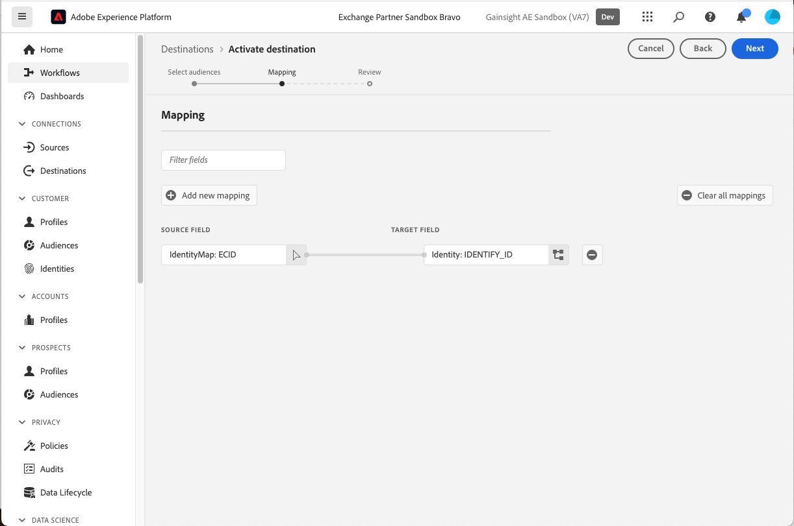
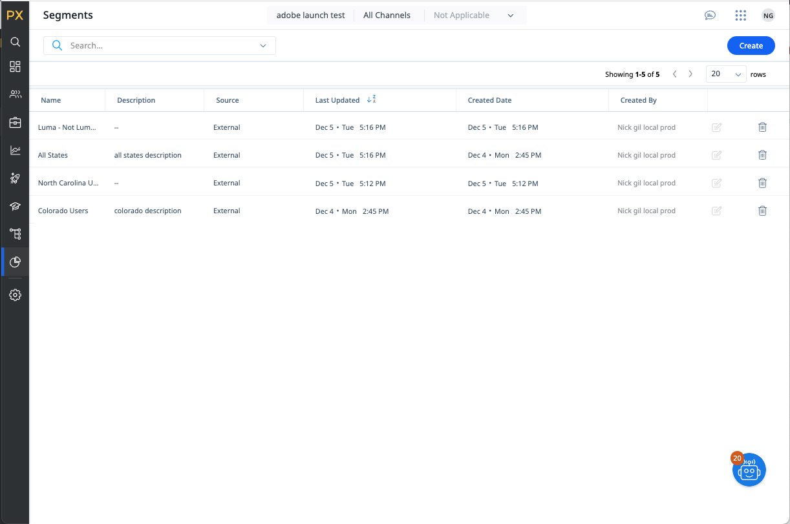

# Connessione PX Gainsight {#gainsight-px}

## Panoramica {#overview}

[[!DNL Gainsight PX]](https://www.gainsight.com/product-experience/) è una piattaforma di esperienza del prodotto che consente ai team di prodotto di comprendere in che modo gli utenti utilizzano i loro prodotti, raccogliere feedback e creare impegni in-app, ad esempio procedure dettagliate sui prodotti, per favorire l&#39;onboarding degli utenti e l&#39;adozione dei prodotti.

>[!IMPORTANT]
>
>Il connettore di destinazione e la pagina della documentazione vengono creati e gestiti dal team *Gainsight PX*. Per richieste di informazioni o richieste di aggiornamento, contattale direttamente all&#39;indirizzo *`pxsupport@gainsight.com`*.

## Casi d’uso {#use-cases}

Per aiutarti a capire meglio come e quando utilizzare la destinazione *Gainsight PX*, ecco alcuni esempi di casi d&#39;uso che i clienti di Adobe Experience Platform possono risolvere utilizzando questa destinazione.

### Targeting degli accordi in-app {#targeting-in-app-engagements}

Un&#39;azienda SaaS vuole coinvolgere i propri clienti tramite una guida in-application costruita su Gainsight PX. Un pubblico per ricevere questo coinvolgimento è stato creato su Adobe Experience Platform. La destinazione PX di Gainsight riceve il pubblico e lo rende disponibile all&#39;interno dell&#39;ambiente PX di Gainsight.

## Prerequisiti {#prerequisites}

* Contatta il team di supporto [!DNL Gainsight] e richiedi l&#39;attivazione delle funzionalità dei segmenti esterni per il tuo abbonamento.
* Genera un valore OAuth Secret per l&#39;abbonamento PX, utilizzando il pulsante **[!UICONTROL Generate New Secret]** nella parte inferiore della [pagina Dettagli società](https://app.aptrinsic.com/settings/subscription)
  

## Identità supportate {#supported-identities}

Gainsight PX supporta l’attivazione delle identità descritte nella tabella seguente. Ulteriori informazioni su [identità](../../../identity-service/features/namespaces.md).

| Identità di destinazione | Descrizione |
|---|----|
| IdentifyID | Identificatore utente comune che identifica in modo univoco un utente in Gainsight PX e Adobe Experience Platform |

{style="table-layout:auto"}

## Tipi di pubblico supportati {#supported-audiences}

Questa sezione descrive il tipo di pubblico che puoi esportare in questa destinazione.

| Origine pubblico | Supportato | Descrizione |
|---------|----------|----------|
| [!DNL Segmentation Service] | Sì | Tipi di pubblico generati tramite Experience Platform [Segmentation Service](../../../segmentation/home.md). |
| Tutte le altre origini del pubblico | No | Questa categoria include tutte le origini del pubblico al di fuori dei tipi di pubblico generati tramite [!DNL Segmentation Service]. Leggi informazioni sulle [diverse origini del pubblico](/help/segmentation/ui/audience-portal.md#customize). Alcuni esempi includono: <ul><li> i tipi di pubblico per caricamento personalizzati [importati](../../../segmentation/ui/audience-portal.md#import-audience) in Experience Platform da file CSV,</li><li> pubblico simile, </li><li> pubblico federato, </li><li> tipi di pubblico generati in altre app di Experience Platform come Adobe Journey Optimizer, </li><li> e altro ancora. </li></ul> |

{style="table-layout:auto"}

Tipi di pubblico supportati per tipo di dati sul pubblico:

| Tipo di dati del pubblico | Supportato | Descrizione | Casi d’uso |
|--------------------|-----------|-------------|-----------|
| [Tipi di pubblico per persone](/help/segmentation/types/people-audiences.md) | Sì | In base ai profili dei clienti, consente di eseguire il targeting di gruppi specifici di persone per campagne di marketing. | Acquirenti frequenti, abbandoni del carrello |
| [Pubblico dell&#39;account](/help/segmentation/types/account-audiences.md) | No | Puoi indirizzare l’attività a singoli utenti all’interno di organizzazioni specifiche per strategie di marketing basate sull’account. | Marketing B2B |
| [Pubblico potenziale](/help/segmentation/types/prospect-audiences.md) | No | Puoi indirizzare l’attività a singoli utenti che non sono ancora clienti, ma che condividono alcune caratteristiche con il tuo pubblico di destinazione. | Ricerca di dati di terze parti |
| [Esportazioni set di dati](/help/catalog/datasets/overview.md) | No | Raccolte di dati strutturati archiviati nel Data Lake di Adobe Experience Platform. | Reporting, flussi di lavoro di data science |

{style="table-layout:auto"}

## Tipo e frequenza di esportazione {#export-type-frequency}

Per informazioni sul tipo e sulla frequenza di esportazione della destinazione, consulta la tabella seguente.

| Elemento | Tipo | Note |
|---|---|---|
| Tipo di esportazione | **[!UICONTROL Segment export]** | Stai esportando tutti i membri di un pubblico con gli identificatori (nome, numero di telefono o altri) utilizzati nella destinazione [!DNL Gainsight PX]. |
| Frequenza di esportazione | **[!UICONTROL Streaming]** | Le destinazioni di streaming sono connessioni &quot;sempre attive&quot; basate su API. Quando un profilo viene aggiornato in Experience Platform in base alla valutazione del pubblico, il connettore invia l’aggiornamento a valle alla piattaforma di destinazione. Ulteriori informazioni sulle [destinazioni di streaming](/help/destinations/destination-types.md#streaming-destinations). |

{style="table-layout:auto"}

## Connettersi alla destinazione {#connect}

>[!IMPORTANT]
>
>Per connettersi alla destinazione, è necessario disporre dell&#39;autorizzazione **[!UICONTROL Manage Destinations]** [per il controllo degli accessi](/help/access-control/home.md#permissions). Leggi la [panoramica sul controllo degli accessi](/help/access-control/ui/overview.md) o contatta l&#39;amministratore del prodotto per ottenere le autorizzazioni necessarie.

Per connettersi a questa destinazione, seguire i passaggi descritti nell&#39;esercitazione [sulla configurazione della destinazione](../../ui/connect-destination.md). Nel flusso di lavoro di configurazione della destinazione, compila i campi elencati nelle due sezioni seguenti.

### Autenticarsi nella destinazione {#authenticate}

Per autenticare nella destinazione, compilare i campi obbligatori e selezionare **[!UICONTROL Connect to destination]**.

* **[!UICONTROL Password]**: password utilizzata per accedere a [[!DNL Gainsight PX]](https://app.aptrinsic.com)
* **[!UICONTROL Client ID]**: ID sottoscrizione Gainsight PX nella [pagina Dettagli società](https://app.aptrinsic.com/settings/subscription)
* **[!UICONTROL Client secret]**: il segreto OAuth generato nella parte inferiore della [pagina Dettagli società](https://app.aptrinsic.com/settings/subscription) nell&#39;interfaccia utente [!DNL Gainsight PX].
* **[!UICONTROL Username]**: indirizzo e-mail utilizzato per accedere all&#39;interfaccia utente [[!DNL Gainsight PX]](https://app.aptrinsic.com)

### Inserire i dettagli della destinazione {#destination-details}

Per configurare i dettagli per la destinazione, compila i campi obbligatori e facoltativi seguenti. Un asterisco accanto a un campo nell’interfaccia utente indica che il campo è obbligatorio.

* **[!UICONTROL Name]**: nome con cui riconoscerai questa destinazione in futuro.
* **[!UICONTROL Description]**: una descrizione che ti aiuterà a identificare questa destinazione in futuro.

Dopo aver fornito i dettagli della connessione di destinazione, selezionare **[!UICONTROL Next]**.

## Attiva i segmenti in questa destinazione {#activate}

>[!IMPORTANT]
>
>* Per attivare i dati, sono necessarie le **[!UICONTROL Manage Destinations]**, **[!UICONTROL Activate Destinations]**, **[!UICONTROL View Profiles]** e **[!UICONTROL View Segments]** [autorizzazioni di controllo di accesso](/help/access-control/home.md#permissions). Leggi la [panoramica sul controllo degli accessi](/help/access-control/ui/overview.md) o contatta l&#39;amministratore del prodotto per ottenere le autorizzazioni necessarie.
>* Per esportare *identità*, è necessario disporre dell&#39;autorizzazione **[!UICONTROL View Identity Graph]** [per il controllo degli accessi](/help/access-control/home.md#permissions).   {width="100" zoomable="yes"}

Leggi [Attivare profili e segmenti nelle destinazioni di esportazione dei segmenti di streaming](/help/destinations/ui/activate-segment-streaming-destinations.md) per le istruzioni sull&#39;attivazione dei segmenti di pubblico in questa destinazione.

### Mappare le identità {#map}

Questa destinazione supporta la mappatura degli attributi del profilo e degli spazi dei nomi di identità. La mappatura di destinazione deve essere sempre lo spazio dei nomi dell&#39;identità **[!UICONTROL IDENTIFY_ID]**.

Consulta gli esempi seguenti per comprendere meglio come configurare la mappatura.

#### Mappare un attributo di profilo {#map-profile-attribute}

Nell’esempio mostrato di seguito, il campo sorgente è un attributo di profilo XDM che viene mappato sullo spazio dei nomi di destinazione IDENTIFICATION_ID.

#### Mappare uno spazio dei nomi delle identità {#map-identity-namespace}

Nell&#39;esempio seguente, il campo di origine è uno spazio dei nomi di identità (**[!UICONTROL ECID]**) che viene mappato allo spazio dei nomi di destinazione **[!UICONTROL IDENTIFY_ID]**.

## Dati esportati / Convalida esportazione dati {#exported-data}

I dati di segmentazione vengono inviati in streaming da Experience Platform a Gainsight PX.

I metadati del segmento sono visibili nella schermata Segmenti nell&#39;interfaccia utente [!DNL Gainsight PX].

Le informazioni sull&#39;appartenenza al segmento sono visibili nella scheda Segmenti della schermata Audience Explorer dell&#39;interfaccia utente [!DNL Gainsight PX].

## Utilizzo dei dati e governance {#data-usage-governance}

Tutte le destinazioni [!DNL Adobe Experience Platform] sono conformi ai criteri di utilizzo dei dati durante la gestione dei dati. Per informazioni dettagliate su come [!DNL Adobe Experience Platform] applica la governance dei dati, leggere la [Panoramica sulla governance dei dati](/help/data-governance/home.md).
