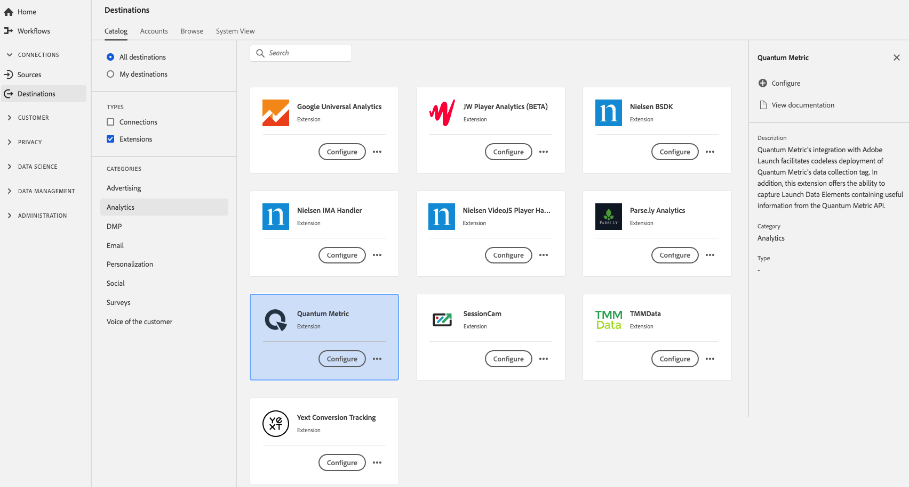

# [!DNL Quantum Metric] Estensione {#quantum-metric-extension}

## Panoramica {#overview}

L&#39;estensione tag [!DNL Quantum Metric] facilita la distribuzione senza codec delle funzionalità di raccolta dati [!DNL Quantum Metric's]. Inoltre, questa estensione offre la possibilità di acquisire elementi di dati contenenti informazioni utili dall’ API [!DNL Quantum Metric].

[!DNL Quantum Metric] è un&#39;estensione analytics in Adobe Experience Platform. Per ulteriori informazioni sulla funzionalità di estensione, consulta la pagina dell&#39;estensione in [Adobe Exchange](https://exchange.adobe.com/experiencecloud.details.101535.quantum-metric-extension-for-adobe-launch.html).

Questa destinazione è un&#39;estensione tag. Per ulteriori informazioni sul funzionamento delle estensioni dei tag in Platform, consulta la [panoramica sulle estensioni dei tag](../launch-extensions/overview.md).

## Prerequisiti {#prerequisites}

Questa estensione è disponibile nel catalogo [!DNL Destinations] per tutti i clienti che hanno acquistato Platform.

Per utilizzare questa estensione, devi accedere ai tag in Adobe Experience Platform. Tag offerti ai clienti Adobe Experience Cloud come funzionalità inclusa a valore aggiunto. Contatta l’amministratore dell’organizzazione per accedere ai tag e chiedi loro di concederti l’autorizzazione **[!UICONTROL manage_properties]** per installare le estensioni. e chiedi loro di concederti l&#39;autorizzazione **[!UICONTROL manage_properties]** per poter installare le estensioni.

## Installa estensione {#install-extension}

Per installare l&#39;estensione [!DNL Quantum Metric]:

Nell’ [Interfaccia piattaforma](http://platform.adobe.com/), vai a **[!UICONTROL Destinazioni]** > **[!UICONTROL Catalogo]**.

Seleziona l’estensione dal catalogo o utilizza la barra di ricerca.

Fai clic sulla destinazione per evidenziarla, quindi seleziona **[!UICONTROL Configura]** nella barra a destra. Se il controllo **[!UICONTROL Configura]** è disabilitato, manca l&#39;autorizzazione **[!UICONTROL manage_properties]**. Consulta [Prerequisiti](#prerequisites).

Seleziona la proprietà in cui desideri installare l&#39;estensione. Puoi anche creare una nuova proprietà. Una proprietà è una raccolta di regole, elementi di dati, estensioni configurate, ambienti e librerie. Ulteriori informazioni sulle proprietà nella sezione [Proprietà della pagina](../../../tags/ui/administration/companies-and-properties.md#properties-page) nella documentazione sui tag.

Il flusso di lavoro descrive i passaggi necessari per completare l’installazione.

Per informazioni sulle opzioni di configurazione dell&#39;estensione e sul supporto dell&#39;installazione, consulta la pagina [Metrica quantistica su Adobe Exchange](https://exchange.adobe.com/experiencecloud.details.101535.quantum-metric-extension-for-adobe-launch.html).

Puoi anche installare l’estensione direttamente nell’ [Interfaccia di raccolta dati](https://experience.adobe.com/#/data-collection/). Per ulteriori informazioni, consulta la sezione sull’ [aggiunta di una nuova estensione](../../../tags/ui/managing-resources/extensions/overview.md#add-a-new-extension) nella documentazione sui tag.

## Come utilizzare l&#39;estensione {#how-to-use}

Dopo aver installato l&#39;estensione, puoi avviare l&#39;impostazione delle regole.

Puoi impostare regole per le estensioni installate per inviare dati evento alla destinazione dell&#39;estensione solo in determinate situazioni. Per ulteriori informazioni sull&#39;impostazione delle regole per le estensioni, consulta la documentazione [tags](../../../tags/ui/managing-resources/rules.md).

## Configurare, aggiornare ed eliminare l&#39;estensione {#configure-upgrade-delete}

Puoi configurare, aggiornare ed eliminare le estensioni nell’interfaccia utente Raccolta dati.

>[!TIP]
>
>Se l&#39;estensione è già installata su una delle tue proprietà, l&#39;interfaccia utente di Platform visualizza ancora **[!UICONTROL Install]** per l&#39;estensione. Per configurare o eliminare l&#39;estensione, fai clic sul flusso di lavoro di installazione come descritto in [Installa estensione](#install-extension) .

Per aggiornare l&#39;estensione, consulta la guida al [processo di aggiornamento dell&#39;estensione](../../../tags/ui/managing-resources/extensions/extension-upgrade.md) nella documentazione sui tag.
